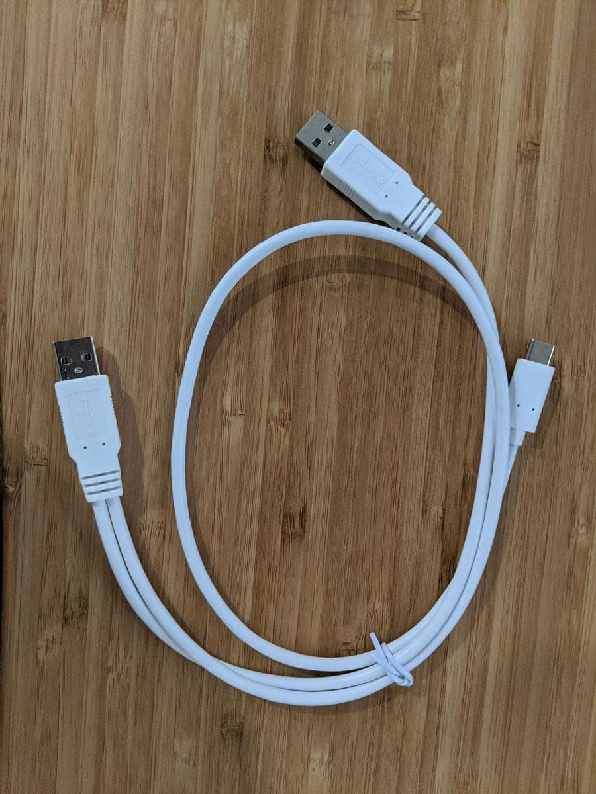
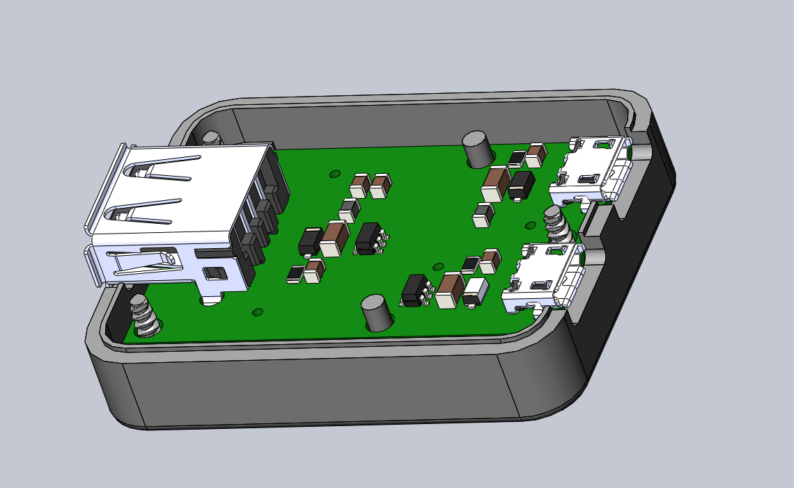
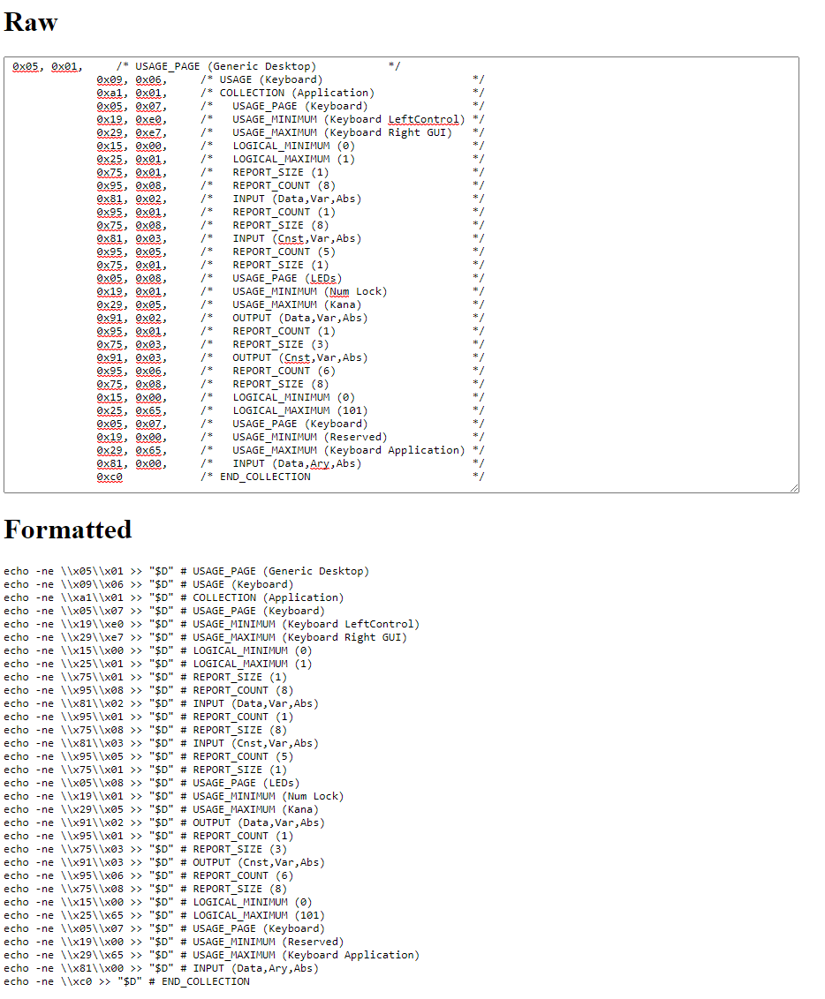

## Highlights

* I paused TinyPilot sales to address a design problem.
* I'm manufacturing a custom USB power connector for TinyPilot.
* Revenue across all my projects was among my strongest ever, at $3.6k total.

## Goal Grades

At the start of each month, I declare what I'd like to accomplish. Here's how I did against those goals:

### Sell 30 TinyPilot kits

* **Result**: Sold 16 TinyPilot kits
* **Grade**: C

I was on track to beat my goal, but then a [wrench got caught in the gears](#why-oh-y-cables), and I had to pause sales.

### Test three new marketing channels

* **Result**: Didn't test any marketing channels
* **Grade**: F

For the same reasons as above, I postponed marketing efforts until I had a product for sale again.

### Implement TinyPilot support for mouse integration

* **Result**: [Added mouse support](https://github.com/mtlynch/tinypilot/pull/125) for TinyPilot
* **Grade**: A

This ended up being more difficult than I expected, but I completed the feature right at the end of the month. Integrating the mouse improved the user experience more than I anticipated.

## [TinyPilot](https://tinypilotkvm.com)



| Metric             | July 2020     | August 2020   | Change                                         |
| ------------------ | ------------- | ------------- | ---------------------------------------------- |
| Unique Visitors    | 4,930         | 2,284         | <font color="red">-2,646 (-54%)</font>         |
| Total Pageviews    | 10,427        | 6,136         | <font color="red">-4,291 (-41%)</font>         |
| Sales Revenue      | $8,741.37     | $3,030.74     | <font color="red">-$5,710.63 (-65%)</font>     |
| Donations          | N/A           | $94.06        | <font color="green">+$94.06 (+inf%)</font>     |
| **Total Earnings** | **$8,741.37** | **$3,124.80** | **<font color="red">-$5,616.57 (-64%)</font>** |

Visits stats aren't as strong as when I had [a big surge](/retrospectives/2020/08/#aligning-my-blog-with-my-business-finally) from Hacker News last month, but I'm still pleased with the steady flow of potential customers.

I missed my sales goals, partly because I had issues keeping inventory adequately stocked and largely because I had to pause sales halfway through the month.

The donations have been a nice surprise. I received almost $100 in donations from people who wanted to support the project, including one from [what seems to be a bot](https://twitter.com/deliberatecoder/status/1300138860668686336).

## Why, oh, Y-cables!

Since the earliest stages of TinyPilot, I've struggled with one major problem: power.

The Raspberry Pi has a special ability to impersonate other USB devices. That's how it's able to type keystrokes into a target computer. It tells the computer that it's a USB keyboard and then sends keystrokes the same way a USB keyboard would.

The problem is that the only port capable of impersonating a keyboard is also the main port for receiving power. A computer's USB port does output a little bit of power, but not enough to meet the Pi's official requirement of 3.0 Amps. The initial version of TinyPilot ran on 0.5 Amps of power, which worked, but I was constantly worried that running underpowered would cause unexpected problems, so I was desperate to find a better solution.

Finally, I found this USB OTG Y-cable, which seemed like what I needed:

{{}}

I bought one, and it worked! It split the connection to the Raspberry Pi so that I could connect to both power and the target computer. I transitioned my entire supply to make a TinyPilot v2 that integrated this cable. After I sold six kits and started promoting the new version, someone reached out to me asking if the cable prevented power backflow.

Power backflow? I wasn't even aware that could be an issue.

It turned out that the Y-cable wasn't meant to connect to distinct power sources. In theory, both an external power source and a computer's USB port output 5 volts of power. In practice, there's no guarantee that both will produce *exactly* 5 V. The USB power specification allows a range between 4.4 - 5.25 V, so if the computer's output dropped to 4.5 V, then current would flow from the external power supply *backwards* into the computer's USB port, potentially overloading the port and damaging it permanently.

As soon as the reader suggested this danger, I paused sales and hired an electrical engineering firm to investigate. They confirmed the risk existed, so I reached out to my customers and advised them to disconnect from external power until I found a solution. Fortunately, TinyPilot functions without external power, though it's less convenient.

## I can manufacture something from scratch in two weeks?

One of my most surprising discoveries in the past month was how fast and inexpensive manufacturing has become.

Just a week ago, on August 27th, I asked TinyPilot's electrical engineering partner to design a connector to address the power issue. The design was ready the next day, and they immediately ordered it printed on 100 circuit boards. We expect the boards to arrive this weekend. Testing and assembly should only take another few days.

Simultaneously, I'm working with a 3D printing design shop on an enclosure for the circuit board. The 3D printing firm completed their designs in two days, and they're in the process of printing the first three prototypes. Once they get going, they have the capacity to 3D print 50 enclosures per day.


  {{}}
  {{}}


If everything goes well, the case and boards could be ready for customers as early as next week. That would mean that we went from zero to a completed physical product in just two weeks.

Including design, parts, and labor, the total cost for this run is on track for ~$13/unit. Even for a simple project like this, I had no idea turnaround time and cost could be that low. Assuming everything goes well, that is.

## HID descriptors are the devil

As I described [above](#why-oh-y-cables), TinyPilot needs to present itself to the target computer as a USB keyboard. It does this by sending what's called a human interface device (HID) descriptor over the USB connection. USB devices like keyboards, mice, and thumb drives have HID descriptors that announce what the device can do.

The HID descriptor is a binary blob that looks like this:

```c
// HID descriptor for a keyboard
// Source: https://www.kernel.org/doc/html/latest/usb/gadget_hid.html
static struct hidg_func_descriptor my_hid_data = {
      .subclass               = 0, /* No subclass */
      .protocol               = 1, /* Keyboard */
      .report_length          = 8,
      .report_desc_length     = 63,
      .report_desc            = {
              0x05, 0x01,     /* USAGE_PAGE (Generic Desktop)           */
              0x09, 0x06,     /* USAGE (Keyboard)                       */
              0xa1, 0x01,     /* COLLECTION (Application)               */
              0x05, 0x07,     /*   USAGE_PAGE (Keyboard)                */
              0x19, 0xe0,     /*   USAGE_MINIMUM (Keyboard LeftControl) */
              0x29, 0xe7,     /*   USAGE_MAXIMUM (Keyboard Right GUI)   */
              0x15, 0x00,     /*   LOGICAL_MINIMUM (0)                  */
              0x25, 0x01,     /*   LOGICAL_MAXIMUM (1)                  */
              0x75, 0x01,     /*   REPORT_SIZE (1)                      */
              0x95, 0x08,     /*   REPORT_COUNT (8)                     */
              0x81, 0x02,     /*   INPUT (Data,Var,Abs)                 */
              0x95, 0x01,     /*   REPORT_COUNT (1)                     */
              0x75, 0x08,     /*   REPORT_SIZE (8)                      */
              0x81, 0x03,     /*   INPUT (Cnst,Var,Abs)                 */
              0x95, 0x05,     /*   REPORT_COUNT (5)                     */
              0x75, 0x01,     /*   REPORT_SIZE (1)                      */
              0x05, 0x08,     /*   USAGE_PAGE (LEDs)                    */
              0x19, 0x01,     /*   USAGE_MINIMUM (Num Lock)             */
              0x29, 0x05,     /*   USAGE_MAXIMUM (Kana)                 */
              0x91, 0x02,     /*   OUTPUT (Data,Var,Abs)                */
              0x95, 0x01,     /*   REPORT_COUNT (1)                     */
              0x75, 0x03,     /*   REPORT_SIZE (3)                      */
              0x91, 0x03,     /*   OUTPUT (Cnst,Var,Abs)                */
              0x95, 0x06,     /*   REPORT_COUNT (6)                     */
              0x75, 0x08,     /*   REPORT_SIZE (8)                      */
              0x15, 0x00,     /*   LOGICAL_MINIMUM (0)                  */
              0x25, 0x65,     /*   LOGICAL_MAXIMUM (101)                */
              0x05, 0x07,     /*   USAGE_PAGE (Keyboard)                */
              0x19, 0x00,     /*   USAGE_MINIMUM (Reserved)             */
              0x29, 0x65,     /*   USAGE_MAXIMUM (Keyboard Application) */
              0x81, 0x00,     /*   INPUT (Data,Ary,Abs)                 */
              0xc0            /* END_COLLECTION                         */
      }
};
```

Creating an HID descriptor for keyboards was a walk in the park. Lots of people had implemented fake keyboards in Python, and the process was well-documented.

Implementing a fake mouse was much harder and required me to [learn more about how HID descriptors work](https://eleccelerator.com/tutorial-about-usb-hid-report-descriptors/). Mice have lots more variations like number of buttons, number of scrollwheels, and type of positioning (absolute vs. relative). Debugging is a pain because the descriptor either works or it doesn't. If you generate an invalid descriptor, there's no way to get feedback about what's wrong with it. Worst of all, every time you try a descriptor, you have to reboot the Raspberry Pi.

It took me five days of tedious work before I got basic mouse functionality working. The key for me was focusing on tooling. At first, I was working with descriptors as giant unstructured blobs, like this:

```bash
echo -ne \\x05\\x01\\x09\\x02\\xA1\\x01\\x05\\x09\\x19\\x01\\x29\\x08\\x15\\x00\\x25\\x01\\x95\\x08\\x75\\x01\\x81\\x02\\x05\\x01\\x09\\x30\\x09\\x31\\x16\\x00\\x00\\x26\\xFF\\x7F\\x75\\x10\\x95\\x02\\x81\\x02\\xC0 > "${MOUSE_FUNCTIONS_DIR}/report_desc"
```

That made it difficult to think about the descriptor because I couldn't modify anything without starting over. I wrote a quick JavaScript app that allowed me to take example HID descriptors in different formats and convert them to equivalent shell commands to generate the file:

{{}}

Next, I wrote little utility scripts in my home directory. They were dead-simple scripts that normally wouldn't be worth their own files:

```bash
#!/bin/bash

set -x

sudo journalctl -u init-usb-gadget
```

These dumb tools helped me in two ways. First, they gave me a sense of accomplishment when I felt like I was banging my head against the wall for days. Even though the HID descriptors weren't working, I was at least producing *some* code that did what I wanted. Next, they reduced my cognitive load and freed up more mental capacity to focus on the problem at hand. Instead of recalling the syntax for viewing the systemd logs, I could just type `~/show-systemd-log`.

It turned out that most of my problems weren't even HID descriptors but rather the shell commands I was using to create them. Once I cleared other tedious tasks from my mind, I realized that I should verify that the files on disk match my expectations. They didn't. Once I realized that, a working mouse descriptor soon followed.



## Legacy projects

Here are some brief updates on projects that I still maintain but are not the primary focus of my development:

### [Is It Keto](https://isitketo.org)



| Metric                    | July 2020   | August 2020 | Change                                         |
| ------------------------- | ----------- | ----------- | ---------------------------------------------- |
| Unique Visitors           | 48,231      | 49,981      | <font color="green">+1,750 (+4%)</font>        |
| Total Pageviews           | 118,980     | 125,599     | <font color="green">+6,619 (+6%)</font>        |
| Domain Rating (Ahrefs)    | 8.0         | 9.0         | <font color="green">+1.0 (+12%)</font>         |
| AdSense Earnings          | $208.86     | $202.46     | <font color="red">-$6.40 (-3%)</font>          |
| AdThrive Earnings         | N/A         | $35.00      | N/A                                            |
| Amazon Affiliate Earnings | $134.45     | $129.88     | <font color="red">-$4.57 (-3%)</font>          |
| Other Affiliate Earnings  | $26.60      | $118.88     | <font color="green">+$92.28 (+347%)</font>     |
| **Total Earnings**        | **$369.91** | **$486.22** | **<font color="green">+$116.31 (+31%)</font>** |

Is It Keto grew a small amount this month, though I've been trying to focus all of my attention on TinyPilot, as the ROI is much higher there.

The one notable Is It Keto event was that I switched my display ads from AdSense to AdThrive. Frustratingly, the transition has demanded much more of my attention than I expected. The onboarding process involved lots of little steps where they'll ask me to fill out some form, wait a week, ask me to fill out another form, and on and on.

Finally, we reached the point of switching my site over to AdThrive ads, and it turned out that their JavaScript snippet didn't work on single-page apps, so it misbehaved on the Vue-based Is It Keto code. I get that a lot of their clients probably have WordPress sites, but... come on! An SPA shouldn't be such a curveball in 2020.

That was a whole new can of worms because AdThrive kept sending me broken, hacky JavaScript that was supposed to make AdThrive play nicely with my site. I'd run it, report to them that it didn't work, and they'd send me a new JavaScript snippet that was broken in a different way.

Finally, I convinced them to host the code on their side and cut me out of the debug loop. I'm not crazy about the fact that they're pushing to production with what feels like insufficient testing, but I don't have bandwidth to worry about it at the moment.

### [Zestful](https://zestfuldata.com)



| Metric             | July 2020  | August 2020 | Change                                     |
| ------------------ | ---------- | ----------- | ------------------------------------------ |
| Unique Visitors    | 440        | 324         | <font color="red">-116 (-26%)</font>       |
| Total Pageviews    | 1,247      | 841         | <font color="red">-406 (-33%)</font>       |
| RapidAPI Earnings  | $18.05     | $9.36       | <font color="red">-$8.69 (-48%)</font>     |
| **Total Earnings** | **$18.05** | **$9.36**   | **<font color="red">-$8.69 (-48%)</font>** |

Things are still quiet at Zestful, though I'm evaluating a new API marketplace. I've always been desperate for an alternative to my current platform, RapidAPI. A new company called [Servernope](https://servernope.com/) invited me to their API platform. I told them that I didn't have time to set it up, but they were welcome to create a Zestful entry on my behalf. So, they [did](https://www.servernope.com/store/service/ZestfulData/Zestful).

I'm not quite sold yet. One of my biggest issues with RapidAPI is that their analytics fail to present data in a useful way. Servernope seems to have a similar problem, except I have no paid users from Servernope yet, so it's hard to compare.

## Wrap up

### What got done?

* Investigated a power issue on TinyPilot and began manufacturing a component to fix it.
* Added mouse support to TinyPilot.
* Hired a freelancer to [take over inventory management](/retrospectives/2020/08/#managing-inventory-is-hard) and some research tasks.
* Set up eBay listings to sell TinyPilot internationally.
  * I'm in the process of figuring out how to do it all through Shopify, but eBay is an easy interim solution.
* Published a new blog post: ["How I Collected a Debt from an Unscrupulous Merchant"](https://mtlynch.io/collect-debt/)
  * And two new [book reports](/book-reports).

### Lessons learned

* Work with electrical engineering experts earlier.
  * Looking back, I was veering far enough out of mainstream Raspberry Pi usage that I should have consulted professional electrical engineers to review my plans.
* When you're stuck on a hard problem, create tools that eliminate debugging work.
  * Creating tools gives you a feeling of forward momentum and frees your mind to focus on the essentials of a problem.

### Goals for next month

* Sell 60 TinyPilot kits and power connectors.
* Test three new marketing channels.
* Interview seven IT professionals about whether they'd use TinyPilot in their work.