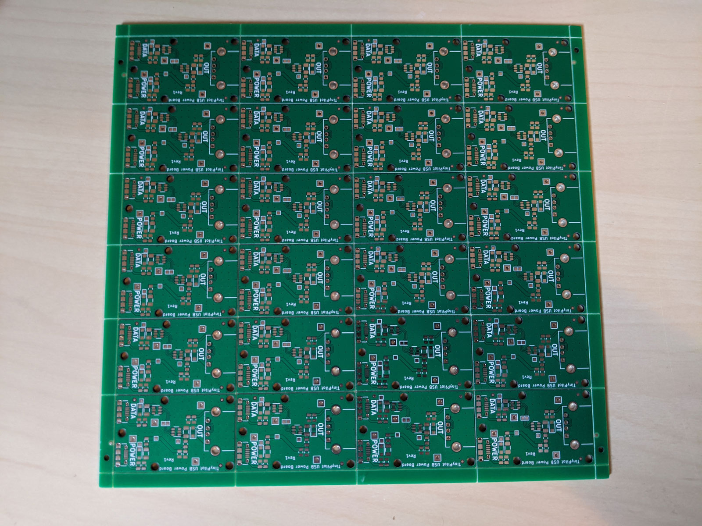
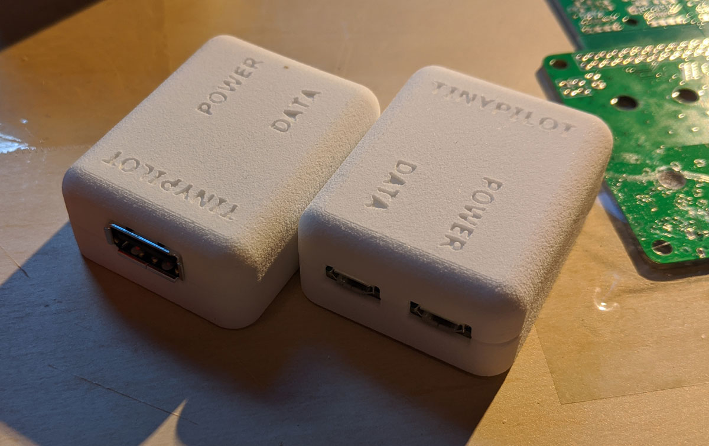
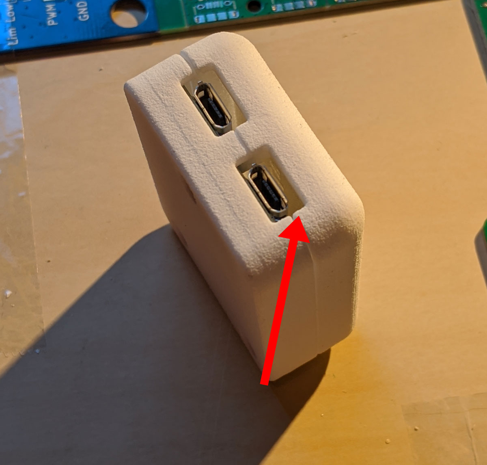
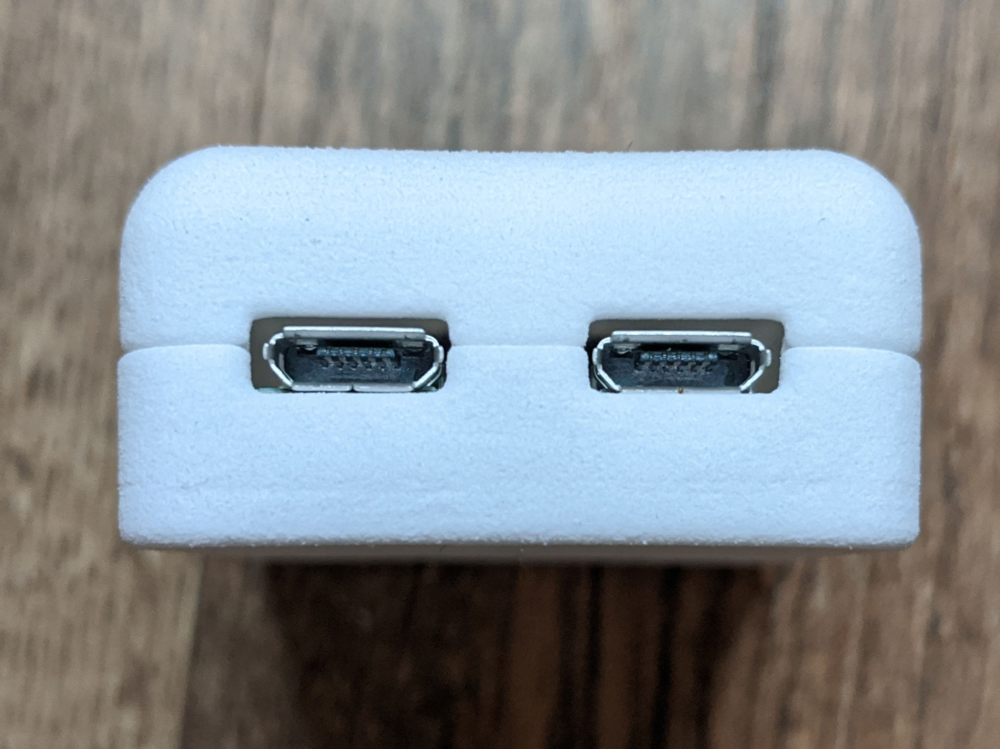
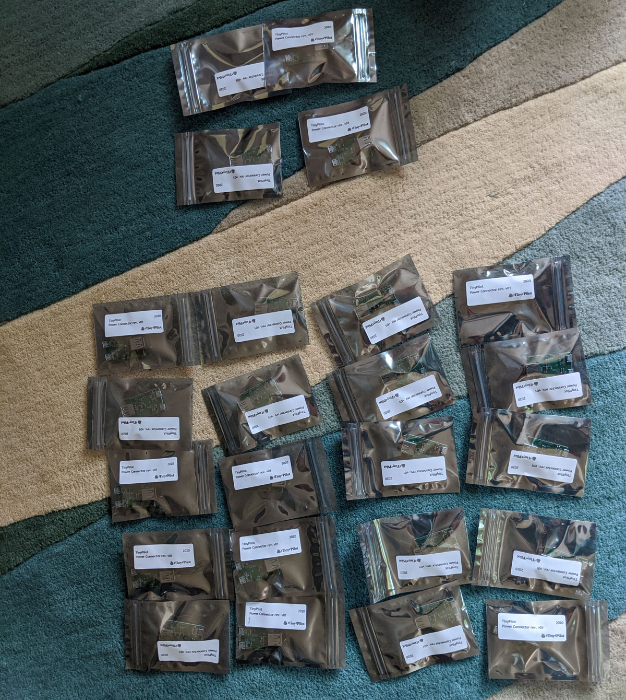
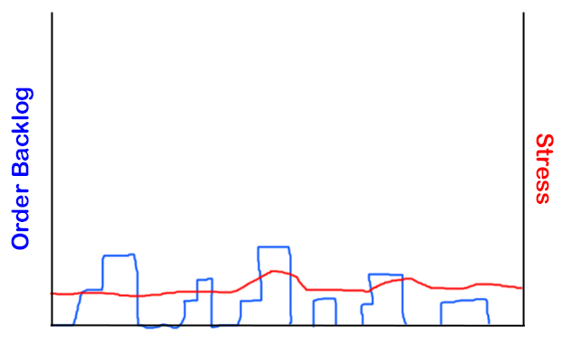
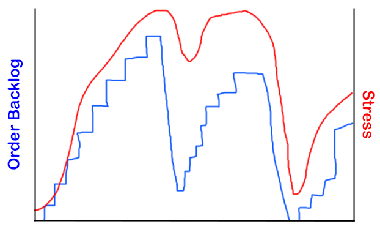

## Highlights

*

## Goal Grades

At the start of each month, I declare what I'd like to accomplish. Here's how I did against those goals:

### Sell 60 TinyPilot kits and power connectors

* **Result**: Sold 29 kits and power connectors.
* **Grade**: C+

I take some pride in the fact that these 29 sales happened while I did zero sales or marketing.

### Test three new marketing channels

* **Result**: XX
* **Grade**: XX

TODO

### Interview seven IT professionals about whether they'd use TinyPilot in their work

* **Result**: Interviewed two IT professionals about remote administration.
* **Grade**: C-

This is a big flop. The other goals, I was stuck without power connectors. While I was stuck on shipping, I should have put extra effort into

The two conversations I had went positively, though. I stuck to [Rob Fitpatrick's strategy](/book-reports/the-mom-test/) of focusing on gathering information as opposed to pitching my product, but both were interested in TinyPilot and volunteered unprompted to participate in a demo when I'm ready.

## Stats

### [Tiny Pilot](https://tinypilotkvm.com)

| Metric             | August 2020   | September 2020 | Change                                         |
| ------------------ | ------------- | -------------- | ---------------------------------------------- |
| Unique Visitors    | 2,284         | 1,741          | -543 (-24%)           |
| Total Pageviews    | 6,136         | 7,057          | +921 (+15%)         |
| Sales Revenue      | $2,951.40     | $3,636.03*      | +$684.63 (+23%)     |
| Donations          | $94.06        | $187.40        | +$93.34 (+99%)      |
| **Total Earnings** | **$3,045.46** | **$3,817.99**  | **+$772.53 (+25%)** |


\* I've made a slight change to how I count "sales revenue." Previously, I was just adding up all the money that came in, including tax and shipping. With 45% of my orders this month coming from international customers, shipping is a much larger percentage of sales, so starting in September, "sales revenue" excludes taxes and shipping.


Sales were closed 
Sales are up a bit, but these metrics are confusing. For half of August, I closed sales to work on the power issue. Through most of September, sales were either closed or backordered.

## Manufacturing a power connector: from start to finish

(Aug 27)

### Day 1

It's simple enough that they're able to design it and order 100 printed circuit boards from China that same day.

Confirm a problem with the Y-cable and send to manufacturing.

### Day 2

I reach out to a 3D printing lab and ask them to design a case for the power board. The same day, they send me a work-in-progress image of the case design.

{{}}

### Day 8

Engineering firm receives the PCBs and begins the process of attaching the USB ports and testing connectivity.

{{}}

The same day, the 3D printing shop printed the first case. I picked them up and overnighted them to the engineering firm so that they could test the fit.

### Day 9

The engineering firm reports that the cases fit the boards. The only noticeable issue is that there are wide gaps around the microUSB ports.


  {{}}
  {{}}


I pass along the feedback to the 3D printing shop who said that this was an intentional design choice to limit the risk that the case would block any microUSB plug from fully inserting into the port.

### Day 10

I receive the first two board prototypes that the engineering firm soldered by hand before getting their automated processes going. Everything works, a huge relief.

### Day 13

The 3D printing shop prints their first batch of 30 cases. There's still a small gap around the microUSB ports, but definitely not a showstopper.

{{}}

### Day 19

I receive the first completed panel of 24 PCBs, which the engineering firm created with automated processes and manual fixes.

{{}}

### Day 20

The 3D printer finishes the remaining 70 cases. They include an experimental case that's dyed black with laser etching to reveal a white print underneath.

TODO: photo

### Day 21

I send out the first completed power connectors to customers.

### Day 26

I receive the remaining 74 completed boards from the first manufacturing run of 100 boards.

### Costs

* Board manufacture: $XX
* Case 3D printing: $XX

I pay a low rate for 3D printing and design because my state has a fantastic government subsidy that covers 75% of 3D printing costs for locally incorporated small businesses.

## Inventory shortages and the thundering herd problem

So far, maintaining inventory has been the biggest challenge of selling TinyPilot. Most of the time that TinyPilot has been available, . The power connector continually felt like it was a week away. The electrical engineers underestimated how long it would take to build them. Fortunately, I padded their estimate in communications with customers, so the actual delivery date was on time.

{{}}

I get a few orders a day, and I pack them up. Life is easy!

When I'm backordered, it's a different picture:

{{}}

People continue to order, so my work queue backs up. I can't clear it because I'm missing some inventory item.

When I was down to my last 15 power connectors, I listed the individual item as backordered but I continued listing the kits as in-stock. I did this because my profits on the connectors are much smaller, so I didn't want to sell off all the connectors on their own and be stuck out of stock on the kits until the next batch could be produced. I still think that was a good idea, but it created complexity later on as it meant that I was now processing orders in a special order instead of first-come, first-serve.

As of today, I'm well-stocked again. I received a batch of 48 new power connectors yesterday, so the TinyPilot sales machine is pumping again. Over the next few days, I'll start up marketing efforts that have been paused for weeks.

But it's a repeat of a problem I've consistently struggled with TinyPilot. Inventory and the thundering herd problem. I've had a few weeks where I was well-stocked, and I would receive 0-3 orders per day, which I can fulfill comfortably.

When I'm backordered, the orders pile up, and it means that when I clear my backlog. But customers continue ordering when I'm backlogged (although it definitely slows down), but it means that by the time I receive the new parts, they're already sold out. And I've got a big rush of orders to fulfill quickly to meet the target dates I've promised to customers.

Backorders are a huge pain. My margins are much higher on the full kits, so I didn't want to sell all my standalone connectors and get stuck without kits, so I listed the connectors as backordered. But then that introduced complexity into the fulfillment process because it means that I'm fulfilling purchases out of order, and I need to keep track of what the promised ship date was at the time the customer made their order.

I didn't want to 

There's been about a week where I was comfortably ahead on inventory. It's what they call a good problem to have, but it's also kind of an an annoying problem to have. I feel stuck on every front. I don't want to 

## Moving forward during a standstill

The biggest mistake I made this month was being unfocused. Manufacturing the boards for the power connectors took longer than we expected, so 

## Assorted company recommendations

### Pirate Ship

### Mercury

### Uline

* Uline is great.

## Legacy projects

Here are some brief updates on projects that I still maintain but are not the primary focus of my development:

### [Is It Keto](https://isitketo.org)

| Metric                    | August 2020 | September 2020 | Change                                       |
| ------------------------- | ----------- | -------------- | -------------------------------------------- |
| Unique Visitors           | 49,981      | 44,751         | -5,230 (-10%)       |
| Total Pageviews           | 125,599     | 110,922        | -14,677 (-12%)      |
| Domain Rating (Ahrefs)    | 9.0         | 10.0           | +1.0 (+11%)       |
| AdSense Earnings          | $202.46     | $161.06        | -$41.40 (-20%)      |
| AdThrive Earnings         | $35.00      | $135.00*        | +$100.00 (+286%)  |
| Amazon Affiliate Earnings | $129.88     | $83.03         | -$46.85 (-36%)      |
| Other Affiliate Earnings  | $118.88     | N/A            | N/A                                          |
| **Total Earnings**        | **$486.22** | **$379.09**    | **-$107.13 (-22%)** |


\* This is an estimate from memory. AdThrive locked me out of my dashboard when I terminated my contract with them, so I won't know my exact earnings until they (hopefully) pay me in November.


Is It Keto is languishing a bit, as I put all of my focus into TinyPilot. I think some of this is seasonal, as I [saw a slowdown last year in September](/retrospectives/2019/10/#is-it-ketohttpsisitketoorg).

The only thing that happened was that I switched back from AdThrive to AdSense. I'd heard that AdThrive was the fancy advertiser. They only work with publishers who reach 100k monthly pageviews, and their payout rates are supposed to be significantly higher than Google AdSense.

They turned out to be a mistake. They couldn't figure out how to make their ads display properly on Is It Keto because it's an SPA, so their ads kept randomly cycling and bouncing around the text on the page. After I complained to them a few times, they finally gave up on fixing the ads and released my from my contract with them.

From my experience, AdThrive and AdSense paid about the same, with AdThrive maybe 10-20% ahead of AdSense.

### [Zestful](https://zestfuldata.com)

| Metric             | August 2020 | September 2020 | Change                                       |
| ------------------ | ----------- | -------------- | -------------------------------------------- |
| Unique Visitors    | 324         | 333            | +9 (+3%)          |
| Total Pageviews    | 841         | 849            | +8 (+1%)          |
| RapidAPI Earnings  | $9.36       | $12.27         | +$2.91 (+31%)     |
| **Total Earnings** | **$9.36**   | **$12.27**     | **+$2.91 (+31%)** |

## Wrap up

### What got done?

* 
* Learned to ship directly to international customers.
  * Originally, I was going through eBay's Global Shipping Program. That was a good first-pass solution, but eBay's a pain in that they require all communication to stay on the platform. They also have no real solution if you need to send your customer a replacement part after the initial order.
  * Shipping directly through DHL and USPS isn't that hard (assuming I'm doing it right), but it's *super* hard to find information about how to do it correctly because every Google result is an article trying to sell you international shipping as a service.

### Lessons learned

*

### Goals for next month

I'm recycling all my goals from last month with the implied addendum for each "and this time, I *really* mean it:

* Sell 60 TinyPilot kits and power connectors.
* Test three new marketing channels.
* Interview seven IT professionals about whether they'd use TinyPilot in their work.