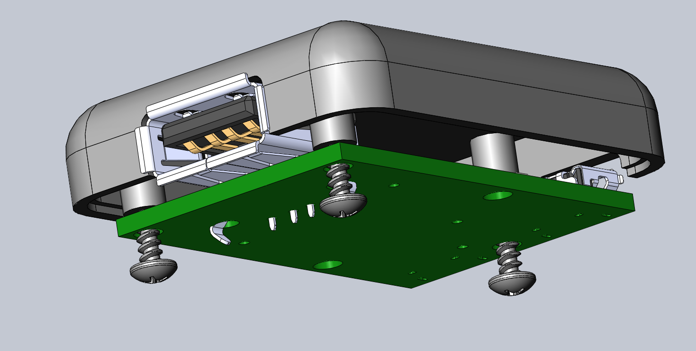
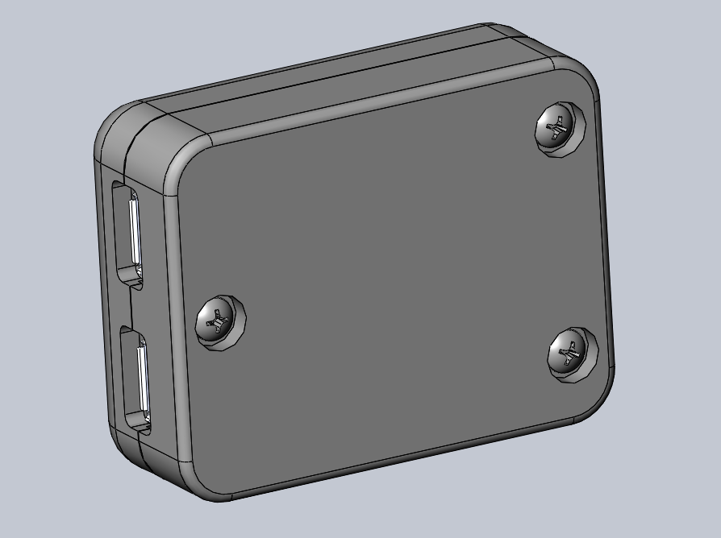
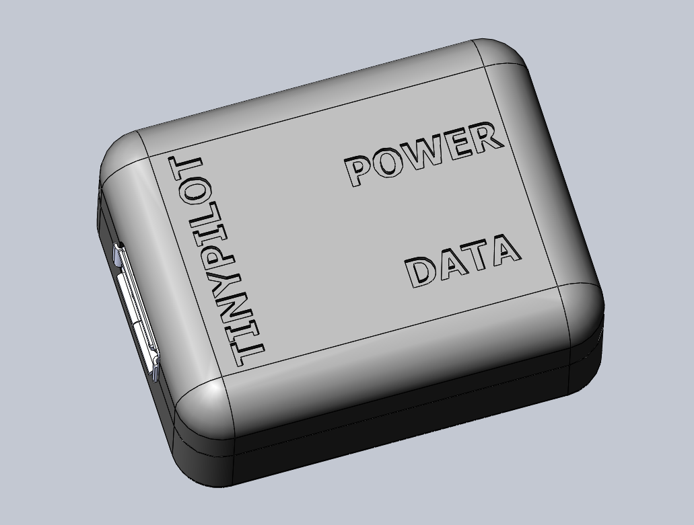

## Highlights

* TinyPilot generated $3,800 in revenue with zero marketing and while backordered.
* I went from zero to a complete, custom manufactured product in 26 days.
* I'm still struggling to manage my inventory.

## Goal Grades

At the start of each month, I declare what I'd like to accomplish. Here's how I did against those goals:

### Sell 60 TinyPilot kits and power connectors

* **Result**: Sold 29 kits and power connectors.
* **Grade**: C+

The limiting factor here was manufacturing the power connectors. I wasn't able to produce enough to keep up with demand, so I sold everything I manufactured, but I couldn't make them quickly enough.

I take some pride in the fact that these 29 sales happened while I did zero sales or marketing.

### Test three new marketing channels

* **Result**: Tested zero marketing channels.
* **Grade**: F

With inventory so low, I decided to postpone marketing efforts. It didn't make sense to spend money on advertising when I couldn't keep the product stocked to begin with.

### Interview seven IT professionals about whether they'd use TinyPilot in their work

* **Result**: Interviewed two IT professionals about remote administration.
* **Grade**: C-

This is a big flop. The other goals, I was stuck without power connectors. While I was stuck on shipping, I should have put extra effort into

The two conversations I had went positively, though. I stuck to [Rob Fitpatrick's strategy](/book-reports/the-mom-test/) of focusing on gathering information as opposed to pitching my product, but both were interested in TinyPilot and volunteered unprompted to participate in a demo when I'm ready.

## Stats

### [Tiny Pilot](https://tinypilotkvm.com)

| Metric             | August 2020   | September 2020 | Change                                         |
| ------------------ | ------------- | -------------- | ---------------------------------------------- |
| Unique Visitors    | 2,284         | 1,741          | <font color="red">-543 (-24%)</font>           |
| Total Pageviews    | 6,136         | 7,057          | <font color="green">+921 (+15%)</font>         |
| Sales Revenue      | $2,951.40     | $3,636.03*      | <font color="green">+$684.63 (+23%)</font>     |
| Donations          | $94.06        | $187.40        | <font color="green">+$93.34 (+99%)</font>      |
| **Total Earnings** | **$3,045.46** | **$3,817.99**  | **<font color="green">+$772.53 (+25%)</font>** |


\* I've made a slight change to how I count "sales revenue." Previously, I was just adding up all the money that came in, including tax and shipping. With 45% of my orders this month coming from international customers, shipping is a much larger percentage of sales, so starting in September, "sales revenue" excludes taxes and shipping.


Sales were closed 
Sales are up a bit, but these metrics are confusing. For half of August, I closed sales to work on the power issue. Through most of September, sales were either closed or backordered.

## Manufacturing a power connector: from start to finish

(Aug 27)

### Day 1

The engineering firm begins work on the circuit board for the power connector. It's a simple enough board that they're able to design it and order 100 printed circuit boards from China that same day.

### Day 2

I reach out to a 3D printing lab and ask them to design a case for the power board. Within hours, they send me a work-in-progress image of the case design.

{{}}

### Day 5

The 3D printing lab completes the design and gets ready to begin printing.


  {{}}
  {{}}



  {{}}
  {{}}


### Day 8

The engineering firm receives the PCBs and begins the process of attaching the USB ports and testing connectivity.

{{}}

The same day, the 3D printing shop produces their first two cases. I picked them up and overnighted them to the engineering firm so that they could test the fit.

### Day 9

The engineering firm reports that the cases fit the boards. The only noticeable issue is that there are wide gaps around the microUSB ports.


  {{}}
  {{}}


The large gaps turned out to be intentional. Because I asked the 3D printing shop to minimize turnaround time, they used large gaps to minimize the risk that the case would get in the way of any plugs. Once we confirm that my USB cables will fit a smaller opening, they revise the design to tighten the opening.

### Day 10

I receive the first two board prototypes that the engineering firm soldered by hand before getting their automated processes going.

I check TinyPilot's functionality: success!

I verify that the Raspberry Pi is receiving full power.

```bash
$ sudo journalctl -xe | grep "Under-voltage"
$
```

Success! No under-voltage warnings.

It's a huge relief to find that this chip works.

### Day 13

The 3D printing shop prints their first batch of 30 cases. There's still a small gap around the microUSB ports, but it's definitely not a showstopper.

{{}}

### Day 19

I receive the first completed panel of 24 PCBs from the engineering firm.

{{}}

The manufacturing process is still a work in progress, so the engineers produced these using a combination of automated processes and manual fixes.

### Day 20

The 3D printer finishes the remaining 70 cases. They include an experimental case that's dyed black with laser etching to reveal a white print underneath.

{{}}

I like this new design so much that I switch all future production to black cases.

### Day 21

I begin sending out the first completed power connectors to customers.

### Day 26

I receive the remaining 74 completed boards from the electrical engineers. With 100 cases and boards ready, the first run of production is complete.

### Costs

* Boards: $2,897.70
  * Design: $241.72
  * Materials: $422.16
  * Manufacture, testing, packaging: $2,579.04
  * Postage: $76.95
* Cases: $500.00
* **Total**: **$3,297.64**

The total cost turned out to be substantially higher than [my original estimate of $13/unit](/retrospectives/2020/09/#i-can-manufacture-something-from-scratch-in-two-weeks), but $33/unit is still doable.

The dominant cost is electrical engineers' person-hours during manufacture. Because this was a small production run and had to be finished quickly, many of the steps were manual for the sake of short-term expediency. Now that I have some breathing room in my inventory, we're evaluating cost optimizations, including better automation and outsourcing manufacture.

In contrast, my 3D printing expenses are fantastically low. My state has [a government subsidy](https://www.uml.edu/research/crf/state-voucher-program.aspx) for locally-incorporated small businesses that pays 75% of 3D printing costs through state universities.

## Inventory shortages and the thundering herd problem

So far, maintaining inventory has been the biggest challenge of selling TinyPilot. At this point, I've been backordered more days than I have inventory in stock. In some ways, it's "a good problem to have," in that there's enough demand that TinyPilot kits are difficult to keep in stock. In other ways, it's an annoying problem to have because maintaining a backlog of orders is stressful.

When my inventory is healthy, the relationship between my order backlog and stress levels look like this:

{{}}

I get a few orders a day, my assistant packs them up and schedules a pickup from USPS or DHL. Life is easy!

When I'm backordered, it's a different picture:

{{}}

With a backlog, everything gets harder. Instead of a nice, predictable stream of work, there's nothing to ship for days or weeks. There are other tasks my assistant can do, but it's more time-consuming for both of us to learn lots of new one-off tasks as opposed to a smaller set of consistent jobs.

This month, when I started running low on power connectors, I marked the individual product as backordered so that I could continue selling my kits, which have higher margins. That was a useful strategy, but it added complexity in that we could no longer simply process all open orders. We had to keep track of which ones to prioritize and when they were ultimately due to customers.

I've [struggled with this problem before](/retrospectives/2020/08/#managing-inventory-is-hard), and my solution has been to keep a deeper inventory than I think I'll need. The problem there is that I've iterated on TinyPilot a few times, changing a few components each time. I have hundreds of cables and cases that I no longer ship in any kit, but they're sitting around in my house. I want to liquidate them on eBay, but it'll probably take four hours of work and yield only $200-300, whereas four hours of marketing or product investment would likely yield more. Still, I prefer letting unused inventory pile up over letting unmet demand pile up.

## Moving forward during a standstill

The biggest mistake I made was letting my work ethic slip. I found it hard to stay motivated during my inventory shortage because I knew every additional sale I made just put me deeper into the backlog. Plus, most tasks felt silly 

One of the biggest problems was that the power connectors perpetually felt like they were only a week away. Had I known on September 1st that the first run wouldn't be complete until three weeks later, I perhaps could have planned a better strategy. But I kept feeling like, "Well, I don't know what I should focus on this week, but that's okay because I'll be back to normal when the power connectors arrive next week." But it was the first run, so naturally there were unanticipated hitches and delays.

In retrospect, it seems . "Well, what if they look me up, find TinyPilot, and then they see I don't have anything in stock?" I don't know why I thought that would be a problem. If anything, it would make it seem like I already have a successful business, but I used it to rationalize away reaching out to companies.

## Assorted company recommendations

As a software developer, eCommerce is all still new to me. In the process of running TinyPilot, I've discovered a few useful companies I thought I'd share. I have no partnerships with any of these companies; I'm just a happy customer.

* [Pirate Ship](https://www.pirateship.com/) (self-printed postage and package pickups): I was using the USPS website to print postage, but it's slow and clunky, as you'd expect a government website to be. Pirate Ship lets you purchase discounted USPS postage and schedule pickups. Their web app is snappy, user-friendly, and when you talk to their customer support, they speak to you in pirate ([really](pirateship-support.png)). It's free, so I use it for both business and personal shipping.

* [Mercury](https://mercury.com/) (startup banking): I'm having a surprisingly difficult time finding a bank who will give me an account for my recently registered TinyPilot LLC. The big banks have rejected me for being too new a business with too small an income. Mercury approved me within a week, and they have a nice, easy interface. They also offer virtual ATM cards, so you can instantly create additional virtual cards with transaction limits.

* [Uline](https://uline.com) (cardboard boxes): When I needed shipping boxes, I was searching "shipping boxes" on Amazon and browsing page after page, looking for something that came close enough to the dimensions I wanted. Then, I realized that there are companies that sell *just* boxes. Uline is cheaper than Amazon, and you can order basically any dimensions you want. Their standard shipping is next-day delivery if you order by 6 PM, and the shipping cost is still only ~$6.

## Legacy projects

Here are some brief updates on projects that I still maintain but are not the primary focus of my development:

### [Is It Keto](https://isitketo.org)

| Metric                    | August 2020 | September 2020 | Change                                       |
| ------------------------- | ----------- | -------------- | -------------------------------------------- |
| Unique Visitors           | 49,981      | 44,751         | <font color="red">-5,230 (-10%)</font>       |
| Total Pageviews           | 125,599     | 110,922        | <font color="red">-14,677 (-12%)</font>      |
| Domain Rating (Ahrefs)    | 9.0         | 10.0           | <font color="green">+1.0 (+11%)</font>       |
| AdSense Earnings          | $202.46     | $161.06        | <font color="red">-$41.40 (-20%)</font>      |
| AdThrive Earnings         | $35.00      | $135.00*        | <font color="green">+$100.00 (+286%)</font>  |
| Amazon Affiliate Earnings | $129.88     | $83.03         | <font color="red">-$46.85 (-36%)</font>      |
| Other Affiliate Earnings  | $118.88     | N/A            | N/A                                          |
| **Total Earnings**        | **$486.22** | **$379.09**    | **<font color="red">-$107.13 (-22%)</font>** |


\* This is an estimate from memory. AdThrive locked me out of my dashboard when I terminated my contract with them, so I won't know my exact earnings until they (hopefully) pay me in November.


Is It Keto is languishing a bit, as I'm focusing entirely on TinyPilot. Some of the dip is also seasonal, as I [saw a slowdown during September last year](/retrospectives/2019/10/#is-it-ketohttpsisitketoorg).

The only notable update is that I switched back from AdThrive to AdSense. I'd heard that AdThrive was the fancy advertiser. They only work with publishers who reach 100k monthly pageviews, and their payout rates are supposed to be significantly higher than Google AdSense.

AdThrive turned out to be a mistake. They couldn't figure out how to make their ads display properly on Is It Keto because it's a single-page app (as opposed to a WordPress site or other pre-rendered site). AdThrive's ads kept randomly cycling, causing text on the page to bounce around as users tried to view the content. After I complained a few times, they finally gave up on fixing the ads and released me from my contract.

### [Zestful](https://zestfuldata.com)

| Metric             | August 2020 | September 2020 | Change                                       |
| ------------------ | ----------- | -------------- | -------------------------------------------- |
| Unique Visitors    | 324         | 333            | <font color="green">+9 (+3%)</font>          |
| Total Pageviews    | 841         | 849            | <font color="green">+8 (+1%)</font>          |
| RapidAPI Earnings  | $9.36       | $12.27         | <font color="green">+$2.91 (+31%)</font>     |
| **Total Earnings** | **$9.36**   | **$12.27**     | **<font color="green">+$2.91 (+31%)</font>** |

Zestful remains quiet. I've had no inquiries for enterprise plans, and pay-as-you-go usage continues to generate $0-$50 in revenue.

## Wrap up

### What got done?

* Learned to ship directly to international customers
  * Originally, I was going through eBay's Global Shipping Program. That was a good first-pass solution, but eBay's a pain in that they require all communication to stay on the platform. They also have no real solution if you need to send your customer a replacement part after the initial order.
  * Shipping directly through DHL and USPS isn't that hard (assuming I'm doing it right), but it's *super* hard to find information about how to do it correctly because every Google result is an article trying to sell you international shipping as a service.
* Added several new features to TinyPilot
  * Full-screen mode, paste from clipboard, configurable installs, diagnostic scripts, and support for AZERTY keyboard layouts.
* Added shopping cart functionality to [the TinyPilot website](https://tinypilotkvm.com/)
  * Previously, customers could only order one item at a time unless they emailed me to manually create the order.
* Automated the process of generating redistributable TinyPilot ISOs
  * Previously, I had to flash a fresh microSD, install TinyPilot, then capture the image of the microSD, which involved physically moving around microSDs a lot. The new method is 100% software.

### Lessons learned

* Shipping internationally isn't that hard to do yourself.
  * The hard part is finding out what forms you need to attach to the box, because the information is buried behind 5,000 companies trying to sell you managed services for international shipping.
* Continue over-ordering inventory.
  * It's better to have too much than to allow sales to freeze when inventory gets used up.
* Remain disciplined, even if temporary circumstances block you from working on the most important thing.

### Goals for next month

I'm recycling all my goals from last month with the implied addendum for each "and this time, I *really* mean it:

* Sell 60 TinyPilot kits and power connectors.
* Test three new marketing channels.
* Interview seven IT professionals about whether they'd use TinyPilot in their work.