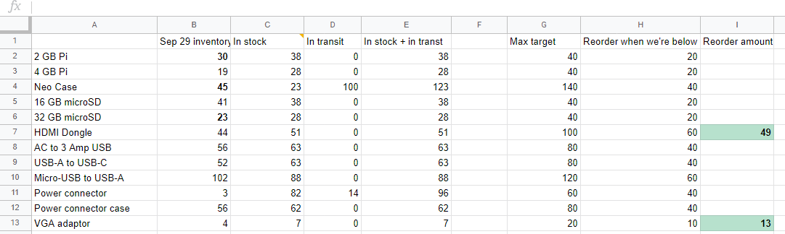
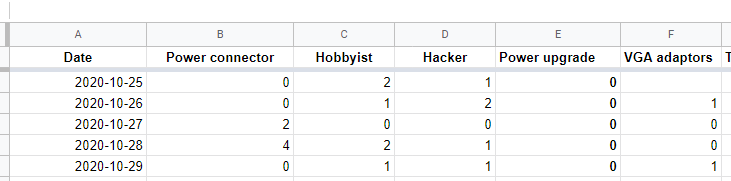
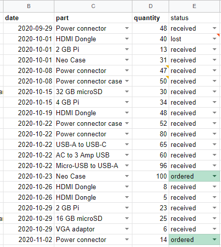
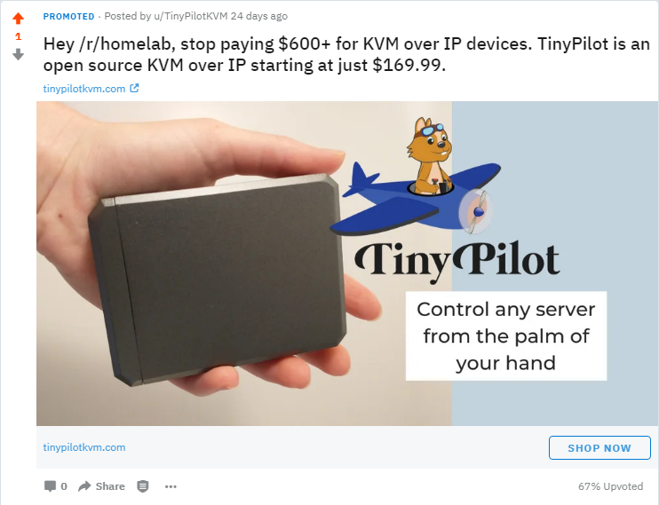
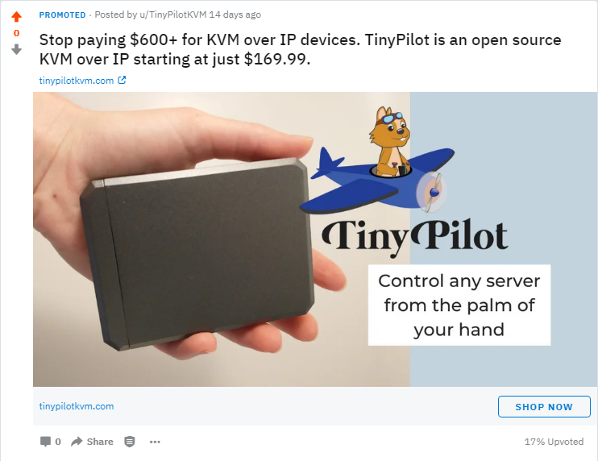
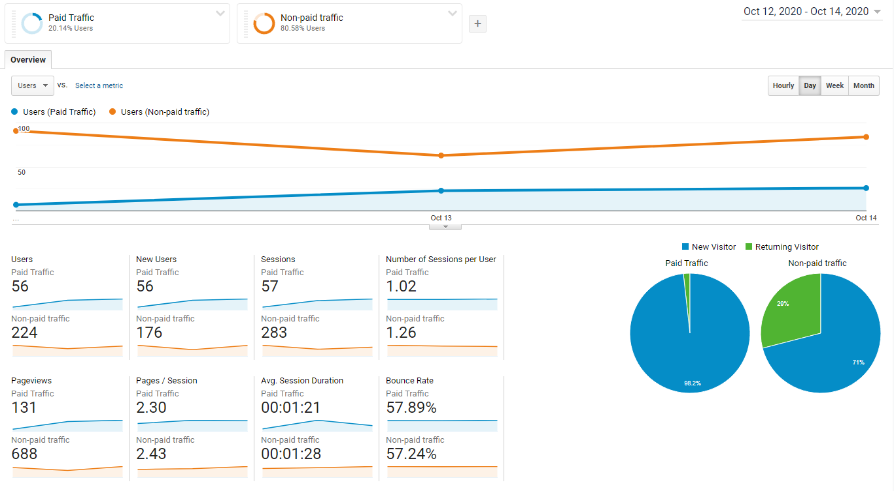
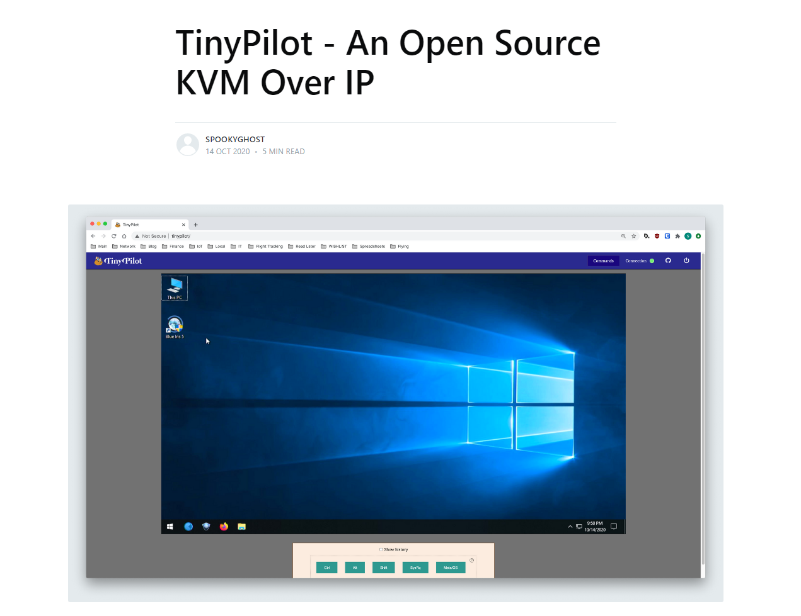

## Highlights

- TinyPilot hit $10k in revenue. That's a record high for me and [exceeds my total revenue for all of 2019](/solo-developer-year-2/#how-i-made-and-spent-money).
- I interviewed several IT consultants and business owners about what TinyPilot features would be useful to them.
- I tested several new marketing channels and realized I'm failing to measure results accurately.

## Goal Grades

At the start of each month, I declare what I'd like to accomplish. Here's how I did against those goals:

### Sell 60 TinyPilot kits and power connectors

- **Result**: Sold 47 kits and 35 connectors (82 total)
- **Grade**: A+

I beat my target by 33%, so I'm happy with the results here. I think this is mostly due to [staying ahead on inventory](#what-a-difference-a-well-stocked-inventory-makes).

### Test three new marketing channels

- **Result**: Shared TinyPilot on reddit, blogs, a podcast, and a newsletter
- **Grade**: B

I explored several new channels to attract users to TinyPilot, but I did a [poor job of measuring their effectiveness](/retrospectives/2020/11/#tracking-acquisition). I can see which channels attracted new website visitors, but I have no numbers showing which of them led to purchases.

### Interview seven IT professionals about whether they'd use TinyPilot in their work

- **Result**: Had four phone/video calls and several more email exchanges
- **Grade**: B+

I didn't arrange as many interviews as I had hoped, but I think I got enough information to return my focus to development for the next few weeks.

## Stats

### [TinyPilot](https://tinypilotkvm.com/?ref=mtlynch.io)



| Metric            | September 2020 | October 2020   | Change                                            |
| ----------------- | -------------- | -------------- | ------------------------------------------------- |
| Unique Visitors   | 1,741          | 2,604          | +863 (+50%)            |
| Total Pageviews   | 7,057          | 8,780          | +1,723 (+24%)          |
| Sales Revenue     | $3,636.03      | $10,176.23\*   | +$6,540.20 (+180%)     |
| Donations         | $187.40        | $90.00         | -$97.40 (-52%)           |
| **Total Revenue** | **$3,817.99**  | **$10,263.62** | **+$6,445.63 (+169%)** |

 \* Excludes revenue from shipping fees and taxes, because those are just pass-through costs.


TinyPilot had a great month across basically all metrics. I'm glad to see visits to the site grow organically and sales continue to increase.

It's hard to calculate profits precisely because my costs fluctuate as I find new suppliers and make different bulk-rate deals. I'd estimate that my profits were around $4k.

Notably, my costs for the power connector boards dropped substantially. The first batch cost [$33/unit](/retrospectives/2020/10/#costs) for just the circuit boards. The second run cost only $12/unit, including the cost of the 3D printed cases.

## What a difference a well-stocked inventory makes

This is TinyPilot's highest revenue month ever, beating July, when TinyPilot [hit #1 on Hacker News](https://news.ycombinator.com/item?id=23927380). Uncoincidentally, October was the only month where I didn't have to list products as backordered because I ran out of inventory.

The two main changes that allowed me to stay ahead of inventory were:

1. I delegated inventory management to my assistant and empowered her to purchase new supplies whenever necessary.
1. We reorganized our inventory spreadsheet to give us better insight into our inventory.

When I first started, I made an ugly spreadsheet that looked like this:

{{}}

The new spreadsheet looks like this:

{{}}

The key difference is that it quickly answers questions like, "How many of this part do we have?" and "What parts are due for a reorder?"

To do this, I had to decide the minimum and maximum of items to keep in stock. These values are a function of:

1. How expensive is this part?
1. How long does it take for this part to arrive?
1. How many of our products use this part?
1. What discounts are available for bulk orders?

For example, the HDMI dongle checks all the boxes for "keep lots of these in stock." Both TinyPilot kits use it, it takes several weeks to ship from China, and it's relatively cheap at ~$9/unit.

At the other end of the spectrum, the $55/unit 4 GB Raspberry Pi is TinyPilot's most expensive part. It's available from several sellers with a turnaround of only a few days. Merchants don't offer bulk discounts on Raspberry Pis until you get into the hundreds of units. These factors mean we can keep a relatively small supply on hand and reorder on-demand.

When we place orders for new inventory or fulfill customer orders, we update two child spreadsheets that automatically update the counts in the main inventory overview:


{{}}
{{}}


## Customer research

I spent most of October researching potential TinyPilot customers and cold emailing them to ask for interviews. This is one of my least favorite parts of running a business. It requires a lot of research and dead ends, so it can get boring and demotivating.

I tend to overinvest in research because I go down the rabbit hole when researching companies and forget to stop when I have enough background to reach out. Research also frequently leads me to places like reddit, Facebook, and LinkedIn, which [create their own distractions](/eliminate-distractions/).

### My interview strategy

One of the lessons I took to heart after reading [_The Mom Test_](/book-reports/the-mom-test/) was that people have a bias to tell you they like your idea. For that reason, I never mentioned TinyPilot until the end of the interview. I set up the interviews from my @mtlynch.io email address and told interviewees that I was interested in remote access in scenarios where tools like SSH and Remote Desktop don't work.

### What are people's remote access pain points?

I expected IT consultants to be a good match for TinyPilot, but most of the ones I interviewed said they didn't have problems with remote access. Mid-sized companies tend to have modern HP or Dell servers, and those have built-in console-level remote access. For workstations, they run Windows, and they can deploy new OS versions with Microsoft's regular IT administration tools.

The most common pain points people mentioned were for dealing with exceptions. For example, a company might have a main office with 100 people and standardized IT infrastructure, but they have one overseas office with three people and totally different equipment. In those cases, they'd like a few KVMs on hand to ship over and manage remotely.

Another exception scenario people mentioned was where a company has a fleet of modern Dell servers, but they have one 15-year-old IBM mainframe that they can't decommission because it runs some business-critical FORTRAN application. Old servers obviously don't have tools like iDRAC or iLO, so they'd want a KVM to manage that legacy server remotely.

### What features should I prioritize in TinyPilot?

The most common feature people talked about was a **remote management portal**. Many customers said they wanted some portal they could either self-host or access in the cloud that would allow them to connect to any of their TinyPilot devices in the field.

Next was **power management**. People wanted a way to power a machine on and off if it got stuck. Projects similar to TinyPilot have solved this by wiring a relay directly to the motherboard, but people I spoke to didn't seem too excited about that route.

The last feature that people asked for was **drive mounting**. Some KVMs allow you to upload a disk image, and then the KVM makes that disk appear as a removable drive on the target computer. Only a couple of interviewees mentioned this, but it's also a common request among my existing users.

The good news is that my intuitions were correct. These were all features I teased a few months ago when advertising a possible paid version of TinyPilot's software called [TinyPilot Pro](https://tinypilotkvm.com/pro?ref=mtlynch.io). Without my prompting, these interviewees often brought up these same features independently.

## Experimenting with paid reddit ads

I'd never tried reddit ads before, but I have to say that the experience was disappointing. I got decent engagement, but the platform itself is unintuitive and a pain to use. As far as I can tell, you can't edit an ad after you create it, even if it hasn't run yet. You can only duplicate it and then make changes to the copy. The copy, of course, becomes immutable the moment you hit save.

Ads can't run until they receive manual approval, which is fine and expected. But seemingly irrelevant changes to the ad put it back into an unapproved state. Like I changed which subreddits I wanted the ad to display in, and that froze my ads for several hours until they could be re-approved.

### Micro-targeting /r/homelab

I started with ads that ran exclusively in the [/r/homelab subreddit](https://www.reddit.com/r/homelab/). Here were my top-performing ads:

| Ad Copy                                                         | Impressions | Clicks | CPC   | CTR    | Conversions |
| --------------------------------------------------------------- | ----------- | ------ | ----- | ------ | ----------- |
| [Tired of swapping your monitor cables?](tired-of-swapping.png) | 2,929       | 67     | $1.53 | 2.287% | 0           |
| [Stop paying $600 for KVM over IP devices](hey-stop-paying.png) | 836         | 14     | $1.91 | 1.675% | 0           |
| [I got tired of bloat-laden enterprise KVMs](i-got-tired.png)   | 2,498       | 41     | $1.69 | 1.641% | 0           |

The click-through-rate is pretty good, but nobody purchased anything through those ads. I even added an event for "Add item to cart," and nobody even got that far.

### Hey - not just for horses

It seems like mentioning the subreddit by name makes a difference. I ran ads that were identical except that one started with "Hey /r/homelab," and its click-through-rate was 3x higher than the one that skipped the salutation:


{{}}
{{}}


### Going broader

After testing the waters with /r/homelab, I tried a broader campaign that displayed the ad in more subreddits. The results were much worse. My overall click-through-rate was 0.435%, with a cost-per-click of $2.21. The /r/homelab and /r/homelabsales subreddits continued to perform far better than any others.

It's worth noting that I dropped the "Hey [subreddit]" on these ads, so maybe they would have performed better had I customized each ad on a per-subreddit basis.

### Are these numbers right?

As I look back on these numbers, I'm questioning their accuracy. I paid $360 for 208 clicks from reddit, and none of those visitors even clicked "Add to Cart."

Looking at Google Analytics, that seems questionable:

{{}}

Paid reddit visitors perform worse on most metrics than my typical user, but not _that_ much worse.

There were four orders during the three days I ran my first campaign, which means that overall my conversion rate was 1.429%. If I trust these numbers, my conversion rate from reddit was 0%, and from other sources, it was 1.786%. The numbers aren't significant enough to say for sure, so it's plausible the conversion counts are accurate. Still, I'm a bit skeptical that zero reddit visitors ever added an item to their cart.

What I should have done (and what I'll do in the coming weeks) is click the ads and go through a checkout flow to verify whether reddit's analytics properly track these events.

## Other marketing channels

### Organic search

Organic search is TinyPilot's largest source of customers. When I started the business, I was hoping to reach the first page of Google results for searches like "raspberry pi kvm over ip." [My TinyPilot blog post](/tinypilot/) performed better than I expected, so TinyPilot is now on the front page for broader terms like "kvm over ip."

{{}}

### Writing more blog posts

This month, I published a new post about building my [homelab VM server](/building-a-vm-homelab/) and explained how TinyPilot made the process easier. [My original article](/building-a-vm-homelab-2017/) was #1 for a few popular Google queries, such as "homelab vm" and "vm server" so I expect that the update will help me keep my position there.

I submitted the new post to several subreddits, including one I wasn't aware of before, [/r/HomeServer](https://www.reddit.com/r/HomeServer/). When my VM server post [did well](https://www.reddit.com/r/HomeServer/comments/j7eiuo/my_home_vm_server_for_software_development/), I also submitted my original TinyPilot article, which [got a positive reception as well](https://www.reddit.com/r/HomeServer/comments/jeoc74/tinypilot_build_a_kvm_over_ip_for_under_100/).

{{}}

### The TinyPilot mailing list

TinyPilot has a mailing list, and when I [paused sales in August](/retrospectives/2020/09/#why-oh-y-cables) to chase down a power issue, I invited customers to sign up for the mailing list to find out when sales would reopen. I expected a burst of sales when I announced that sales were resuming. I wanted to reward customers for waiting, so I offered an exclusive 10% off coupon.

Only one customer purchased with the coupon, so I guess there wasn't really a backlog of users waiting to purchase. Another customer emailed, asking if they could retroactively apply the coupon to an order they placed the previous day. I allowed it, but I wonder if there were other recent customers who felt punished for purchasing earlier.

### Homelab blogs

[NetworkProfile](https://blog.networkprofile.org) is a cool blog I found through self-hosting and homelab communities on reddit. I asked the author if he'd be interested in reviewing a TinyPilot device, and he needed a new KVM over IP for his security camera server. He published [a thorough review](https://blog.networkprofile.org/tinypilot-open-sourve-ipkvm/) within days of receiving the device that covered both the good and the bad of TinyPilot:

{{}}

I also reached out to a large hardware blog that's interested in featuring TinyPilot in November, so I hope to share a positive update about that next month.

### Blind bargains podcast

This one just happened without me initiating it directly. I only realized it by seeing incoming referrals from [Blind Bargains](https://www.blindbargains.com/), a podcast for people who are blind or have low vision. [Alex Hall](https://twitter.com/mehgcap) was a guest on the episode, talking about his experience as a blind PC builder.

BIOS UIs typically have poor accessibility support, so there's no way for blind users to navigate the interface. Alex configured his TinyPilot so that his friend could access it over the Internet and describe to him what appeared on the screen during BIOS. This allowed Alex to customize his BIOS settings to take advantage of the advanced features his motherboard offers.

If you're interested in [checking out the episode](https://www.blindbargains.com/bargains.php?m=22022), the TinyPilot discussion begins at 1:03:57.

### Self-hosting newsletter

Lastly, I submitted TinyPilot to a newsletter about self-hosting projects. It stayed up on their list of user-contributed links, but they didn't include it in their newsletter.

I can buy a guaranteed spot in the newsletter for $500, but I suspect that the audience is too small to get a positive return on investment there.

## Tracking acquisition

The takeaway I'm realizing now as I look back on my marketing experiments is that I need to improve my conversion tracking.

The challenge is that I have sort of an unusual payment flow:

1. User lands on the TinyPilot website from Google search, paid ad, or an external site.
1. User adds an item to their cart and clicks "Check out."
1. The TinyPilot website sends the user to Shopify to complete their purchase.
1. Shopify sends the user back to an "Order complete" page on the TinyPilot website when they complete their checkout.

So, Shopify can't track where purchases came from because they see 100% of customers arrive from the TinyPilot website. I run Google Analytics on the TinyPilot website, but it loses the flow of the session because users leave the TinyPilot domain to check out on Shopify and then come back after they complete their order. Google Analytics records those as two separate sessions and doesn't link them.

I'm sure this is solvable, as my flow isn't _that_ crazy. I just need to spend some time figuring out how to keep track of where customers originate from as they complete the payment flow.


The problem of tracking sessions across Shopify checkouts feels like one of those problems that's easy to solve once you've done it, so if any of my readers know the solution, [get in touch](/about/).

**Update**: A kind reddit user has [shared a potential solution](https://www.reddit.com/r/SideProject/comments/jnkkzu/my_first_10k_month_selling_a_raspberry_pibased/gb3i0cz/?context=3).


## Legacy projects

Here are some brief updates on projects that I still maintain but are not the primary focus of my development:

### [Is It Keto](https://isitketo.org)



| Metric                    | September 2020 | October 2020 | Change                                         |
| ------------------------- | -------------- | ------------ | ---------------------------------------------- |
| Unique Visitors           | 44,751         | 50,195       | +5,444 (+12%)       |
| Total Pageviews           | 110,922        | 117,428      | +6,506 (+6%)        |
| Domain Rating (Ahrefs)    | 10.0           | 10.0         | 0                                              |
| AdSense Earnings          | $161.06        | $322.58      | +$161.52 (+100%)    |
| AdThrive Earnings         | $135.00        | N/A          | N/A                                            |
| Amazon Affiliate Earnings | $83.03         | $188.28      | +$105.25 (+127%)    |
| **Total Revenue**         | **$379.09**    | **$510.86**  | **+$131.77 (+35%)** |

Is It Keto had nice growth this month, and I'm not sure why. I haven't touched it at all since September.

These numbers further confirm what I've always liked about Is It Keto as a business: when I stop managing it, it continues earning money at roughly the same rate. When I do add content or features, it bumps up the recurring, passive revenue that I'll earn from it when I stop managing the site.

### [Zestful](https://zestfuldata.com)



| Metric            | September 2020 | October 2020 | Change                                         |
| ----------------- | -------------- | ------------ | ---------------------------------------------- |
| Unique Visitors   | 333            | 436          | +103 (+31%)         |
| Total Pageviews   | 849            | 1,149        | +300 (+35%)         |
| RapidAPI Earnings | $12.27         | $35.05       | +$22.78 (+186%)     |
| **Total Revenue** | **$12.27**     | **$35.05**   | **+$22.78 (+186%)** |

Zestful continues its multi-month streak of sub-$100 revenue from low-volume clients.

I received an inquiry from a large customer about an enterprise package for Zestful. It could potentially be a significant source of revenue, but I'm worried about it distracting me from TinyPilot. Historically, enterprise Zestful customers have required little to no support, so it might turn out to be a win-win.

## Wrap up

### What got done?

- Set a new personal record for revenue, at $10,263 in TinyPilot sales.
- Interviewed several businesses about their pain points in remote administration.
- Published a new blog post about [using TinyPilot to build my new home VM server](/building-a-vm-homelab/).
- My article on digitizing home videos [hit #3 on Hacker News](https://news.ycombinator.com/item?id=24839848).

### Lessons learned

- Inventory management makes a huge difference
  - Customers are understandably more interested in purchasing TinyPilot when there isn't a multi-week backlog.
  - At the same time, it [requires a lot of cash](https://twitter.com/deliberatecoder/status/1322547428999024641) to pre-pay for inventory in advance.
- I need better conversion tracking before investing more into marketing
  - I tested several marketing channels, but I'm limited in what I can learn from the results because I'm not tracking the full flow from arrival to purchase.

### Goals for next month

- Release a high-end version of TinyPilot that arrives pre-assembled in a custom case.
- Release the first version of [TinyPilot Pro](https://tinypilotkvm.com/pro?ref=mtlynch.io).
- Figure out how to properly track the source of customers who end up completing purchases.
