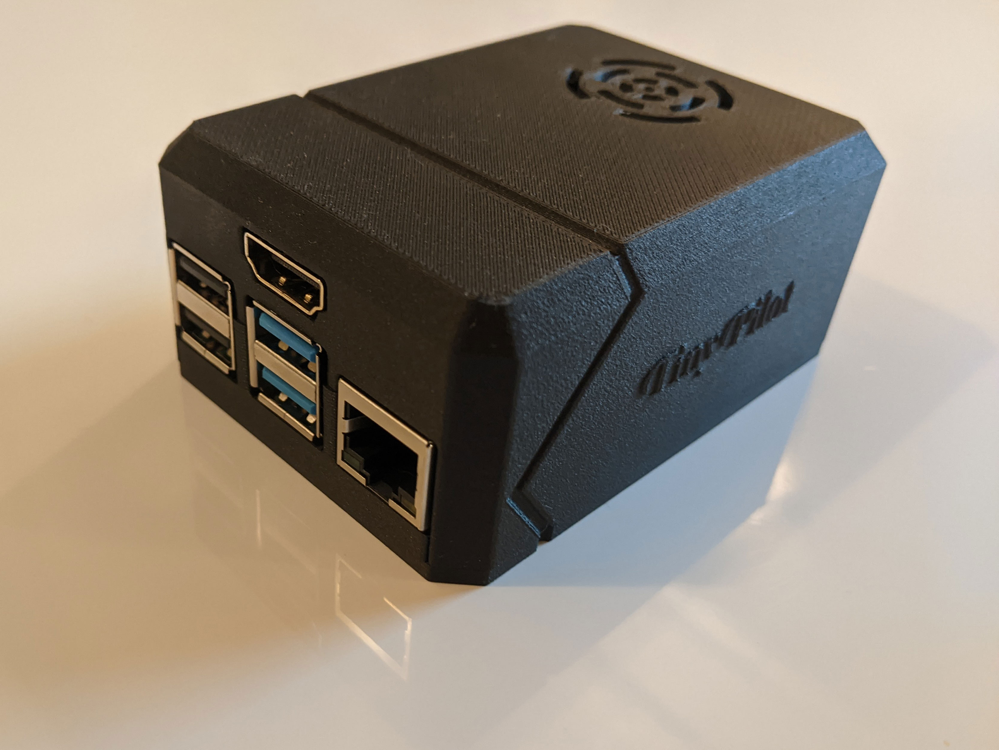
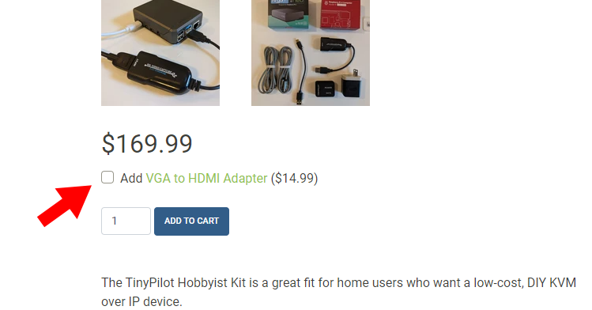
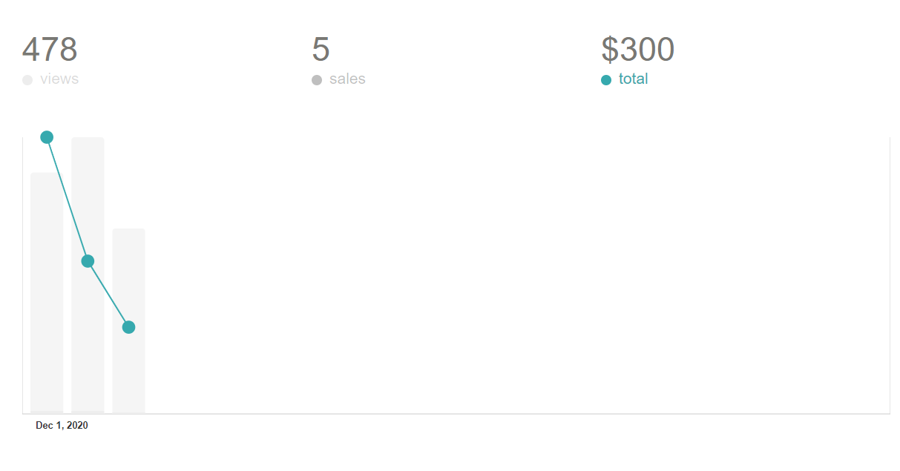

## Highlights

- TinyPilot revenue grew 20% to $12k.
- I released a new high-end model of TinyPilot.
- I launched my first ever paid course.

## Goal Grades

At the start of each month, I declare what I'd like to accomplish. Here's how I did against those goals:

### Release a high-end version of TinyPilot that arrives pre-assembled in a custom case

- **Result**: Released [TinyPilot Voyager](https://tinypilotkvm.com/product/tinypilot-voyager?ref=mtlynch.io)
- **Grade**: A

I released it! It had a muted reception at first, but now sales seem to be picking up.

### Release the first version of [TinyPilot Pro](https://tinypilotkvm.com/pro?ref=mtlynch.io)

- **Result**: I haven't even figured out how to distribute TinyPilot Pro.
- **Grade**: F

Releasing Voyager took longer than I anticipated, so I punted this until December.

### Figure out how to properly track the source of customers who end up completing purchases

- **Result**: I _think_ I'm doing this properly.
- **Grade**: C-

I figured out how to track sessions as users move between [tinypilotkvm.com](https://tinypilotkvm.com/?ref=mtlynch.io) and my Shopify domain for the checkout process (thanks to [this suggestion from reddit](https://www.reddit.com/r/SideProject/comments/jnkkzu/my_first_10k_month_selling_a_raspberry_pibased/gb3i0cz/?context=3)). Still, Google Analytics claims that 53% of visitors [arrived directly](ga-referrals.png), meaning that they typed the URL manually. That seems unlikely.

Another founder made a compelling argument to me that my largely tech audience is probably using ad-blockers. That means a large percentage won't show up in analytics anyway. It's also common for people to come back to the site later rather than complete their purchase the instant they see an ad, so I might be putting too much faith in the accuracy of analytics.

## Stats

### [TinyPilot](https://tinypilotkvm.com/?ref=mtlynch.io)



| Metric            | October 2020   | November 2020  | Change                                           |
| ----------------- | -------------- | -------------- | ------------------------------------------------ |
| Unique Visitors   | 2,604          | 3,118          | +514 (+20%)           |
| Total Pageviews   | 8,780          | 9,021          | +241 (+3%)            |
| Sales Revenue     | $10,176.23     | $12,313.25     | +$2,137.02 (+21%)     |
| Donations         | $90.00         | $0.00          | -$90.00 (-100%)         |
| **Total Revenue** | **$10,263.62** | **$12,313.25** | **+$2,049.63 (+20%)** |

TinyPilot had another month of strong growth, with a $2k increase in overall revenue. I ran a Black Friday Weekend special for 20% off, and that generated a $3k bump in revenue to close out the month.

## New products require new habits

The biggest TinyPilot event this past month was [the release of TinyPilot Voyager](https://tinypilotkvm.com/blog/introducing-voyager?ref=mtlynch.io). It's the new model that uses a higher-quality video capture device. I worked with a 3D printing lab to create a custom case that neatly packages together all the components.

{{}}

Unlike my previous products, which ship as "some assembly required" kits, Voyager comes pre-assembled, so it's plug 'n play.

I'm finding that one of the biggest sources of stress with running TinyPilot as a business is just forming new habits. When I'm in steady-state, everything is easy. Orders come in, then my assistant packs them and mails them out. There are a few special cases here and there, but for the most part, once a routine forms, it's low-stress and manageable.

When we do something new, everything goes haywire and gets stressful. It happened when I started selling TinyPilot internationally. Now that I know the process, it's easy, but figuring out the requirements and setting everything up for the first time was bewildering and frustrating.

I realized too late that I underestimated the cost of establishing new habits for Voyager. No one thing was especially difficult, but there are dozens of little new things that have to happen and existing processes we have to adjust. In the future, I'll plan to roll out new products more gradually and budget time for developing processes and handling unexpected issues.

## Voyager pricing

Voyager is exciting because it's a product that only I offer, so I can charge a higher premium than my other products. My costs for each Voyager are ~$106/unit, so I make a profit of $144 on each sale (58% markup). I have similar percentage markups on the kits, but my profits are lower in absolute terms (~$86/unit) because of the lower price point.

| Product      | Cost    | Retail Price | Profit          |
| ------------ | ------- | ------------ | --------------- |
| Hobbyist kit | $84.22  | $169.99      | $85.77 (50.5%)  |
| Voyager      | $106.22 | $249.99      | $143.77 (57.5%) |

I plan to experiment more with Voyager's pricing, as I suspect there's room to grow. Before I released Voyager, one of my business customers said to me, "You should make a custom enclosure for these because business clients like me would pay $400 for them."

TinyPilot is an alternative to enterprise KVMs, where [costs are $600-1,000 per device](https://mtlynch.io/tinypilot/#commercial-solutions). Many of those solutions require the user to run old versions of Java to access the interface. Customers hate Java-based client UIs, so it's possible I don't even have to compete with entrenched KVM manufacturers on price.

## Eliminating sales questions with a product add-on

One of the most common questions customers asked about TinyPilot was, "Does it work with servers that have VGA output instead of HDMI?" For the first month, my answer was that a VGA to HDMI adapter would probably work, but I'd never tested it.

After the third inquiry about VGA support, I purchased a VGA to HDMI adapter from Amazon. After I verified that it worked with TinyPilot, I began recommending it to any customers who asked.

As I continued receiving questions about VGA, I started thinking about ways to answer the customer's question before they have to email me. So I did this:

{{}}

About one-third of my customers now choose the VGA add-on, so the experiment was a success. I sell the adapter at cost, but it creates convenience for my customers who don't have to go elsewhere to purchase it separately.

## My first paid course

The idea of making a paid course or book has been in the back of my mind for the past couple of years. Two things happened recently that made me think much more seriously about it.

The first was TinyPilot. In the back of my mind, I felt embarrassed to sell a course teaching anything when none of my businesses were profitable. I thought back to this jokey TV ad that ran in the 90s where a slick sales guru tells viewers to pay $50 for his guide to fast wealth. The book is titled, _How to Convince People to Send You $50 for a Book_. But TinyPilot's success made me feel like the things I know are demonstrably valuable.

The other factor was [Daniel Vasallo's interview on the Indie Hackers podcast](https://www.indiehackers.com/podcast/177-daniel-vassallo). I've been following Daniel's progress ever since he [left Amazon](https://danielvassallo.com/only-intrinsic-motivation-lasts/) in an exit similar to [my departure from Google](https://mtlynch.io/why-i-quit-google/). In the year after he started working for himself, he released an [ebook about AWS](https://gumroad.com/l/aws-good-parts/dv), which earned $100k, and [a video course about Twitter](https://gumroad.com/l/twitter-audience/dv) that earned $150k. He recorded and published the Twitter course in just 16 hours to test his theory that people care more about information quality than production value.

{{}}

$150k for 16 hours of work? That sounded like a great deal to me!

Okay, I didn't really expect to make $150k, but I thought $20k was achievable. And I fuss too much over editing to do it in 16 hours, but I could probably put together a course in 40 hours.

In the last year, I've realized that one of my unique skills is writing articles that reach the front page of [Hacker News](https://news.ycombinator.com/), so I decided to make a course that teaches everything I've learned about doing that.

{{}}

I announced the course two days ago, and sales have been... slow.

{{}}

As of this writing, I've sold five pre-orders for $300 total. I'm happy to have sales, but I'm a bit worried that I overestimated the market for this course. One of the authors who gave me advice about self-publishing a course told me that she made more in pre-sales than she did post-launch, so the current sales numbers don't bode well.

But it's possible that with this product, people are less interested in pre-paying for a course that's not yet available. I might create a landing page that just collects emails to announce the release date and direct people there instead.

I'm getting worried that I bit off more than I can chew, though. I've spent about 30 hours already between putting together slides, working on the cover image, and presenting to test audiences. I haven't even started recording the real course yet. There's probably 30-50 hours of work to go, and I'm anxious about how much time it's taking away from TinyPilot.

But it'll be **fine**. I think whatever happens, it'll be an interesting learning experience and will inform whether and how I pursue educational products in the future.

## Legacy projects

Here are some brief updates on projects that I still maintain but are not the primary focus of my development:

### [Is It Keto](https://isitketo.org)



| Metric                    | October 2020 | November 2020 | Change                                      |
| ------------------------- | ------------ | ------------- | ------------------------------------------- |
| Unique Visitors           | 50,195       | 43,911        | -6,284 (-13%)      |
| Total Pageviews           | 117,428      | 102,143       | -15,285 (-13%)     |
| Domain Rating (Ahrefs)    | 10.0         | 10.0          | 0                                           |
| AdSense Earnings          | $322.58      | $357.51       | +$34.93 (+11%)   |
| Amazon Affiliate Earnings | $188.28      | $74.01        | -$114.27 (-61%)    |
| **Total Revenue**         | **$510.86**  | **$431.52**   | **-$79.34 (-16%)** |

Is It Keto is still chugging along in the background. Amazon Affiliate revenue is dwindling, likely because I haven't updated my affiliate links in a few months, so many of them are pointing to products that no longer exist. Updating the dead links requires 90-180 minutes of tedious work, so I'd rather spend the time on TinyPilot.

The drop in visitors is expected, as there's historically a seasonal drop for the holidays, followed by a huge surge in visits starting New Year's Day.

### [Zestful](https://zestfuldata.com)



| Metric                   | October 2020 | November 2020 | Change                                           |
| ------------------------ | ------------ | ------------- | ------------------------------------------------ |
| Unique Visitors          | 436          | 484           | +48 (+11%)            |
| Total Pageviews          | 1,149        | 1,393         | +244 (+21%)           |
| RapidAPI Earnings        | $35.05       | $28.37        | -$6.68 (-19%)           |
| Enterprise Plan Earnings | $0.00        | $872.63       | +$872.63 (+inf%)      |
| **Total Revenue**        | **$35.05**   | **$901.00**   | **+$865.95 (+2471%)** |

Zestful had a nice jump this month. One of my longtime pay-as-you go customers upgraded to a short-term unlimited plan because he had a big batch of ingredients to parse. That was a nice sale, but it's definitely a one-off.

## Wrap up

### What got done?

- Launched [Voyager](https://tinypilotkvm.com/product/tinypilot-voyager?ref=mtlynch.io), the new model of TinyPilot aimed at business customers.
- Published a [new release](https://github.com/tiny-pilot/tinypilot/releases/tag/1.2.0) of TinyPilot that includes an on-screen keyboard and support for saving screenshots.
- Launched pre-orders for my [Hacker News course](https://hitthefrontpage.com/).
- Two of my blog posts reached the front page of Hacker News.
  - [How I Hired a Freelance Editor for My Blog](https://news.ycombinator.com/item?id=25262272)
  - [Building a Homelab VM Server](https://news.ycombinator.com/item?id=25061823)

### Lessons learned

- New products need new processes.
  - Adapting to new processes creates stress.
  - Plan for everything to take longer than expected when rolling out a new product, even one that's similar to your others.
- Budget in the cost of technical debt
  - It took two weeks longer than I expected to release Voyager because I forgot about software shortcuts in TinyPilot's I took early in TinyPilot's life.
  - For simplicity, I baked assumptions into the code about which video capture device it would use, and untangling those assumptions was messy.

### Goals for next month

- Release the first version of [TinyPilot Pro](https://tinypilotkvm.com/pro?ref=mtlynch.io).
- Receive TinyPilot reviews from two bloggers or YouTubers with a relevant audience.
- Record five out of seven parts to my [Hacker News course](https://hitthefrontpage.com/).
