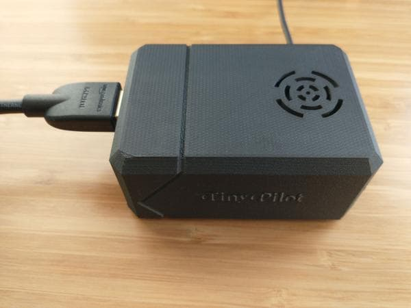
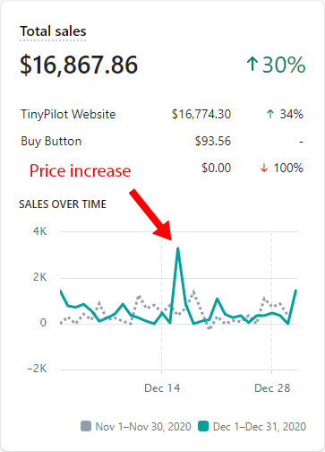
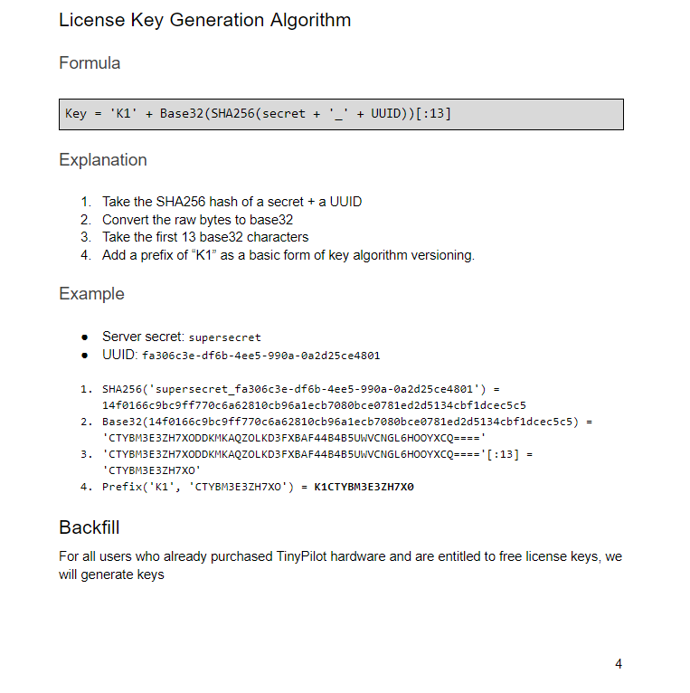
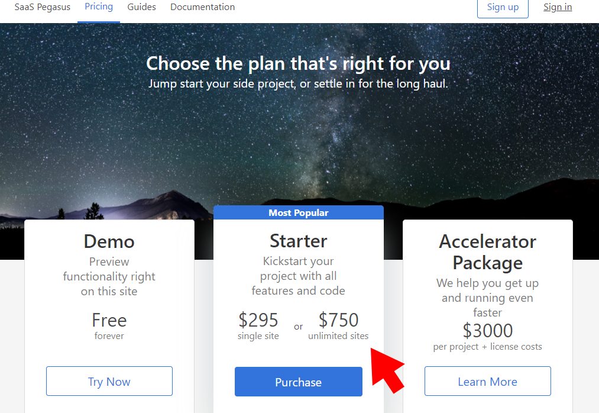
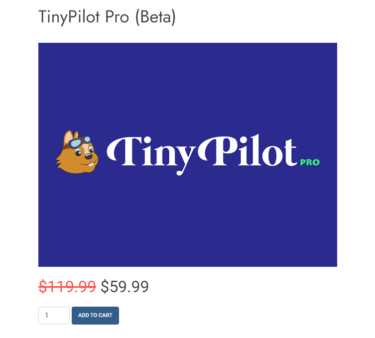
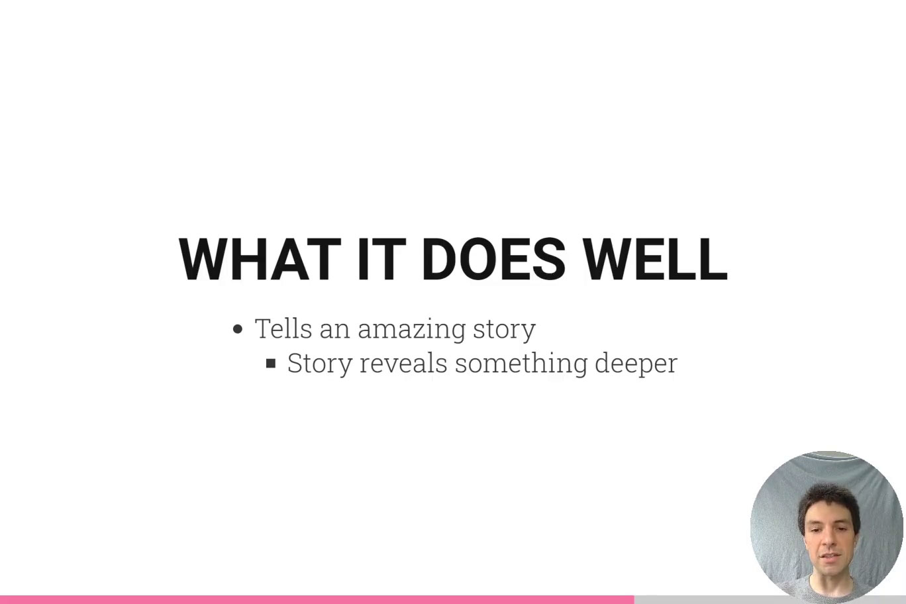

## Highlights

* [TinyPilot](https://tinypilotkvm.com) had another record-breaking month, with $15k in revenue.
* I sold $1.1k in pre-orders for my first ever [video course](https://gum.co/htfphn/hacker).
* My attempt to slow down sales ended up doing the opposite.

## Goal Grades

At the start of each month, I declare what I'd like to accomplish. Here's how I did against those goals:

### Release the first version of [TinyPilot Pro](https://tinypilotkvm.com/pro)

* **Result**: Released a beta version of TinyPilot Pro
* **Grade**: B

I thought the hard part of releasing TinyPilot Pro would be creating a separate distribution channel for paying customers. The v1 features for Pro seemed easy, but they turned out to be harder than I expected.

I would have released the official version of TinyPilot Pro, except I realized a few days before release that nobody had beta tested it except me. I reached out to a few users to see if they wanted early access, but it was over the holidays, so there wasn't much progress. Instead, I published it as a "beta" and offered it for a 50% discount.

### Receive TinyPilot reviews from two bloggers or YouTubers with a relevant audience

* **Result**: Two YouTubers have agreed to review TinyPilot, but they haven't published yet.
* **Grade**: D

TinyPilot Pro messed up my plans here. I'd been in conversation with a large YouTube channel interested in reviewing TinyPilot. But then they emailed me asking, "Hey, what's this *TinyPilot Pro* thing your website says you're about to release?"

They didn't want to record a review that would become obsolete a week later. So, now they're planning to do their review once TinyPilot Pro supports the next feature on my roadmap: remote drive mounting.

Another YouTuber agreed to review it but never followed up after I sent their free device, so hopefully, they're just backlogged.

### Record five out of seven parts to my [Hacker News course](https://gum.co/htfphn/hacker)

* **Result**: Recorded five parts and published them to pre-order customers
* **Grade**: A

I got this in just under the wire, sending out the last video at 5 PM on New Year's Eve, but I made it! Customers who pre-ordered now have early access to the first five videos.

## Stats

### [TinyPilot](https://tinypilotkvm.com)



| Metric             | November 2020  | December 2020  | Change                                           |
| ------------------ | -------------- | -------------- | ------------------------------------------------ |
| Unique Visitors    | 3,118          | 3,486          | +368 (+12%)           |
| Total Pageviews    | 9,021          | 5,785          | -3,236 (-36%)           |
| Sales Revenue      | $12,313.25     | $15,358.31     | +$3,045.06 (+25%)     |
| Donations          | $0.00          | $9.00          | +$9.00 (+inf%)        |
| **Total Earnings** | **$12,313.25** | **$15,367.05** | **+$3,053.80 (+25%)** |

TinyPilot had another strong month, growing by 25% in revenue. It's crazy to think that [my goal for 2020](/solo-developer-year-2/#goals-for-year-three) was to make $20k in revenue for the *year*, and I'm earning that almost every month now.

Despite the growth, I still feel like I'm fumbling on TinyPilot. I did no marketing in December aside from failed attempts to get reviews from YouTubers. Even development work slowed because of how little bandwidth I had. I've decided that revenues are strong enough that I can afford to bring on a part-time developer, and I've already begun the search process.

### [Hit the Front Page of Hacker News](https://gum.co/htfphn/hacker)

| Metric             | December 2020  |
| ------------------ | -------------- |
| Total Pageviews    | 2,243          |
| Orders             | 30             |
| **Total Earnings** | **$1,181.40**  |

December was my first month selling pre-orders for my blogging course, *Hit the Front Page of Hacker News*.

I had a small panic on the first day of sales because I sold only two pre-orders for a grand total of $160. That didn't bode well. Fortunately, there's been a small but consistent stream of customers that I broke $1k in sales for December.

One of the best ways I've found for reaching new customers is to [share behind-the-scenes updates on Twitter](https://twitter.com/deliberatecoder/status/1337513280064135169), but I've been so swamped that I've had trouble finding time to post updates.

## I generated record sales by accident

In the first few months of TinyPilot, I struggled to keep up with inventory and often had to [forfeit sales by listing all of my products as backordered](/retrospectives/2020/10/#inventory-shortages-and-the-thundering-herd-problem). I've thankfully managed to avoid going into backorder for two months, but that streak ended in December.

A shipment of HDMI capture chips was running late, and I needed them to build more [Voyagers](https://tinypilotkvm.com/product/tinypilot-voyager), my high-end TinyPilots.

{{}}

It was Monday, and the chips were supposed to arrive that Saturday. I had six Voyagers left. I generally sell about one every day or two, so I thought I might skate by. Then two customers purchased that day.

I was down to four. Okay, I still might make it...

On Tuesday, two more customers purchased Voyagers. I've never been so frustrated to make sales of my highest-margin product.

With only two remaining Voyagers in stock, I tried to slow down sales. I increased the price of Voyager from $249 to $299. Two hours later, I received an email from a customer saying he wanted to purchase seven!

I explained the inventory situation, and he said that he was fine with me shipping two immediately and waiting a few days for the remaining five. Thankfully, the chips arrived the following week, and the customer received all seven on time. So that was a $2,093 sale from a single customer, bumping my overall sales for that day to TinyPilot's all-time high of $3,298.

{{}}

## Enforcing software licenses via the honor system

I had been postponing work on TinyPilot Pro for months. It was largely because the first step in the process was so boring: distribution.

It's easy to distribute the free version of TinyPilot because the software is all [open-source](https://github.com/mtlynch/tinypilot). I publish an install script that works the same for customers and non-customers alike.

TinyPilot Pro would be more complicated. If I published the source, customers might think, "Why would I pay for this when I can just find it online for free?" I needed some way to limit access to paying customers.

I started designing a licensing system. It didn't sound so hard. Generate a hash or something based on the customer's device ID, and check that it matches on the server. Oh, but what about license expiration? Okay, so I'll keep a database of licenses with their expiration dates. But what if I lose that database? Hmm...

{{}}

It felt like overengineering. I looked into Shopify plugins that provide digital licenses, but they all seemed low-quality and didn't offer the functionality I needed. It would take longer to integrate with those solutions than to roll my own.

Then, I had a realization: what if I skip license enforcement entirely?

I was reminded of my friend [Cory Zue](https://coryzue.com)'s experience selling his Django starter template, [Pegasus](https://www.saaspegasus.com/). Customers are allowed to build one website with Pegasus, but Cory has no way of enforcing that. Once the customer downloads the Pegasus source code, they have everything they need to reuse it on hundreds of sites.

A few months into selling Pegasus, Cory was relieved to see his customers re-purchasing Pegasus for new sites. From a technical perspective, they were paying for the same code they'd bought before. But the customers were abiding honestly by the Pegasus license and compensating Cory for his product.

Cory realized he could offer a better solution: an unlimited license. Customers regularly purchase the unlimited option even though an unscrupulous customer could cheat Cory by paying the single-site price and reusing the code.

{{}}

If the honor system worked well enough for Cory, it would probably work well enough for me. I shelved my plans for a licensing server and just put TinyPilot Pro at an undiscoverable URL.

A dishonest customer could take advantage by re-using the license on multiple devices or sharing the URLs with non-paying users, but the risk and impact of both are low. It's been less than a week since I started selling TinyPilot Pro, and one of my customers has already purchased four separate licenses.

## I gave myself too many deadlines

I definitely over-committed in December.

I generally avoid promising customers a product by a certain deadline. TinyPilot is still so young, and things change quickly. At the same time, I was growing increasingly embarrassed about my promises to release TinyPilot Pro "soon" for the last six months, despite the fact that I had made zero progress. Finally, I started telling customers that I'd release the first version by end of the year.

{{}}

At the same time, I started working on [my first-ever video course](https://gum.co/htfphn/hacker). I estimated that it would take ~40 hours to write, record, edit, and publish. That's roughly how long it takes me to write a new blog post, so I figured I'd just do that instead of my next blog post. I picked a release date of January 13th, which seemed like an incredibly relaxed schedule to produce a couple hours of video.

{{}}

I *vastly* underestimated the work required to complete the course. It's probably going to take 150-200 hours to create this course, and it's been draining tons of time from TinyPilot.

And if that wasn't enough, I have a tradition of publishing a [yearly](/solo-developer-year-1/) [retrospective](/solo-developer-year-2/) on February 1st, the anniversary of when I [quit Google to work for myself](/why-i-quit-google/). I want to keep up that tradition, as it always draws a big response. But that means I need the blog post ready by February 1st.

So, in a one-month timespan, I gave myself four aggressive deadlines without realizing it. I'm definitely going to be more conservative about publicly declaring deadlines in the future.

## Legacy projects

Here are some brief updates on projects that I still maintain but are not the primary focus of my development:

### [Is It Keto](https://isitketo.org)



| Metric                    | November 2020 | December 2020 | Change                                        |
| ------------------------- | ------------- | ------------- | --------------------------------------------- |
| Unique Visitors           | 43,911        | 49,373        | +5,462 (+12%)      |
| Total Pageviews           | 102,143       | 93,242        | -8,901 (-9%)         |
| Domain Rating (Ahrefs)    | 10.0          | 10.0          | 0                                             |
| AdSense Earnings          | $357.51       | $334.72       | -$22.79 (-6%)        |
| Amazon Affiliate Earnings | $74.01        | $149.99       | +$75.98 (+103%)    |
| **Total Earnings**        | **$431.52**   | **$484.71**   | **+$53.19 (+12%)** |

I'm expecting a significant bump in January, as people often begin looking into healthier eating options at the start of the new year. I spent an hour updating Amazon Affiliate links so that I maximize the value from the upcoming surge months. Otherwise, Is It Keto remains on auto-pilot in the background.

### [Zestful](https://zestfuldata.com)



| Metric                   | November 2020 | December 2020 | Change                                       |
| ------------------------ | ------------- | ------------- | -------------------------------------------- |
| Unique Visitors          | 484           | 507           | +23 (+5%)         |
| Total Pageviews          | 1,393         | 1,511         | +118 (+8%)        |
| RapidAPI Earnings        | $28.37        | $103.33       | +$74.96 (+264%)   |
| Enterprise Plan Earnings | $872.63       | $0.00         | -$872.63 (-100%)    |
| **Total Earnings**       | **$901.00**   | **$103.33**   | **-$797.67 (-89%)** |

Zestful's quiet, too. The enterprise customer finished their one-month plan and didn't need to renew, as expected. There was a jump in RapidAPI earnings, but 95% of that came from a single user who seems to have used Zestful in a one-off bulk parsing.

## Wrap up

### What got done?

* Published the TinyPilot Pro beta
* Completed five sections of Hit the Front Page of Hacker News
* [Removed all affiliate links](https://twitter.com/deliberatecoder/status/1342847048811499523) from this blog
* Two of my blog posts [reached the front page of Hacker News](https://hn.algolia.com/?dateEnd=1609452000&dateRange=custom&dateStart=1606860000&page=0&prefix=true&query=mtlynch.io&sort=byPopularity&type=story)

### Lessons learned

* Commit to fewer deadlines.
  * Definitely don't commit to four aggressive deadlines in a one-month span.
* When selling side-projects, waitlist instead of pre-sell.
  * Pre-selling a product has the advantage of letting you know early that customers are willing to buy.
  * The downside of pre-selling is that I feel uncomfortable changing the scope or pushing back the release date since I've already sold under the promise of certain topics by a certain date.
  * If I sell an ebook or course in the future, I'll create a waitlist instead of pre-selling.
  * Adam Wathan talks more about pre-selling vs. waitlisting in [this helpful Microconf talk](https://www.youtube.com/watch?v=ajrDxZRpP9M).
  * Actually, now that I typed this out, I feel like I'm needlessly putting pressure on myself to stick rigidly to the course outline I advertised. I don't think anyone cares *that* much about me matching my outline exactly. If they do, I offer painless refunds.

### Goals for next month

* Hire a freelance developer to help with TinyPilot development.
* Receive TinyPilot reviews from two bloggers or YouTubers with a relevant audience.
* Earn $4k in revenue from Hit the Front Page of Hacker News.