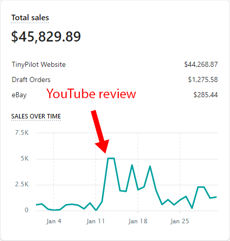
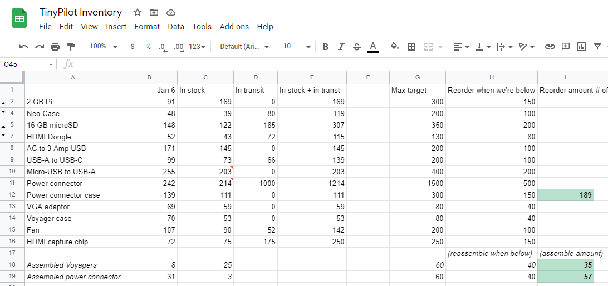

## Highlights

* TinyPilot achieved an astonishing growth in revenue, jumping from $15k in December to $42k in January.
* Most of TinyPilot's sales came from a single positive YouTube review.
* TinyPilot is experiencing growing pains as I scramble to meet demand.

## Goal Grades

At the start of each month, I declare what I'd like to accomplish. Here's how I did against those goals:

### Hire a freelance developer to help with TinyPilot development

* **Result**: I ran one trial hire that didn't work out, but I'm currently trying with another.
* **Grade**: A

Hiring a new developer is a slow process, but it's going according to plan. With each trial hire, I'm finding ways to help them ramp up faster. It also helps me recognize what qualities I should look for in future hires.

### Receive TinyPilot reviews from two bloggers or YouTubers with a relevant audience

* **Result**: Received one YouTube review and two others are in progress
* **Grade**: A-

I underestimated how long it takes for YouTubers to make new videos. One new review came out, but it's based on outreach I did in November. Two other YouTubers agreed to review, but they're still working on their videos.

That said, one review turned out to be almost too much to handle. More on that [below](#my-first-youtube-review).

### Earn $4k in revenue from Hit the Front Page of Hacker News

* **Result**: Earned $2.6k in revenue
* **Grade**: C

The course hasn't quite played out the way I'd hoped. I'm proud of the material, but far fewer people are purchasing it than I anticipated.

I tried [several different techniques](https://twitter.com/deliberatecoder/status/1352322420833722372) to market it, but none of them have had a noticeable effect on sales.

## Stats

### [TinyPilot](https://tinypilotkvm.com)



| Metric             | December 2020  | January 2021   | Change                                             |
| ------------------ | -------------- | -------------- | -------------------------------------------------- |
| Unique Visitors    | 3,486          | 11,249         | +7,763 (+223%)          |
| Total Pageviews    | 5,785          | 17,737         | +11,952 (+207%)         |
| Sales Revenue      | $15,358.31     | $41,992.92     | +$26,634.61 (+173%)     |
| Donations          | $9.00          | $0.00          | -$9.00 (-100%)            |
| **Total Earnings** | **$15,367.05** | **$41,992.92** | **+$26,625.87 (+173%)** |

This was a enormous month for TinyPilot. Sales jumped from $15k to $42k.

Every month, I think to myself, "Wow, that was a lucky month! I won't be able to do *that* again." And then there's even more growth the following month, so here's hoping that luck continues.

## My first YouTube review

The majority of January's growth is due to just one source: [Craft Computing](https://www.youtube.com/c/CraftComputing/about), a YouTube channel about IT hardware for professionals and home enthusiasts.

I discovered the Craft Computing channel early last year through its excellent tutorial on [installing Proxmox](/building-a-vm-homelab/#vm-management-proxmox). A few months later, Jeff, the host, announced that he had [quit his job](https://www.youtube.com/watch?v=5yTq0DLLeN0) as an IT manager to work for himself, so I [felt a kinship](/why-i-quit-google/) there.

In November, I reached out asking if he'd be interested in reviewing TinyPilot. He agreed, so I quickly shipped one over. I didn't hear anything for a few months and was beginning to wonder whether my Voyager was just sitting in a big heap of free hardware that companies send him.

Just before I went to bed on January 12th, Jeff emailed me to say he posted the review.



It was surreal. My girlfriend and I watched it on the big TV in our living room, so I was seeing a YouTube personality I'd watched for a year *holding my product and speaking directly to me!*

Jeff loved TinyPilot and shared the many ways it impressed him. I was anxious the whole way through that he would suddenly stop and say, "Actually... now that I think about it, this product is bad. Tell everyone you know not to buy one." But fortunately, the review was positive throughout, and his critiques were minor.

The results were strong and immediate. The next day, I received 33 orders and earned $5k in revenue, far exceeding previous sales records. The next day, the number of orders dropped, but more of the customers purchased high-end kits, so the total revenue remained the same (almost *exactly* the same - there was an increase of only $1.99).


{{}}
{{}}


I expected things to subside on the third day, and they did a little bit, but they kept coming. I planned inventory to absorb a rush like this for a few days, but I didn't expect it to continue as long as it did.

My fulfillment manager and I kept up with orders for the first week, but on day eight, we'd been run ragged. We ran out of a few parts we couldn't replace within our two-day shipping window, so we briefly listed our products as backordered. A few days later, we were back on our feet and things were back to manageable.

## My first postmortem

[Blameless postmortems](https://landing.google.com/sre/book/chapters/postmortem-culture.html) are one of the most valuable practices I learned while working at Google. When something goes majorly wrong, you get back to steady state and then write a report analyzing what happened.

As the name implies, the document is *blameless*. It's never, "We had an outage because Michael's an idiot, and he deleted the wrong file."

The underlying assumption of a postmortem is that everyone on the team is smart and diligent, so if something went wrong, it was the systems and not the people who failed. When a failure looks like someone being stupid, the root cause is that processes failed to protect against expected human error.

After the Craft Computing review, my fulfillment manager and I conducted TinyPilot's first postmortem. Below are the the major issues we discovered and what changes we put in place to mitigate them.

### Inventory targets were too low

We manage inventory with a spreadsheet. For each part we carry, we define a minimum and maximum. For example, Raspberry Pis had a minimum of 40 and a maximum of 80. That means that anytime our inventory of Raspberry Pis drops below 40 Pis, we order enough to get our supply back to 80.

{{}}

The problem was that we only adjusted these targets when they became a problem. Even though TinyPilot's sales grow each month, we never adjust the targets to match. Then, when we're in a shortage, we're so panicked that it's hard to think rationally about what the new targets should be.

* **Fix**: Schedule a monthly adjustment of inventory targets.
* **Fix**: Assume the next surge in orders will be more intense than our last one.
* **Fix**: If we ever run out of a part or experience a close call, double its inventory targets.

### Urgency was not obvious

Our standard workflow with the inventory spreadsheet is to "top up" any item that falls below the threshold of what's in stock. So when we dipped below the minimum for USB cables, we ordered new ones in our usual workflow, with standard ground shipping.

We didn't notice that customers were purchasing so quickly that some parts would reach zero before our resupply arrived.

* **Fix**: Highlight numbers in the "in stock" column when they reach dangerously low levels.
* **Fix**: Upgrade to Amazon Business Prime to make two-day shipping a no-brainer.
* **Fix**: Look for inventory management software that includes alerting based on trends.

### Handling time is too short

When I first started TinyPilot, I promised shipping within one business day. It immediately became clear that a one-day turnaround was unsustainable, as it constantly forced me to context-switch and rush orders out. A few weeks in, I changed the advertised turnaround time to two days.

After the YouTube review, we had to list items as backordered on day 8, but if our shipping promise was three days, that would have been enough buffer for us to never go into backorder. We realized that about 80% of our previous backorders or close calls were off by just a day.

The two-day window was creating too much stress. We ship most orders out next-day anyway, and customers probably don't care much about an advertised turnaround of two vs. three days.

* **Fix**: Increase advertised handling time to three days.

### Managing inventory creates unnecessary cognitive load

We purchase some of our parts individually, and some of them come in packs of two or three per package. For example, we purchase our power adapters in packs of three. But our inventory spreadsheet lists absolute quantity of power adapters, not *packs* of power adapters.

During the rush, we meant to order 150 power adapters, but we accidentally ordered 150 3-packs, so 450 total.

The over-order was a human mistake, but it highlights how our system leads easily to errors. The person placing the order needs to do mental arithmetic that varies for each item.

**Fix**: Add a column in the spreadsheet for "reorder quantity" that factors in quantity-per-pack.

## How can I scale?

TinyPilot is growing far more quickly than I anticipated. Fortunately, my existing processes have scaled to accomodate the growth, but if we continue to grow, things will begin buckling under the weight. Here's how I'm planning to scale growth across a few dimensions.

### Scaling support

As the number of TinyPilot customers increases, I'm also receiving more support emails. Some days, I spending up to half my working hours on technical support.

I thought back to a [blog post](https://lunchbag.ca/company-of-one/) from Jen Yip, founder of [Lunch Money](https://lunchmoney.app/). She manages all aspects of her business by herself, and she minimizes her support burden by implementing features that help users [resolve common issues](https://lunchbag.ca/company-of-one/#optimizing-customer-support).

About half of TinyPilot's support requests are actually just gaps in the product itself. A common request is, "How do I turn on WiFi?" Right now, I send them [a link](https://www.raspberrypi.org/documentation/configuration/wireless/wireless-cli.md) that explains how to do it from the command line, but this should be something users can do right from the TinyPilot web interface.

As I continue developing TinyPilot's software, I'm prioritizing features that empower users to solve common paint points, and I'm making debugging tools more accessible when things go wrong.

### Scaling manufacturing

3D-printed parts are great because adjustments to the design are fast and inexpensive. The downside is that 3D printing scales poorly. The lab that makes my Voyager cases can produce only 40 per week with the material I want, and that will soon become a bottleneck.

The next step up is injection molding. Basically, the manufacturer creates a steel or aluminum mold of the case, fills it with plastic, then presses it into shape. Creating the mold is slow and expensive, but once the mold is created, they can produce 1,000 per day at low costs. I solicted quotes from several vendors, but they came back in the range of $20-40k, a bit too high at this point.

I reached out to other labs to see if I could parallelize the 3D printing. The problem is that the material I like is a carbon fiber material that's uncommon among 3D printing labs, so not many other vendors carry it. The ones that do quoted me prices that are 10-15x higher than I'm currently paying. Still, the margins on Voyagers are high enough that I could still turn a profit, even with the significantly more expensive cases.

One of the other labs told me I could achieve a similar result with an alternative material that prints faster. I'm requesting a sample from them and talking to my primary lab about alternative materials.

The last part of manufacturing, my  are other parts of manufacturing that I do at home with my girlfriend slash inventory manager, such as testing circuit boards and assembling Voyagers. We may reach a point where she doesn't have enough time to do order fullfilment, inventory management, assembly, and other tasks on top of being a full-time grad student. So, we're reviewing which tasks we can outsource when we reach the limits of her available work time.

### Scaling development

With all the other parts of running TinyPilot, I've sadly had very little time to work on the software. In December, I began looking for part-time developers. I prepared these two documents to describe the job:

* [Job description](https://docs.google.com/document/d/1DPvwbEqCJjJ2f6GklQ0lQnVvfgFNsAAahgzLRjox1-g/edit?usp=sharing)
* [Guidelines for working with me](https://docs.google.com/document/d/1wbXw6G7c6T-PnqIZzFzzzx8Iy3NKTHqcb6SDEPgdKxc/edit?usp=sharing)

Out of all the freelance positions I hire for, software development is always the biggest challenge. I have high standards for software, so it's difficult to find developers who have a similar passion for quality and maintainability.

Instead of interviewing candidates, I go straight to trial hires. The first hire didn't work out, but they told me they were pleased with the process. It also helped me find ways to make it easier for new developers to ramp up on the codebase.

## Legacy projects

Here are some brief updates on projects that I still maintain but are not the primary focus of my development:

### [Hit the Front Page of Hacker News](https://hitthefrontpage.com)



| Metric             | December 2020 | January 2021  | Change                                           |
| ------------------ | ------------- | ------------- | ------------------------------------------------ |
| Unique Visitors    | 2,595         | 1,042         | -1,553 (-60%)           |
| **Total Earnings** | **$1,431.00** | **$2,565.22** | **+$1,134.22 (+79%)** |

*Hit the Front Page of Hacker News*, my course about blogging, finally launched in January. There was a jump in sales around the launch, but it was significantly less than I expected. My goal for the course was to earn $20k by the end of the year. That's looking unlikely.

When I told [Cory Zue](https://www.coryzue.com/) that I was disappointed in sales so far, he teased that TinyPilot's earnings have jaded me. The course earned more in January than I earned [my whole first year](/solo-developer-year-1/#how-i-made-and-spent-money) as an indie developer.

I'm planning to write a retrospective later this month that's focused entirely on what I learned from recording and marketing the course, so stay tuned for a more detailed discussion.

### [Is It Keto](https://isitketo.org)



| Metric                    | December 2020 | January 2021 | Change                                         |
| ------------------------- | ------------- | ------------ | ---------------------------------------------- |
| Unique Visitors           | 49,373        | 80,177       | +30,804 (+62%)      |
| Total Pageviews           | 93,242        | 182,367      | +89,125 (+96%)      |
| Domain Rating (Ahrefs)    | 10.0          | 11.0         | +1.0 (+10%)         |
| AdSense Earnings          | $334.72       | $677.36      | +$342.64 (+102%)    |
| Amazon Affiliate Earnings | $149.99       | $238.02      | +$88.03 (+59%)      |
| **Total Earnings**        | **$484.71**   | **$915.38**  | **+$430.67 (+89%)** |

Is It Keto had a record month even though I didn't touch the site at all. There's always a spike in interest in the site that coincides with people making new year's resolutions.

### [Zestful](https://zestfuldata.com)



| Metric             | December 2020 | January 2021 | Change                                        |
| ------------------ | ------------- | ------------ | --------------------------------------------- |
| Unique Visitors    | 507           | 419          | -88 (-17%)           |
| Total Pageviews    | 1,511         | 1,194        | -317 (-21%)          |
| RapidAPI Earnings  | $103.33       | $155.50      | +$52.17 (+50%)     |
| **Total Earnings** | **$103.33**   | **$155.50**  | **+$52.17 (+50%)** |

Zestful is growing slightly, even though it's in maintenance mode. The growth seems to be from a single long-standing customer whose usage has increased.

## Wrap up

### What got done?

* *Hit the Front Page of Hacker News* launched.
* TinyPilot Pro graduated from beta to a real relase.
* Conducted TinyPilot's first postmortem.
* Hired two freelance developers on a trial basis.

### Lessons learned

* YouTube reviews can be incredibly powerful, but they take time.
  * After the result of the first review, this is definitely a channel I want to explore further, but it will take a few months to line up new reviews.
* As you grow, review the assumptions behind your processes.
  * This is a lesson I have to learn over and over. I often establish a process for some task and continue following the process, forgetting that I designed it around conditions that are no longer true. It's important to take a step back regularly and review whether the process is still optimal.

### Goals for next month

* Attract five bloggers or YouTubers to a TinyPilot affiliate program.
* Add two features to TinyPilot that reduce support or manufacturing costs.
* Collect feedback from 10 customers about a potential rack-mounted version of TinyPilot.
