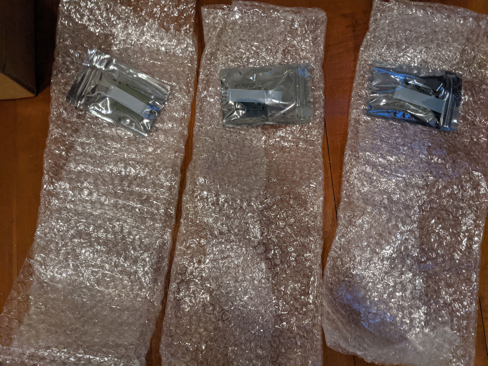

## Highlights

*

## Goal Grades

At the start of each month, I declare what I'd like to accomplish. Here's how I did against those goals:

### Attract five bloggers or YouTubers to a TinyPilot affiliate program

* **Result**: Failed to even launch an affiliate program
* **Grade**: D

I thought this would be easy. I use Shopify as my payments backend, and there are tons of Shopify apps that let you create affiliate programs. I only realized after trying to up an affiliate program that every option requires you to hand over all of your customers' personal information.

Instead, I'm rolling my own, which I'm hoping is [as simple as it seems](https://www.joelonsoftware.com/2002/03/04/nothing-is-as-simple-as-it-seems/). I think all I need to do is tell affiliates to use a link like `tinpilotkvm.com/?ref=some-affiliate` and record the affiliate ID with the transaction. At the end of the month, I pay everyone manually. It doesn't scale, but it should be fine for ~10 affiliates.

### Add two features to TinyPilot that reduce support or manufacturing costs

* **Result**: I added three features to the app and two features to the website that reduce support costs
* **Grade**: B

I added three new convenience features to TinyPilot, but I haven't yet cut an official release with those features:

* Update TinyPilot through the web UI
* Change hostname through the web UI
* View debug logs from the web UI

I also added a [support forum](https://forum.tinypilotkvm.com) and [frequently asked questions pages](https://tinypilotkvm.com/faq?ref=mtlynch.io), both of which I should have added a long time ago. They both help users answer their own questions instead of relying on me for private email support.

### Collect feedback from 10 customers about a potential rack-mounted version of TinyPilot

* **Result**: Didn't finish
* **Grade**: D

TODO

## [TinyPilot](https://tinypilotkvm.com/?ref=mtlynch.io) stats

| Metric             | January 2021   | February 2021  | Change                                         |
| ------------------ | -------------- | -------------- | ---------------------------------------------- |
| Unique Visitors    | 11,249         | 7,824          | -3,425 (-30%)         |
| Total Pageviews    | 17,737         | 12,909         | -4,828 (-27%)         |
| Sales Revenue      | $41,992.92     | $33,061.41     | -$8,931.51 (-21%)     |
| Donations          | $0.00          | $50.00         | +$50.00 (+inf%)     |
| **Total Earnings** | **$41,992.92** | **$33,109.96** | **-$8,882.96 (-21%)** |

This is TinyPilot's first down month since August 2020. $33k of revenue is certainly nothing to sneeze at, but I was hoping to sustain the $40k revenues I saw in January.

Part of this was due to an inventory shortage. I suspended advertising and promotion, but previous promotion didn't work as well as I expected.



## Dealing with materials shortage

Throughout January, I kept hearing from vendors talk about how things would slow down in February due to Chinese New Year. I heeded the warnings and purchased enough of the parts I get from China to last me through mid-March. Even so, I thought everyone was exaggerating. I thought there would maybe be a week where things stop and business would resume as usual.

I placed an order on February 4th with my usual supplier for the high-quality HDMI capture chip I use in Voyager, my premium TinyPilot. Nothing happeend, so I figured I just was too late and I'd get it when things started up again at the end of the month. No problem! I planned for this.

Two weeks later, I got this message:

{{}}

At first, it didn't seem like a big deal. I'd just order from another vendor. But my backup vendor was out of stock as well. Uh oh...

I found several other vendors, but I was nervous about placing huge orders with a vendor I've never worked with before. Some vendors can take months to ship, and I don't want $5k tied up in a vendor taking their time.

To hedge my risk, I split my orders across several vendors on eBay and AliExpress. The problem is that I think most of these sellers are actually the same company. I'd often get identical auto-responses after placing the order.

I placed 15 different orders for about 200 chips total, paying a premium for expedited shipping. Since then I have received a total of 3 chips. And despite me ordering them from three different vendors, they all arrived on the same day in identical packaging.

{{}}

There are two sequences that have happened every time I've placed an order:

### The bad sequence

1. I place the order
1. Vendor responds saying that they're out of stock, would I like to wait or get a refund?
1. I ask for a refund
1. They process it and I get the money back

### The worse sequence

1. I place the order
1. Vendor creates adds a phony tracking number to the order
1. I ask vendor why it's not showing up on DHL and they tell me that it will be there soon
1. Repeat (3) every three days

I even tried switching to another variant of the same chip, but I'm getting the same runaround with those listings too.

## YouTube success might not replicate

After TinyPilot's [first YouTube review](/retrospectives/2021/02/#tinypilots-first-youtube-review), the business experienced its largest-ever surge in sales. Naturally, I thought, "Wow! I really need to get more YouTubers to review TinyPilot."

TODO: image

I worked with two more YouTubers to get reviews, but the results were less dramatic. The reviews were positive, but they didn't have a measurable impact on sales.

TODO: image

I still see a great deal of potential in YouTube. There are tons of YouTubers who teach server maintenance, and if I can win them over to TinyPilot when they show demos of low-level administration, I think that has tremendous value for the TinyPilot brand.

## Finding time for deep work

For the past few months, I've felt extremely pressed for time. There are tons of things on my to-do list, and I feel like I'm often checking off the urgent things rather than the important things (TODO: link to seven habits). I find myself often spending the majority of my day responding to emails, focused on the short-term rather than the long-term deep work (TODO: link).

Although it's possible that things are going according to plan. I've been delegating more, so maybe I naturally have less time for deep work because I've delegated it to the people working for me.

I've noticed that I'm

I don't want to be totally unreachable because I think a big part of TinyPilot's appeal is that I'm a small business owner. I'm not a faceless enterprise provider. I'm a friendly developer who you can talk to directly.

That said, I don't want to be *so* accessible that I spend all my time responding to customer emails. I'm trying to find ways to

That said, it's extremely inefficient for me to provide private email support to everyone. I end up answering the same questions repeatedly. don't want to volunteer to be the private support specialist for every customer. I'm happy to

* Adjust language around support documentation to tell users that I prioritize responding to posts to the support forum over support requests sent to my email.
* Add FAQ articles for repeated support questions.
* Focus on bugfixes rather than new features.
* Delegate more development tasks to freelance developers.

## Legacy projects

Here are some brief updates on projects that I still maintain but are not the primary focus of my development:

### [Is It Keto](https://isitketo.org)



| Metric                    | January 2021 | February 2021 | Change                                       |
| ------------------------- | ------------ | ------------- | -------------------------------------------- |
| Unique Visitors           | 80,177       | 60,437        | -19,740 (-25%)      |
| Total Pageviews           | 182,367      | 135,865       | -46,502 (-25%)      |
| Domain Rating (Ahrefs)    | 11.0         | 11.0          | 0                                            |
| AdSense Earnings          | $677.36      | $584.18       | -$93.18 (-14%)      |
| Amazon Affiliate Earnings | $238.02      | $202.78       | -$35.24 (-15%)      |
| **Total Earnings**        | **$915.38**  | **$786.96**   | **-$128.42 (-14%)** |

Is It Keto is still enjoying its surge in traffic from New Year's Resolution dieters. It's having an almost identical dropoff to what happened in 2020.

It continues to run in the background without me touching it. I had an offer to buy the site last month for a decent valuation, but the time it would take me to complete the sale would take too much away from TinyPilot.

### [Hit the Front Page of Hacker News](https://hitthefrontpage.com/)



| Metric             | January 2021  | February 2021 | Change                                         |
| ------------------ | ------------- | ------------- | ---------------------------------------------- |
| Unique Visitors    | 1,042         | 483           | -559 (-54%)           |
| **Total Earnings** | **$2,565.22** | **$359.95**   | **-$2,205.27 (-86%)** |

Sadly, I've stopped promotion of the course. I tried a few things in January (TODO: link), but they didn't seem to have any impact on sales. It feels like a waste because I put so much time into the course, and the results faded so quickly.

### [Zestful](https://zestfuldata.com)



| Metric             | January 2021 | February 2021 | Change                                       |
| ------------------ | ------------ | ------------- | -------------------------------------------- |
| Unique Visitors    | 419          | 434           | +15 (+4%)         |
| Total Pageviews    | 1,194        | 1,236         | +42 (+4%)         |
| RapidAPI Earnings  | $155.50      | $32.52        | -$122.98 (-79%)     |
| **Total Earnings** | **$155.50**  | **$32.52**    | **-$122.98 (-79%)** |

Zestful is chugging along in the background as well. I got an unexpected spike of inbound inquiries for enterprise plans, but nothing has come of it so far.

## Wrap up

### What got done?

* Hired three freelance developers for TinyPilot
  * Two work 10-15 hours/week on the product and one works 3-5 hours/week on the website
* Created a TinyPilot support forum and FAQ
* Published ["My Third Year as a Solo Developer,"](/solo-developer-year-3/) which reached #1 on [/r/programming](https://www.reddit.com/r/programming/comments/la4hfq/my_third_year_as_a_solo_developer/) and [#7 on Hacker News](https://news.ycombinator.com/item?id=25989010)

### Lessons learned

* Even commodity parts can disappear overnight.
  * I was conscious of the fact that I depended on one specific type of HDMI capture chip, but I thought the risk was low given that there were dozens of vendors selling it, many of whom reported 1000+ in stock at any given time.
  * Worse comes to worst, I figured I could switch to an alternative board with the same chipset, of which there were several.
  * When the shortage happened, it broke both my assumptions. All vendors ran out at the same time of both my chip and the alternative boards, suggesting that they all share a single point of failure somewhere in the manufacturing pipeline.
* Prepare more for Chinese New Year
  * I expected slow responses for a week or so, but most vendors were shut down entirely for the majority of February.
  * Next year, I need to plan for Chinese vendors being totally unavailable and unable to ship new parts from the start of February until the end of March.

### Goals for next month

* Hire two part-time employees to begin taking over order fulfillment.
  * TinyPilot's current fulfillment manager goes back to grad eschool in June.
* Attract five bloggers or YouTubers to a TinyPilot affiliate program.
* Collect feedback from 10 customers about a potential rack-mounted version of TinyPilot.
