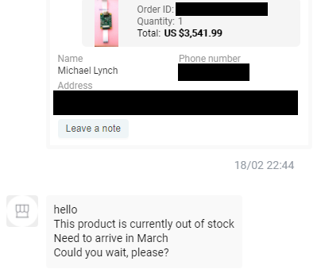
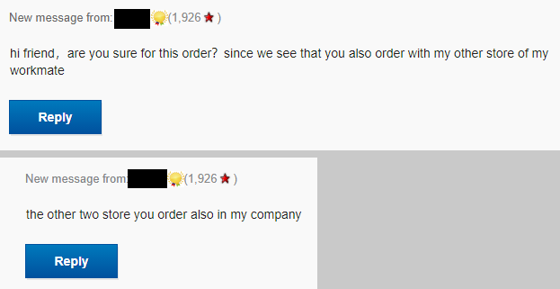

## Highlights

* TinyPilots revenues dropped for the first time in six months.
* TinyPilot finished the month with $33k in revenue, a 21% drop from January.
* One of the critical TinyPilot parts I need suddenly disappeared from vendors.
* Delegating work to others is paradoxically leaving me with less free time.

## Goal Grades

At the start of each month, I declare what I'd like to accomplish. Here's how I did against those goals:

### Attract five bloggers or YouTubers to a TinyPilot affiliate program

* **Result**: Failed to even launch an affiliate program
* **Grade**: D

I thought this would be easy. I use Shopify as my payments backend, and there are tons of Shopify apps that let you create affiliate programs. I only realized after trying to up an affiliate program that every option requires you to [hand over all of your customers' personal information](https://twitter.com/deliberatecoder/status/1360284765149085699) to the affiliate app.

Instead, I'm rolling my own, which I'm hoping is [as simple as it seems](https://www.joelonsoftware.com/2002/03/04/nothing-is-as-simple-as-it-seems/). All I need to do is tell affiliates to use a link like `tinpilotkvm.com/?ref=some-affiliate` and record the affiliate ID with the transaction. At the end of the month, I pay everyone manually. It doesn't scale, but it should be fine for ~10 affiliates.

### Add two features to TinyPilot that reduce support or manufacturing costs

* **Result**: I added three features to the app and two features to the website that reduce support costs
* **Grade**: B

I added three new convenience features to TinyPilot, but I haven't yet cut an official release that includes them:

* Update TinyPilot through the web UI
* Change hostname through the web UI
* View debug logs from the web UI

I also added a [support forum](https://forum.tinypilotkvm.com) and [frequently asked questions pages](https://tinypilotkvm.com/faq?ref=mtlynch.io), both of which I should have added a long time ago. They both help users answer their own questions instead of relying on me for private email support.

### Collect feedback from 10 customers about a potential rack-mounted version of TinyPilot

* **Result**: Collected feedback from zero customers
* **Grade**: D

Sketching out a rack-mounted TinyPilot took longer than I expected. I'm days away from a preview document I can show customers to solicit feedback.

## [TinyPilot](https://tinypilotkvm.com/?ref=mtlynch.io) stats



| Metric             | January 2021   | February 2021  | Change                                         |
| ------------------ | -------------- | -------------- | ---------------------------------------------- |
| Unique Visitors    | 11,249         | 7,824          | -3,425 (-30%)         |
| Total Pageviews    | 17,737         | 12,909         | -4,828 (-27%)         |
| Sales Revenue      | $41,992.92     | $33,061.41     | -$8,931.51 (-21%)     |
| Donations          | $0.00          | $50.00         | +$50.00 (+inf%)     |
| **Total Earnings** | **$41,992.92** | **$33,109.96** | **-$8,882.96 (-21%)** |

February was TinyPilot's first down month since August 2020. Of course, $33k of revenue is nothing to sneeze at, but I hoped to sustain the $40k revenues I saw in January.

Part of this was due to an inventory shortage. I suspended new advertising and promotion halfway through the month, but the first half's marketing didn't work as well as I expected.

## Dealing with materials shortage

Throughout January, I kept hearing vendors talk about a slowdown in February due to Chinese New Year. I heeded the warnings and purchased enough of the parts I get from China to last me through mid-March. Even so, I thought everyone was exaggerating. An entire country can't shut down for a month, right? There'd maybe be a week where things stop, but then business would resume as usual.

I placed an order on February 4th with my usual supplier for the HDMI capture chip I use in Voyager, my premium TinyPilot. The order never moved forward, so I figured I just was too late and I'd get it when things started up again at the end of the month. No problem! I planned for this.

Two weeks later, I got this message:

{{}}

At first, it didn't seem like a big deal. I'd just order from another vendor.

Then, my backup vendor said they were out of stock. Uh oh...

I found several other suppliers, but I was nervous about placing huge orders with an overseas vendor I've never worked with before. No vendor has ever completely ripped me off, but I've experienced several who sit on my order for months before shipping.

To hedge my risk, I split my orders across several vendors on eBay and AliExpress. The problem is that I think most of these sellers are actually the same company. One eBay seller flat-out told me so:

{{}}

Two sequences that have happened every time I've placed an order:

### The bad sequence

1. I place the order
1. Vendor responds, saying that they're out of stock, would I like to wait or get a refund?
1. I ask for a refund
1. I get the money back but still have no chips

### The worse sequence

1. I place the order
1. Vendor adds a phony tracking number to the order
1. I ask vendor why it's not showing up on DHL, and they tell me that it will be there soon
1. Repeat step (3) every two days
1. I have neither my money nor my chips

I even tried switching to another variant of the same chip, but I'm getting the same runaround with those listings. I haven't run out of chips yet, but I'm on track to exhaust my inventory in the next two weeks. In the meantime, I've increased Voyager prices by 10% to slow down sales.

## YouTube success might not replicate

After TinyPilot's [first YouTube review](/retrospectives/2021/02/#tinypilots-first-youtube-review), the business experienced its largest-ever surge in sales. Naturally, I thought, "Wow! I really need to get more YouTubers to review TinyPilot."

{{}}

I worked with two more YouTubers to get reviews, but the results were less dramatic. The subsequent reviews were positive, but they had no measurable impact on sales.

{{}}

I still see a great deal of potential in YouTube. Tons of YouTubers teach server maintenance. If I can win them over to TinyPilot when they show demos of low-level administration, that has tremendous value for the TinyPilot brand.

## Finding time for deep work

For the past few months, I've felt extremely pressed for time. There are tons of things on my to-do list, and I often check off the [urgent things rather than the important things](/book-reports/7-habits-of-highly-effective-people/#time-management-matrix). I find myself spending the majority of my time responding to emails, focused on short-term tasks rather than [deep work](/book-reports/deep-work/#key-takeaways) that serves my long-term goals.

On the other hand, I may be managing time optimally. I've been focusing on delegating more of my work, but hiring new people means I have less time for deep work in the short-term. I'm spending more time communicating with people and helping new hires get up to speed.

I haven't tried to delegate customer service, as I think a significant part of TinyPilot's appeal is that customers identify me as personally responsible for the business. With an enterprise KVM vendor, you'd never get in touch with an engineer, much less the CEO.

That said, I don't want to be *so* accessible that I spend all my time responding to customer emails. I'm trying to find ways to stay accessible but provide easier ways for customers to solve their problems than by emailing me.

Here are my plans for reducing my customer support workload:

* Adjust language around support documentation to tell users that I prioritize support forum posts over requests to my direct email.
* Add FAQ articles for repeated support questions.
* Allocate more development toward bugfixes and usability features.

## Legacy projects

Here are some brief updates on projects that I still maintain but are not the primary focus of my development:

### [Is It Keto](https://isitketo.org)



| Metric                    | January 2021 | February 2021 | Change                                       |
| ------------------------- | ------------ | ------------- | -------------------------------------------- |
| Unique Visitors           | 80,177       | 60,437        | -19,740 (-25%)      |
| Total Pageviews           | 182,367      | 135,865       | -46,502 (-25%)      |
| Domain Rating (Ahrefs)    | 11.0         | 11.0          | 0                                            |
| AdSense Earnings          | $677.36      | $584.18       | -$93.18 (-14%)      |
| Amazon Affiliate Earnings | $238.02      | $202.78       | -$35.24 (-15%)      |
| **Total Earnings**        | **$915.38**  | **$786.96**   | **-$128.42 (-14%)** |

Is It Keto is still enjoying its bump in visitors from New Year's Resolution dieters. The January-to-February drop is almost identical dropoff to what happened in 2020.

The site continues to run in the background without me touching it. I had an offer to buy the site last month for a decent valuation, but the time it would take me to complete the sale would take too much away from TinyPilot.

### [Hit the Front Page of Hacker News](https://hitthefrontpage.com/)



| Metric             | January 2021  | February 2021 | Change                                         |
| ------------------ | ------------- | ------------- | ---------------------------------------------- |
| Unique Visitors    | 1,042         | 483           | -559 (-54%)           |
| **Total Earnings** | **$2,565.22** | **$359.95**   | **-$2,205.27 (-86%)** |

Sadly, I've stopped promotion of the course. I tried several marketing tactics in January, but none of them seemed to impact sales, so I've stopped trying. It feels like a waste because I put so much time into the course, and the results faded so quickly.

### [Zestful](https://zestfuldata.com)



| Metric             | January 2021 | February 2021 | Change                                       |
| ------------------ | ------------ | ------------- | -------------------------------------------- |
| Unique Visitors    | 419          | 434           | +15 (+4%)         |
| Total Pageviews    | 1,194        | 1,236         | +42 (+4%)         |
| RapidAPI Earnings  | $155.50      | $32.52        | -$122.98 (-79%)     |
| **Total Earnings** | **$155.50**  | **$32.52**    | **-$122.98 (-79%)** |

Zestful is chugging along in the background as well. I got an unexpected spike of inbound inquiries for enterprise plans, but nothing has come of it so far.

## Neat discoveries

### [Litestream](https://litestream.io)

I hate being responsible for database backups, so I always end up using a managed database like Google Cloud Datastore or Google Firestore. But as Google increasingly [makes me regret building on their platform](https://medium.com/@steve.yegge/dear-google-cloud-your-deprecation-policy-is-killing-you-ee7525dc05dc), I've searched for an alternative.

Litestream looks like the solution I've been waiting for. It's a lightweight service that replicates a SQLite database to any S3-compatible interface. That means that I can completely blow away a server with zero notice, and all the data remains safely stored in my S3 bucket. When I start the server up again, it will gracefully pull down the database from S3 and resume without me having to do any manual repairs.

To test out Litestream, I created a little [log pasting service](http://logpaste-demo.mtlynch.io/) that I wanted for TinyPilot. I can run it on any Docker hosting service (Heroku, Lightsail, DigitalOcean), but it fits in the free tier of both Heroku and Amazon S3. At any time, I can tear down the Docker container, launch it somewhere else, and it will have all the same data and continue replicating automatically.

### [Plaintext accounting](https://plaintextaccounting.org/)

For the past two years, I've begrudgingly done my bookkeeping with Xero. I dislike the software, but it's the best bookkeeping solution I can find.

I recently learned about [plaintext accounting](https://plaintextaccounting.org/), a dev-oriented way of tracking finances using command-line tools and double-entry accounting in plaintext files. Compared with Xero, I find plaintext accounting much more intuitive, and I have more confidence that I'm doing things correctly.

All the tools have [a steep learning curve](https://twitter.com/deliberatecoder/status/1358975568637747207), but my favorite so far is [Beancount](http://furius.ca/beancount). It appeals to me because it's one of the most mature tools in its category and it's Python-based.

## Wrap up

### What got done?

* Hired three freelance developers for TinyPilot
  * Two work 10-15 hours/week on the product, and one works 3-5 hours/week on the website
* Created a TinyPilot support forum and FAQ
* Reached feature complete on TinyPilot's next release
* Published ["My Third Year as a Solo Developer,"](/solo-developer-year-3/) which reached #1 on [/r/programming](https://www.reddit.com/r/programming/comments/la4hfq/my_third_year_as_a_solo_developer/) and [#7 on Hacker News](https://news.ycombinator.com/item?id=25989010)
* Appeared as a guest on two podcasts:
  * [The Hexdevs Podcast](https://www.hexdevs.com/posts/why-michael-lynch-left-his-job-at-google-to-become-a-solo-founder/), where I talked about financial independence
  * [The Entrepreneurial Coder Podcast](https://www.ecpodcast.io/episodes/42-michael-lynch-how-to-hit-the-front-page-of-hacker-news), where I talked about blogging and Hacker News

### Lessons learned

* Even commodity parts can disappear overnight.
  * I was conscious of the risk I carried by depending on one specific type of HDMI capture chip.
  * I felt the risk was low given that there were dozens of vendors selling the chip, many of whom reported 1000+ in stock at any given time.
  * Worse comes to worst, I could switch to an alternative board with the same chipset, of which there were several.
  * When the shortage happened, it broke both my assumptions. All vendors ran out at the same time of all board variants, which exposed that vendors are less independent than they seem.
* Prepare more for Chinese New Year
  * I expected slow responses for a week or so, but most vendors were shut down for the majority of February.
  * In the future, I'll plan for Chinese vendors to be totally unavailable and unable to ship new parts from the start of February until the end of March.

### Goals for next month

* Hire two local part-time employees to begin taking over order fulfillment.
  * TinyPilot's current fulfillment manager goes back to grad school in June.
* Attract five bloggers or YouTubers to a TinyPilot affiliate program.
* Collect feedback from 10 customers about a potential rack-mounted version of TinyPilot.
