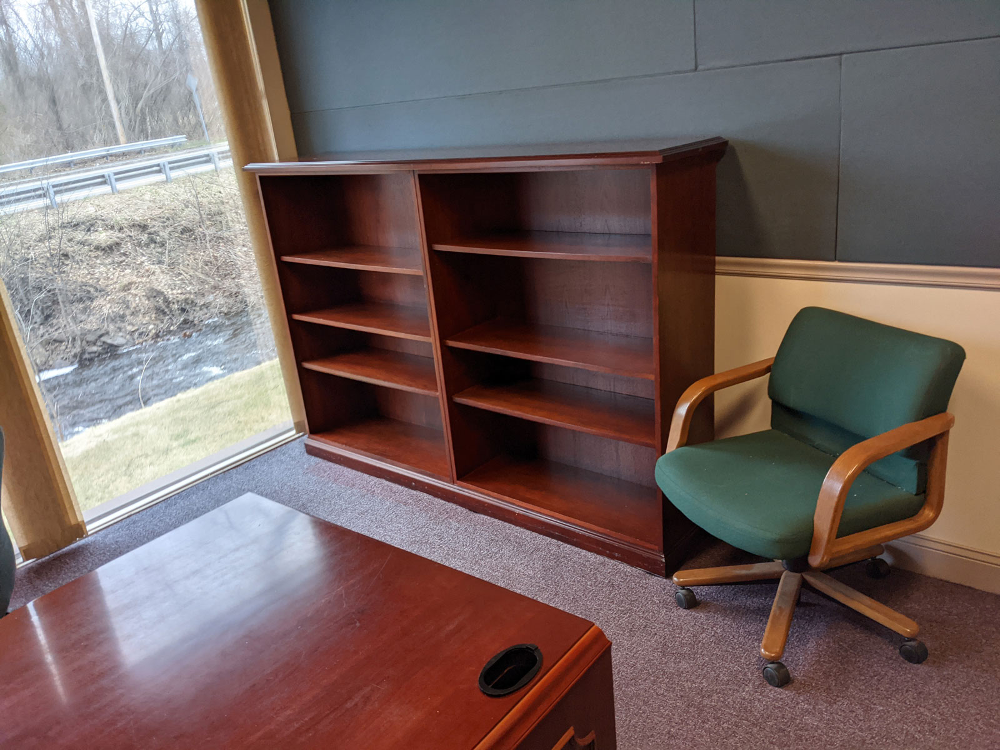

## Highlights

*

## Goal Grades

At the start of each month, I declare what I'd like to accomplish. Here's how I did against those goals:

### Hire two local part-time employees to begin taking over order fulfillment

* **Result**: Received applications from two promising candidates.
* **Grade**: D

I slacked a bit here and didn't get the ball rolling until late into the month. I've got interviews scheduled, but I haven't hired anyone yet.

### Attract five bloggers or YouTubers to a TinyPilot affiliate program

* **Result**: Two affiliates signed up and a third is considering it
* **Grade**: C

This has been harder than I expected. I wanted to start with kind of "mid-tier" bloggers, but they're hard to find. Everyone seems to be a massive site like Tom's Hardware or a tiny personal blog that nobody reads. I'm not having much luck finding the in-between.

Two YouTubers signed on as affiliates, and one more is interested but hasn't yet committed.

### Collect feedback from 10 customers about a potential rack-mounted version of TinyPilot

* **Result**: Received feedback from 14 customers
* **Grade**: A

I published a [preview](https://tinypilotkvm.com/blog/rackmount) of the rack mount and got some feedback from it. The feedback was positive in that people seem excited about it. It was also valuable to identify some design improvements early on.

## [TinyPilot](https://tinypilotkvm.com/?ref=mtlynch.io) stats



| Metric             | February 2021  | March 2021     | Change                                          |
| ------------------ | -------------- | -------------- | ----------------------------------------------- |
| Unique Visitors    | 7,824          | 5,805          | -2,019 (-26%)          |
| Total Pageviews    | 12,909         | 9,762          | -3,147 (-24%)          |
| Sales Revenue      | $33,061.41     | $19,782.96     | -$13,278.45 (-40%)     |
| Donations          | $50.00         | $19.92         | -$30.08 (-60%)         |
| **Total Earnings** | **$33,109.96** | **$19,802.30** | **-$13,307.66 (-40%)** |

Revenues sure have been plummeting the past two months! I was panicking about it at the beginning of the month, but I've since come to accept that things have slowed down, and I'm enjoying the slower pace.

That said, I see dwindling revenues as TinyPilot's biggest problem at the moment. Next month, I plan to reverse this trend by investing more in my affiliate program and experimenting with other marketing channels.

## Optimizing order fulfillment

When I first started selling TinyPilots, the fulfillment process was a huge mess. It took me almost the entire day to pack orders, bring them to the post office, then send customers their tracking numbers by hand.

Since then, my girlfriend joined the company and handles fulfillment, which works great, but we still have the thundering herd problem. For a few reasons, we've stuck with just-in-time order packing, meaning that we don't have any pre-packed. I realized that was inefficient, but I also wanted to make sure customers had the latest version of TinyPilot.

One thing she hated was flashing microSD cards. It takes a while, and sometimes it's flaky, so cards will fail over and over unless we do them one at a time. I insisted on this method because I wanted to ensure that customers always receive the latest stable release. If we flash them all at once.

I said we could switch to pre-flashing once I implement update functionality in TinyPilot's web UI. That way, users could easily update to the latest and greatest version when they receive their device. Once we added updates, it was a huge relief to be able to pre-flash the microSDs.

But then we asked, what else does that let us do? This frees up time at the bottleneck because we don't have to flash microSDs. Are there other fulfillment tasks we can now do in advance? We realized that we could actually do a lot.

 The microSD was a blocker for the whole packing process. With that unblocked, we can prepare almost everything about an order ahead of time. Only two items need to wait until the order actually comes in. The first is the commercial invoice. It's hard to print a commercial invoice before you know who to address it to. And the second is the VGA to HDMI adaptor. It's an optional add-on, and only ~30% of customers purchase one.

But that's fine, because we can just pack the boxes, leave them unsealed, and put in the last few items right before shipping.

The other thing that surprised me was that *folding paper* is a significant time-suck. The boxes we use for TinyPilot are XX" by XX", which means we have to fold the invoice into fourths to fit in the box. So my girlfriend found some A6 paper, which is the perfect size but oddly hard to find. And now everything fits perfectly into the box with no folding.

## How can TinyPilot run while I'm on vacation?

One of my goals for 2021 is to reach the point where my girlfriend and I can [take a two-week vacation](/solo-developer-year-3/#automate-tinypilot-management) without interrupting TinyPilot's operations.

The most obvious obstacle to that goal is order fulfillment. My girlfriend works with me on TinyPilot, and she takes care of order fulfillment. If we go on vacation together, customers would have to wait for weeks before their devices even ship.

My dream was to find some sort of "warehouse as a service," where I ship them all my parts and they assemble things and ship them out for me when orders come in. I found services *kind of* like that, but they're for scales much bigger than mine.

One popular service for this is Fulfillment by Amazon. I ship a bunch of TinyPilots to Amazon, and they manage fulfillment. That would sort of work, except there's still a lot of physical labor that needs to happen outside of just fulfillment. Parts are continuously arriving that need to be processed and assembled into working devices. Amazon wouldn't do any of that. Plus, going through Amazon adds a extra layers between me and the customer, and I'm not quite ready to part with the simplicity of my current operation.

All signs were pointing to hiring local employees to manage fulfillment, which I was very reluctant to do. I've only ever hired contractors, and the paperwork there is fairly lightweight. With real employees, there's *so* much more paperwork. I have to give them a bunch of forms and notices and make sure I'm withholding all the right taxes. Fortunately, there are services that manage this for you. I asked friends and Twitter and heard recommendations for [JustWorks](https://justworks.com/) and [OnPay](https://onpay.com/).

I was planning to keep my house as TinyPilot's central warehouse, but then

We don't mind if our house is a partial TinyPilot warehouse for us, but if it gets to the point where people are coming in and out of our house for equipment all the time, it feels too weird, so we also need office space. I wasn't planning to look for this quite yet, but I happened upon an office space that's a 15-minute walk from my house that suddenly became available. It's $550/month, including. And the last tenants didn't want their furniture anymore, so it comes furnished with decent desks. I'm going to try to get a 1-year lease and establish the first official TinyPilot headquarters.


  {{}}
  {{}}


Having a dedicated office wi

## Building an affiliate program

It's going to take a while. The first affiliate published a video. It led to 10 visitors, but no sales yet. The second hasn't yet published a video.

## Legacy projects

Here are some brief updates on projects that I still maintain but are not the primary focus of my development:

### [Is It Keto](https://isitketo.org)



| Metric                    | February 2021 | March 2021  | Change                                         |
| ------------------------- | ------------- | ----------- | ---------------------------------------------- |
| Unique Visitors           | 60,437        | 63,493      | +3,056 (+5%)        |
| Total Pageviews           | 135,865       | 141,199     | +5,334 (+4%)        |
| Domain Rating (Ahrefs)    | 11.0          | 11.0        | 0                                              |
| AdSense Earnings          | $584.18       | $611.99     | +$27.81 (+5%)       |
| Amazon Affiliate Earnings | $202.78       | $337.29     | +$134.51 (+66%)     |
| **Total Earnings**        | **$786.96**   | **$949.28** | **+$162.32 (+21%)** |

Is It Keto is funny because I haven't touched it in months. It had a big jump in January due to New Year's resolution dieters and was slowly fading, but then someone purchased $XX worth of lockers after visiting the site, so I made $XX in Amazon affiliate earnings from that sale alone. That gave Is It Keto its highest-ever month of revenue, nearly breaking $1k.

### [Hit the Front Page of Hacker News](https://hitthefrontpage.com/)



| Metric                     | February 2021 | March 2021  | Change                                          |
| -------------------------- | ------------- | ----------- | ----------------------------------------------- |
| Unique Visitors            | 483           | 185         | -298 (-62%)            |
| Gumroad Earnings           | $359.95       | $313.63     | -$46.32 (-13%)         |
| Blogging for Devs Earnings | $0.00         | $655.20     | +$655.20 (+inf%)     |
| **Total Earnings**         | **$359.95**   | **$968.83** | **+$608.88 (+169%)** |

### [Zestful](https://zestfuldata.com)



| Metric             | February 2021 | March 2021 | Change                                      |
| ------------------ | ------------- | ---------- | ------------------------------------------- |
| Unique Visitors    | 434           | 480        | +46 (+11%)       |
| Total Pageviews    | 1,236         | 1,367      | +131 (+11%)      |
| RapidAPI Earnings  | $32.52        | $21.97     | -$10.55 (-32%)     |
| **Total Earnings** | **$32.52**    | **$21.97** | **-$10.55 (-32%)** |

## Wrap up

### What got done?

* Published a blog post [explaining how I work with freelance developers](/freelancer-guidelines/).
* Created a TinyPilot affiliate program
* Published two new releases of TinyPilot
  * [TinyPilot 1.4.0](https://tinypilotkvm.com/blog/whats-new-in-1-4) adds easy updates, support for device renaming, and accessible logs.
  * [TinyPilot 1.4.1](https://github.com/mtlynch/tinypilot/releases/tag/1.4.1) substantially improves UI

### Lessons learned

*

### Goals for next month

* Reach $30k in TinyPilot revenue
* Produce a prototype for a custom TinyPilot PoE HAT
* Create an outline for my book, [*Refactoring English*](https://refactoringenglish.com)
