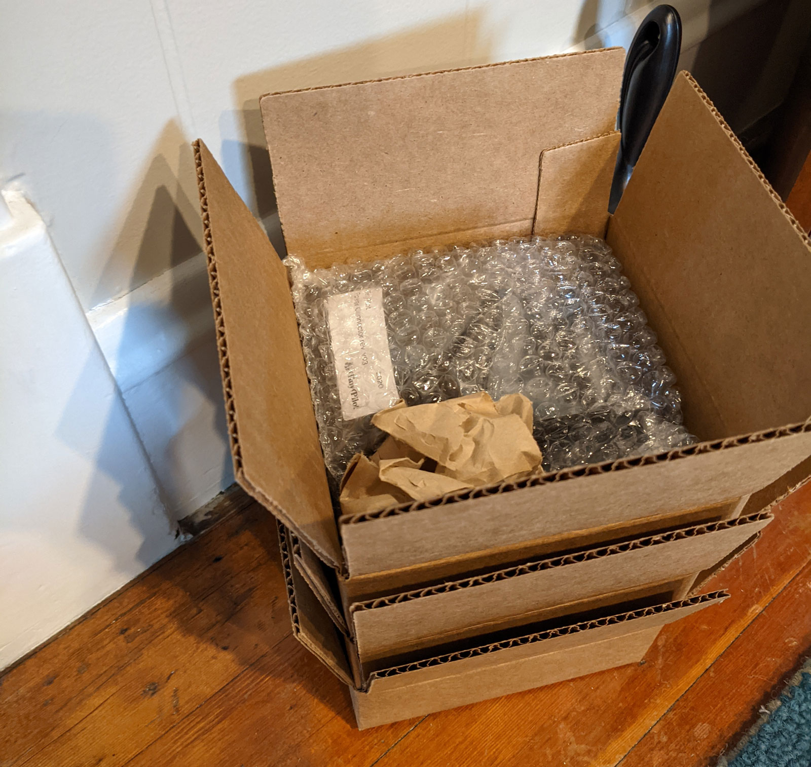
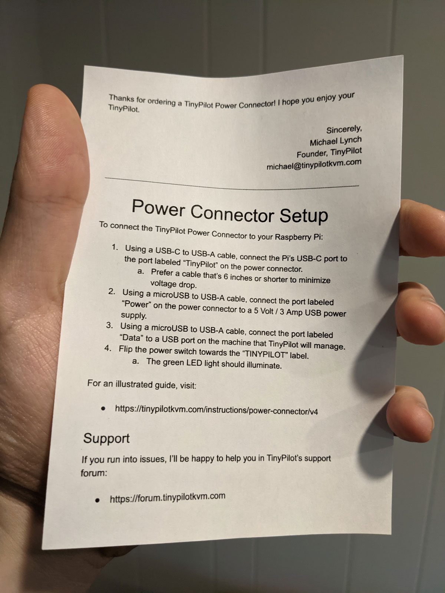

## Highlights

* I plan to open TinyPilot's first real office next month.
* TinyPilot's revenues continue to plummet, but I'm learning to accept it.
* I'm inching ever closer to the freedom to take short vacations.

## Goal Grades

At the start of each month, I declare what I'd like to accomplish. Here's how I did against those goals:

### Hire two local part-time employees to begin taking over order fulfillment

* **Result**: Received applications from two promising candidates.
* **Grade**: D

I slacked a bit here and didn't get the ball rolling until late into the month. I've got interviews scheduled, but I haven't hired anyone yet.

### Attract five bloggers or YouTubers to a TinyPilot affiliate program

* **Result**: Two affiliates signed up, and a third is considering it
* **Grade**: C

This has been harder than I expected. I wanted to start with mid-tier bloggers, but they're hard to find. Everyone seems to be a massive site like Tom's Hardware or a tiny personal blog that nobody reads. I'm not having much luck finding the in-between.

Two YouTubers signed on as affiliates, and one more is interested but hasn't yet committed.

### Collect feedback from 10 customers about a potential rack-mounted version of TinyPilot

* **Result**: Received feedback from 14 customers
* **Grade**: A

I published a [preview](https://tinypilotkvm.com/blog/rackmount) of the rack mount and solicited feedback from readers and customers. The feedback was positive in that people seem excited about it. It was also valuable in identifying some incorrect assumptions.

## [TinyPilot](https://tinypilotkvm.com/?ref=mtlynch.io) stats



| Metric             | February 2021  | March 2021     | Change                                          |
| ------------------ | -------------- | -------------- | ----------------------------------------------- |
| Unique Visitors    | 7,824          | 5,805          | -2,019 (-26%)          |
| Total Pageviews    | 12,909         | 9,762          | -3,147 (-24%)          |
| Sales Revenue      | $33,061.41     | $19,782.96     | -$13,278.45 (-40%)     |
| Donations          | $50.00         | $19.92         | -$30.08 (-60%)         |
| **Total Earnings** | **$33,109.96** | **$19,802.30** | **-$13,307.66 (-40%)** |

Revenues have been plummeting for the past two months. I was panicking about the slowdown at the beginning of the month, but I've since come to accept and enjoy the slower pace.

Still, I see dwindling revenues as TinyPilot's biggest problem at the moment. In April, I aim to reverse this trend by investing more in my affiliate program and experimenting with other marketing channels.

## Optimizing order fulfillment through time-shifting

When I first started selling TinyPilots, the fulfillment process was a huge mess. It took me almost the entire day to pack orders, bring them to the post office, then send customers their tracking numbers by hand. Since then, my girlfriend has joined the company and handles fulfillment. That works great, but we still have [the thundering herd problem](/retrospectives/2020/10/#inventory-shortages-and-the-thundering-herd-problem). We'll go through some lulls, and then a massive surge of orders comes in and overwhelms us.

Most of the reason order surges are so painful is that we do just-in-time order packing. When an order comes in, we print the necessary documents and labels, grab the right parts, flash a disk with the latest TinyPilot software, pack everything into a box, and ship it out. That process takes 5-10 minutes per order.

One of the biggest bottlenecks in the process was imaging the disk with TinyPilot software. We could have done it in advance, but I stubbornly refused. I couldn't bear the thought of shipping devices with bugfixes I'd already published. But in March, I released [TinyPilot 1.4.0](https://tinypilotkvm.com/blog/whats-new-in-1-4), which allows users to update their TinyPilots from the web UI. With updates easy and discoverable, I let go of my unreasonable restriction on flashing images the day of the order.

That got us thinking: flashing the microSDs in advance allows us to *shift time* productively. We moved a process that previously created a bottleneck at crunch time to a time where it wasn't a bottleneck. What else can we time-shift with microSDs no longer a blocker? It turned out that we could do a lot.

Only two items need to wait until the order actually comes in. The first is the commercial invoice. We can't very well print an invoice until we know who the customer is. The second is the VGA to HDMI adaptor. It's an optional add-on, and only ~30% of customers purchase one.

So we couldn't completely pre-pack boxes, but we could do 95% of the work and leave the last 5% until shipping time.

{{}}

When discussing other bottlenecks, I was surprised to learn that *folding paper* is a significant time-suck. The boxes we use for TinyPilot are 6x6x2", which means we have to fold normal 8.5x11" paper into quarters to fit into the box. My girlfriend realized that A6 paper is 4.1x5.9", which is the perfect size for our boxes, so we bought a ream:

{{}}

## How can TinyPilot run while I'm on vacation?

One of my goals for 2021 is to reach the point where my girlfriend and I can [take a two-week vacation](/solo-developer-year-3/#automate-tinypilot-management) without interrupting TinyPilot's operations. If we did that right now, fulfillment would completely stop until we came back. Customers would be displeased at the two-week delay in their orders.

My girlfriend will return to grad school in June, at which point, she won't have time to work with me on TinyPilot. I definitely need to prepare for that. She once left for a week to visit her family, and I barely got anything done that week outside of packing orders.

My dream was to find some sort of "warehouse as a service" business, where I ship them all my parts, and they handle assembly and fulfillment. I found services *kind of* like that, but they're for business about 50x bigger than mine.

And then there's Fulfillment by Amazon, a service that lets me ship big batches of finished products to Amazon for fulfillment. That would sort of work, except that creating TinyPilots still requires a lot of physical labor. Parts are continuously arriving that need to be processed and assembled into working devices. Amazon wouldn't do any of that. Plus, I'm not quite ready to insert an enormous corporate machine between me and my customers.

{{}}

All signs were pointing to hiring local employees, which scared me. Based on the IRS' definition, a local worker who uses equipment I provide and follows instructions I give is unambiguously an "employee" rather than an "independent contractor." I've only ever hired contractors, and the process there is fairly lightweight.  With real employees, there's *so* much more paperwork. I have to give them a bunch of forms and notices and make sure I'm withholding all the right taxes.

After asking some friends and Twitter, I found out that there are services for small businesses that help you manage taxes and legalities of part-time employees. I heard recommendations for [JustWorks](https://justworks.com/) and [OnPay](https://onpay.com/), both of which seem like they'll address my worries around hiring.

I created [a job description](https://bit.ly/tinypilot-assistant) and shared it with friends and in some local Facebook groups. I'm still going to start the workers as contractors because [I like the contract-to-hire model](/freelancer-guidelines/#interviews), and a time-limited position fits more under the IRS' definition of a contractor.

The rate is $16/hr, which I expected to yield a bigger response. Subway cashiers in my area earn $14-16, and TinyPilot should be substantially more attractive in terms of flexibility. Still, I've received some promising applications, so I'm hoping to make hires in the next week or two.

## TinyPilot's first real office

I was planning to continue using my house as TinyPilot's central warehouse, but now that we're bringing on local employees, that gets more complicated. All of our closets are currently overflowing with TinyPilot inventory and parts, and we don't mind so much. But the idea of employees coming in and out of our house all the time to manage the inventory feels too invasive.

I wasn't planning to begin searching yet, but I saw a "for lease" sign on an office park that's only a 15-minute walk from my house. I called for pricing, expecting something in the range of $1,200-$1,500/month plus utilities. It turns out it's $550/month, including utilities and Internet. And the last tenants didn't want their furniture anymore, so it comes furnished with decent desks.


  {{}}
  {{}}


I'm going to try to get a 1-year lease and establish the first official TinyPilot headquarters.

Having an office means that we can move everything out of our house. It'll be convenient to have a dedicated space outside our house for work stuff, but I still need to figure out how to orchestrate everything, as I plan to continue working mostly from home. I also have to figure out how to ship and receive packages because I don't want packages to just sit outside a relatively well-trafficked office until someone arrives to pick them up.

## Legacy projects

Here are some brief updates on projects that I still maintain but are not the primary focus of my development:

### [Is It Keto](https://isitketo.org)



| Metric                    | February 2021 | March 2021  | Change                                         |
| ------------------------- | ------------- | ----------- | ---------------------------------------------- |
| Unique Visitors           | 60,437        | 63,493      | +3,056 (+5%)        |
| Total Pageviews           | 135,865       | 141,199     | +5,334 (+4%)        |
| Domain Rating (Ahrefs)    | 11.0          | 11.0        | 0                                              |
| AdSense Earnings          | $584.18       | $611.99     | +$27.81 (+5%)       |
| Amazon Affiliate Earnings | $202.78       | $337.29     | +$134.51 (+66%)     |
| **Total Earnings**        | **$786.96**   | **$949.28** | **+$162.32 (+21%)** |

Is It Keto is funny because I haven't touched it in months. The January bump from New Year's resolution dieters was slowly fading, but then [someone purchased $5.3k worth of steel lockers](https://twitter.com/deliberatecoder/status/1369778897135493124) after visiting the site. I made $160 in Amazon affiliate earnings from that sale alone, giving the site its all-time-highest month of revenue.

### [Hit the Front Page of Hacker News](https://hitthefrontpage.com/)



| Metric                     | February 2021 | March 2021  | Change                                          |
| -------------------------- | ------------- | ----------- | ----------------------------------------------- |
| Unique Visitors            | 483           | 185         | -298 (-62%)            |
| Gumroad Earnings           | $359.95       | $313.63     | -$46.32 (-13%)         |
| Blogging for Devs Earnings | $0.00         | $655.20     | +$655.20 (+inf%)     |
| **Total Earnings**         | **$359.95**   | **$968.83** | **+$608.88 (+169%)** |

*Hit the Front Page of Hacker News* had a surprising comeback due to a lucrative partnership with Monica Lent's [Blogging for Devs](https://bloggingfordevs.com/). I piloted the course in that community, and it was popular with members, so Monica offered me a generous royalty deal.

Blogging for Devs members get a special link that allows them to download the course for free. In exchange, Monica pays me a royalty for each download at a discounted price from the retail cost.

It works out nicely for everyone. I felt like there were customers out there, but it didn't make financial sense for me to shift focus away from TinyPilot to find them. Now, customers discover the course during their onboarding flow in Blogging for Devs. It's self-perpetuating because members cite my course in the forums when their articles are successful on Hacker News, which leads other members to check it out.

### [Zestful](https://zestfuldata.com)



| Metric             | February 2021 | March 2021 | Change                                      |
| ------------------ | ------------- | ---------- | ------------------------------------------- |
| Unique Visitors    | 434           | 480        | +46 (+11%)       |
| Total Pageviews    | 1,236         | 1,367      | +131 (+11%)      |
| RapidAPI Earnings  | $32.52        | $21.97     | -$10.55 (-32%)     |
| **Total Earnings** | **$32.52**    | **$21.97** | **-$10.55 (-32%)** |

Zestful's still chugging along in the background, bringing in slightly more than the $7/month it costs me to run it on Heroku.

## Wrap up

### What got done?

* Created a TinyPilot [affiliate program](https://tinypilotkvm.com/affiliate-policy)
* Published a blog post [explaining how I work with freelance developers](/freelancer-guidelines/)
* Published two new releases of TinyPilot
  * [TinyPilot 1.4.0](https://tinypilotkvm.com/blog/whats-new-in-1-4) adds easy updates, support for device renaming, and accessible logs.
  * [TinyPilot 1.4.1](https://github.com/mtlynch/tinypilot/releases/tag/1.4.1) substantially improves UI

### Lessons learned

* There are some positives to a drop in revenue.
  * The slower pace gave me time to invest more in improving processes.
* Pre-pack as much as possible.
  * I should have done this sooner, as it's so much more practical to control when the bulk of fulfillment work happens until waiting to do it just in time when the order comes in.

### Goals for next month

* Increase TinyPilot revenue to $30k
* Produce a prototype for a custom TinyPilot PoE HAT
* Create an outline for my book, [*Refactoring English*](https://refactoringenglish.com)
