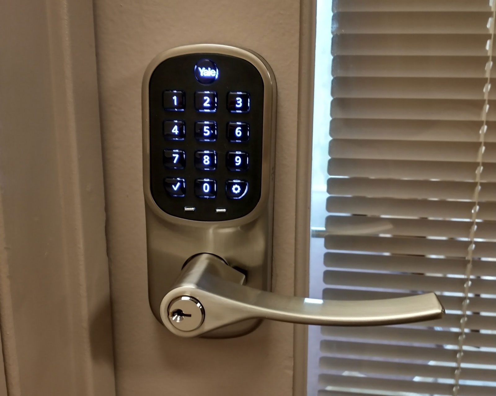
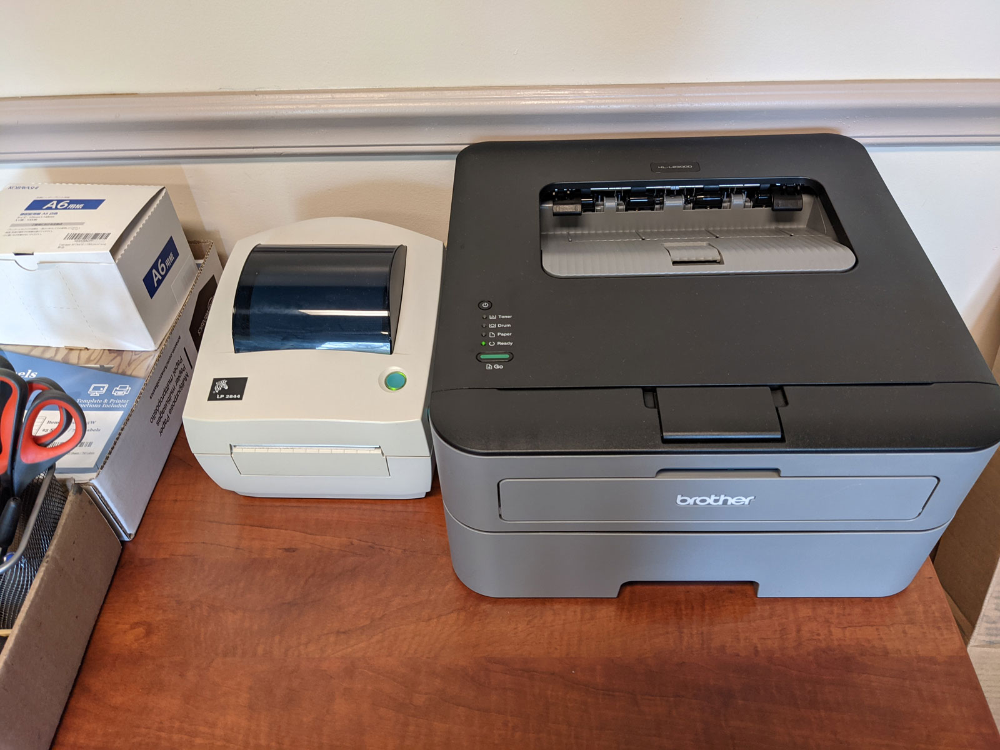
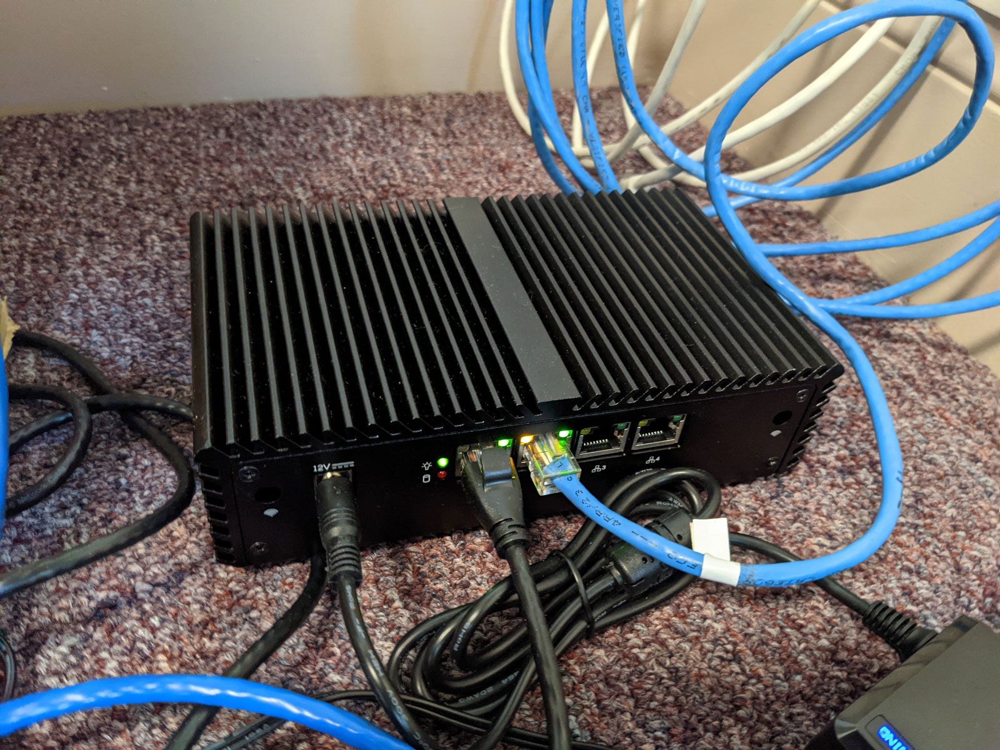
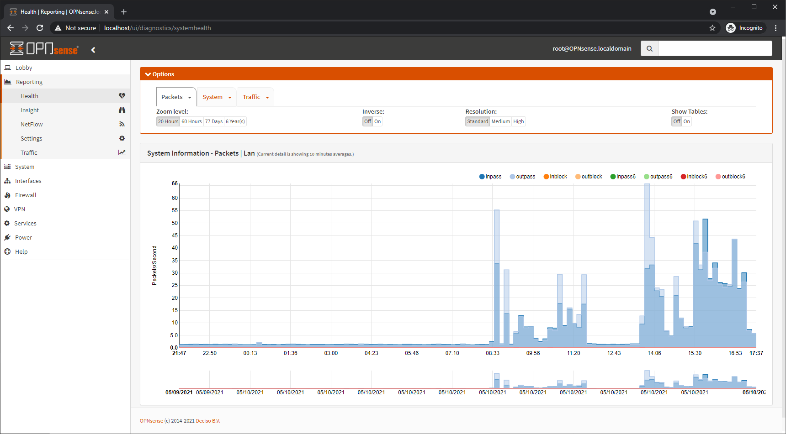
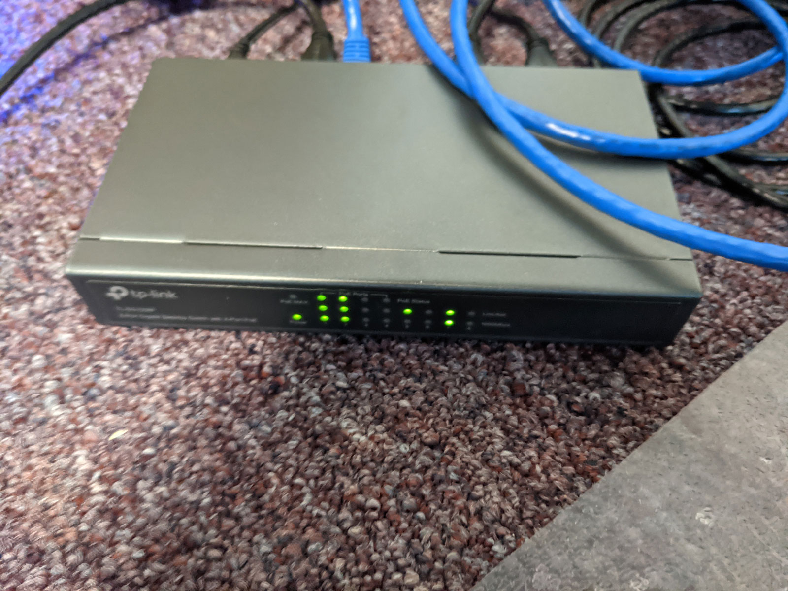
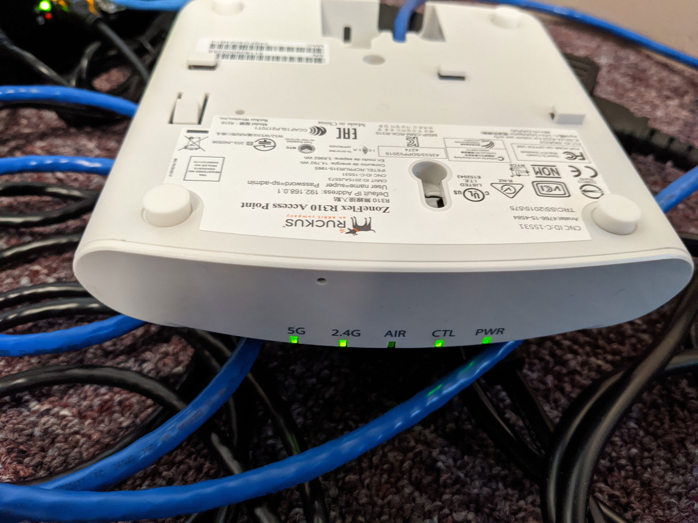
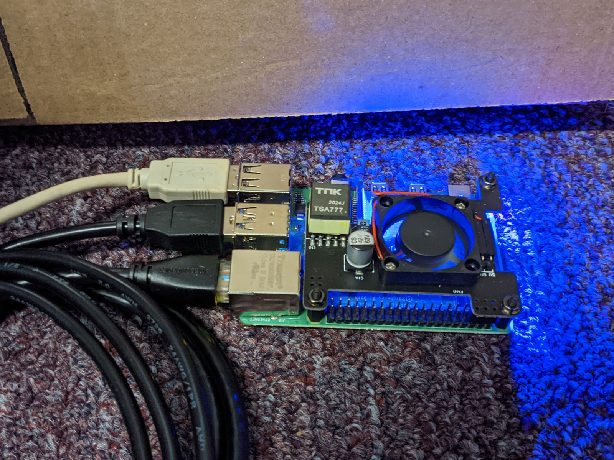
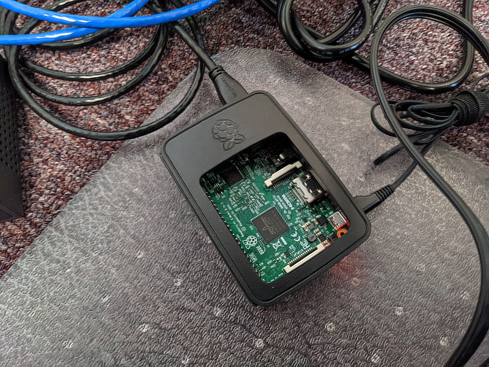

## Highlights

*

## Goal Grades

At the start of each month, I declare what I'd like to accomplish. Here's how I did against those goals:

### Increase TinyPilot revenue to $30k

* **Result**: XX
* **Grade**: XX

TODO

### Produce a prototype for a custom TinyPilot PoE HAT

* **Result**: The global chip shortage has delayed the prototype by at least one month
* **Grade**: D

TODO

### Create an outline for my book, [*Refactoring English*](https://refactoringenglish.com)

* **Result**: Completed the outline and published it on [the book's landing page](https://refactoringenglish.com)
* **Grade**: A

TODO

## [TinyPilot](https://tinypilotkvm.com/?ref=mtlynch.io) stats



| Metric           | March 2021 | April 2021    | Change                                       |
| ---------------- | ---------- | ------------- | -------------------------------------------- |
| Unique Visitors  | 5,805      | 5,880         | <font color="green">+75 (+1%)</font>         |
| Total Pageviews  | 9,762      | 10,483        | <font color="green">+721 (+7%)</font>        |
| Sales Revenue    | $19,782.96 | $28,880.65    | <font color="green">+$9,097.69 (+46%)</font> |
| Donations        | $19.92     | $0.00         | <font color="red">-$19.92 (-100%)</font>     |
| Total Revenue    | $19,802.30 | $28,880.65    | <font color="green">+$9,078.35 (+46%)</font> |
| **Net Profit**\* | *not calculated*    | **$2,146.50** | **N/A**                                      |

\* It's hard for me to calculate profit quickly in a meaningful way because I do bookkeeping mid-month after all my bank statements arrive. The profit above is simply the change in my checking account balance in the last month. It's not the full picture, as it ignores outstanding debt.

## TinyPilot's new office: the fun stuff

While I stil enjoy working from home, I'm finding it more fun than I expected to have a real office. My house was increasingly becoming a TinyPilot warehouse, so it was a relief to move everything into the office and gain back two full cabinets and a closet.

Another part of the new office that I didn't expect to enjoy so much was choosing the tech infrastructure. Here's a brief tour of what I'm using:

### Door lock: Yale Assure Lever

{{}}

The office came with a normal keyed latch, but I wanted a better way of handling temporary access. Also, if an employee relationship goes south and we have to part ways, I don't want to worry that they potentially have a copy of the office keys lying around somewhere.

I've heard good things about August smart locks, but the company only make deadbolts. Yale acquired August in 2017, and they make a door latch with August software.

I'm not sure if this is a side effect of the Yale acquisition, but August software is surprisingly bad. Every step of setting it up took at least three tries because the app is so unclear in its directions and fails completely on any hardware or WiFi failure instead of handling errors gracefully.

### Printers: Brother HL-2300D (paper) )and Zebra LP2844 (shipping labels)

{{}}

This is another copy of what I use at home.

I have terrible luck with printers that try to serve over the network, especially over WiFi. The Brother printer is just a dumb USB printer, and I use dedicated print server (below) that serves it to the local network.

We were already using the Zebra printer at home, so we just moved it to the office. It works, but I can't seem to control the ink darkness settings the way we did at home, so labels are coming out a little harder to read.

### Router: OPNsense running on a Qotom Q355G4 mini PC


**Note**: We haven't set up the office server rack yet, so I'm keeping all of my networking equipment on the floor like a filthy animal.



  {{}}
  {{}}


I like the Ubiquiti EdgeRouter 4 I have at home, but Ubiquiti's been [going](https://krebsonsecurity.com/2021/03/whistleblower-ubiquiti-breach-catastrophic/) [downhill](https://www.reddit.com/r/sysadmin/comments/mgd2k5/ubiquity_starts_to_serve_selfpromotion_ads_in/) fast these last few months. pfSense is a popular alternative, but they seem to be [lying about being open-source](https://github.com/rapi3/pfsense-is-closed-source). I've heard from several sources that [OPNsense](https://opnsense.org/) is the "good citizen" fork of pfSense.

I'm enjoying OPNsense so far. The complexity is higher than Ubiquiti, but it's much more intuitive than Microtik. I can find my way around, but I'm not yet comfortable fiddling with settings.

### Switch: TP-Link 8-Port PoE Switch

{{}}

It's the same switch I use at home, and I've liked it. I'm quickly running out of PoE ports, though, so I've already ordered a Netgear 16-Port GS116LP, which I plan to rack mount.

### Wireless Access Point: Ruckus R310

{{}}

Again, same one I use at home. Probably a bit too fancy for a single 125 square foot office. I love that it's PoE, so it only needs a single cable. With my home Ruckus, I configured it once and never had to tinker with it again.

### Print server: CUPS on a Pi 4B

{{}}

This was surprisingly easy to set up. I stuck a PoE HAT on a Pi 4B (I happen to have many available) and installed `cups` and `printer-driver-brlaser`.

I'm running into some printer hiccups, but I'm not sure whether to blame the Linux clients I'm using to print, the CUPS server, or the printers themselves.

### Jumpbox / bastion server: Tailscale on an old Pi 3

{{}}

To access my machines remotely, I installed Tailscale on an old Raspberry Pi 3 I had lying around. Then, I installed Tailscale on my home desktop, so the two are joined over Tailscale's virtual network whenever both machines have Internet.

So, if I want to manage the office print server (`franklin`, another spare Pi), I just do this:

```bash
ssh -J bastion franklin -L 631:localhost:631
```

And voila, I can access `franklin`'s web interface.

If I need to access the router, I do this:

```bash
ssh bastion -L 443:192.168.1.1:443
```

Tada! I can access my router's management dashboard.

Apparently, OPNsense has a plugin that allows Tailscale directly on the router, which allows me to access different office machines easily. For now, I'm sticking with this, because I understand what's happening clearly, whereas I find it hard to reason about what's happening when I combina OPNsense and Tailscale.

### Still to come

* 12 U server rack
* HP DL380 G7 rack-mounted server
  * Mainly because I want to experiment using a server rack for the first time.
  * It's enormous and weighs 60 lbs.
  * It may turn out to be a terrible idea.
* Dell Optiplex 3050 Micro (main workstation)
  * In the meantime, a 17" test laptop is acting as the main workstation

## TinyPilot's new office: the annoying stuff

The not-so-fun part about opening an office is all the legal and insurance stuff.

I've previously only ever hired people as "independent contractor," which is a fairly lightweight and non-bureaucratic process in the US. But you can't just declare anyone you want a contractor. The IRS [issues guidance](https://www.irs.gov/newsroom/understanding-employee-vs-contractor-designation) about the distinction between contractor and employee. For the work I need, the IRS considers it an employee relationship. And that means I have to do a whole bunch of paperwork and get worker's comp insurance. My lease also requires me to purchase liability and property insurance.

TinyPilot doesn't fit neatly into any existing business category. We "manufacture" a product in that we screw circuit boards into plastic cases, but when insurance companies talk about "manufacturers," they usually mean factories with heavy machinery that can kill you. But because TinyPilot employees have to assemble things and occasionally drive to and from our vendors' location, we're not "general office work," either.

It was annoying to find liability and property insurance because there was no way to do it online. I got it done in about four hours total and only three phone calls. I ended up going with [insureon](https://www.insureon.com/). They're a reseller of other insurers, but were the most competent of the companies I called.

HR stuff was more annoying and continues to drag on. I went with JustWorks based on recommendations from other founders, but I'm realizing the experience is probably much worse for me because I'm not a pure software business.

Here's my experience with JustWorks so far:

* The JustWorks on-boarding process involved seven different people contacting me and asking the same questions, seemingly without any collaboration with anyone else on their team speaking to me.
* JustWorks obscures a huge hidden fee in that you're required to purchase Worker's Comp insurance from them, and you don't find out until a week into the signup process.
* JustWorks, by default, sends you a poster of labor laws and then charges you $50. Customers can opt-out, but it feels like nickel-and-diming me. If I'm paying $200/month for a team of four people, a cheap poster seems like the kind of thing JustWorks can throw in for free.

The most frustrating part of JustWorks is that, for worker's comp insurance, they've classified my job as [wholesale warehouse worker](https://www.wcribma.org/mass/ToolsAndServices/MACI/Results.aspx?class=8018). I'm the same risk pool as people who move giant pallets around with a forklift. Even though I defined my job as purely computer work, the insurance rate on my pay is 3x higher than employees who actually perform manual work of assembling devices. When I tried to correct the rate, JustWorks kept insisting that they assigned me the correct code and refused to elaborate.

I finally got on the phone with my account manager and explained to him that my job is limited to writing software and managing people, so it makes no sense to classify me as a warehouse worker. He was understanding and said he'd talk to the worker's comp team, but then he came back a few days later with this response from the Worker's Comp team:

>The admin in this case has exposure to the product and the operations of the wholesale business even though the work that this person does is computer work in the office. This is why the client is getting the classification they are getting. The exposure to such disqualifies this employee from being simply a clerical employee.

It's too hard to switch away from JustWorks at this point, but I plan to evaluate [Gusto](https://gusto.com/) and [OnPay](https://onpay.com/) at the end of the year.

## Let me run it by my lawyer

Inspired by re-watching Mike Monteiro's famous talk, ["F--- You, Pay Me,"](https://www.youtube.com/watch?v=jVkLVRt6c1U) I "consulted a lawyer" for the first time ever for business reasons.

Monteiro's advice is primarily for consultants and contractors, but the bulk of his talk applies to founders as well. He argues that you hire a lawyer to review all business contracts. You forfeit a tremendous amount of power in letting the other party define all terms of a contract.

Working with a lawyer added a week to the lease process, so that was stressful. The latency was because I was doing two things at once: hiring a lawyer for the first time and having him review a lease.

The result turned out to be more fun than I expected. I felt like a real businessperson saying, "I'll have to review this with my lawyer." And the lawyer identified contradictions in the contract and suggested clearer language for the things that were important to me, like Internet availability and limitations on the landlord's rights to enter the leased space.

## My wrongheaded promotional experiment

Will Yarborough was one of the first YouTubers to review TinyPilot. He showcased the TinyPilot Voyager on his channel SpaceRex, and I was interested in collaborating with him to make more videos showing interesting use-cases for a TinyPilot.

We got on a video call to brainstorm ideas, and Will suggested using TinyPilot to control DSLR cameras. He said that nearly all DSLRs have an HDMI output and expose a simple electronic interface for firing the camera shutter. TinyPilot runs on a Raspberry Pi, which includes electronic pins you can turn on and off through software. If I could add a button to TinyPilot's web interface that controls one of the Pi's pins, Will could rig up a circuit that connects it to the camera's shutter.

This seemed like a great idea! It could open up a whole new market for TinyPilot. And even though other people had blogged about using a Raspberry Pi to control a DSLR's shutter, nobody had ever combined it with video capture in a web interface so you can see what you're shooting.

With Will would doing the heavy lifting of making the video and creating the circuit, this felt like a slam dunk. All I had to do was add a button to a web interface. That should take an hour of my time at the most.

When I sat down to implement it, I realized quickl that there was more work than just adding a button. You can't forward keystrokes or mouse clicks to a DSLR, so this wasn't a feature that could exist alongside TinyPilot's normal features. And it wasn't just adding a button because I needed to update TinyPilot's installer to include the right library for controlling Raspberry Pi's electronic interfaces. Even after I had a working solution, Will and I had to iterate on it a few times as we found out what worked with different cameras.

All told, it took about six hours of development time. That doesn't sound like a lot, but I don't get very much time to write software. TinyPilot now has a lot of moving parts, so I'm lucky if I get an hour a day to write code. In other words, this project absorbed all of my coding time for a week.



I think we were both underwhelmed by the video's response. Here are the stats as of this writing:

| Metric       | Value |
|---------------|----|
| YouTube views | 812 |
| Mailing list signups | 17 |
| Conversion rate | 2% |

This is nothing against Will's work. The video is exactly what we discussed. The YouTube audience just wasn't especially excited about the idea.

After the video came out, I realized I had asked myself the wrong questions. While it was true that nobody had built a Raspberry Pi-based solution for controlling a camera, there were indeed products that allowed you to control DSLRs remotely from your phone and browser. One company even holds [a patent](https://patents.google.com/patent/US9712688B2/en) claiming they invented the idea of controlling a camera over the network, so they could potentially sue me if I created a competing product.

I'm glad I had the foresight to keep all the DSLR code in a separate, experimental branch. Initially, I thought it was a small enough change that I could add it as a feature to the regular TinyPilot software. It's a good thing I didn't, as that would have introduced a ton of complexity to the code and cluttered the UI with a feature that 99% of my current users wouldn't want.

## Legacy projects

Here are some brief updates on projects that I still maintain but are not the primary focus of my development:

### [Is It Keto](https://isitketo.org)



| Metric                   | March 2021  | April 2021  | Change                                       |
| ------------------------ | ----------- | ----------- | -------------------------------------------- |
| Unique Visitors          | 63,493      | 56,094      | <font color="red">-7,399 (-12%)</font>       |
| Total Pageviews          | 141,199     | 123,723     | <font color="red">-17,476 (-12%)</font>      |
| Domain Rating (Ahrefs)   | 11.0        | 11.0        | 0                                            |
| AdSense Revenue          | $611.99     | $560.20     | <font color="red">-$51.79 (-8%)</font>       |
| Amazon Affiliate Revenue | $337.29     | $116.78     | <font color="red">-$220.51 (-65%)</font>     |
| **Total Revenue**        | **$949.28** | **$676.98** | **<font color="red">-$272.30 (-29%)</font>** |

Is It Keto is still running quietly in the background. It's following the same pattern as last year of slowly dropping in popularity as people lose interest in diets they started for the new year.

### [Hit the Front Page of Hacker News](https://hitthefrontpage.com/)



| Metric                    | March 2021  | April 2021  | Change                                       |
| ------------------------- | ----------- | ----------- | -------------------------------------------- |
| Unique Visitors           | 185         | 114         | <font color="red">-71 (-38%)</font>          |
| Gumroad Revenue           | $313.63     | $341.61     | <font color="green">+$27.98 (+9%)</font>     |
| Blogging for Devs Revenue | $655.20     | $109.20     | <font color="red">-$546.00 (-83%)</font>     |
| **Total Revenue**         | **$968.83** | **$450.81** | **<font color="red">-$518.02 (-53%)</font>** |

The course continues to sell in small quantities as well. There was a big jump last month from Monica Lent's [Blogging for Devs Community](https://community.bloggingfordevs.com/). Monica began offering the course as a free perk to her members and paid me a royalty for each unique course download, but that initial rush has subsided.

I'm happy that people are continuing to find the course and reach out to me about what they learned from it. [Chris Samiullah](https://twitter.com/ChrisSamiullah) from CourseMaker published [his notes from the course](https://coursemaker.org/blog/summary-michael-lynch-hacker-news-course/) and credited the course for helping him reach the [top spot of the /r/programming subreddit](https://www.reddit.com/r/programming/comments/mbd9lk/coursemaker_interactive_course_builder_for/).

### [Zestful](https://zestfuldata.com)



| Metric            | March 2021 | April 2021 | Change                                        |
| ----------------- | ---------- | ---------- | --------------------------------------------- |
| Unique Visitors   | 480        | 892        | <font color="green">+412 (+86%)</font>        |
| Total Pageviews   | 1,367      | 2,132      | <font color="green">+765 (+56%)</font>        |
| RapidAPI Revenue  | $21.97     | $40.82     | <font color="green">+$18.85 (+86%)</font>     |
| **Total Revenue** | **$21.97** | **$40.82** | **<font color="green">+$18.85 (+86%)</font>** |

Zestful continues to run in maintenance mode. I've seen an uptick in people asking about my enterprise pricing, but nothing has come of it. I'm quoting people higher prices for Enterprise than I used to because I'm accounting for the opportunity cost of shifting my attention away from TinyPilot.

It's hard to take a lot of the Enterprise inquiries seriously, as they often begin with, "The pay-as-you-go plan is too expensive for me. How much does your Enterprise plan cost?"

## Wrap up

### What got done?

* Signed a lease on TinyPilot's first-ever office space.
* Reached code complete on TinyPilot 1.5.0, adding virtual storage and support for tuning the video stream.
* Published the blog post, ["How Litestream Eliminated My Database Server for $0.03/month"](https://mtlynch.io/litestream/).

### Lessons learned

* Never commit to a new project during a live discussion.
  * Even if it seems small, it's probably more complicated than it seems.
  * I need more time to think over whether the work is worth the effort.
* Allocate more time for change.
  * TinyPilot is experiencing two major changes simultaneously: moving to our first office and training a new employee from scratch.
  * I anticipated that both would take time, but I should have given myself more of a buffer to handle unanticipated tasks.

### Goals for next month

* Increase TinyPilot's revenue to $33k.
* Fully migrate TinyPilot's operations to our new office.
* Gather feedback on the table of contents for [*Refactoring English*](https://refactoringenglish.com) and iterate on it.
