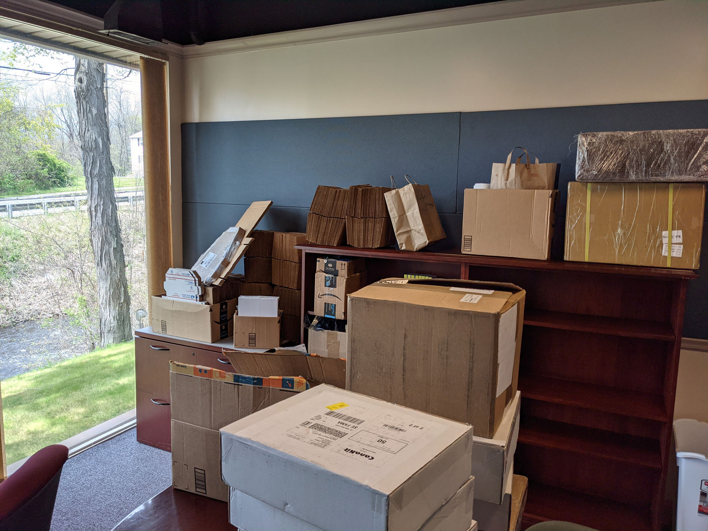
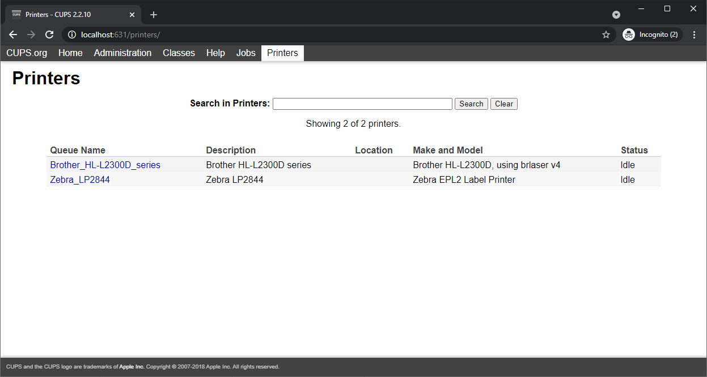

## Highlights

* TinyPilot has its first official office space.
* I tried a marketing experiment that flopped.
* Designing IT infrastructure for a new office is fun.

## Goal Grades

At the start of each month, I declare what I'd like to accomplish. Here's how I did against those goals:

### Increase TinyPilot revenue to $30k

* **Result**: Increased revenue by 46% to $29k
* **Grade**: A-

I didn't quite hit my $30k goal, but I came close. It's a relief to end the downward sales trend that began in February.

### Produce a prototype for a custom TinyPilot PoE HAT

* **Result**: The global chip shortage has delayed the prototype by at least one month
* **Grade**: D

When we began work, my electrical engineering partners took into account the [global shortage of integrated circuits](https://www.cnbc.com/2021/05/07/chip-shortage-is-starting-to-have-major-real-world-consequences.html), but it's worse than they expected.

Normally, you'd buy components in bulk after designing and printing a successful prototype. We planned to move up the buying step to the point where we just *design* the prototype. We tried this three times, and every time, the components sold out in the three or four days we spent designing the circuit board. Our new strategy is to buy a six-month supply of the critical components as soon as we identify compatible parts and cross our fingers that they work in our design.

### Create an outline for my book, [*Refactoring English*](https://refactoringenglish.com)

* **Result**: Completed the outline and published it on [the book's landing page](https://refactoringenglish.com)
* **Grade**: A

I wrote an outline that feels right to me, but I haven't yet collected feedback from readers. My next step is to survey the book's mailing list about whether the outline matches what they're hoping to learn.

## [TinyPilot](https://tinypilotkvm.com/?ref=mtlynch.io) stats



| Metric           | March 2021 | April 2021    | Change                                       |
| ---------------- | ---------- | ------------- | -------------------------------------------- |
| Unique Visitors  | 5,805      | 5,880         | <font color="green">+75 (+1%)</font>         |
| Total Pageviews  | 9,762      | 10,483        | <font color="green">+721 (+7%)</font>        |
| Sales Revenue    | $19,782.96 | $28,880.65    | <font color="green">+$9,097.69 (+46%)</font> |
| Donations        | $19.92     | $0.00         | <font color="red">-$19.92 (-100%)</font>     |
| Total Revenue    | $19,802.30 | $28,880.65    | <font color="green">+$9,078.35 (+46%)</font> |
| **Net Profit**   | **-$352.77**    | **$843.56** | **N/A**                                      |

## TinyPilot's new office: the fun stuff

TinyPilot has its first official office space! It's a 15-minute walk from my house, so it's a great location. The lease started on May 1st, and I'm in the process of moving operations there.

{{}}

While I still primarily work from home, I'm finding it more fun than I expected to have a real office. My house was increasingly becoming a TinyPilot warehouse, so it was a relief to move everything into the office and gain back two full cabinets and a large closet.

Another part of the new office that I didn't expect to enjoy so much was choosing the tech infrastructure. Here's a brief tour of what I'm using:

### Door lock: Yale Assure Lever

{{}}

The office came with a normal lockable door handle, but I wanted a better way of handling temporary access. Also, if an employee relationship goes south and we have to part ways, I don't want to worry that they potentially have a copy of the office keys lying around somewhere.

I've heard good things about August smart locks, but they only make deadbolts. Yale acquired August in 2017, and they make a door latch with August software.

I'm not sure if this is a side effect of the Yale acquisition, but the installation process was surprisingly bad. Every step of setting it up took at least three tries because the app is so unclear in its directions and fails completely on any hardware or WiFi issue instead of handling errors gracefully.

Now that it's all set up, it's nice to open the door without digging in my pocket for keys, and it's cool to have a log of who's gone in and out of the office.

### Printers: Zebra LP2844 (shipping labels) and Brother HL-2300D (paper)

{{}}

I have terrible luck with network-enabled printers, especially over WiFi. The Brother printer is just a dumb USB printer, and I use a dedicated print server (below) that serves it to the local network. I use the same printer at home, and it's been reliable, so it seemed like a good pick for the office.

We were already using the Zebra printer at home, so we just moved it to the office. It works, but I can't seem to control the ink darkness settings the way we did at home from Windows machines, so labels are coming out a little harder to read.

### Router: OPNsense running on a Qotom Q355G4 mini PC


**Note**: We haven't set up the office server rack yet, so I'm keeping all of my networking equipment on the floor like a filthy animal.



  {{}}
  {{}}


At home, I have a Ubiquiti EdgeRouter 4, but Ubiquiti's been [going](https://krebsonsecurity.com/2021/03/whistleblower-ubiquiti-breach-catastrophic/) [downhill](https://www.reddit.com/r/sysadmin/comments/mgd2k5/ubiquity_starts_to_serve_selfpromotion_ads_in/) fast this year. pfSense is a popular alternative, but they seem to be [lying about being open-source](https://github.com/rapi3/pfsense-is-closed-source). I've heard from several sources that [OPNsense](https://opnsense.org/) is the "good citizen" fork of pfSense.

The Qotom Q355G4 mini PC is a popular choice for running OPNsense, so I picked up one from Amazon. I, of course, installed the OS using only a TinyPilot, thanks to its new [virtual storage mounting feature](https://tinypilotkvm.com/blog/whats-new-in-1-5#boot-into-a-virtual-disk-drive).

I'm enjoying OPNsense so far. The complexity is higher than Ubiquiti, but it's much more intuitive than Microtik. I can find my way around, but I'm not yet comfortable fiddling with settings.

### Switch: TP-Link 8-Port PoE Switch

{{}}

It's the same switch I use at home, and I've liked it. I'm quickly running out of PoE ports, though, so I've already ordered a Netgear 16-Port GS116LP, which I plan to rack mount.

### Wireless Access Point: Ruckus R310

{{}}

Again, it's the same one I use at home. Probably a bit too fancy for a single 125-square-foot office.

I love that it's PoE, so it only needs a single cable. With my home Ruckus, I configured it once and never had to tinker with it again, so I like the minimal maintenance.

### Print server: CUPS on a Pi 4B

{{}}

My print server was surprisingly easy to set up. I stuck a PoE HAT on a Pi 4B (I happen to have many available) and installed `cups` and `printer-driver-brlaser`.

I'm running into some printer hiccups, but I'm not sure whether to blame the Linux clients I'm using to print, the CUPS server, or the printers themselves.

### Jumpbox / bastion server: Tailscale on an old Pi 3

{{}}

To access my machines remotely, I installed [Tailscale](https://tailscale.com/) on an old Raspberry Pi 3. Then, I installed Tailscale on my home desktop, so the two are joined over Tailscale's virtual network whenever both machines have Internet.

If I need to access the router, I run this command from my home desktop:

```bash
ssh bastion -L 443:192.168.1.1:443
```

Tada! I can access my router's management dashboard.

When I want to manage the office print server (`franklin`), I run this command:

```bash
ssh -J bastion franklin -L 631:localhost:631
```

And voila, I can access `franklin`'s CUPS web interface.

{{}}

### Still to come

* 12 U server rack
* HP DL380 G7 rack-mounted server
  * Mainly because I want to experiment using a server rack for the first time.
  * It's enormous and weighs 60 lbs.
  * It may turn out to be a terrible idea.
* Dell Optiplex 3050 Micro (main workstation)
  * In the meantime, a 17" test laptop is acting as the main workstation

## TinyPilot's new office: the annoying stuff

The not-so-fun part about opening an office is all the legal and insurance stuff.

I've previously only ever hired people as "independent contractors," which is a fairly lightweight and non-bureaucratic process in the US. But you can't just declare anyone you want a contractor. The IRS [issues guidance](https://www.irs.gov/newsroom/understanding-employee-vs-contractor-designation) about the distinction between contractor and employee. For the work I need, the IRS considers it an employee relationship. And that means I have to do a whole bunch of paperwork and get worker's comp insurance. My lease also requires me to purchase liability and property insurance.

TinyPilot doesn't fit neatly into business categories that insurance companies use. When insurance companies talk about "manufacturers," they usually mean factories with heavy machinery that can kill you. We "manufacture" a product in that we screw circuit boards into plastic cases, but that means that insurers see the work as "manufacturing" and charge high rates.

HR stuff was more annoying and continues to drag on. I went with JustWorks based on recommendations from other founders, but I'm realizing the experience is probably much worse for me because I'm not a pure software business.

Here's my experience with JustWorks so far:

* The JustWorks on-boarding process involved seven different people contacting me and asking the same questions, seemingly without any collaboration with anyone else on their team.
* JustWorks obscures a huge hidden fee in that you're required to purchase worker's comp insurance from them, and you don't find out until a week into the signup process.
* JustWorks, by default, sends you a poster of labor laws and then charges you $50. Customers can opt-out, but wow does it feel like JustWorks is nickel-and-diming me. If I'm paying $200/month for a team of four people, a cheap poster seems like the kind of thing JustWorks can throw in for free.

The most frustrating part of JustWorks is that, for worker's comp insurance, they've classified my job as a [wholesale warehouse worker](https://www.wcribma.org/mass/ToolsAndServices/MACI/Results.aspx?class=8018). I'm in the same risk pool as people who move giant pallets around with a forklift. Even though I defined my job as purely computer work, the insurance rate on my pay is 3x higher than employees who actually perform manual work of assembling devices. When I tried to correct the rate, JustWorks kept insisting that they assigned me the correct code and refused to elaborate.

I finally got on the phone with my account manager and explained to him that my job is limited to writing software and managing people, so it makes no sense to classify me as a warehouse worker. He was understanding and said he'd talk to the worker's comp team. A few days later, he relayed this message:

>The admin in this case has exposure to the product and the operations of the wholesale business even though the work that this person does is computer work in the office. This is why the client is getting the classification they are getting. The exposure to such disqualifies this employee from being simply a clerical employee.

It's too hard to switch away from JustWorks at this point, but I plan to evaluate [Gusto](https://gusto.com/) and [OnPay](https://onpay.com/) at the end of the year.

## Let me run it by my lawyer

Inspired by re-watching Mike Monteiro's famous talk, ["F--- You, Pay Me,"](https://www.youtube.com/watch?v=jVkLVRt6c1U) I hired a lawyer to review a business contract for the first time ever.



Monteiro's advice is primarily for consultants and contractors, but the bulk of his talk applies to founders as well. He argues that you forfeit a tremendous amount of power by letting the other party define all terms of a contract without a lawyer on your side. A good lawyer pays for themselves in protecting you from bad deals, even if your business seems too small to afford a lawyer.

I'd never signed a commercial lease, and I didn't know what was normal, so it seemed like a good opportunity to consult a lawyer. That added a stressful week to the lease process. The latency was because I was doing two things at once: hiring a lawyer for the first time and having him review a lease.

The result turned out to be fun, though. Getting to say, "I'll have to review this with my lawyer," made me feel like a real businessperson. And the lawyer identified contradictions in the lease and suggested clearer language for clauses that were important to me, like Internet availability and limitations on the landlord's rights to enter the leased space.

## My wrongheaded promotional experiment

Will Yarborough was one of the first YouTubers to [review TinyPilot](https://www.youtube.com/watch?v=jq2X2ofedyQ), and I was interested in collaborating with him on more interesting use-cases for a TinyPilot.



We got on a video call to brainstorm ideas, and Will suggested using TinyPilot to control DSLR cameras. Nearly all DSLRs have an HDMI output and expose a simple electronic interface for firing the camera shutter.

TinyPilot runs on a Raspberry Pi, which has electronic pins that turn on and off through software. If I could add a button to TinyPilot's web interface that controls one of the Pi's pins, Will could rig up a circuit that connects it to a camera shutter.

This seemed like a great idea! It could open up a whole new market for TinyPilot. And even though other people had blogged about using a Raspberry Pi to control a DSLR's shutter, nobody had ever combined it with video capture and put it all in a slick web interface.

With Will doing the heavy lifting of creating the circuit and shooting the video, this felt like a slam dunk. All I had to do was add a button to a web UI. That should take an hour of my time at the most.

When I sat down to implement the software portion, I quickly realized that there was more work than just adding a button. I needed to update TinyPilot's installer to include the right library for controlling Raspberry Pi's electronic interfaces. And I can't just stick a button anywhere &mdash; I had to rearrange the UI to put the button somewhere sensible. Even after I had a working solution, Will and I had to iterate on it a few times as we discovered what worked with different cameras.

All told, I spent about six hours of development time on this. It sounds small, but I'm lucky if I get a few hours per week to write code these days. This project absorbed all of my coding time for over a week.



Will put together a great video, but we were both underwhelmed by the response. Here are the stats as of this writing:

| Metric       | Value |
|---------------|----|
| YouTube views | 812 |
| Mailing list signups | 17 |
| Conversion rate | 2% |

After the video came out, I realized I had asked myself the wrong questions. While it was true that nobody had built a solution like this with a *Raspberry Pi*, there were already products that controled DSLRs from a phone or web browser. One company even holds [a patent](https://patents.google.com/patent/US9712688B2/en) claiming they invented the idea of controlling a camera over a computer network, so they could potentially sue me if I created a competing product.

I'm glad I had the foresight to keep all the DSLR code in [a separate, experimental branch](https://github.com/tiny-pilot/tinypilot/tree/experimental/dslr) of the codebase. Initially, I thought it was a small enough change that I could add it as a feature to the regular TinyPilot software. It's a good thing I didn't, as that would have introduced a ton of complexity to the code and cluttered the UI with a feature that 99% of my users don't want.

## Legacy projects

Here are some brief updates on projects that I still maintain but are not the primary focus of my development:

### [Is It Keto](https://isitketo.org)



| Metric                   | March 2021  | April 2021  | Change                                       |
| ------------------------ | ----------- | ----------- | -------------------------------------------- |
| Unique Visitors          | 63,493      | 56,094      | <font color="red">-7,399 (-12%)</font>       |
| Total Pageviews          | 141,199     | 123,723     | <font color="red">-17,476 (-12%)</font>      |
| Domain Rating (Ahrefs)   | 11.0        | 11.0        | 0                                            |
| AdSense Revenue          | $611.99     | $560.20     | <font color="red">-$51.79 (-8%)</font>       |
| Amazon Affiliate Revenue | $337.29     | $116.78     | <font color="red">-$220.51 (-65%)</font>     |
| **Total Revenue**        | **$949.28** | **$676.98** | **<font color="red">-$272.30 (-29%)</font>** |

Is It Keto is still running quietly in the background. It's following the same pattern as last year: slowly dropping in popularity as people lose interest in diets they started for the new year.

Amazon Affiliate revenue dropped disproportionately, but that's just because [last month was an outlier](/retrospectives/2021/04/#is-it-ketohttpsisitketoorg).

### [Hit the Front Page of Hacker News](https://hitthefrontpage.com/)



| Metric                    | March 2021  | April 2021  | Change                                       |
| ------------------------- | ----------- | ----------- | -------------------------------------------- |
| Unique Visitors           | 185         | 114         | <font color="red">-71 (-38%)</font>          |
| Gumroad Revenue           | $313.63     | $341.61     | <font color="green">+$27.98 (+9%)</font>     |
| Blogging for Devs Revenue | $655.20     | $109.20     | <font color="red">-$546.00 (-83%)</font>     |
| **Total Revenue**         | **$968.83** | **$450.81** | **<font color="red">-$518.02 (-53%)</font>** |

My course continues to sell in small quantities. There was a big jump last month from Monica Lent's [Blogging for Devs Community](https://community.bloggingfordevs.com/). In March, Monica began offering the course as a free perk to her members and paid me a royalty for each unique course download. That initial rush has subsided.

I'm happy that people continue to find the course and reach out to me about what they learned. [Chris Samiullah](https://twitter.com/ChrisSamiullah) from CourseMaker published [his notes](https://coursemaker.org/blog/summary-michael-lynch-hacker-news-course/) and credited my course with helping him reach the [top spot of the /r/programming subreddit](https://www.reddit.com/r/programming/comments/mbd9lk/coursemaker_interactive_course_builder_for/).

### [Zestful](https://zestfuldata.com)



| Metric            | March 2021 | April 2021 | Change                                        |
| ----------------- | ---------- | ---------- | --------------------------------------------- |
| Unique Visitors   | 480        | 892        | <font color="green">+412 (+86%)</font>        |
| Total Pageviews   | 1,367      | 2,132      | <font color="green">+765 (+56%)</font>        |
| RapidAPI Revenue  | $21.97     | $40.82     | <font color="green">+$18.85 (+86%)</font>     |
| **Total Revenue** | **$21.97** | **$40.82** | **<font color="green">+$18.85 (+86%)</font>** |

Zestful continues to run in maintenance mode. There's been an uptick in people asking about Enterprise plans, but the discussions fizzle quickly after they hear pricing. I'm quoting higher prices to account for the opportunity cost of shifting my attention away from TinyPilot.

It's hard to take a lot of the Enterprise inquiries seriously, though. The inquiries often begin with, "The pay-as-you-go plan is too expensive for me. How much does your Enterprise plan cost?"

## Wrap up

### What got done?

* Signed a lease on TinyPilot's first-ever office space.
* Hired two new employees to staff the office part-time.
* Documented about 50% of TinyPilot's internal processes for new employees.
* Reached code complete on TinyPilot 1.5.0, adding virtual storage and support for tuning the video stream.
* Published the blog post, ["How Litestream Eliminated My Database Server for $0.03/month"](https://mtlynch.io/litestream/).

### Lessons learned

* Never commit to a new project during a live discussion.
  * Even if it seems small, it's probably more complicated than it seems.
  * I need more time to think over whether the work is worth the effort.
* Allocate more time for change.
  * TinyPilot is experiencing two major changes simultaneously: moving to our first office and training a new employee from scratch.
  * I anticipated that both would take time, but I should have given myself more of a buffer to handle unanticipated tasks.

### Goals for next month

* Increase TinyPilot's revenue to $33k.
* Fully migrate TinyPilot's operations to our new office.
* Gather feedback on the table of contents for [*Refactoring English*](https://refactoringenglish.com) and iterate on it.
