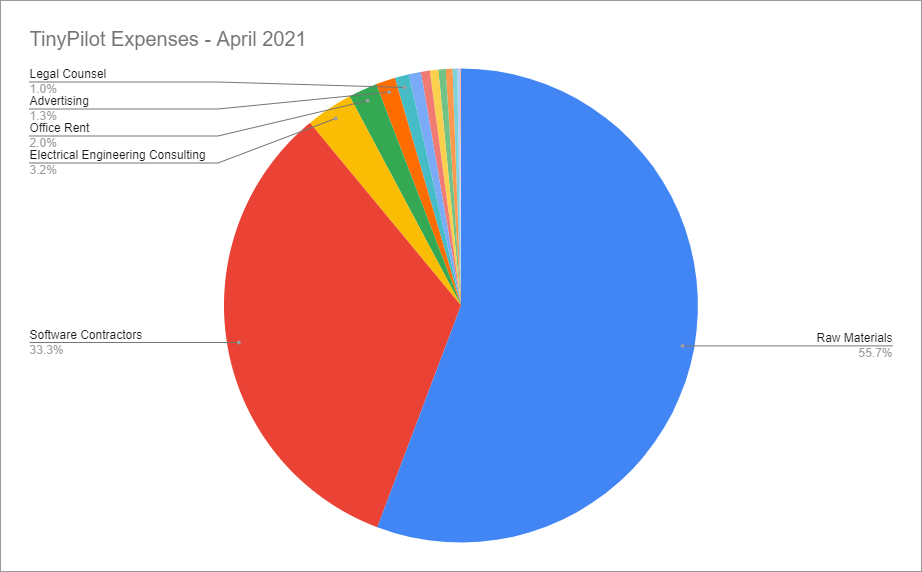

## Highlights

- Despite $30k in monthly revenue, TinyPilot barely covers costs.
- I'm exploring options to get big companies to pay more for TinyPilot.
- I need to come to terms with the fact that managing people is a real job.

## Goal grades

At the start of each month, I declare what I'd like to accomplish. Here's how I did against those goals:

### Increase TinyPilot's revenue to $33k

- **Result**: Increased TinyPilot's revenue to $39k
- **Grade**: A

TinyPilot had a huge spike in sales following a [big review from ServeTheHome](https://www.servethehome.com/tinypilot-voyager-kvm-raspberry-pi-remote/), one of the top blogs / YouTube channels for IT hardware.

### Fully migrate TinyPilot's operations to our new office

- **Result**: TinyPilot operates completely at the new office
- **Grade**: A

We finally moved TinyPilot operations out of my house and into a real office. There were some stressful days, like when I wasn't sure if I could get printing to work on Linux at all, but overall the transition was smooth. Incoming parts ship to the office, employees build and test products at the office, and outgoing orders ship out from the office.

### Gather feedback on the table of contents for [_Refactoring English_](https://refactoringenglish.com) and iterate on it

- **Result**: I gathered feedback, but I'm not yet sure how to integrate it
- **Grade**: B

I got feedback from the [Write Useful Books community](https://writeusefulbooks.com) and from my mailing list. Six people responded out of 202 subscribers, which was a bit lower than I hoped, but it provided [helpful feedback](https://twitter.com/deliberatecoder/status/1396595066316148742).

People seemed more interested in the high-level tasks like "Write better blog posts" and less interested in chapters that explain how to improve verb use. I want to reorder things to front-load the interesting parts, but I'm not sure how to do that because the later chapters depend on the earlier ones.

Exciting outcomes are naturally more attractive than fundamentals. If I wrote a book about creating a video game, people would be interested in chapters like "How to build enemies with intelligent AI" and probably not so interested in "the basics of linear algebra." That doesn't mean that I can just skip the fundamentals, but maybe it means I need to find ways to keep the lessons practical and easy to apply while teaching the fundamentals

## [TinyPilot](https://tinypilotkvm.com/) stats



| Metric          | April 2021  | May 2021      | Change                                            |
| --------------- | ----------- | ------------- | ------------------------------------------------- |
| Unique Visitors | 5,880       | 7,283         | <font color="green">+1,403 (+24%)</font>          |
| Total Pageviews | 10,483      | 13,267        | <font color="green">+2,784 (+27%)</font>          |
| Sales Revenue   | $28,880.65  | $38,767.77    | <font color="green">+$9,887.12 (+34%)</font>      |
| **Profit**      | **$843.56** | **$6,858.72** | **<font color="green">+$6,015.16 (+713%)</font>** |

TinyPilot had its second-best month ever. It was exciting how everything worked smoothly at this level of sales. When a similar rush hit in January, it [overwhelmed us](/retrospectives/2021/02/#tinypilots-first-postmortem). Fortunately, we've improved our order fulfillment workflow, so all of our systems worked as normal.

## I'm just a manager

From 2012 to 2014, I worked as a software security consultant at a company called iSEC Partners. My manager, Peter, ran the entire team in New York. He would often say self-deprecatingly, "I'm just a manager &mdash; I'm overhead." He said it as all of his employees did productive work, whereas he was just part of the company's bureaucracy.

But Peter was an exceptionally good manager, and everyone knew it. I think he joked about the unimportance of his role because management meant he had less time for the more fun things that happened at the company, like security research and tool development.

I now relate to Peter's sentiment. I'll often get to the end of the day and feel like all I did was write emails. But taking a step back, I can understand why I have those days. At this point, I work with a lot of people on TinyPilot:

- three remote software developers
- three local staffers who handle inventory, assembly, and order fulfillment
- two vendors with whom I work closely on 3D printing and electrical engineering

So, eight people in total that I communicate with at least once per week. And on top of that, there are other people and services I work with, like the office's landlord, my HR/payroll service, our knowledge base, and tools for tracking inventory. And I'm the only one handling customer support and sales.

Taking that into consideration, it feels more reasonable that I spend most of my time just emailing people. I need to adjust my strategies to embrace management even more.

### Avoid doing work that my teammates can do

One of the dumbest things I do now is take on tasks that someone else on the team is perfectly capable of doing instead. Last month, I talked about how [I only have an hour per day to write code](/retrospectives/2021/05/#my-wrongheaded-promotional-experiment). Thinking about it more, I shouldn't even be doing that because my teammates can write code, and I'm falling behind on tasks that _only_ I can do.

### Unhoard Michael-only tasks

There are a few tasks that other people theoretically could do, but they can't in practice because I'm currently the only one with the required access or knowledge.

These tasks primarily cross domains or roles, like managing tools that only my local staff uses. Here are some things I should delegate (in ascending difficulty of unbinding them from me):

- Manage glue code that connects Shopify to our inventory spreadsheet.
- Manage scripts that build TinyPilot production images.
- Manage formulas in our inventory spreadsheet.
- Answer customer support questions.
- Perform final QA testing on TinyPilot releases.

## How is $30k/month not profitable?

I was lamenting recently to my girlfriend that there are likely easy solutions to many of my issues growing TinyPilot, but I'm unaware of them because I'm not in touch with people who run businesses like mine. She asked who I'd want advice from and pointed out that I could just think of people and email them.

The first person who came to mind was [Mike Perham](https://www.mikeperham.com/), the founder of Sidekiq. Mike's [interview on Indie Hackers](https://www.indiehackers.com/podcast/016-mike-perham-of-sidekiq) is one of my favorites. I listened to it when I was still an employee at Google, and his business has always stuck with me as the ideal indie software business. He was earning ~$80k/month writing open-source software. Best of all, customers run Sidekiq on their own machines, so it's nearly impossible for an emergency to pop up that demands Mike's immediate attention.

I don't know Mike, so I sent him an email introducing myself and asked if he had any advice about TinyPilot. He responded the next day with several generous suggestions. The part that most stuck out to me was his reaction to my finances:

> Get those profits up. A 5% profit margin is not a healthy business to be in. Either get your costs down, massage your prices a bit or find a software-only addon that can be closer to pure profit.

That was a helpful wake-up call. I knew my profits were low, but it still felt like $30k/month meant that I was in a good position. But thinking about it in terms of 5% profit margin really puts it into perspective.

Based on Mike's advice, I took a closer look at my expenses. I haven't done my bookkeeping for May yet, so I'm using April as an example.

{{}}

| Category                          | Total      |
| --------------------------------- | ---------- |
| Raw Materials                     | $15,637.68 |
| Software Contractors              | $9,331.79  |
| Local Fulfillment Staff           | $1,460.12  |
| Postage                           | $1,262.53  |
| Electrical Engineering Consulting | $901.25    |
| Office Rent                       | $550.00    |
| Advertising                       | $370.00    |
| Lawyer                            | $270.00    |
| Office Equipment                  | $233.72    |
| Graphic Design                    | $169.00    |
| Stickers                          | $163.63    |
| Cloud Services                    | $176.33    |
| Misc                              | $161.21    |

My cost for raw materials isn't so surprising. My profit margin on physical products is generally around 50-60%, so $15k matches what I'd expect on about $30k of sales. There's not much wiggle room there, as there aren't cheaper alternatives to the materials I buy. There are a few items like cables where I pay a premium for quality, but that's a difference of $1-2/unit on a product I sell for $300. The expensive parts are things that have no cheaper alternatives, like the Raspberry Pis or the HDMI capture chips.

My second largest expense is software development, which probably seems strange when I can write software myself. The problem is that I need uninterrupted focus time to write software well, and TinyPilot has too many non-software moving parts to allow that. At the end of 2020, TinyPilot's software development slowed to a crawl because I was the only developer, and I was busy with all the logistics of adding [a new product](/retrospectives/2020/12/#new-products-require-new-habits).

I could hire cheaper developers, but that would quickly become disastrous. The developers I work with are especially talented. They keep the quality of the codebase high so that the software continues to be maintainable and low in bugs.

I've worked with cheaper developers (~$30/hr), and they either can't figure out how to do the work at all, or they apply naïve implementations that lead to bugs and maintenance headaches later on. If I staffed the project with low-cost developers, the codebase would become an unmaintainable nightmare within a few months.

Outside of this, I don't have any expenses I can meaningfully cut. My third biggest expense is my local fulfillment staff, but even slashing 50% of costs would only reduce overall expenses by 2.4%, so it's not worth messing with a system that works well.

The other way I can follow Mike Perham's advice is to increase revenue.

## Capturing value from large customers

Earlier this year, I talked to an IT manager at a large corporation. He loved TinyPilot and wanted to champion it within his company to replace their old $2k enterprise appliances. And it worked! The company deployed 40 TinyPilots throughout one of their departments and planned to add more.

Guess how much TinyPilot earned from that deployment. Zero.

Instead of buying the hardware from me, they simply built their own devices. And because the software has [a permissive open-source license](https://github.com/tiny-pilot/tinypilot/blob/master/LICENSE), they were free to use it in their company without paying me anything.

This is an extremely common problem in open-source. An open license helps people discover your product and encourages them to use it, but it also allows big corporations to profit from your work while offering nothing in return.

I asked Mike Perham about this as well. Here was his response:

> Sounds like your license is allowing large customers to walk all over you. This is YOUR code, right? Change your license, e.g. allow hobbyists to use it with one instance for personal use only. The MIT or BSD license is great for giving away code; it's not good to base a business on.

It is my code... sort of. The freelancers who work on TinyPilot sign a contract saying that I own the intellectual property of code they contribute, but I also have accepted a handful of contributions from volunteer developers. My understanding is that developers who contributed free code technically co-own the copyright to TinyPilot's code with me.

I released TinyPilot under the [MIT license](https://choosealicense.com/licenses/mit/) because it gives me flexibility as well. I _think_ I can "fork" the code myself into a different license and just say that it also uses MIT-licensed code, but I'm not totally sure how that works.

I've thought about ways to capture more value from large, Enterprise customers, and here's what I've come up with:

### Offer Enterprise features for TinyPilot

One of the features that large customers ask for and nobody else does is programmatic access to the TinyPilot. Like, "I want to monitor the remote screen to detect when the target device has crashed, then generate an alert."

I'm going to talk to large customers about an Enterprise version of TinyPilot with this functionality for a steep premium. I think something like $50/device/month would be ridiculous to a home user, but it's an irrelevant amount of money to a Fortune 500 company if it means they don't have to spend weeks rolling their own solution.

### Offer a SaaS add-on

TinyPilot is easy to use if you're on the same local network as the device, but if customers want to access their TinyPilots from over the Internet, they currently have to rely on third-party solutions. I've floated the idea to several customers of a "TinyPilot Cloud Portal": a secure web interface that gives them remote access to their TinyPilot devices anywhere on the Internet.

This would be a nice software as a service subscription opportunity, which would provide a complement to TinyPilot's hardware offerings at a higher profit margin.

Still, I want to avoid hosting a service [where I have to be on-call](/solo-developer-year-3/#you-can-build-a-successful-business-without-being-available-247). I'm exploring the possibility of working with a vendor that can manage the operational aspects of the service.

### Talk to a lawyer who specializes in open-source licensing

There's a lot I still don't understand about open-source licensing, so I should talk to a lawyer to find out what my options are. The ideal license would keep TinyPilot affordable for personal users who can try it at home and then bring it to their employer for a more expensive license in a commercial setting, [similar to Sidekiq](https://github.com/mperham/sidekiq/wiki/Commercial-FAQ).

## Legacy projects

Here are some brief updates on projects that I still maintain but are not the primary focus of my development:

### [Is It Keto](https://isitketo.org)



| Metric                   | April 2021  | May 2021    | Change                                      |
| ------------------------ | ----------- | ----------- | ------------------------------------------- |
| Unique Visitors          | 56,094      | 49,085      | <font color="red">-7,009 (-12%)</font>      |
| Total Pageviews          | 123,723     | 108,862     | <font color="red">-14,861 (-12%)</font>     |
| Domain Rating (Ahrefs)   | 11.0        | 11.0        | 0                                           |
| AdSense Revenue          | $560.20     | $466.84     | <font color="red">-$93.36 (-17%)</font>     |
| Amazon Affiliate Revenue | $116.78     | $138.99     | <font color="green">+$22.21 (+19%)</font>   |
| **Total Revenue**        | **$676.98** | **$605.83** | **<font color="red">-$71.15 (-11%)</font>** |

Is It Keto continues to run in the background, but I put in a rare bit of work this month. Many of my Amazon Affiliate links had gone out of date and were pointing to products that no longer existed, so I spent a couple of hours fixing those.

Dusting off the code after months away, it's _so_ tempting to go down a rabbit hole of tinkering with the site. I have to restrain myself because it's better for me to focus on TinyPilot as much as possible.

### [Hit the Front Page of Hacker News](https://hitthefrontpage.com/)



| Metric                    | April 2021  | May 2021    | Change                                     |
| ------------------------- | ----------- | ----------- | ------------------------------------------ |
| Unique Visitors           | 114         | 191         | <font color="green">+77 (+68%)</font>      |
| Gumroad Revenue           | $341.61     | $417.85     | <font color="green">+$76.24 (+22%)</font>  |
| Blogging for Devs Revenue | $109.20     | $0.00       | <font color="red">-$109.20 (-100%)</font>  |
| **Total Revenue**         | **$450.81** | **$417.85** | **<font color="red">-$32.96 (-7%)</font>** |

This course is still making a few sales per month, but I haven't spent much time promoting it.

One highlight was that Dan Willoughby [applied the lessons from the course](https://twitter.com/plainice_/status/1398382363386597376) to write [an article](https://tellspin.app/blog/why-interruptions-are-frustrating-to-developers/) that reached the #2 spot on Hacker News. And it wasn't like he applied "growth hacks" to game the system. He just put in the time to write a high-quality article, and it received an appropriate response. That felt great to see.

### [Zestful](https://zestfuldata.com)



| Metric            | April 2021 | May 2021   | Change                                     |
| ----------------- | ---------- | ---------- | ------------------------------------------ |
| Unique Visitors   | 892        | 659        | <font color="red">-233 (-26%)</font>       |
| Total Pageviews   | 2,132      | 1,784      | <font color="red">-348 (-16%)</font>       |
| RapidAPI Revenue  | $40.82     | $32.85     | <font color="red">-$7.97 (-20%)</font>     |
| **Total Revenue** | **$40.82** | **$32.85** | **<font color="red">-$7.97 (-20%)</font>** |

Even though Zestful is still in maintenance mode, last weekend, I published an [official Python package for it](https://pypi.org/project/zestful-parse-ingredient/). It's something I always thought the project should have, but I kept putting it off because I didn't know how to publish PyPI packages. I ended up learning how to do it in March [while playing around with Restic](https://github.com/mtlynch/resticpy), so I figured I may as well use the knowledge to make a package for Zestful.

Now, a user can get up and running with Zestful in minutes. Install the package like this:

```bash
pip install zestful-parse-ingredient
```

Then, import the `parse_ingredient` module, and pass it an ingredient:

```python
import json
import parse_ingredient

ingredient = parse_ingredient.parse('2 1/2 tablespoons finely chopped parsley')
print(json.dumps(ingredient.as_dict()))
```

And you'll see JSON output like this:

```javascript
{
  "quantity": 2.5,
  "unit": "tablespoon",
  "product": "parsley",
  "productSizeModifier": null,
  "preparationNotes": "finely chopped",
  "usdaInfo": {
      "category": "Vegetables and Vegetable Products",
      "description": "Parsley, fresh",
      "fdcId": "170416",
      "matchMethod": "exact"
  },
  "confidence": 0.9858154,
}
```

## Wrap up

### What got done?

- Moved TinyPilot's operations from my house to a real office
- Worked with my inventory manager to document all of our processes in Notion.
  - Notion definitely has some warts and gotchas, but it's a big step up from Google Docs, which was where we previously documented our internal processes.
- Successfully transitioned responsitibilites from TinyPilot's original inventory manager (my girlfriend) to our new local employee.
  - My girlfriend's grad school classes resume next week, so she won't have time to work on TinyPilot.

### Lessons learned

- When it comes to new employee training, "tell, don't show."
  - We trained our first local employee almost entirely through written instructions rather than live discussions.
  - We were all happy with how easily the ramp-up went, and it led to a smooth transition of responsibilities to the new employee.
  - A second local employee started in mid-May, and we're expecting the ramp-up to be even easier because everything is already documented.
- Management requires time, too.
  - If I want to manage well, I need to let go of tasks that my teammates can do instead.
- TinyPilot needs higher profit margins.
  - Increasing revenue will be easier than cutting expenses.

### Goals for next month

- Publish a new release of TinyPilot.
- Earn $35k in TinyPilot revenue.
- Create a prototype of the TinyPilot Voyager 2, with built-in Power over Ethernet.
