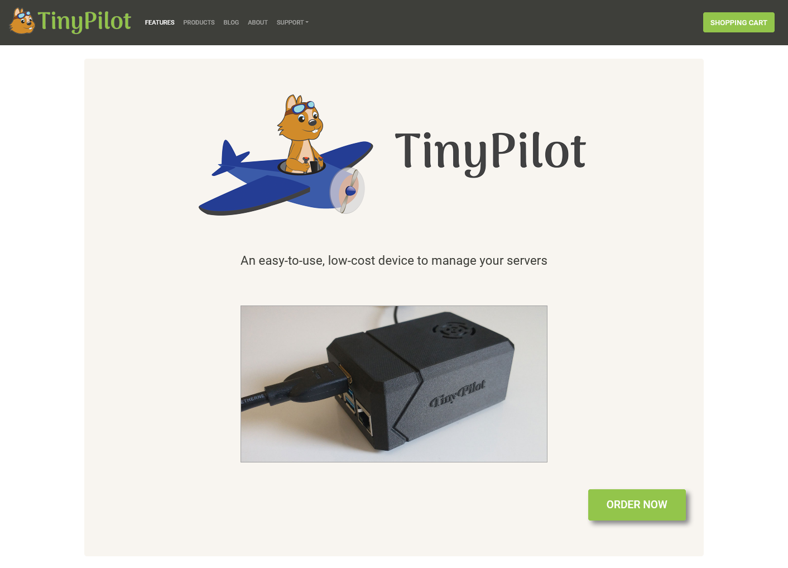
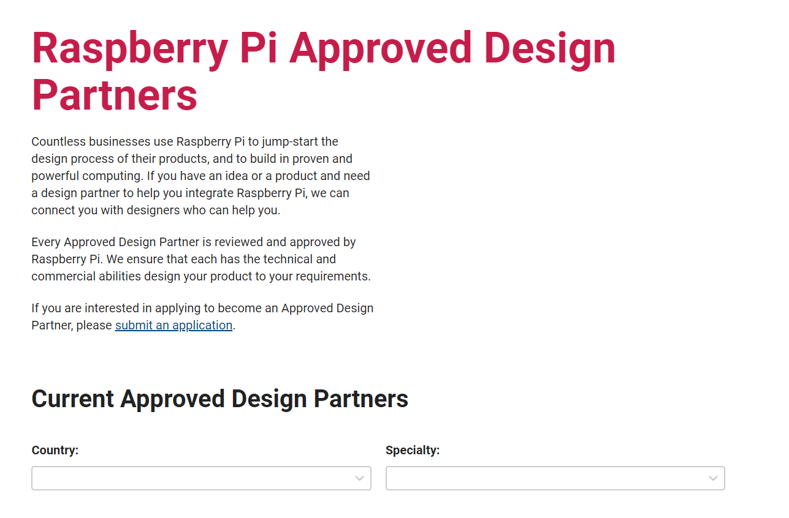

## Highlights

- I'm struggling to get unstuck in two areas that have stalled for months: hardware development and hiring.
- I'm partnering with a distributor in Germany to begin selling TinyPilot within the EU.

## Goal Grades

At the start of each month, I declare what I'd like to accomplish. Here's how I did against those goals:

### Publish a new release of TinyPilot

- **Result**: Published [TinyPilot 1.5.1](https://tinypilotkvm.com/blog/whats-new-in-1-5-1)
- **Grade**: A

This release went well and came out on schedule. It didn't have any especially exciting new features, but we polished existing features and paid down technical debt.

### Earn $35k in TinyPilot revenue

- **Result**: Earned $29k in revenue
- **Grade**: B-

Revenue slipped this month, as I haven't been investing as much into marketing. It's a relief that revenue stays this stable without a major marketing push in the last two months, but I need to step it up in July.

### Create a prototype of the TinyPilot Voyager 2, with built-in Power over Ethernet

- **Result**: Scoped the project down to a more compact Voyager without Power over Ethernet
- **Grade**: D

There wasn't as much progress here as I'd hoped. Even with me drastically increasing the price I'm willing to pay for PoE components, my electrical engineering partners couldn't find any in stock.

We ultimately decided to drop PoE as a Voyager 2 feature and instead reduced the number of external wires and connectors. We likely won't have the first prototype until mid-July.

## [TinyPilot](https://tinypilotkvm.com/?ref=mtlynch.io) stats



| Metric          | May 2021      | June 2021                               | Change                                     |
| --------------- | ------------- | --------------------------------------- | ------------------------------------------ |
| Unique Visitors | 7,283         | 6,339                                   | -944 (-13%)       |
| Total Pageviews | 13,267        | 11,514                                  | -1,753 (-13%)     |
| Sales Revenue   | $38,767.77    | $29,446.46                              | -$9,321.31 (-24%) |
| Total Revenue   | $38,767.77    | $29,446.46                              | -$9,321.31 (-24%) |
| **Profit**      | **$6,858.72** | **-$-9452.32** | **N/A**                                    |

All of my numbers are down, which I attribute mostly to neglecting marketing.

My profits are down but not as drastically as it appears. The Raspberry Pi is TinyPilot's most expensive component, and my Pi costs have drastically increased. There's an ongoing chip shortage, so I've had to double the amount I keep in inventory to weather the storm. I've also had to upgrade from the 2 GB model to the doubly expensive 4 GB model, as the 2 GB are out of stock everywhere. There's probably a better way for me to represent the value of my inventory in these numbers, but I haven't gotten there yet.

## Finding ways to free up time

I recently read the book [_The Goal_](/book-reports/the-goal/), which is all about the "bottlenecks" of a business. The bottleneck is the limiting factor of a system. As an example, suppose you have a product that needs to go through two machines: machine A and machine B. If machine A can process 100 units per week, and machine B can process 500 units per week, machine A is the bottleneck. Even if you had more of machine B or increased its output, it would have no effect on your business because you can still only produce 100 units per week until you get more of machine A.

Early in TinyPilot's life, I systematized the fulfillment process so that I wasn't the bottleneck. I hired an inventory manager who ensured that customer orders shipped out on a daily basis without me being involved.

Today, the bottleneck on fulfillment is just market demand. We usually ship one to five orders per day, but if I increased our sales, we could likely ship out five times as many orders without hitting a bottleneck in the fulfillment process.

Still, there are several areas of the business where I'm the bottleneck: marketing, customer support, management, software development, and hardware development, to name a few.

As I realized last month, my [management responsibilities have ballooned up](/retrospectives/2021/06/#im-just-a-manager) to occupy almost all of my time. I'm staying afloat in other areas, but I don't feel like I'm improving them. And I neglect marketing because it's [important but not urgent](/book-reports/7-habits-of-highly-effective-people/#time-management-matrix).

I'm continuing to look for ways to delegate more of my work to the people that work with me. Here's what I did last month:

- Avoid doing tasks that someone is already trained to do (e.g., report bugs instead of investigating or fixing them myself)
- Give more responsibilities to local staffers (e.g., contacting vendors to order new parts and arrange pickups)

And here's what I'm planning to do in July:

- Show local staff how I research marketing opportunities so that they can do more of the legwork in that process.
- Define playbooks for technical support so that local staffers can take on easy cases and escalate to me when it's beyond their technical knowledge.
- Revise software workflows so that developers review each other's code instead of me reviewing all changes personally.

## Getting unstuck on the TinyPilot website

There are two freelance developers who work on the TinyPilot product itself. They do fantastic work, and I was fortunate to find them both relatively quickly.

Finding a developer for the sales website has been a different story. Since October 2020, I've hired six different developers to work on the site, and none of them have been a good match. Half of them were too limited in availability, so their work was inconsistent, and communication was poor. The other half were a mismatch in skill. I can identify those developers early, but I still get frustrated burning a week and several hundred dollars only to find out that a new developer writes code that I find unreadable.

The design of the website has always been a placeholder until I can find someone to come in and make it look more professional. Without a stable developer, the website has limped along with the same design it had when I first launched. To me, it looks like a hobby project, and I want to make it look like A Real Product.

{{}}

My biggest mistake in hiring for the web development role was limiting its scope too much. For the first six months, I advertised it as a freelance job that required three to five hours per week. It's a simple sales site, so I just wanted someone to fix small bugs and add non-urgent features. But I think capping the hours so low made the job unappealing to most freelance developers and instead attracted people whose schedule was mostly booked.

I've since updated [the job description](https://tinypilotkvm.com/jobs/vue-developer) to say 10-15 hours per week. At this point, there's such a long issue backlog that there's lots of work to do. And once I find someone I like, I'll hire a designer to redesign the website and then have a developer spend a few weeks transitioning over to the new design. I can also have them work on web development tasks for the TinyPilot software itself if they're ever in need of hours.

My other hiring mistake for this job was that I weighed design skills too heavily. Maintaining the website requires a lot of grungy work, chasing down weird issues that only show up at certain screen sizes or on certain platforms. There are jack-of-all-trades developers who can design something amazing, write maintainable code, and chase down confusing issues, but it's easier to just look for a good developer and find a specialist designer later for a one-time redesign.

I started a promising trial hire this week, so here's hoping that works out.

## Getting unstuck on hardware development

The other dimension where I've felt perpetually stuck is in TinyPilot's hardware. For the first few months, I was rapidly iterating on TinyPilot's physical design. I created my first ever custom electrical component [in 26 days](/retrospectives/2020/10/#manufacturing-a-power-connector-from-start-to-finish) and designed a 3D-printed case for it in parallel. Two months later, I [launched Voyager](https://tinypilotkvm.com/blog/introducing-voyager), which was a huge step forward for the product and the company as a whole.

There haven't been any significant improvements to TinyPilot's hardware or physical design since then. I feel like I've been spinning my wheels for seven months.

The first factor is design work. The early work we did on TinyPilot was simple as far as electrical engineering projects go. As I progressed forward, I invested more into up-front design and customer research to verify that we were building the right thing. So, even though it _feels_ like we have nothing to show for that time, we wrote design documents that advanced the project.

Based on our design work, I felt like the best next step for TinyPilot would be to support power over Ethernet (PoE). There are off-the-shelf PoE adaptors for TinyPilot, but they lack the voltage protection features that TinyPilot needs. A year ago, building a custom PoE HAT would require a few days of PCB design work, $4/unit for PoE components, and a final PCB cost of $15-20.

Then, the [global chip shortage](https://en.wikipedia.org/wiki/2020%E2%80%9321_global_chip_shortage) hit. The widely available $4 PoE components were sold out everywhere. Over a few weeks, I increased the price cap to $40/unit, then $60/unit, and the electrical engineers still couldn't find anything, despite checking vendor supplies daily for months.

The last factor is that I work with an engineering consultancy that's small in scale. They've been a great partner, but they're a two-person shop that consults in their spare time. For the last two months, they've had unexpectedly low availability, so all hardware development ground to a halt.

To try to get unstuck, I'm reaching out to larger electrical engineering firms. I had searched in the past but had trouble finding companies that matched my scale. When I searched "electrical engineering consultant," I found companies that do multi-million dollar projects, which is obviously not a match for TinyPilot at this point.

By chance, I stumbled upon Raspberry Pi's [list of approved design partners](https://www.raspberrypi.org/for-industry/design-partners/), which turned out to be an excellent resource. The vendors all have experience with Raspberry Pi and cater to clients at my scale.

{{}}

I reached out to the three US-based firms on that list. Of the firms I contacted, Vendor A never responded, Vendor B declined my project after three weeks of back and forth, and Vendor C sent me a proposal.

I'm still debating whether to accept Vendor C's proposal because it seems like they don't really understand my project. When Vendor B declined, it was after they held several internal meetings and concluded that they didn't have the supplier connections or expertise to complete the job according to my spec. Vendor C said that neither of those things would be an issue, but I heard that from a sales rep, not from engineers.

Vendor C's proposal was extremely vague and buzzwordy to the point where I couldn't understand what they were offering to do. I asked them to revise it, and the new proposal isn't much better. They misspelled "TinyPilot," made several obvious grammatical errors, and gave no indication that they've even read my spec. They want $5k to do a 35-hour preliminary investigation and prepare a presentation outlining my options.

If my original EE firm had access to components they needed, they could probably design the PCB and manufacture an initial batch with 10-15 hours of work. 35 hours just to come up with a plan seems excessive.

I asked Vendor C what happens if their confidence is misplaced and they fail to identify suppliers who can offer the necessary components. They cheerily responded that I'd still have to pay them $5k.

Seeing it all written out, I'm going to decline Vendor C and start the process over with some of the other vendors. If Vendor C's work is sloppy at the proposal stage, it makes me too nervous to bind myself to them for several months and upwards of $30k.

## Starting EU distribution

I've had a strange relationship with overseas distributors for TinyPilot. I get an email every month or so from someone asking if I'll partner with them so that they can distribute TinyPilot in their country. I always say, "Sure, can you tell me more about how you'd like that partnership to work?" And then I never hear from them again. I don't know why.

So when I received an email from a German guy offering to distribute TinyPilot in the EU, I was skeptical. But unlike his predecessors, when I asked about his plans, he had practical ideas and told me about his experience in this space.

He also came up with a clever scheme for negotiating our profit split. Because the person who names the first number is at a disadvantage, he suggested the following:

1. He writes a proposal
1. He encrypts the proposal in a password-protected zip file
1. He sends me the encrypted zip file
1. I send him my proposal
1. He sends me the password to the zip file so I can see what he proposed before he knew my offer

We ended up on opposite sides of the negotiating table. His initial proposal gave me a 10% bigger share of the profits than my own initial proposal. So, we met in the middle and both felt like we got a good deal.

I'm excited about this partnership because it makes TinyPilot more appealing to users in the EU. I ship to the EU now, but it's a sub-optimal experience due to the shipping speed, tariffs, and the fact that TinyPilot's power adaptor is for US plugs. Partnering with a distributor addresses those issues and means that marketing effort from either of us benefits us both.

## Legacy projects

Here are some brief updates on projects that I still maintain but are not the primary focus of my development:

### [Is It Keto](https://isitketo.org)



| Metric                   | May 2021    | June 2021   | Change                                        |
| ------------------------ | ----------- | ----------- | --------------------------------------------- |
| Unique Visitors          | 49,085      | 49,839      | +754 (+2%)         |
| Total Pageviews          | 108,862     | 122,700     | +13,838 (+13%)     |
| Domain Rating (Ahrefs)   | 11.0        | 13.0        | +2.0 (+18%)        |
| AdSense Revenue          | $466.84     | $536.85     | +$70.01 (+15%)     |
| Amazon Affiliate Revenue | $138.99     | $134.59     | -$4.40 (-3%)         |
| **Total Revenue**        | **$605.83** | **$671.44** | **+$65.61 (+11%)** |

I'm impressed at how much money Is It Keto is generating this late in the year. Last year, it had a big jump in revenue in January and then tumbled 75% by April. Maybe that was more of a COVID effect than I realized. This year, there was still a noticeable drop after the New Year's dieters faded out, but the site continues to generate over 70% of its January peak each month.

I did a small bit of work on the site this month to update Amazon affiliate links that had gone stale. Amazon products appear and disappear, so I have to regularly check the links to make sure they still point to available products. Outside of that, the site continues humming along in the background, earning passive income.

### [Hit the Front Page of Hacker News](https://hitthefrontpage.com/)



| Metric            | May 2021    | June 2021   | Change                                       |
| ----------------- | ----------- | ----------- | -------------------------------------------- |
| Unique Visitors   | 191         | 248         | +57 (+30%)        |
| Gumroad Revenue   | $417.85     | $123.52     | -$294.33 (-70%)     |
| **Total Revenue** | **$417.85** | **$123.52** | **-$294.33 (-70%)** |

Sales are dwindling for Hit the Front Page of Hacker news. There was a noticeable jump in visitors because my last retrospective _did_ [hit the front page of Hacker News](https://news.ycombinator.com/item?id=27387978), but it didn't translate to many customers.

### [Zestful](https://zestfuldata.com)



| Metric            | May 2021   | June 2021  | Change                                       |
| ----------------- | ---------- | ---------- | -------------------------------------------- |
| Unique Visitors   | 659        | 594        | -65 (-10%)          |
| Total Pageviews   | 1,784      | 1,470      | -314 (-18%)         |
| RapidAPI Revenue  | $32.85     | $40.20     | +$7.35 (+22%)     |
| **Total Revenue** | **$32.85** | **$40.20** | **+$7.35 (+22%)** |

Zestful continues on in maintenance mode. No news on that front.

## Wrap up

### What got done?

- Pre-sold my first TinyPilot Enterprise subscription
  - A customer from a large company requested a REST API for TinyPilot. I asked if they'd be willing to pay a monthly fee for a version that included it, and they were happy to do so.
  - I'm hoping to attract more Enterprise customers with features that cater to large-company scenarios.
- Published a new version of TinyPilot
- Trained a new local employee on the TinyPilot fulfillment process
- Created a proof-of-concept of TinyPilot Cloud, a web app that allows you to access your TinyPilot over the Internet
  - It's still TBD how this will play out. I'm in talks with a cloud provider who's considering 24/7 operational support, but there are still many unknowns.

### Lessons learned

- If you're having trouble hiring, revise the role.
  - I couldn't find a developer for the TinyPilot website because I offered too few hours and required too many skills. I've had better luck since expanding the hours and narrowing the requirements.
- When a task can't be outsourced, look for subtasks that can be.
  - I've been the sole person handling marketing and customer support because they require knowledge and skills that cross domains of the business, but I can outsource some of the legwork.

### Goals for next month

- Get my EU partner ready to begin sales by the end of August.
- Define processes that allow TinyPilot's local staff to share and alternate on all tasks.
- Find a designer for the TinyPilot sales site.
- Find an electrical engineering firm that can create a PoE adaptor for TinyPilot Voyager.
