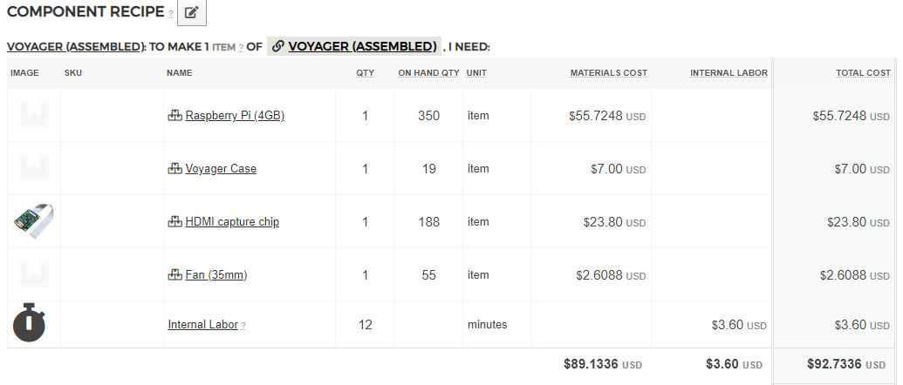
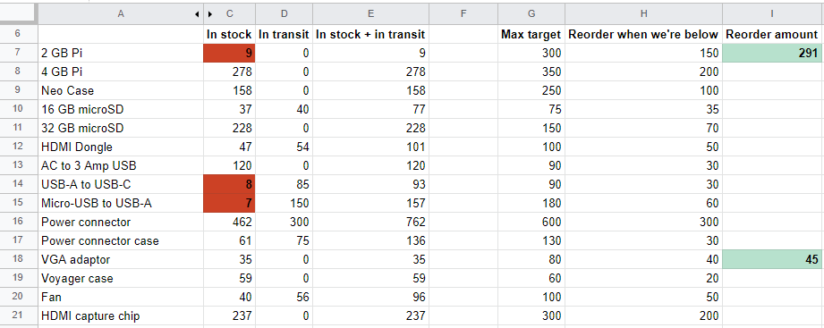
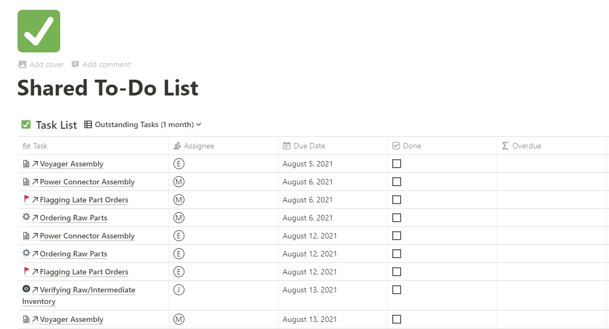
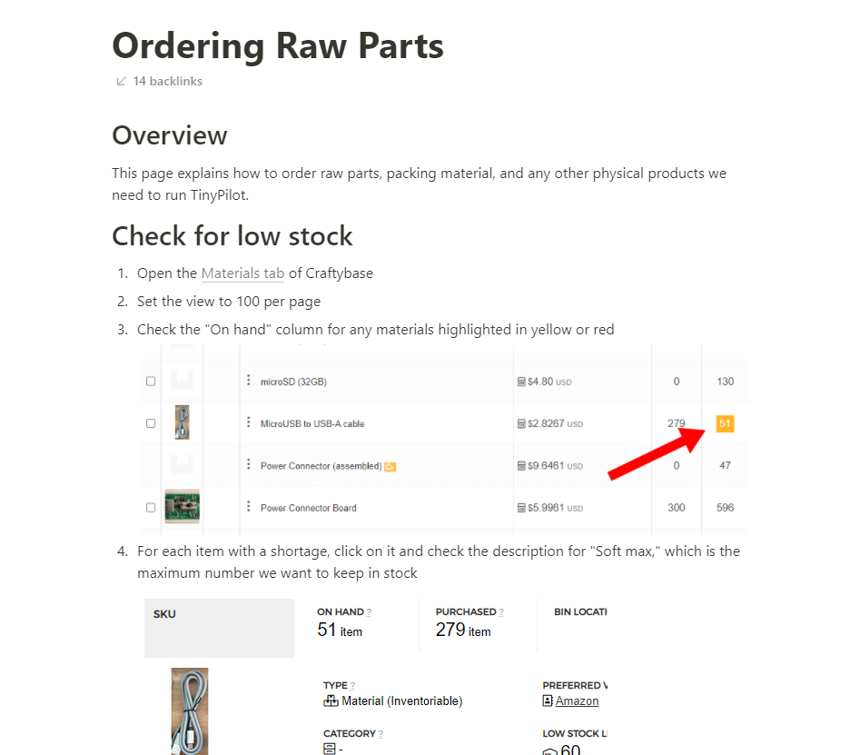
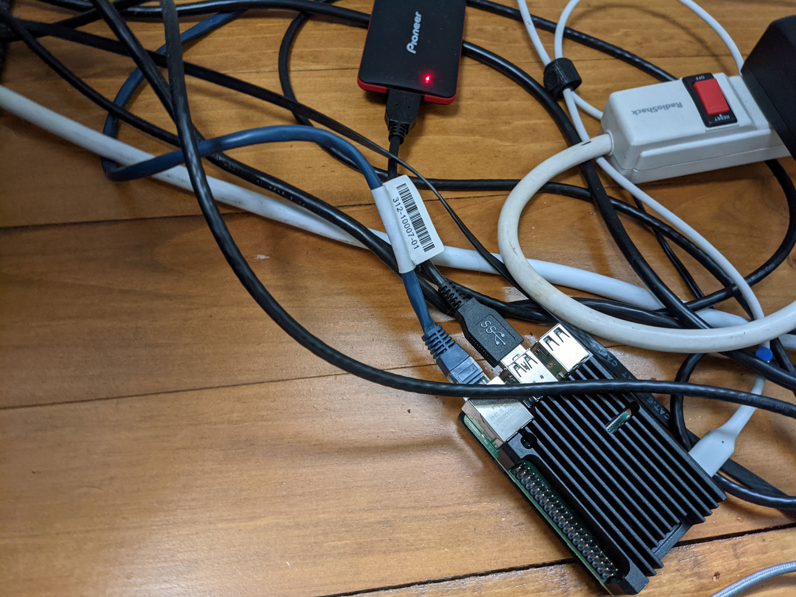
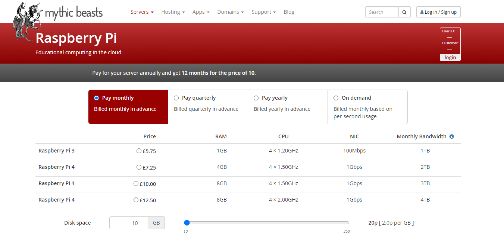

## Highlights

*

## Goal Grades

At the start of each month, I declare what I'd like to accomplish. Here's how I did against those goals:

### Get my EU partner ready to begin sales by the end of August

* **Result**: We're on track to begin sales by end of August
* **Grade**: A

This went well. By next week, my distributor should have all the parts and instructions he needs to begin assembling his own TinyPilot Voyager devices. He's on track to begin sales by the end of this month.

### Define processes that allow TinyPilot's local staff to share and alternate on all tasks

* **Result**: We now have a shared to-do list that lets staff alternate tasks
* **Grade**: A

TinyPilot has never had more than one person at a time managing inventory and fulfillment tasks. It was harder than I expected to create systems that allow two people to share responsibilities equally, but we now have a working system that allows both employees to alternate tasks and coordinate schedules.

### Find a designer for the TinyPilot sales site

* **Result**: A new developer is in the process of a redesign
* **Grade**: A

I ended up finding a talented web developer to work on TinyPilot, and he's in the process of redesigning the TinyPilot website.

### Find an electrical engineering firm that can create a PoE adaptor for TinyPilot Voyager

* **Result**: My original firm found components that allow them to create a PoE adaptor
* **Grade**: A+

After months of searching for PoE components and coming up empty due to the chip shortage, TinyPilot's electrical engineering managed to find a supply that should last us 6-12 months at a price less than 10% of what I was prepared to pay. They're currently working on a PCB design for a PoE adaptor and expect to have a prototype within the next 4-6 weeks.

## [TinyPilot](https://tinypilotkvm.com/?ref=mtlynch.io) stats



| Metric          | June 2021  | July 2021  | Change                                     |
| --------------- | ---------- | ---------- | ------------------------------------------ |
| Unique Visitors | 6,339      | 5,234      | -1,105 (-17%)     |
| Total Pageviews | 11,514     | 9,730      | -1,784 (-15%)     |
| Sales Revenue   | $29,446.46 | $23,954.64 | -$5,491.82 (-19%) |
| Enterprise Subscriptions | $48.00 | $48.00 | $0 (0%) |
| Total Revenue   | $29,494.46 | $24,002.64 | -$5,491.82 (-19%) |
| **Profit**      | **-$9,452.32**    | **-$8,854.07**\*    | **N/A**                                    |

\* *July profit is provisional until I do real bookkeeping for the month. This number is just the delta in my checking account since June 1st.*

Sales continue to slump, as I've been focusing on setting up EU distribution and scaling TinyPilot's fulfillment processes. I'm lucky that TinyPilot can continue to hit $24k in revenue two months without any marketing or advertising, but I need to

## Moving to a managed inventory service

From the beginning of TinyPilot, I've been looking for a managed service to let me track inventory. The problem is that I could never find a solution that matched my scale. The solutions I found were either too simple and meant for people who don't build from raw materials. Or they were overly complicated, designed for Enterprise-grade customers with thousands of products and multiple warehouses.

By chance, I stumbled across [Craftybase](https://craftybase.com), which finally seemed like a solution that matched TinyPilot. And it *sort of* does, but it's been a rough transition.

Some things about Craftybase are well-designed and fit perfectly in my workflow. My favorite feature is "recipes," which allow me to define which raw materials make up a product. For example, I can tell Craftybase that a TinyPilot Power Connector consists of one case and one circuit board. When I record a "build" in Craftybase of 10 Power Connectors, it knows to deduct 10 cases and 10 circuit boards from my inventory.

{{}}

Recipes can also contain other items I manufactured, which works nicely for TinyPilot's multi-stage manufacturing. For example, we build TinyPilot Voyagers in phases. We'll usually build a batch of 10+ Voyager devices, test them, and then pack each device into a box with the necessary cables, instructions, and microSD card. Craftybase allows us to track components at different stages of this process, since recipes can contain raw materials or parts we built at an earlier stage.

Unfortunately, most of our workflows in Craftybase are fairly bumpy. The most egregious example is managing incoming shipments. Craftybase allows you to set a "low stock limit" for each item so Craftybase highlights any parts that are running low.

{{}}

The problem is that it continues flagging the item even after you've ordered more, as the flag ignores pending shipments. In the example above, I recorded in Craftybase that I have an order of HDMI capture chips arriving at the end of the month, but it still flags this item as low in stock even though there's nothing left for me to do.

That means that when TinyPilot staff want to figure out which items to reorder, they have to go through every flagged item individually and check whether it's *actually* low in stock after taking into account pending orders.

At first, I thought identifying true low stock items would be easy, as I assumed Craftybase's "purchased" column represented pending shipments. It turns out that "purchased" is actually the total quantity I've purchased since the beginning of time. That's an irrelevant metric, so I can't understand why Craftybase gives it such prominent real estate.

{{}}

The workaround is that for each item flagged as low in stock, we have to dive into the details, check its total, add pending orders, then check whether that number falls below our low stock limit. Checking for low stock should be a two-second workflow, but Craftybase has turned it into a tedious and complex process requiring several minutes of work.


  {{}}
  {{}}


## Freeing up more time with delegation

For most of TinyPilot, I've been struggling with a lack of time. There are many moving parts to the business, and I'm the sole bridge across all of them.

In June, I identified [a list of tasks](/retrospectives/2021/06/#unhoard-michael-only-tasks) that I could delegate but hadn't had time. I'm pleased to say that I've successfully delegated or eliminated half of the items on that list, plus several more.

### Excuse myself from spreadsheet duty

TinyPilot's previous inventory solution was a homegrown spreadsheet that I maintained. It supported TinyPilot's workflows well, but it was inflexible. Any time we added a new product or changed parts, I had to spend several hours fiddling with my hacky spreadsheet forumulas to make things work again.

{{}}

As much as Craftybase frustrates me, it eliminates me from the critical path of our inventory process. Craftybase tracks our inventory with more granularity and flexibility than we could with the spreadsheet, though it does require a depressing layer of workarounds.

### Create a shared to-do list for local staff

One of the tasks I was still unintentionally micromanaging was task assignment. Each of TinyPilot's local employees visit the office three days per week for a few hours. For tasks that happen every day, such as order fulfillment or processing incoming deliveries, it's easy to just tell employees to tackle it during their shift.

Tasks that happen once per week or month are harder to systematize. For the first few months in the local office, the weekly and monthly tasks were a disorganized mix of "do it when it needs doing," "wait for Michael to ask for help," or "Michael will just do this."

One of TinyPilot's employees was interested in learning more about [Notion](https://notion.so), the tool we use for our knowledge base. This seemed like a good Notion project, so I asked him to create a shared to-do list to manage weekly and monthly tasks.

{{}}

We've been using the to-do list successfully for the past three weeks. The major disadvantage is that we haven't found a good way of creating recurring tasks in Notion. Our workaround is to repopulate the list by hand every few months. It's tedious, but it's only about an hour of work per quarter.

### Train local staff to reorder raw materials

For most of TinyPilot's life, my girlfriend managed inventory, including reordering raw materials when we were running low. When she went back to grad school in May, we transferred most of her responsibilities to a new employee, but reordering materials fell back onto my plate.

Reordering inventory is a deceptively difficult task to outsource. It's not just explaining how to do it, it's figuring out how to share credentials to vendor websites, giving them a new debit card number that's spending-capped to limit mistakes, etc. Assigning someone to manage inventory also requires time to build up trust. I don't want to hand a brand new employee a credit card and say, "You're now responsible for $10k/month in spending."

Finally in July, I set created [Bitwarden](https://bitwarden.com/download/) accounts for everyone on the team, which allows us to securely share credentials. I also wrote instructions on how to order from our various vendors.

{{}}

Maintaining inventory levels feels like such a small amount of work, but there are so many little tasks involved in the process of reordering supplies that I'm always immensely relieved when someone else takes it over.

### Allow developers to review each other's pull requests

Since February, two freelance developers have worked with me on TinyPilot, and a third joined last month. I've mostly stopped writing code due to lack of available time, but I was still the code reviewer on every single change.

A few months ago, we tried removing me from the review process, but it didn't take. I'm available full-time, whereas the others are only available part-time at mostly non-overlapping hours. If they had a sequence of code changes that depended on each other, [latency between reviews could kill progress](/code-review-love/#13-minimize-lag-between-rounds-of-review).

At our monthly dev meeting, we realized that only a fraction of changes come in a sequence like that. For most changes, it's not a big deal if you have to wait a day or two for a review. So, developers are now reviewing each other's code.

As someone who still sees themselves as an indie developer, it feels scary to own code that I didn't personally review. But I trust my teammates, and I think this system works better for the company overall.

### Externalize the image building process

Every time we publish a new release of TinyPilot, I create a microSD image with the latest version pre-installed. My process for building a microSD image requires a Raspberry Pi, so I used a spare Pi and SSD that sits in the corner of my office.

{{}}

Even though TinyPilot's developers are perfectly capable of managing the code, the logistics of a single server silo'ed in my home made it too difficult to share access. The result was that I remained the sole maintainer of the build code.

Sometimes, I hopelessly Google something for months and months, desperate for a solution, only to find out that I was using the wrong search terms. I always wanted Pi cloud hosting, and I'd routinely searched for "pi cloud hosting" or "pi cloud server," only to find unhelpful results about using your own Pi as a cloud server. Finally, it occurred to me to search "pi dedicated server." That led me to [Mythic Beasts](https://www.mythic-beasts.com/), a company that offers cloud-hosted Raspberry Pi servers that you can rent by the second.

{{}}

Mythic Beasts has a nice API for dynamically spinning up Pi servers, but I realized that their server costs are so inexpensive relative to developer time, it's cheaper for me to just give each of my developers a server that runs 24/7/365 than to automate any fancy server allocation logic.

With the server problem solved, I cleaned up my image building code and shared it with my team. Now any TinyPilot developer can provision their server with the latest build code and use it to generate a TinyPilot microSD image. More importantly, if we discover bugs in the process or add new steps, TinyPilot's developers can make those changes instead of it being a Michael-only task.

## Starting EU distribution

My biggest project over the past month has been getting things rolling with my new EU distributor.

The biggest tasks in the partnership is defining the contract. The costs of an international legal battle are higher than any amount we'd be disputing, so we're not expecting this to be a document we bring to court. But we still want to create a contract that makes our expectations from one another explicit and clear.

One of the major challenges we've had is how to balance commitment with flexibility. Historically, it's been hard to predict TinyPilot's future more than a few months out, so I try to stay as flexible as possible. Understandably, my distributor requires some level of long-term commitment from TinyPilot. It takes a lot of work and capital investment to begin selling TinyPilot devices, so he doesn't want me to simply pull the rug out from him if another distributor comes along offering a better deal.

The other struggle has been figuring out how to calculate royalties. We decided it made sense for the distributor to assemble their own devices. TinyPilot's most expensive materials come from overseas, so if I was sending assembled units to my distributor, parts would cross international borders multiple times, and we'd lose something like 30-40% of our revenue in tariffs.

We agreed that the best way to align our incentives was to share profits by percentage. That way, the distributor can experiment with different prices without being limited by a fixed payment to me. And if he finds that he can sell at a higher price, I benefit from that higher price alongside him.

The challenge in splitting profits is that it leads to a lot of questions about how, exactly, to calculate profits. If he gives free devices away as part of promotion, does he owe me royalties for those units? Does labor cost factor into profit per unit for royalty payments? If we invest in product improvements together, how does that affect our profit calculation?

We've been figuring out those questions and trying to anticipate potential sources of conflict. At this point, we're about 95% done with the contract, and it looks like we're on track to finalize it in weeks, if not days.

## Legacy projects

Here are some brief updates on projects that I still maintain but are not the primary focus of my development:

### [Is It Keto](https://isitketo.org)



| Metric                   | June 2021   | July 2021   | Change                                       |
| ------------------------ | ----------- | ----------- | -------------------------------------------- |
| Unique Visitors          | 49,839      | 39,568      | -10,271 (-21%)      |
| Total Pageviews          | 122,700     | 96,494      | -26,206 (-21%)      |
| Domain Rating (Ahrefs)   | 13.0        | 13.0        | 0                                            |
| AdSense Revenue          | $536.85     | $438.07     | -$98.78 (-18%)      |
| Amazon Affiliate Revenue | $134.59     | $59.65      | -$74.94 (-56%)      |
| **Total Revenue**        | **$671.44** | **$497.72** | **-$173.72 (-26%)** |

Last month, I was celebrating how well the Is It Keto's audience has held up so long after the annual January surge. I guess I jinxed it because this month had the year's biggest month-over-month drop in visitors, falling by over 20%.

Sadly, the slump coincides with me applying to partner with a higher-tier display ad partner. I've heard recommendations to switch from Google AdSense to MediaVine, as the latter pays publishers considerably more. MediaVine has a minimum requirement of 100k pageviews per month, which I had when I applied, but now I'm just below. We'll see what happens, I guess.

### [Hit the Front Page of Hacker News](https://hitthefrontpage.com/)



| Metric                    | June 2021   | July 2021   | Change                                         |
| ------------------------- | ----------- | ----------- | ---------------------------------------------- |
| Unique Visitors           | 248         | 109         | -139 (-56%)           |
| Gumroad Revenue           | $123.52     | $218.09     | +$94.57 (+77%)      |
| Blogging for Devs Revenue | $0.00       | $27.30      | +$27.30 (+inf%)     |
| **Total Revenue**         | **$123.52** | **$245.39** | **+$121.87 (+99%)** |

There hasn't been anything new with the course. A few people per month purchase it and seem to like it, but I haven't been promoting it. Martin Schleiss gave it a favorable mention in his [recent blog post](https://schleiss.io/retrospectives/mid-june-2021). I'm planning to pitch myself as a guest on some tech podcasts this month, so that might lead new people to the course.

### [Zestful](https://zestfuldata.com)



| Metric            | June 2021  | July 2021   | Change                                           |
| ----------------- | ---------- | ----------- | ------------------------------------------------ |
| Unique Visitors   | 594        | 547         | -47 (-8%)               |
| Total Pageviews   | 1,470      | 1,300       | -170 (-12%)             |
| **Total Revenue** | **$40.20** | **$620.67** | **+$580.47 (+1444%)** |

There was a big jump in Zestful usage this month, but I'm pretty sure it's fraudulent. There were several users that signed up within days of each other with usersnames like `joe-84ad853`. The bulk of this month's earnings came from one of those accounts. No Zestful customer has ever spent more than $100 on API requests without reaching out to me to ask for a volume discount, and this user never reached out, so I'm highly suspicious. RapidAPI claims I'll receive the money on August 30th, but I'll be shocked if that actually happens.

## Wrap up

### What got done?

* Published a [new TinyPilot release](https://tinypilotkvm.com/blog/whats-new-in-2021-07)
* Found a developer to manage the TinyPilot website
* Resumed progress on the TinyPilot PoE HAT and rack mount
* Migrated to a managed inventory service

### Lessons learned

* An imperfect workflow is better than one that depends on the CEO.
  * As much as Craftybase user interface and limitations frustrate me, it's better than me being stuck maintaining formulas in a complicated spreadsheet.

### Goals for next month

* Help my EU distributor achive his first sale.
* Finalize the first version of TinyPilot's custom Pi HAT.
* Publish a sample chapter of [*Refactoring English*](https://refactoringenglish.com).
