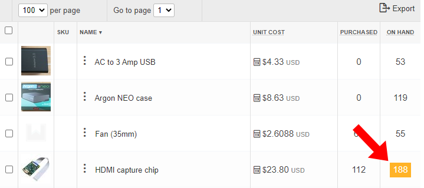
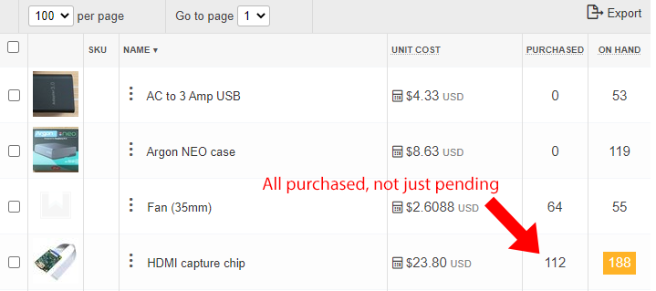
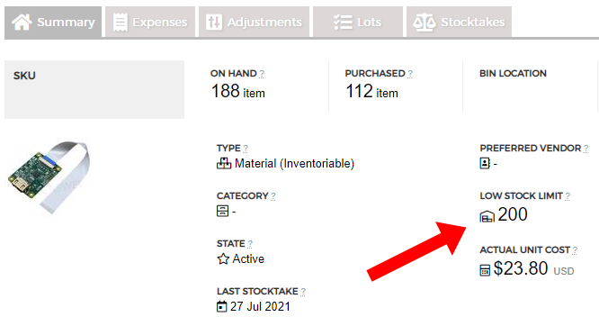
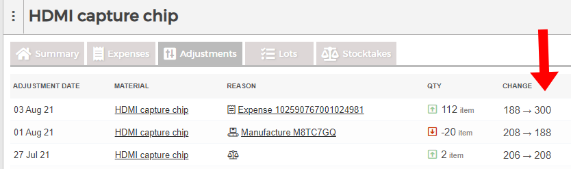

## Highlights

*

## Goal Grades

At the start of each month, I declare what I'd like to accomplish. Here's how I did against those goals:

### Get my EU partner ready to begin sales by the end of August

* **Result**: We're on track to begin sales by end of August
* **Grade**: A

This went well. By next week, my distributor should have all the parts and instructions he needs to begin assembling his own TinyPilot Voyager devices. He's on track to begin sales by the end of this month, which will be exciting for both of us.

### Define processes that allow TinyPilot's local staff to share and alternate on all tasks

* **Result**: We now have a shared to-do list that lets staff alternate tasks
* **Grade**: A

TODO

### Find a designer for the TinyPilot sales site

* **Result**: We're in the process of a redesign
* **Grade**: A

TODO

### Find an electrical engineering firm that can create a PoE adaptor for TinyPilot Voyager

* **Result**: My original firm found components that allow them to create a PoE adaptor
* **Grade**: A+

After months of searching for PoE components and coming up empty due to the chip shortage, TinyPilot's electrical engineering partner got a stock alert about a few hundred components becoming available for a great price. Then, over the course of the month, they found even more of these components from another supplier. Now we have enough components to last us 6-12 months at a price that's less than 10% of what I was prepared to pay. They're currently working on a PCB design for a PoE adaptor and expect to have a prototype within the next 4-6 weeks.

## [TinyPilot](https://tinypilotkvm.com/?ref=mtlynch.io) stats



| Metric          | June 2021  | July 2021  | Change                                     |
| --------------- | ---------- | ---------- | ------------------------------------------ |
| Unique Visitors | 6,339      | 5,234      | -1,105 (-17%)     |
| Total Pageviews | 11,514     | 9,730      | -1,784 (-15%)     |
| Sales Revenue   | $29,446.46 | $23,954.64 | -$5,491.82 (-19%) |
| Enterprise Subscriptions | $48.00 | $48.00 | $0 (0%) |
| Total Revenue   | $29,494.46 | $24,002.64 | -$5,491.82 (-19%) |
| **Profit**      | **-$9,452.32**    | **-$8,854.07**\*    | **N/A**                                    |

\* *July profit is provisional until I do real bookkeeping for the month. This number is just the delta in my checking account since June 1st.*

## Moving to a managed inventory service

From the beginning of TinyPilot, I've been looking for a managed service to let me track inventory. The problem is that I could never find a solution that matched my scale. The solutions I found were either too simple and meant for people who don't build from raw materials. Or they were overly complicated, designed for Enterprise-grade customers with thousands of products and multiple warehouses.

By chance, I stumbled across [Craftybase](https://craftybase.com), which finally seemed like a solution that matched TinyPilot. And it *sort of* does, but it's been a rough transition.

Some things about Craftybase are well-designed and fit perfectly in my workflow. My favorite feature is "recipes." I

The worst feature about Craftybase is how it handles incoming shipments. It allows you to set a "low stock limit" for each item so that when your inventory falls below that threshold, Craftybase highlights it for you.

{{}}

The problem is that it continues flagging the item even after you've ordered more, as the flag ignores pending shipments. In the example above, I recorded in Craftybase that I have an order of HDMI capture chips arriving at the end of the month, but it still flags this item as low in stock.

That means that when TinyPilot staff want to figure out which items to reorder, they have to go through every flagged item individually and check whether it's *actually* low in stock after taking into account pending orders.

At first, I thought identifying true low stock items would be easy because Craftybase shows a "purchased" quantity, which I assumed was pending shipments. It turns out that "purchased" is actually the quantity I've purchased since the beginning of time. That's an irrelevant metric, so I can't understand why Craftybase gives it such prominent real estate.

{{}}

The workaround is that for each item flagged as low in stock, we have to dive into the details, check its total including pending orders, then check whether that number falls below our low stock limit. That means that checking for low stock should be a two-second workflow, but Craftybase makes it a complex process that requires several minutes.


  {{}}
  {{}}


## Freeing up more time with delegation

For most of TinyPilot, I've been struggling with a lack of time. There's so many moving parts, and I'm the only one who manages them. Last month, I made good progress toward freeing up more of my time.

### Get myself out of spreadsheet duty

TinyPilot's previous inventory solution was a homegrown spreadsheet that I maintained. It made TinyPilot's workflows easy, but it was inflexible. Any time we added a new product or changed parts, I had to spend several hours fiddling with my hacky spreadsheet forumulas to make things work again.

As much as Craftybase frustrates me, it successfully removes me from the critical path for changes to our inventory process. It allows us to track our inventory with more granularity and flexibility than the spreadsheet offered, even though it does require a lot of hacky workarounds for our workflows.

### Create a shared to-do list for local staff

One of the tasks I was still unintentionally micromanaging was task assignment. Each of TinyPilot's local employees visit the office three days per week for a few hours. For tasks that happen every day, such as order fulfillment or processing incoming deliveries, it's easy to just tell people to do it every day.

For tasks that happen once per week or once per month, it was harder to systematize. For the first few months in the local office, the weekly and monthly tasks were a disorganized mix of "do it when it needs doing," "wait for Michael to ask for help," or "Michael will just do this."

One of TinyPilot's employees was interested in learning more about Notion, the tool we use for our knowledge base. This seemed like a good Notion project, so I asked him to create a shared to-do list in Notion.

It works pretty well. It keeps track. The major disadvantage is that we haven't found a good way of creating recurring tasks, so our workaround is to just manually populate the next four months of tasks in the list every quarter.

### Train local staff to reorder raw materials

For most of TinyPilot, my girlfriend managed inventory, including reordering raw materials when we needed more. When she went back to grad school in May, we transferred most of her responsibilities to a new employee, but reordering materials fell back onto my plate. It required too much work to set up because it's not just explaining how to do it, it's getting the employees set up with Bitwarden so they can access shared credentials, giving them a new debit card number that's spending-capped to limit mistakes, etc.

Delegating the reordering process also takes time to build up trust. I don't want to hand a brand new employee a credit card and say, "You're now responsible for $10k/month in spending."

Finally in July, I got everyone on the team set up with Bitwarden and wrote instructions on how to order from our various vendors. It's one of those tasks that feels like such a minor amount of work, but there are so many little tasks involved in the process of reordering supplies that I'm always immensely relieved when someone else takes it over.

### Allow developers to review each other's pull requests

Since February, two freelance developers have worked with me on TinyPilot, and a third joined last month. I've mostly stopped writing code, as TinyPilot's developers can handle it. But until July, I was still the code reviewer on every single change.

We had tried removing me from the review process a few months ago, but it didn't take. The issue was that I'm the only TinyPilot developer available full-time. The other developers work part-time on mostly non-overlapping hours. It meant that if they had a sequence of code changes that depended on each other, their would be long lags between reviews as they wait for their teammate to resume part-time TinyPilot work another day that week.

At our monthly dev meeting, we realized that only a fraction of changes come in a sequence like that. For most changes, it's not a big deal if you have to wait a day or two for a review. So, we're back to developers reviewing each other's code, and it's working pretty well so far.

### Externalize the image building process

Every time we publish a new release of TinyPilot, I create a microSD image with the latest version pre-installed. My process for building a microSD image requires a Raspberry Pi. I'd never seen a cloud hosting provider that offered Raspberry Pi hosting, so I've always done these builds on a

My build process worked okay, but because I was the only one with a build server, managing the build process became my sole responsibility. Even though TinyPilot's developers are perfectly capable of managing the build code, they couldn't simply due to the logistics of a single Pi server being silo'ed in my office.

Sometimes, I hopelessly Google something for months and months, desperate for a solution, only to find out that I was Googling the wrong thing. I always wanted Pi cloud hosting, so I searched "pi cloud hosting" or "pi cloud server," which turned up results about making your own server. Finally, it occurred to me to search "pi dedicated server." That led me to [Mythic Beasts](), a company that offers Raspberry Pi servers that you can rent by the minute.

Mythic Beasts has a nice API for dynamically spinning up Pi servers, but I realized that their server costs are so inexpensive, it's cheaper for me to just give each of my developers a server that runs 24/7/365 than to spend developer time scripting server turnup and turndown.

With the Pi server solved, I cleaned up my image building code and shared it with my team. Now anyone on the team can provision their server with the latest build code and use it to build a TinyPilot microSD image. More importantly, if we discover bugs in the process or add new steps, TinyPilot's developers can make those changes instead of it being a Michael-only task.

## Starting EU distribution

My biggest project over the past month has been getting things rolling with my new EU distributor.

One of the biggest challenges in the partnership is defining the contract. It's unlikely that we'd ever take each other to court because at our scale, the costs of an international court battle are higher than any amount we'd be disputing. But we still want to create a contract that makes our expectations from one another explicit and clear.

One of the major challenges we've had is how to balance commitment with flexibility. Historically, it's been hard to predict TinyPilot's future more than a few months out, so I'm reluctant to marry myself to one particular distributor forever. But understandably, my distributor requires some level of long-term commitment from TinyPilot. It takes a lot of work and capital investment to begin selling TinyPilot devices, so he doesn't want me to simply pull the rug out from his entire operation because another distributor comes along offering a better deal.

The other struggle has been figuring out how to calculate royalties. We decided it made sense for the distributor to assemble their own devices. TinyPilot's most expensive materials come from overseas, so if I was sending assembled units to my distributor, we'd have two border crossings and lose something like 30-40% of our revenue in tariffs.

We agreed that the best way to align our incentives was to share profits by percentage. That way, he can experiment with different prices without being limited by a fixed payment to me. And if he finds that he can sell at a higher price, I benefit from that higher price alongside him.

The challenge in splitting profits is that it leads to a lot of questions about how to calculate profits. If he gives free devices away as part of promotion, does he owe me royalties for those units? Does labor cost factor into profit per unit for royalty payments? If we invest in product improvements together, how does that affect our profit calculation?

We've been figuring out those questions and trying to anticipate potential sources of conflict. At this point, we're about 95% done with the contract, and it looks like we're on track to finalize it in weeks, if not days.

## Legacy projects

Here are some brief updates on projects that I still maintain but are not the primary focus of my development:

### [Is It Keto](https://isitketo.org)



| Metric                   | June 2021   | July 2021   | Change                                       |
| ------------------------ | ----------- | ----------- | -------------------------------------------- |
| Unique Visitors          | 49,839      | 39,568      | -10,271 (-21%)      |
| Total Pageviews          | 122,700     | 96,494      | -26,206 (-21%)      |
| Domain Rating (Ahrefs)   | 13.0        | 13.0        | 0                                            |
| AdSense Revenue          | $536.85     | $438.07     | -$98.78 (-18%)      |
| Amazon Affiliate Revenue | $134.59     | $59.65      | -$74.94 (-56%)      |
| **Total Revenue**        | **$671.44** | **$497.72** | **-$173.72 (-26%)** |

Last month, I was celebrating how well the site's visit rate has held up so long after the annual January surge. I guess I jinxed it because this month had the year's biggest month-over-month drop in visitors, falling by over 20%.

Sadly, the slump coincides with me applying to partner with a higher tier display ad partner. I've heard recommendations to switch from Google AdSense to MediaVine, as the latter pays much more. MediaVine has a minimum requirement of 100k pageviews per month, which Is It Keto had when I applied, but just barely. We'll see what happens in light of the reduced audience size.

### [Hit the Front Page of Hacker News](https://hitthefrontpage.com/)



| Metric                    | June 2021   | July 2021   | Change                                         |
| ------------------------- | ----------- | ----------- | ---------------------------------------------- |
| Unique Visitors           | 248         | 109         | -139 (-56%)           |
| Gumroad Revenue           | $123.52     | $218.09     | +$94.57 (+77%)      |
| Blogging for Devs Revenue | $0.00       | $27.30      | +$27.30 (+inf%)     |
| **Total Revenue**         | **$123.52** | **$245.39** | **+$121.87 (+99%)** |

There hasn't been anything new with the course. A few people per month purchase it and seem to like it, but I haven't been promoting it. Martin Schleiss gave it a favorable mention in his [recent blog post](https://schleiss.io/retrospectives/mid-june-2021). I'm planning to pitch myself as a guest on some tech podcasts this month, so that might lead new people to the course.

### [Zestful](https://zestfuldata.com)



| Metric            | June 2021  | July 2021   | Change                                           |
| ----------------- | ---------- | ----------- | ------------------------------------------------ |
| Unique Visitors   | 594        | 547         | -47 (-8%)               |
| Total Pageviews   | 1,470      | 1,300       | -170 (-12%)             |
| **Total Revenue** | **$40.20** | **$620.67** | **+$580.47 (+1444%)** |

There was a big jump in Zestful usage this month, but I'm pretty sure it's fraudulent. There were several users that signed up within days of each other with usersnames like `joe-84ad853`. The bulk of this month's earnings came from one of those accounts. Also, no Zestful customer has ever spent more than $100 on API requests without reaching out to me to ask for a volume discount, and this customer never reached out. RapidAPI claims I'll receive the money on August 30th, but I'll be shocked if that actually happens.

## Wrap up

### What got done?

* Published a [new TinyPilot release](https://tinypilotkvm.com/blog/whats-new-in-2021-07)
* Found a developer to manage the TinyPilot website
* Resumed progress on the TinyPilot PoE HAT and rack mount
* Migrated to a managed inventory service

### Lessons learned

*

### Goals for next month

* Help my EU distributor achive his first sale.
* Finalize the first version of TinyPilot's custom Pi HAT.
* Publish a sample chapter of [*Refactoring English*](https://refactoringenglish.com).
