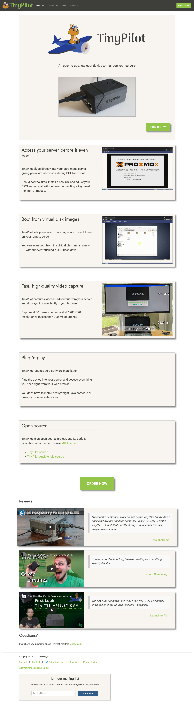

## Highlights

* A redesign of TinyPilot's website seems to have increased sales.
* After three years, Zestful is finally profitable (and I might sell it).
* I'm still ruthlessly delegating every task I can.

## Goal Grades

At the start of each month, I declare what I'd like to accomplish. Here's how I did against those goals:

### Help TinyPilot's EU distributor achieve his first sale

* **Result**: The distributor made his first sale on September 6th
* **Grade**: B

I was hoping we'd earn the first sale within the month of August, but we got a sale within the first 10 days. I'm happy we launched successfully.

### Finalize the design of the Voyager 2

* **Result**: The design is taking longer than expected, so it will take another month
* **Grade**: B-

I thought the chip shortage was the last big challenge to overcome, but the electrical engineers are running into more complexity than they expected in the design. One change that's worked well is that we've now broken down the project into individual steps with time estimates for each so that we have a shared view of the overall schedule and how delays affect our timeline.

### Publish a sample chapter of [*Refactoring English*](https://refactoringenglish.com)

* **Result**: Almost finished a sample chapter, but I'm still editing
* **Grade**: B

The thing about writing a book about effective writing is that people expect you to be a good writer. That puts some pressure on me. I'm about 70% done with a sample chapter to publish, but I still need to edit it more before it's ready.

## [TinyPilot](https://tinypilotkvm.com/?ref=mtlynch.io) stats



| Metric          | July 2021      | August 2021    | Change                                            |
| --------------- | -------------- | -------------- | ------------------------------------------------- |
| Unique Visitors | 5,234          | 4,194          | -1,040 (-20%)            |
| Total Pageviews | 9,730          | 8,864          | -866 (-9%)               |
| Sales Revenue   | $23,954.64     | $30,191.04     | +$6,236.40 (+26%)      |
| Enterprise Subscriptions | $48.00 | $48.00 | $0 (0%) |
| Total Revenue   | $24,002.64     | $30,239.04     | +$6,236.40 (+26%)      |
| **Profit**      | **$-9,713.34** | **$-8,049.21**\* | **+$1,664.13** |

\* *Provisional until I perform bookkeeping for August. This number is just the change in my checking account minus my credit card balance.*

Ouch! That's three consecutive months of ~$8-10k losses. Worryingly, I increased revenue by $6k from last month but reduced my net losses by less than $2k.

Part of the problem is the [chip shortage](https://en.wikipedia.org/wiki/2020%E2%80%932021_global_chip_shortage). 2 GB Raspberry Pi boards are sold out everywhere, so I've had to upgrade to the 4 GB model at almost double the cost, even though TinyPilot gains no benefit from the additional RAM. In addition, I have to buy the boards on a fixed schedule, irrespective of how many TinyPilots I sell, so I'm accumulating more than I want.

Outside of raw materials, my biggest cost is software development. I paid freelance developers around $13k in July and $11k in August. I have a great development team, and they're worth what they charge, but the last few months of losses are making me realize I need to choose development tasks intelligently.

For the next few months, my focus on TinyPilot's software development will be for things that directly affect the bottom line:

* Offering a SaaS complement to TinyPilot
* Improving the website so that a higher proportion of customers purchase the product
* Reaching out to larger customers to find out what features they need to deploy TinyPilot at scale

## TinyPilot website improvements

When I first launched TinyPilot's website, I meant for the design to be a placeholder until I improved it. I made small improvements over time, but the design had barely changed since I launched TinyPilot.

One of the hurdles was finding a skilled developer. After going through six hires who didn't work out, I found a developer in July, and I worked with him throughout August on implementing those changes. I think the site looks more professional as a result:


  {{}}
  {{}}


One promising indicator is my revenue per unique visitor. The site tends to earn $4-5 per unique visitor, but in August, the number spiked to $7.20, a 60% increase over the previous month.

  <canvas id="revenue-per-visitor"></canvas>

I didn't do a rigorous A/B test to prove that the new site made a difference. It's certainly possible that the increase was a fluke. I'll feel more confident if the trend continues through September.

I'll go through the changes piece by piece.

First, we adjusted the navbar so that it now lines up with the content on the page:

{{}}

The feature brags are now more compact. You can't see it in the screenshot, but we removed the animations, which were a bit distracting.

{{}}

I changed the reviews from a stack of boxes to a carousel that rotates every few seconds with a new review:

{{}}

And lastly, we redesigned the footer. It was a jumbled mess before, but now it looks deliberate and organized:

{{}}

This is just a first pass. I'm going to hire a professional designer to [iterate on this](https://docs.google.com/document/d/1dypa3pwaTbzdOJzGrcYiiERuYSJ9GMrqxh80D-t_NKk/edit?usp=sharing). If you have recommendations, [let me know](/about).

## Adding a European distributor

One of my biggest projects for the last few months has been arranging a distribution partnership with a German company, [punkt.de](https://punkt.de). They launched [their website](https://www.kvm-ip.de) at the end of August, and they're now accepting orders.

{{}}

Sales have been slower than I expected. Historically, I've sold 10-15 Voyagers per month to European customers, so I thought it would be easy for punkt.de to exceed that. They can offer faster delivery and more transparent pricing.

I announced the European sales site to TinyPilot's 400+ mailing list subscribers, but none of them purchased. Finally, this week, he sold his first unit, but we're not sure why the volume is so low.

Still, I'm hopeful that this partnership will be a big step forward for TinyPilot. I have someone else who's not quite a co-founder but has a similar vested interest in the company's success and will promoting TinyPilot in additional markets.

## Carving out more time for myself

For the past few months, I've been struggling to find time to grow TinyPilot. With so many moving pieces, I sometimes get stuck in a position where I spend all my time filling the gaps between roles for which I've hired contractors and part-time employees.

Now, when I have available time, I invest a portion of it into delegating or automating the tasks that absorb significant amounts of my time.

### Automated license checks

One of the silliest things I was still doing was verifying user licenses.

If a user wants to reinstall TinyPilot from scratch, they need a disk image. I don't offer the image publicly because otherwise users would have no incentive to purchase it. Under the old system, users emailed me their order number, I looked it up to verify they were a real user, and then I sent them a download link.

It's a classic "do things that don't scale" task. I never prioritized it because it only happened 5-10 times per month. Still, it was a needless disruption, and I disliked making customers wait around for access to software they already purchased.

In August, one of TinyPilot's developers added a serverless function that checks purchase records from our Shopify store, and we implemented a simple web UI for it. This means that customers can download the latest disk image instantly without me being in the critical path.

{{}}

### QA testing

A month or two after I began selling TinyPilot, I published a bad update that broke keyboard input under certain conditions. Ever since then, I have a checklist of features that I test manually before each release.

My checklist started out as a handful of items I could check in five minutes. As we've added more features, the checklist has grown longer to the point where testing a release takes me almost half a day.

I'd love to automate QA testing, but some of the workflows are unfriendly to automation. So, I designed a system and documented steps for my local staff to run manual QA tests on spare hardware and share a recording with me.

In addition to eliminating a time-consuming task from my workload, delegating QA gives the developers an opportunity to fix bugs earlier. I noticed a pattern where I'd discover bugs during final QA testing which were annoying but not significant enough to delay the release. Now that the QA process isn't blocked on me, we can run QA cycles mid-release and fix those minor issues.

## Can I afford to keep writing?

With the added time, I'm doing more important but non-urgent things I want to do. I'm spending more time proactively reaching out to customers rather than talking only to customers with support issues. I'm exercising more regularly again instead of cutting it out of my day because I feel too busy.

I'm back to writing for an hour each morning. I've done that for most of the past three years, but I stopped around March because I was too short on time to manage TinyPilot.

I enjoy the habit of daily writing, but looking at my TinyPilot sales for the past two months, I don't think I can afford it. There are ways that I can potentially increase TinyPilot's sales that I can't pursue due to lack of time. So, I'm planning to publish a sample chapter of [my book](https://refactoringenglish.com) and then scale back on writing until TinyPilot is consistently profitable.

## Legacy projects

Here are some brief updates on projects that I still maintain but are not the primary focus of my development:

### [Is It Keto](https://isitketo.org)



| Metric                   | July 2021   | August 2021 | Change                                      |
| ------------------------ | ----------- | ----------- | ------------------------------------------- |
| Unique Visitors          | 39,568      | 30,439      | -9,129 (-23%)      |
| Total Pageviews          | 96,494      | 72,340      | -24,154 (-25%)     |
| Domain Rating (Ahrefs)   | 13.0        | 12.0        | -1.0 (-8%)         |
| AdSense Revenue          | $438.07     | $358.43     | -$79.64 (-18%)     |
| Amazon Affiliate Revenue | $59.65      | $43.73      | -$15.92 (-27%)     |
| **Total Revenue**        | **$497.72** | **$402.16** | **-$95.56 (-19%)** |

Last month, I mentioned that I was applying for Is It Keto to join a premium ad network. The network approved me, but I backed out of the deal. The contract terms felt especially onerous, even relative to typically onerous terms for these kinds of deals.

My reading was that the ad partner could request unlimited site changes from me, and the contract required me to carry them out. It also required me to serve their ads exclusively for at least three months. If I even *spoke* to another advertiser, I'd be in breach.

So, I'm sticking with boring but reliable AdSense. My numbers are down, and it's at least partially seasonal changes. I might also be losing traffic to a competitor that popped up in the last six months. I'm still focusing on TinyPilot instead of worrying about it.

### [Hit the Front Page of Hacker News](https://hitthefrontpage.com/)



| Metric                    | July 2021   | August 2021 | Change                                          |
| ------------------------- | ----------- | ----------- | ----------------------------------------------- |
| Unique Visitors           | 109         | 393         | +284 (+261%)         |
| Gumroad Revenue           | $218.09     | $728.90     | +$510.81 (+234%)     |
| Blogging for Devs Revenue | $27.30      | $0.00       | -$27.30 (-100%)        |
| **Total Revenue**         | **$245.39** | **$728.90** | **+$483.51 (+197%)** |

In August, I tried a [pay-what-you-want promotion](https://twitter.com/deliberatecoder/status/1426551146055876611) for *Hit the Front Page of Hacker News*. For a week, customers could pay any price for the course, starting at $3. It roughly doubled the total number of course customers and brought in over $700 in revenue.

I was hoping the promotion might jump-start sales even after I went back to regular pricing. If customers who bought at a discount recommended the course, it could create a self-sustaining cycle, but this hasn't happened yet. There haven't been any sales of the course whatsoever since the promotion ended, so it's probably not going to create a viral purchasing frenzy.

### [Zestful](https://zestfuldata.com)



| Metric            | July 2021   | August 2021 | Change                                       |
| ----------------- | ----------- | ----------- | -------------------------------------------- |
| Unique Visitors   | 547         | 585         | +38 (+7%)         |
| Total Pageviews   | 1,300       | 1,467       | +167 (+13%)       |
| **Total Revenue** | **$620.67** | **$390.80** | **-$229.87 (-37%)** |

Last month, I saw an unexpected spike in Zestful revenue, and I [dismissed it as likely fraud](/retrospectives/2021/08/#zestfulhttpszestfuldatacom). To my surprise, it was a legitimate customer and they paid their balance in full.

This month, another customer had a big spike in usage, and this one seems legitimate as well. Both charges seem to be one-off bulk processing, but it's good to see more usage.

These past two months bring me to an exciting Zestful milestone: it's overall profitable! I [spent $7.4k](/solo-developer-year-1/#zestfulhttpszestfuldatacom) hiring a freelancer to help me launch the first version, and I had a few other smaller costs leading to a total cost of $8k. Including August, my lifetime revenue from Zestful is now $8,246, so the project has officially turned a profit. Of course, this was possible because I paid myself $0. On an hourly basis, Zestful probably paid me about a dime per hour, but I learned some valuable lessons (mainly what not to do).

Lastly, a company reached out in August about potentially acquiring Zestful. I was up front with them that its earnings are small, but if they want to acquire my solution instead of rolling their own, I'm open to it. We had a preliminary call and they requested some historical data from me and said they're considering an offer. I'm not getting my hopes up, but it will be a nice bonus if it happens.

## Wrap up

### What got done?

* Helped European distributor launch his sales site
* Revamped TinyPilot's homepage
* Delegated QA testing to my local staff
* Booked appearances on two podcasts
* Automated license checks for TinyPilot
* Migrated TinyPilot's mailing list from Mailchimp to EmailOctopus

### Lessons learned

* Even though I've freed up enough time to write every day, it's too early to borrow time from TinyPilot.
* I need to choose development tasks that have a high chance of impacting TinyPilot's earnings.

### Goals for next month

* Publish a sample chapter of [*Refactoring English*](https://refactoringenglish.com)
* Start development on a monthly service-based software complement to TinyPilot
* Finalize the design of the Voyager 2
