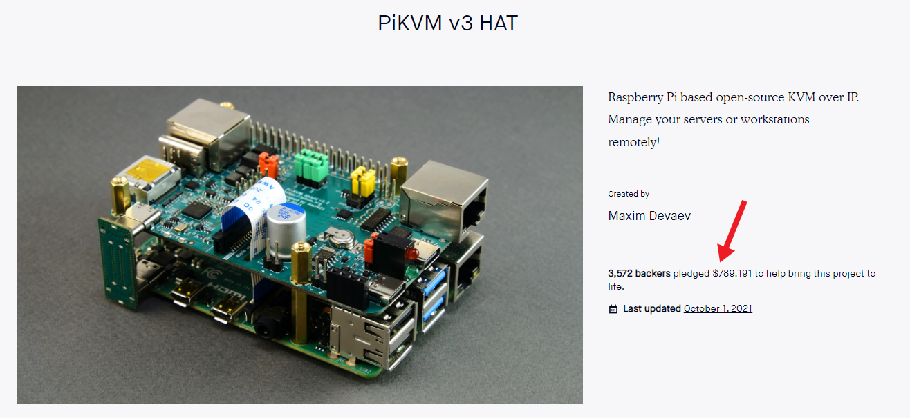
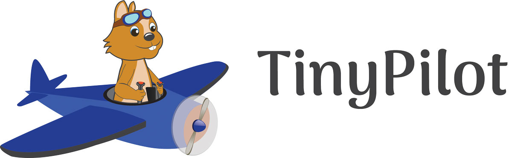

## Highlights

* TinyPilot had its highest-revenue month ever.
* One of TinyPilot's competitors raised $800k almost overnight.
* I'm working with a design firm to improve TinyPilot's brand and website.

## Goal Grades

At the start of each month, I declare what I'd like to accomplish. Here's how I did against those goals:

### Publish a sample chapter of [*Refactoring English*](https://refactoringenglish.com)

* **Result**: Made progress but didn't publish a chapter
* **Grade**: D

TinyPilot got busy enough again that I didn't have much time to write this month. Sadly, I'm going to put the book on hold indefinitely, since TinyPilot still needs my full attention.

### Start development on a monthly service-based software complement to TinyPilot

* **Result**: We're still at the design stage, but for good reasons
* **Grade**: B-

I was hoping to start development by the end of the month, but there are more design questions than I anticipated. Still, I don't feel bad about the delay because investing more in up-front design will save us time on the implementation. This project involves important architectural decisions that will be difficult to change later, so it's worth investing time into getting them right initially.

### Finalize the design of the Voyager 2

* **Result**: We finished all testing on the Voyager 2
* **Grade**: A

We're running a little late on this, but we're still on track to ship the first Voyager 2 by the end of November. The electrical engineers have built several prototypes, and they've passed all tests. We're now in the process of ordering the first production batch from a PCB manufacturer.

## [TinyPilot](https://tinypilotkvm.com/?ref=mtlynch.io) stats



| Metric                   | August 2021     | September 2021 | Change                                              |
| ------------------------ | --------------- | -------------- | --------------------------------------------------- |
| Unique Visitors          | 4,194           | 9,960          | +5,766 (+137%)           |
| Total Pageviews          | 8,864           | 15,744         | +6,880 (+78%)            |
| Sales Revenue            | $30,191.04      | $42,234.17     | +$12,043.13 (+40%)       |
| Enterprise Subscriptions | $48.00          | $48.00         | 0                                                   |
| Royalties                | N/A             | $3,000.00\*      | N/A                                                 |
| Total Revenue            | $30,239.04      | $45,282.17     | +$15,043.13 (+50%)       |
| **Profit**               | **$-10,140.95** | **$7,168.50**\**  | **+$17,309.45 (+inf%)** |

\* Royalties are an estimate until my distributor and I calculate the totals. 
\*\* Profit is provisional until I complete my monthly bookkeeping. Currently, it's just the delta in cash balances for the month minus my credit card balance.

After an unremarkable first half of the month, I got a surprise [review from Jeff Geerling](https://www.youtube.com/watch?v=TIrkEr2AeDY), a beloved blogger and YouTube creator in the Raspberry Pi world.



Jeff's video compared TinyPilot to a competing device, PiKVM, and I feel like both products came across well. The video already has over 250k views, so it led tons of new customers to TinyPilot.

TinyPilot had $42k in sales from the main website, but it was also a success for [TinyPilot's European distributor](https://www.kvm-ip.de/), who [launched at the end of August](/retrospectives/2021/09/#adding-a-european-distributor). They had an excellent first full month in business, and their sales earned me an additional ~$3k in royalties.

## PiKVM's scary fundraising

Speaking of PiKVM, they just raised an enormous amount of money on Kickstarter.

PiKVM is similar to TinyPilot in that they're both KVM over IP products built on the Raspberry Pi. PiKVM's founder Maxim actually reached out to me when I was developing TinyPilot and [helped me get my project off the ground](/tinypilot/#borrowing-from-a-similar-project).

TinyPilot and PiKVM have co-existed for the past year while serving somewhat different markets. My primary goal with TinyPilot has always been to make the device easy to use, whereas PiKVM has catered to the DIY crowd who don't mind tinkering a bit to get things working the way they want.

PiKVM gives all of their software away for free and doesn't offer a paid version. Until recently, PiKVM relied purely on donations, with about $800 in monthly contributions from their Patreon supporters and one-off donations from other sources. In September, PiKVM launched a Kickstarter for their first-ever paid product. It's a hardware accessory for the Raspberry Pi that complements PiKVM's software.

When I heard about PiKVM's Kickstarter, I estimated that it would earn $15-20k, enough to manufacture a few hundred units. It ended up **far** exceeding my expectations. The final total was $789k from 3,572 backers. That's twice as much as TinyPilot's total sales revenue since launch.

{{}}

I'm happy for Maxim, and he certainly deserves the success for all the work he's put into PiKVM. That said, it's a bit scary to see a competitor suddenly raise close to a million dollars. Scarier still, he's expressed interest in a plug 'n play version of PiKVM to compete directly with TinyPilot.

On the positive side, the Kickstarter shows how enormous the market is for products like TinyPilot. PiKVM and TinyPilot still probably capture less than 1% of the total market.

Even though PiKVM has a five-year lead in developing their software, TinyPilot still has a significant head start in several areas:

**TinyPilot has a dev team**. Even with unlimited money, it's still difficult to find and hire talented developers. Google, Apple, and friends have almost infinite money, and they struggle to hire developers. Excluding me, TinyPilot has three solid developers that are ramped up on TinyPilot and all the development processes around it. That's difficult for a competitor to replicate.

**TinyPilot has a learnable codebase**. TinyPilot has extensive unit tests, [continuous integration](https://github.com/tiny-pilot/tinypilot/blob/4476e3b40af6879191a8d682bef54005e74aca48/.circleci/config.yml), and [documentation](https://github.com/tiny-pilot/tinypilot/blob/4476e3b40af6879191a8d682bef54005e74aca48/CONTRIBUTING.md) that make it easy for new developers to work on the code. In contrast, only one person is comfortable with the PiKVM codebase, and that's the founder. PiKVM has significantly less documentation and automated tests than TinyPilot, so new developers will face a steeper learning curve.

**TinyPilot has an asssembly pipeline**. PiKVM is currently a simpler product to sell because a generic circuit board manufacturer can produce their product. If they move into pre-assembled devices, they need to hire staff and train them to assemble parts, manage inventory, and ship to distributors. It took me almost a year to get all these processes running smoothly for TinyPilot, so it's not the kind of thing a competitor could flip on overnight.

## Investing more into design

Last month, I talked about how [improving TinyPilot's website design](/retrospectives/2021/09/#tinypilot-website-improvements) seems to have increased sales. I decided to continue work on the website by hiring a professional designer.

I interviewed six different designers and firms and ended up picking the most expensive one. I originally planned to spend a few thousand dollars on incremental improvements, but the winning firm convinced me to expand the scope of the project significantly. They proposed the following strategy:

1. Re-do TinyPilot's branding (logo, fonts, color scheme).
1. Hire a marketing firm to talk about an ad strategy using the new brand.
1. Have the marketing firm and design firm collaborate on a website design based on the new brand and ad strategy.

I might be a rube who got hornswoggled into an expensive project, but I felt like they made a compelling case. The brand forms the foundation of everything else, so it makes sense to invest more in that now.

{{}}

As much as I love the TinyPilot chipmunk, I think the company has outgrown the mascot. The cartoonishness worked in the beginning when we were catering mainly to hobbyists, but now that more of our customers are businesses, I want a logo that's a bit more serious &mdash; not IBM-level serious, but maybe like a notch or two more playful than [Ubiquiti](https://ui.com) or [Proxmox](https://www.proxmox.com/en/).

Hopefully, we'll have the rebrand done by the end of October. Then, in November and December, I can work with an ad agency on an ad strategy to coincide with the release of my new product, the Voyager 2.


If you know of a digital marketing agency that works with small eCommerce businesses, let me know.


## Legacy projects

Here are some brief updates on projects that I still maintain but are not the primary focus of my development:

### [Is It Keto](https://isitketo.org)



| Metric                   | August 2021 | September 2021 | Change                                      |
| ------------------------ | ----------- | -------------- | ------------------------------------------- |
| Unique Visitors          | 30,439      | 23,618         | -6,821 (-22%)      |
| Total Pageviews          | 72,340      | 56,246         | -16,094 (-22%)     |
| Domain Rating (Ahrefs)   | 12.0        | 11.0           | -1.0 (-8%)         |
| AdSense Revenue          | $358.43     | $264.63        | -$93.80 (-26%)     |
| Amazon Affiliate Revenue | $43.73      | $77.42         | +$33.69 (+77%)   |
| **Total Revenue**        | **$402.16** | **$342.05**    | **-$60.11 (-15%)** |

Is It Keto seems to be slowly dying. Another website popped up that does the same thing, and they're outcompeting me in search engine rankings.

I was hoping the site would quietly generate steady passive income for another few years, but it's been deflating fast each month.

### [Hit the Front Page of Hacker News](https://hitthefrontpage.com/)



| Metric                    | August 2021 | September 2021 | Change                                       |
| ------------------------- | ----------- | -------------- | -------------------------------------------- |
| Unique Visitors           | 393         | 128            | -265 (-67%)         |
| Gumroad Revenue           | $728.90     | $189.14        | -$539.76 (-74%)     |
| Blogging for Devs Revenue | $0.00       | $27.30         | +$27.30 (+inf%)   |
| **Total Revenue**         | **$728.90** | **$216.44**    | **-$512.46 (-70%)** |

In August, I ran a [pay-what-you-want promotion](/retrospectives/2021/09/#hit-the-front-page-of-hacker-newshttpshitthefrontpagecom) for the course, and that led to a jump in sales. I worried that anyone who had any interest in the course purchased it during that promotion, but September showed that a modest number of customers are still buying.

### [Zestful](https://zestfuldata.com)



| Metric            | August 2021 | September 2021 | Change                                       |
| ----------------- | ----------- | -------------- | -------------------------------------------- |
| Unique Visitors   | 585         | 596            | +11 (+2%)         |
| Total Pageviews   | 1,467       | 1,512          | +45 (+3%)         |
| **Total Revenue** | **$390.80** | **$185.12**    | **-$205.68 (-53%)** |

Zestful is popping up from nowhere as a recurring revenue source. Historically, the pay-as-you go service rarely earns more than $50/month. The bulk of Zestful's income came from Enterprise customers who wanted the service for a month or two to bulk process millions of records. In the last three months, multiple customers are increasing their pay-as-you-go usage of Zestful to the point that it's generating a few hundred dollars per month.

## Wrap up

### What got done?

* Hired a design firm to redesign the TinyPilot website.
* Released the TinyPilot [September update](https://tinypilotkvm.com/blog/whats-new-in-2021-09).
* Moved TinyPilot's image build process to the cloud.
* Moved TinyPilot's email support to [HelpScout](https://helpscout.com), a shared inbox service, which will help me scale customer support.

### Lessons learned

* Don't panic just because a competitor raises a crazy amount of money.
  * Many of the things that have occupied my time over the past year are things that my competitor has not yet figured out, so I still have several valuable advantages.

### Goals for next month

* Train local staff members to assist with customer support.
* Start development on a monthly service-based software complement to TinyPilot.
* Complete TinyPilot's website rebrand.
