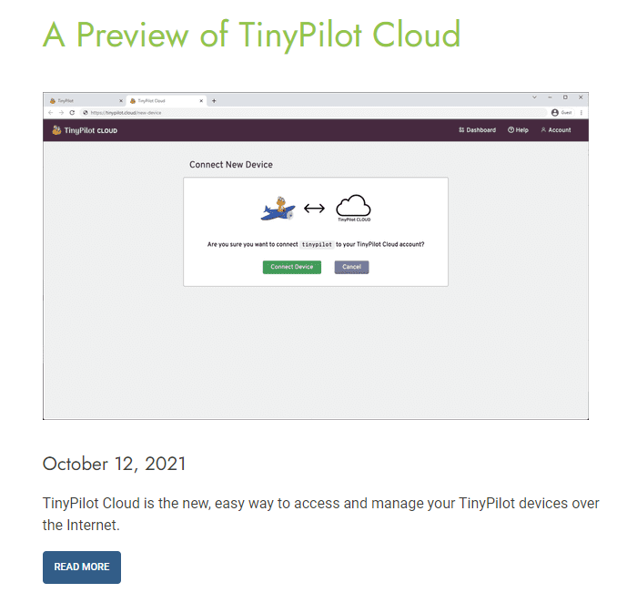
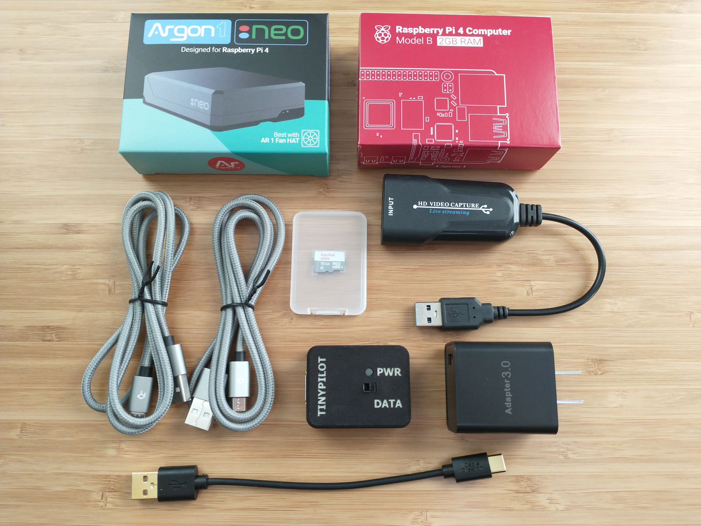
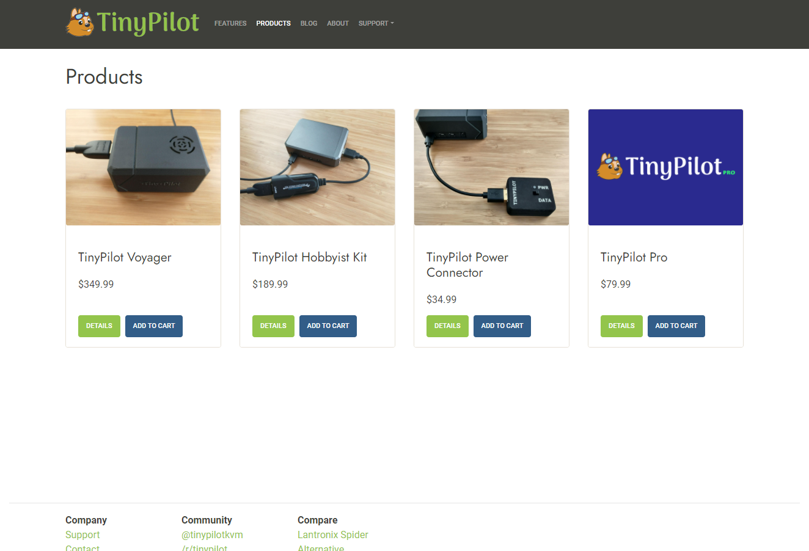
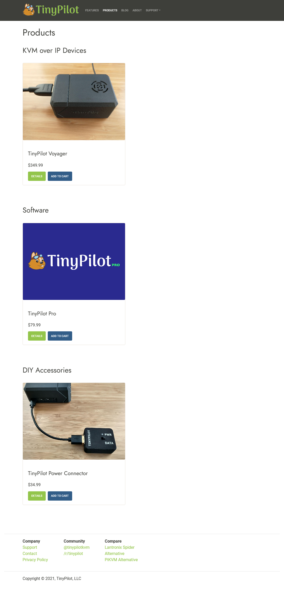
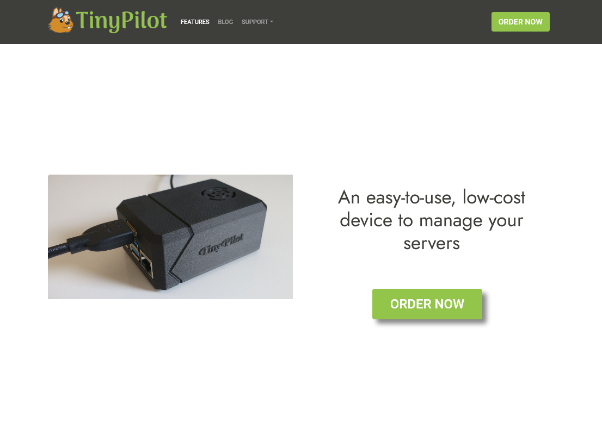
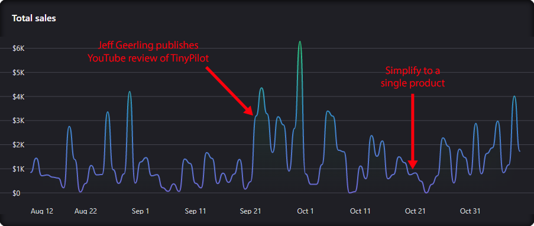

## Highlights

- I announced a new product and then discovered it was a mistake.
- I simplified the TinyPilot website to focus on a single device.
- I tried taking my first real vacation from TinyPilot with mixed results.

## Goal Grades

At the start of each month, I declare what I'd like to accomplish. Here's how I did against those goals:

### Train local staff members to assist with customer support

- **Result**: Local staff members are answering ~50% of support emails.
- **Grade**: A-

We now use [HelpScout](https://www.helpscout.com/) as a shared customer support queue. There are still plenty of cases where I'm the only one with the context or technical background to handle the request, but it's great to have help with the rest.

It's also fantastic to take myself out of the critical path on time-sensitive inquiries, like when a customer places an order and then follows up quickly to tell us they entered the wrong shipping address. Before HelpScout, I'd have to ferry messages between the customer and TinyPilot's fulfillment staff, often too late. Now, the fulfillment staff members get the requests directly and can handle them without me.

### Start development on a monthly service-based software complement to TinyPilot

- **Result**: I've paused development after a tepid user reception.
- **Grade**: C-

I [published a preview](https://tinypilotkvm.com/blog/tinypilot-cloud-waitlist) of a service called TinyPilot Cloud and offered signups for early access. There wasn't enough interest from users, so I've paused the project for now.

### Complete TinyPilot's website rebrand

- **Result**: We're very close, but it's not done yet.
- **Grade**: B-

The rebrand is taking longer than I expected, but it should be ready in November. The new designs look really cool, so I'm eager to get them up.

## [TinyPilot](https://tinypilotkvm.com/?ref=mtlynch.io) stats



| Metric                   | September 2021 | October 2021  | Change                                         |
| ------------------------ | -------------- | ------------- | ---------------------------------------------- |
| Unique Visitors          | 9,960          | 6,898         | -3,062 (-31%)         |
| Total Pageviews          | 15,744         | 13,008        | -2,736 (-17%)         |
| Sales Revenue            | $42,234.17     | $34,927.55    | -$7,306.62 (-17%)     |
| Enterprise Subscriptions | $48.00         | $48.00        | 0                                              |
| Royalties                | $3,431.35      | $6,804.53     | +$3,373.18 (+98%)   |
| Total Revenue            | $45,713.52     | $41,780.08    | -$3,933.44 (-9%)      |
| **Profit**               | **$11,713.04** | **$1,936.22** | **-$9,776.82 (-83%)** |

TinyPilot had a fairly strong sales month. Sales are down a bit from last month, but our European distributor doubled their sales from September, providing a nice boost.

Profits are lower than last month despite sales because my dev costs were atypically high at $11k. I also spent $5k on design consulting for the rebrand, but those costs are only ongoing for the next couple of months.

## The TinyPilot Cloud flop

One of the most common requests I hear from users is for access to their TinyPilot devices over the Internet. There are a few [third-party solutions](https://tinypilotkvm.com/faq/cloud-access), but they're either slow or inconvenient.

Naturally, this led to the idea for TinyPilot Cloud, a paid service that offers customers simple and performant cloud access to their devices. It would be a great selling point because no other KVM over IP device offers this natively. The service fits in with TinyPilot's brand of making everything dead-simple while preserving performance and security. Best of all, it would provide a consistent stream of income, unlike the bursty nature of eCommerce.

With the open-source tools and cloud vendors available, I estimated that it would take about a month to deploy a minimum viable product of TinyPilot Cloud. I worked with other TinyPilot developers on a simple proof-of-concept implementation using [Wireguard](https://www.wireguard.com/) and [fly.io](https://fly.io). It was harder than I anticipated, but it worked better than any of the existing third-party cloud access solutions.

Now that we had a basic prototype, I wrote a requirements document and asked TinyPilot's senior developer to turn it into a design document. That also turned out to be more difficult than either of us expected. We had to evaluate authentication providers and map out a complex setup flow that balanced security with ease of use.

As part of the design work, TinyPilot's senior developer created screenshots to mock up the user flow. I included them in a [teaser blog post](https://tinypilotkvm.com/blog/tinypilot-cloud-waitlist) that invited readers to sign up for TinyPilot Cloud early access.

{{}}

I sent the announcement to TinyPilot's 450 mailing list subscribers. 94 of them clicked the link, which was a promising conversion rate.

After two days, only two users had signed up for the TinyPilot Cloud waitlist, and that was after sharing the post on Twitter, Reddit, and the TinyPilot user forums.

{{}}

Two signups were _way_ less than I was hoping. I expected maybe 50 signups, of which 25 could turn into actual customers, so we'd be starting out with ~$750/month. If only two people total were interested out of a population that actively follows TinyPilot, something was seriously wrong.

I invited the users who signed up to talk more in hopes of learning out how to find more customers like them, but they weren't so enthusiastic. One of them never responded to my email, and the other said he signed up out of curiosity but wasn't sure he'd actually use the service.

Other users expressed concern about the cost, as $30/month for cloud access felt steep. Larger customers were less price-sensitive, but they didn't want to expose their internal networks to an external service.

I felt discouraged and embarrassed that I'd invested so much time into something users didn't want in the first place. All told, this project consumed six to eight person-weeks of development time. Validating customer demand before investing months into engineering is like entrepreneurship 101.

Looking back, instead of setting out to create a working product, I should have just aimed for the blog post and measured interest from there. My mistake was assuming that just because people _wanted_ cloud access meant that they'd be willing to pay $30/month for it. The existing providers in this space offer their services free to small businesses and home users, so I think $30/month seemed surprisingly high.

For now, we're pausing development on TinyPilot Cloud. We've documented our design work well, so we should be able to pick it up in a few months if we find more customers. Alternatively, we may end up publishing an open-source version of the service that customers can self-host.

## Simplifying to just one product

The first TinyPilot product I ever offered was the TinyPilot Hobbyist Kit. Before I had any custom hardware or cases, I offered this kit of off-the-shelf hardware that allowed customers to build a TinyPilot the same way I built my first one. As TinyPilot has evolved and I've added the high-end [TinyPilot Voyager](https://tinypilotkvm.com/blog/introducing-voyager), I continued to offer the Hobbyist Kit for price-conscious customers.

{{}}

I began working with a design firm in September on a rebrand for TinyPilot. When they asked me which customers TinyPilot should to appeal to, I said small-to-medium-sized businesses and tech-savvy consumers.

After that conversation, I began to wonder whether the Hobbyist Kit was hindering that goal. Seeing the TinyPilot Voyager next to a cheap DIY device might send the message that the Voyager is only a small step up from something you could build yourself.

{{}}

Further complicating matters, there's been a shortage of Raspberry Pi devices. The wait time on new orders is six months or more. It's possible that I'll run out of Raspberry Pis before the chip shortage eases up, so it seems foolish to waste a scarce resource on my $190 product instead of my $350 product.

Halfway through the month, I retired the Hobbyist Kit from the website to focus on the Voyager:

{{}}

That felt nicer. If a customer wanted a KVM over IP device, the choice was unambiguous. They didn't have to research the Hobbyist kit and Voyager and evaluate whether they were willing to pay more for a plug 'n play device and higher quality video.

Then, I thought, "Why stop there?" Did all the other products need to be there? When customers upgrade to TinyPilot Pro, they typically purchase directly from their TinyPilot web dashboard rather than navigating the website. And I still wanted to offer the power connector for the DIY crowd, but I could do that without listing it on my main product page. At that point, I realized I didn't even need an index page of products.

Trimming out the accessory products allowed me to focus the TinyPilot website around my flagship product: the Voyager.

{{}}

Reducing to a single product offers a lot of benefits. There's less complexity for customer support, it gives us more room to store inventory, and it simplifies our order fulfillment process.

Sales have been stronger since the change, but it's difficult to say whether there's a causal connection. There's definitely a trend upwards after the change, but it could just be trailing effects from last month's [positive press](/retrospectives/2021/10/#tinypilothttpstinypilotkvmcomrefmtlynchio-stats).

{{}}

The Voyager 2 is on track to ship in a month or two. My original plan was to sell Voyagers models 1 and 2 side-by-side and experiment with their respective pricing. Seeing how much easier it is to sell a single product, I'm probably going to phase out Voyager 1 soon after I start shipping its successor.

## Taking a test vacation

One of my goals for this year is to [systematize enough of TinyPilot's business operations that I can take a two-week vacation](/solo-developer-year-3/#automate-tinypilot-management). I haven't tested that much because it's not so appealing to travel during a global pandemic. Now that vaccines have rolled out, I've taken a few trips.

In August, I took a three-day weekend to attend a friend's wedding. That went smoothly, but I was essentially just taking a Friday off work, so there's very little that could have gone wrong.

This past month, I pushed my vacation a bit more. I took a five-day trip: three weekdays + a weekend. I managed to stay off of my work email for the most part, though I did scan it a few times to see if there was anything urgent. When I returned, TinyPilot's local staff had been fulfilling orders and managing inventory without any issues, but I still had 122 new emails in my work inbox. I spent three full days doing almost nothing but catching up on email, which is not so fun.

I don't have a great plan for how to solve this. The fundamental problem is that TinyPilot as a business has so many moving parts. There's me, two local staff, three developers, a European distributor, a 3D-printing lab, and an electrical engineering vendor. I communicate with all of them on a weekly basis, so that's just a lot of coordination.

I prioritize systematizing and documenting as much as possible, but there are always exceptional cases that require my attention. On top of that, there are sales inquiries and customer support requests, though the local staff is now helping to absorb some of those.

I listened to an interview with WPEngine founder Jason Cohen earlier this year where he said that part of being a successful leader is [helping the people around you grow and take on more responsibility](https://twitter.com/deliberatecoder/status/1424894197702799362). That's something I took to heart, and it's my best hope of growing the business to the point where it can run without me for a few weeks. Allowing developers to [review each other's code](/retrospectives/2021/08/#allow-developers-to-review-each-others-pull-requests) has helped the dev team grow and achieve more autonomy. I expect to see a similar effect from integrating TinyPilot's local staff into the customer support process.

Lastly, I hope that exceptional problems become less exceptional over time. A situation typically requires my intervention because we don't have a defined process for handling it. And we usually don't have a process because it's never happened before. TinyPilot is still a relatively young company, so there are still lots of things we've never seen before. The dev team only formed [eight months ago](/retrospectives/2021/03/#what-got-done), we've only [had an office](/retrospectives/2021/05/#tinypilots-new-office-the-fun-stuff) for six months, and we added our first distributor only [two months ago](/retrospectives/2021/09/#adding-a-european-distributor). I'm hoping the proportion of new, surprising things goes down over time so that we have a written, consistent process for handling most situations.

## Legacy projects

Here are some brief updates on projects that I still maintain but are not the primary focus of my development:

### [Is It Keto](https://isitketo.org)



| Metric                   | September 2021 | October 2021 | Change                                      |
| ------------------------ | -------------- | ------------ | ------------------------------------------- |
| Unique Visitors          | 23,618         | 20,321       | -3,297 (-14%)      |
| Total Pageviews          | 56,246         | 47,487       | -8,759 (-16%)      |
| Domain Rating (Ahrefs)   | 11.0           | 11.0         | 0                                           |
| AdSense Revenue          | $264.63        | $230.64      | -$33.99 (-13%)     |
| Amazon Affiliate Revenue | $77.42         | $27.76       | -$49.66 (-64%)     |
| **Total Revenue**        | **$342.05**    | **$258.40**  | **-$83.65 (-24%)** |

Is It Keto continues its slow decline, as competing sites outperform it in search results. It's a shame, but it's not worth it for me to shift focus from TinyPilot.

### [Hit the Front Page of Hacker News](https://hitthefrontpage.com/)



| Metric                    | September 2021 | October 2021 | Change                                       |
| ------------------------- | -------------- | ------------ | -------------------------------------------- |
| Unique Visitors           | 128            | 100          | -28 (-22%)          |
| Gumroad Revenue           | $189.14        | $75.27       | -$113.87 (-60%)     |
| Blogging for Devs Revenue | $27.30         | $0.00        | -$27.30 (-100%)     |
| **Total Revenue**         | **$216.44**    | **$75.27**   | **-$141.17 (-65%)** |

I haven't done anything to promote my blogging course, but a couple of people purchased it last month. At the last indie founder meetup I co-hosted, one of the attendees had watched my course, so it was cool to meet a student in real life for the first time.

### [Zestful](https://zestfuldata.com)



| Metric            | September 2021 | October 2021 | Change                                      |
| ----------------- | -------------- | ------------ | ------------------------------------------- |
| Unique Visitors   | 596            | 613          | +17 (+3%)        |
| Total Pageviews   | 1,512          | 1,426        | -86 (-6%)          |
| RapidAPI Revenue  | $185.12        | $99.74       | -$85.38 (-46%)     |
| **Total Revenue** | **$185.12**    | **$99.74**   | **-$85.38 (-46%)** |

Zestful keeps doing its thing in the background. It's had a good run these past few months with $100-600/month in revenue. I suspect that the sales are coming from users who are doing bulk parsing rather than clients with recurring needs, but it's been a nice bump in revenue.

The person who [expressed interest in acquiring Zestful](/retrospectives/2021/09/#zestfulhttpszestfuldatacom) stopped following up and hasn't replied to my emails, so I think that deal is dead.

## Wrap up

### What got done?

- Integrated local staff into the customer support workflows.
- Paused development on TinyPilot Cloud.
- Retired the TinyPilot Hobbyist Kit and focused the site around the Voyager.
- Published [episode 1 of "Deliberate Programming."](https://www.youtube.com/watch?v=RKpaccCmxwQ)
  - I started a project about looking for ways of applying [deliberate practice](/book-reports/badass/#building-expertise) to software development.

### Lessons learned

- Validate your product early.
  - Wanting a feature or product is different than being willing to pay for it.
- If I want to be able to take vacations, I have to help my teammates grow.
  - The more responsibility that my teammates take on, the less reliant the business is on me personally for day-to-day operations.

### Goals for next month

- Complete TinyPilot’s website rebrand.
- Prepare for Voyager 2 launch as soon as the hardware is ready.
- Hire a marketing firm or freelancer to help TinyPilot explore paid marketing channels.
