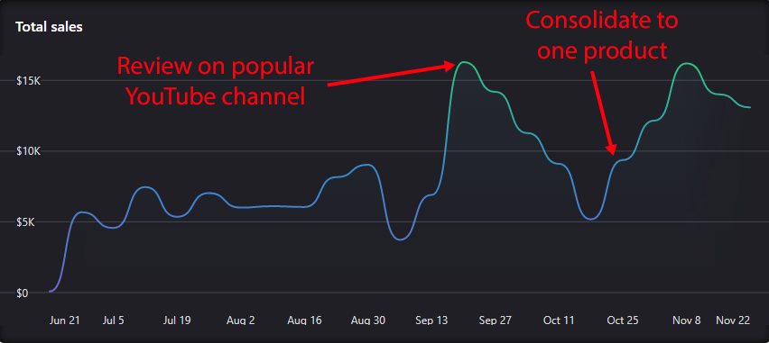
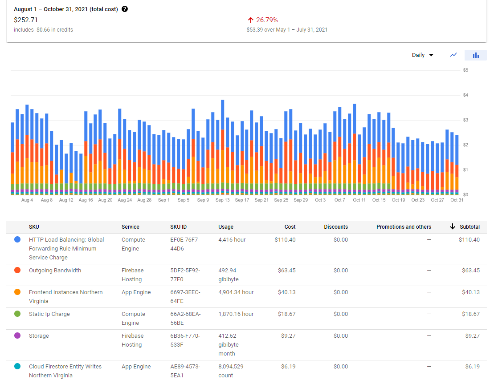
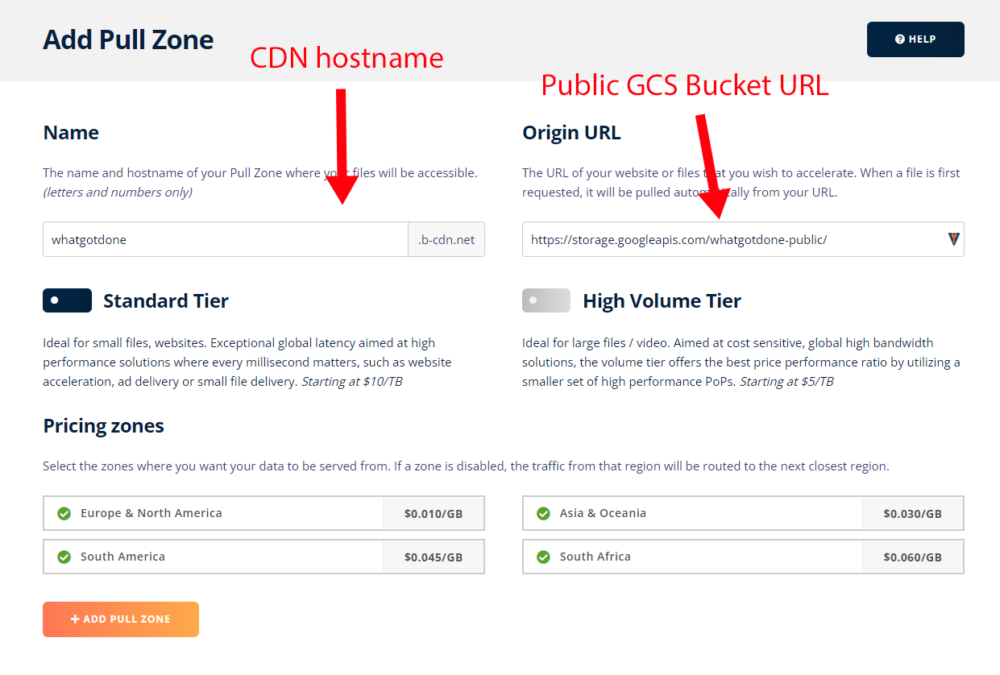
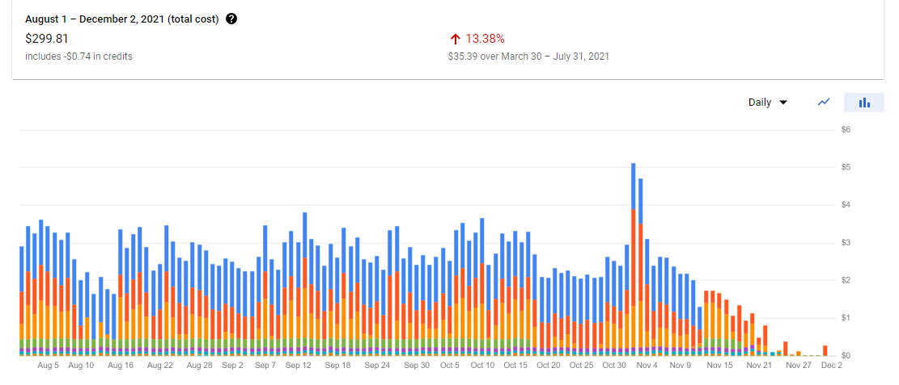

## Highlights

*

## Goal Grades

At the start of each month, I declare what I'd like to accomplish. Here's how I did against those goals:

### Complete TinyPilot’s website rebrand

* **Result**: The rebrand is 95% done, but we haven't published it yet.
* **Grade**: B

I've finalized a logo concept and color scheme with the design firm, but we're still working out some fine details before we pull the trigger on the new branding.

### Prepare for Voyager 2 launch as soon as the hardware is ready

* **Result**: Everything is in place to launch within a week of receiving the hardware
* **Grade**: A-

It's been a long slog to get the custom hardware we need for the Voyager 2, but we completed manufacturing and received the first batch of hardware last week, so we should be ready to launch this week. We're a little behind where I hoped to be because we've had trouble keeping up with demand for Voyager 1, but it should only delay us by a day or two.

### Hire a marketing firm or freelancer to help TinyPilot explore paid marketing channels

* **Result**: Punted on this due to changing priorities
* **Grade**: N/A

I spoke to a few marketing firms, but I wasn't ready to hire anyone yet. We're struggling to keep up with TinyPilot's growing sales as it is, so I'm pausing on marketing and focusing on scaling production to meet our current demand.

## [TinyPilot](https://tinypilotkvm.com/?ref=mtlynch.io) stats



| Metric                   | October 2021  | November 2021 | Change                                            |
| ------------------------ | ------------- | ------------- | ------------------------------------------------- |
| Unique Visitors          | 6,898         | 7,983         | +1,085 (+16%)          |
| Total Pageviews          | 13,008        | 14,596        | +1,588 (+12%)          |
| Sales Revenue            | $34,927.55    | $56,626.33    | +$21,698.78 (+62%)     |
| Enterprise Subscriptions | $48.00        | $48.00        | 0                                                 |
| Royalties                | $6,804.53     | $6,000.00     | -$804.53 (-12%)          |
| Total Revenue            | $41,780.08    | $62,674.33    | +$20,894.25 (+50%)     |
| **Profit**               | **$1,936.22** | **$9,442.26**\* | **+$7,506.04 (+388%)** |

\* *Profit is provisional until I complete monthly bookkeeping. The current number is just a simple delta in cash holdings since last month.*

## Reducing to a single product nearly doubled sales

Due to supply shortages, I retired TinyPilot's lower-cost product last month to focus on our premium product, the TinyPilot Voyager. That reduced the product catalog to just the Voyager and some accessories that don't generate many sales, so I decided to scrap the product catalog page.

I basically just removed a link from the site's navigation bar.

TODO: Screenshot of change

In last month's retrospective, I mentioned that I was [starting to see sales trending upwards](/retrospectives/2021/11/#simplifying-to-just-one-product) and wondered whether it was related to simplifying the product offering. After a month of extra data, I'm pretty convinced that it made a huge difference:

{{}}

We've had spikes in sales before, but they always followed some obvious event like a mention on YouTube or a review on a popular website. Sales would spike and then slowly subside.

Ever since the consolidation to a single product, sales have been as high as our spikes in the past, except they don't seem to be tapering off like they do for one-time events.

If I'm correct that the sales increase came from eliminating the catalog page, it's the highest return on investment from anything I've done with TinyPilot. I got a 62% sales jump just by removing a link!

## The return of growing pains

For the first six months of TinyPilot, I was always scrambling to keep up with growth. Sales were doubling every four to eight weeks, so I constantly had to search for new suppliers and reinvent processes to scale up the business. While that growth was exciting, those growing pains are exhausting, so I was glad to settle into a more consistent, predictable pace for most of 2021.

This new sales spike has brought back some growing pains. We have contingency plans, and they've served us well this year, but we didn't have a plan for sustained growth like this.

We caught a few miracles that have allowed us to sell continuously

 Our 3D print vendor can scale gradually with us by buying more equipment, but if we double sales in a month, he can't easily just double his capacity.

I ran a Black Friday promotion last year that generated a significant bump in sales, and I was considering it again this year, but there was too much going on. Between preparing for the Voyager 2 launch and scrambling to handle inventory shortages, I didn't want to add more stress and complexity to our fulfillment processes.

## Migrating my hobby projects off of Google Cloud Platform

I mainly focus on my business projects in these retrospectives, but I had some fun this past month migrating off of Google Cloud Projects for several of my hobby projects.

I've been using Google Cloud Platform for years because I used to work for Google, I think Google does engineering well, so I just thought they were a good default choice for cloud services. Over time, I've come to realize that Google Cloud Platform is usually a poor solution for small projects. When I start new projects, I look for solutions outside of Google, and the alternatives I find are invariably easier to use, less expensive, and they provide better customer support (which is to say they provide a non-zero amount of customer support).

I still had a lot of old projects running on Google Cloud Platform, and they were accruing more and more service fees, so I spent the month eliminating the most costly ones. Here's what my costs looked like before moving:

{{}}

So, I'm going to share how I eliminated those costs, starting from the most expensive to the least expensive.

### HTTP Load Balancing - $37/mo

HTTP Load Balancing was a big gotcha.

On What Got Done and WanderJest, I let users upload images, and the app stores the images in a Google Cloud Storage (GCS) bucket. By default, GCS URLs are big, ugly messes like `https://storage.googleapis.com/whatgotdone-public/...`. I wanted a nice, tidy URL like `https://media.whatgotdone.com`.

This simple [80-step process](https://cloud.google.com/storage/docs/hosting-static-website) explains the Google way of serving from a subdomain. You have to provision a static IPv4 address and set up an HTTP Load Balancer. Little did I know, the load balancer would drive up my costs by about $18/mo per site.

I cut that cost by switching to [BunnyCDN](https://bunny.net/). I worried that setting up a whole CDN would be a pain, but it was incredibly simple. Less than 30 minutes after I first discovered BunnyCDN as a service, I was successfully serving my Google Cloud Storage bucket through the `media.whatgotdone.com` domain. All I had to do was tell BunnyCDN the GCS bucket URL, the subdomain I wanted, and add a DNS entry.

{{}}

Bunny's minimum charge is $1/mo total whereas Google's is ~$18/mo per site. And even if I exceed the minimum, Bunny's bandwidth prices are less than 1/10th Google's, so I'm happy with the switch.

### Bandwidth - $21/mo

My outgoing bandwidth fees come mostly this blog and Is It Keto. I was hosting both sites on Google Firebase, where the bandwidth fees are $0.15/GB. My websites collectively serve about 150 GB/mo in bandwidth, but a popular blog post can drive that up by a factor of three.

I've searched for other static file hosts, but for some reason, almost every provider wants to take over your entire continuous integration (CI) process. I don't want that. I want to use a CI company for CI, and I want to use a hosting company for hosting.

I'd looked into Netlify in the past, but I dismissed them as a "we insist on being your CI" company. Then, [Siddhant Goel told me](https://twitter.com/siddhantgoel/status/1457381011923378176) about Netlify's "manual build" mode that lets you skip all their CI nonsense. They have a $19/mo plan with 400 GB of bandwidth and $0.20/GB after that, so even in the rare month that I got a huge influx of visitors, I'd still only be paying ~$20/month.

### AppEngine - $13/mo

My last significant cost was AppEngine hosting for What Got Done. For years, the cost had been ~$2/mo. In July, the bills suddenly shot up to $10-15/month, and I don't know why.

Fortunately, What Got Done is a standard Go web app, so it doesn't especially need to run on AppEngine. What Got Done also depends on Google Firestore for data, and I could have migrated them separately, but I figured it would be easier to switch both at once. Otherwise, I'd have to spend hours getting a service account working from another host and make sure it has proper access to Firestore.

To replace Firestore, I used [use SQLite and Litestream](https://github.com/mtlynch/whatgotdone/pull/639). SQLite is a simple SQL database that keeps everything in a single file. Litestream is a tool for syncing SQLite databases to the cloud. You may recall that I used these technologies [to build LogPaste](/litestream/).

To replace AppEngine, I used [fly.io](https://fly.io). I've been experimenting with fly.io, and I consitently have good experiences with them. Their documentation is clear, their tools work how you expect, and their customer support team includes the founders and lead engineers.

My move to fly.io was mainly about reducing costs and vendor-dependence, but the changes ended up improving performance tremendously. Most of What Got Done's API requests had 15-30x speedups in response time after I migrated to SQLite and fly.io.

{{}}

| Request | AppEngine Latency (ms) | fly.io Latency (ms) | Latency Reduction |
|---------|------------------------|---------------------|-------------------|
| Fetch recent entries | 745.3 | 27.3 | 96.3% |
|Fetch user profile | 300.0 | 29.3 | 90.2% |
|Fetch personalized feed | 572.0 | 68.7 | 88.0% |
|Fetch user's complete entry history | 215.7 | 62.0 | 71.3% |
|Fetch impression count | 349.7 | 20.0 | 94.3% |
|Publish entry | 183.3 | 72.7 | 60.4% |

### Final costs

After migrating the big-ticket services away from Google Cloud Platform, my ongoing fees for Google services are nearly zero:

{{}}

Strangely, the remaining bandwidth costs are coming from my old [demo app of pre-rendering in Vue](https://hello-world-vue-pre-rendered.web.app/). It doesn't seem to be linked from anywhere except this blog, but it somehow attracts ~6.5 GB/mo in bandwidth? It's strange, but I'm not too concerned about it since it's only a few cents per month.

## Legacy projects

Here are some brief updates on projects that I still maintain but are not the primary focus of my development:

### [Is It Keto](https://isitketo.org)



| Metric                   | October 2021 | November 2021 | Change                                      |
| ------------------------ | ------------ | ------------- | ------------------------------------------- |
| Unique Visitors          | 20,321       | 17,790        | -2,531 (-12%)      |
| Total Pageviews          | 47,487       | 40,722        | -6,765 (-14%)      |
| Domain Rating (Ahrefs)   | 11.0         | 15.0          | +4.0 (+36%)      |
| AdSense Revenue          | $230.64      | $235.36       | +$4.72 (+2%)     |
| Amazon Affiliate Revenue | $27.76       | $26.25        | -$1.51 (-5%)       |
| **Total Revenue**        | **$258.40**  | **$261.61**   | **+$3.21 (+1%)** |

Is It Keto is still hanging around in the background earning small amounts of revenue. My only change this month was moving it from Firebase to Netlify, which reduces my hosting costs.

### [Hit the Front Page of Hacker News](https://hitthefrontpage.com/)



| Metric                    | October 2021 | November 2021 | Change                                        |
| ------------------------- | ------------ | ------------- | --------------------------------------------- |
| Unique Visitors           | 100          | 159           | +59 (+59%)         |
| Gumroad Revenue           | $75.27       | $94.57        | +$19.30 (+26%)     |
| Blogging for Devs Revenue | $0.00        | $0.00         | 0                                             |
| **Total Revenue**         | **$75.27**   | **$94.57**    | **+$19.30 (+26%)** |

My blogging course had a handful of sales this past month. I considered running a Black Friday sale, but I was enjoying the long weekend of not thinking about business, so I decided against it. I'm glad I did because it allowed me to focus on finishing up the improvements to What Got Done.

### [Zestful](https://zestfuldata.com)



| Metric            | October 2021 | November 2021 | Change                                          |
| ----------------- | ------------ | ------------- | ----------------------------------------------- |
| Unique Visitors   | 613          | 576           | -37 (-6%)              |
| Total Pageviews   | 1,426        | 1,489         | +63 (+4%)            |
| RapidAPI Revenue  | $99.74       | $727.17       | +$627.43 (+629%)     |
| **Total Revenue** | **$99.74**   | **$727.17**   | **+$627.43 (+629%)** |

Zestful saw a big bump this month from a new customer doing around $700 in requests. The customer's name seemed familiar, so I checked my emails. It turns out that I reached out to this customer three years ago, but they politely declined. I guess they needed a few years to think about it.

## Wrap up

### What got done?

* Published the [TinyPilot 2.3.1 release](https://tinypilotkvm.com/blog/whats-new-in-2021-11)
* Prepared for the launch of Voyager 2
* [Migrated What Got Done](https://github.com/mtlynch/whatgotdone/pull/639) from GCP and Firestore to fly.io, SQLite, and Litestream
* Migrated this blog, Is It Keto, and a few other static sites from Google Firebase Hosting to Netlify

### Lessons learned

* When sales begin trending upwards, think early about scaling.

### Goals for next month

* Launch the Voyager 2
* Launch TinyPilot’s rebrand
  * For real this time.
