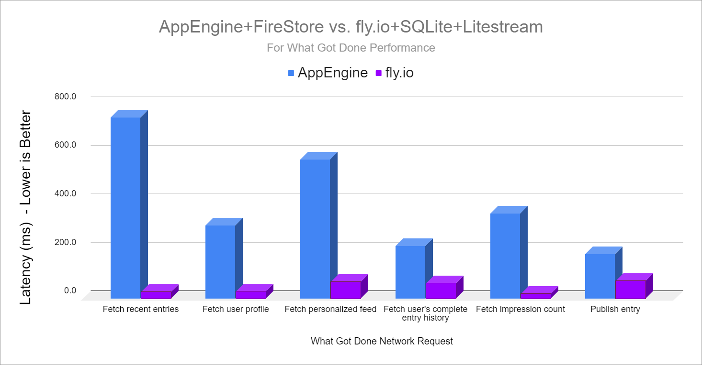

## Highlights

*

## Goal Grades

At the start of each month, I declare what I'd like to accomplish. Here's how I did against those goals:

### Complete TinyPilot’s website rebrand

* **Result**: The rebrand is 95% done, but we haven't published it yet.
* **Grade**: B

I've finalized a logo concept and color scheme with the design firm, but we're still working on that

### Prepare for Voyager 2 launch as soon as the hardware is ready

* **Result**: The
* **Grade**: A-

TODO

### Hire a marketing firm or freelancer to help TinyPilot explore paid marketing channels

* **Result**: Punted on this due to changing priorities
* **Grade**: N/A

I spoke to a few marketing firms, but I wasn't ready to hire anyone yet. TinyPilot's sales are surging without any marketing, and we're struggling to keep up, so I'm pausing on marketing and focusing on scaling production to meet our current demand.

## [TinyPilot](https://tinypilotkvm.com/?ref=mtlynch.io) stats



## Reducing to a single product nearly doubled sales

We've had other sales spikes driven by YouTube reviews, but those are mainly one-off events. They generate a spike in sales and then the sales subside. This change appears to be sustainable, which would be great.

## The return of growing pains

This new sales spike . Our 3D print vendor can scale gradually with us by buying more equipment, but if we double sales in a month, he can't easily just double his capacity.

I ran a Black Friday promotion last year that generated a significant bump in sales, and I was considering it again this year, but there was too much going on. Between preparing for the Voyager 2 launch and scrambling to handle inventory shortages, I didn't want to add more stress and complexity to our fulfillment processes.

## Migrating my hobby projects off of Google Cloud Platform

### HTTP Load Balancing

HTTP Load Balancing was a bit of a gotcha. On What Got Done and WanderJest, I let users upload images and then store them to a Google Cloud Storage bucket. I got tired of ugly URLs for user-generated content that were like `https://storage.googleapis.com/whatgotdone-public/uploads/...`, so I looked into how to serve a GCS bucket from a subdomain like `media.whatgotdone.com`. I found this easy [80-step process](https://cloud.google.com/storage/docs/hosting-static-website) that explained the Google way of serving from a subdomain, and it involved setting up an HTTP Load Balancer. Little did I know, the load balancer costs an extra $15/mo on a site that previously cost around $1/mo.

The solution to the load balancer was switching to [BunnyCDN](https://bunny.net/) to serve my GCS bucket files from a friendly URL. I worried that setting up a whole CDN would be a pain, but it took less than 30 minutes to set up. I just telling BunnyCDN the GCS bucket URL, the subdomain I wanted, and then I added a DNS entry, and it was working. It was an infinitely better experience than Google 80-step process, and Bunny's minimum charge is $1/mo to Google's $15. And even if I exceed the minimum, Bunny's bandwidth prices are less than 1/10th Google's.

### Bandwidth

Outgoing bandwidth is mostly this blog and Is It Keto. I was hosting both sites on Google Firebase, where the bandwidth fees are $0.15/GB. I usually have 150 GB/mo in bandwidth, but sometimes it spikes up to 450 GB/mo. I've stuck with Firebase for a while despite their high bandwidth prices because they're one of the few hosts that will just accept their role as dumb static file hosts instead of insisting that they should take over your entire build process. Netlify has a $19/mo plan with 400 GB of bandwidth and $0.20/GB after that, so even in the rare month that I got a huge influx of visitors, I'd still only be paying ~$20/month.

### AppEngine

My next biggest cost was AppEngine hosting for What Got Done. For years, the cost had been ~$2/mo. In July, the bills suddenly shot up to $10-15/month, and I don't know why.

Fortunately, What Got Done is a standard Go web app, so it doesn't have any strict dependencies on AppEngine. What Got Done does use Google Firestore, and I never was that fond of it, so I decided I'd migrate off Firestore at the same time as I switched away from AppEngine.

I rewrote the app to [use SQLite and Litestream](https://github.com/mtlynch/whatgotdone/pull/639) using the same [technique I described for LogPaste](/litestream/). I deployed to fly.io, and one of the unexpected benefits was that it got 10-30x faster. It brought 800+ ms requests down to

{{}}

## Legacy projects

Here are some brief updates on projects that I still maintain but are not the primary focus of my development:

### [Is It Keto](https://isitketo.org)



Is It Keto is still hanging around in the background earning small amounts of revenue. My only change this month was moving it from Firebase to Netlify, which should reduce my hosting costs from ~$10/month to nearly $0/month.

### [Hit the Front Page of Hacker News](https://hitthefrontpage.com/)



My blogging course had a handful of sales this past month. I considered running a Black Friday sale, but I was enjoying the long weekend of not thinking about business, so I decided against it. I'm glad I did because it allowed me to focus on finishing up the improvements to What Got Done.

### [Zestful](https://zestfuldata.com)



Zestful saw a big bump this month from a new customer doing around $1k in requests. Interestingly, the customer is someone I approached four years ago, and they said they weren't interested.

## Wrap up

### What got done?

* Published the [TinyPilot 2.3.1 release](https://tinypilotkvm.com/blog/whats-new-in-2021-11)
* [Migrated What Got Done](https://github.com/mtlynch/whatgotdone/pull/639) from GCP and Firestore to fly.io, SQLite, and Litestream
* Migrated this blog, Is It Keto, and a few other static sites from Google Firebase Hosting to Netlify

### Lessons learned

*

### Goals for next month

* Launch the Voyager 2
* Complete TinyPilot’s website rebrand
  * For real this time.
