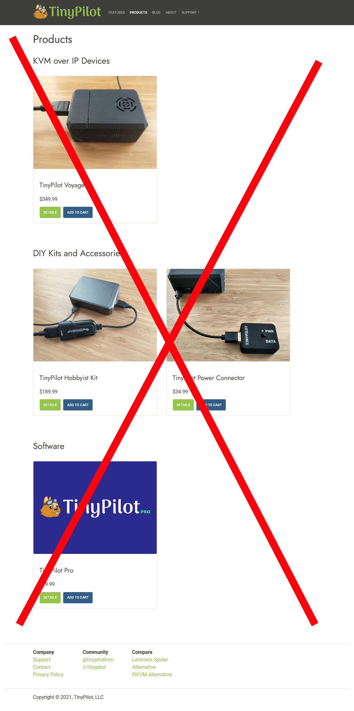

## Highlights

* TinyPilot's sales jumped to $57k, and it might be sustainable.
* I'm just about to launch TinyPilot's new product and branding.
* I reduced Google Cloud Platform fees by 90% on my side projects.

## Goal Grades

At the start of each month, I declare what I'd like to accomplish. Here's how I did against those goals:

### Complete TinyPilot’s website rebrand

* **Result**: The rebrand is 95% done, but we haven't published it yet.
* **Grade**: B

I've finalized a logo concept and color scheme with the design firm, but we're still working out some fine details before we pull the trigger on the new branding.

### Prepare for Voyager 2 launch as soon as the hardware is ready

* **Result**: Everything is in place to launch within a week of receiving the hardware
* **Grade**: A-

It's been a long slog to get the custom hardware we need for the Voyager 2, but we completed manufacturing and received the first batch of hardware last week, so we should be ready to launch this week. We're a little behind where I hoped to be because we've had trouble keeping up with demand for Voyager 1, but it should only delay us by a day or two.

### Hire a marketing firm or freelancer to help TinyPilot explore paid marketing channels

* **Result**: Punted on this due to changing priorities
* **Grade**: N/A

I spoke to a few marketing firms, but I wasn't ready to hire anyone yet. We're struggling to keep up with TinyPilot's growing sales as it is, so I'm pausing on marketing and focusing on scaling production to meet our current demand.

## [TinyPilot](https://tinypilotkvm.com/?ref=mtlynch.io) stats



| Metric                   | October 2021  | November 2021 | Change                                            |
| ------------------------ | ------------- | ------------- | ------------------------------------------------- |
| Unique Visitors          | 6,898         | 7,983         | +1,085 (+16%)          |
| Total Pageviews          | 13,008        | 14,596        | +1,588 (+12%)          |
| Sales Revenue            | $34,927.55    | $56,626.33    | +$21,698.78 (+62%)     |
| Enterprise Subscriptions | $48.00        | $48.00        | 0                                                 |
| Royalties                | $6,804.53     | $7,590.49     | +$785.96 (+12%)        |
| Total Revenue            | $41,780.08    | $64,264.82    | +$22,484.74 (+54%)     |
| **Profit**               | **$1,936.22** | **$9,442.26**\* | **+$7,506.04 (+388%)** |

\* *Profit is provisional until I complete monthly bookkeeping. The current number is just a simple delta in cash holdings since last month.*

## Reducing to a single product nearly doubled sales

Due to supply shortages, I retired TinyPilot's lower-cost product in October to focus on our premium product, the TinyPilot Voyager. That reduced the product catalog to just the Voyager and some accessories that don't generate many sales, so I decided to scrap the catalog page.

I basically just removed a link from the site's navigation bar.


  {{}}
  {{}}


In last month's retrospective, I mentioned that I was [starting to see sales trending upwards](/retrospectives/2021/11/#simplifying-to-just-one-product) and wondered whether it was related to simplifying the product offering. After a month of extra data, I'm pretty convinced that it made a huge difference:

{{}}

We've had spikes in sales before, but they always followed some obvious event like a mention on YouTube or a review on a popular website. Sales would spike and then slowly subside.

Since the consolidation to a single product, sales have been as high as our spikes in the past, except they don't seem to be tapering off like they do for one-time events.

If I'm correct that the sales increase came from eliminating the catalog page, it's the highest return on investment from anything I've done with TinyPilot. I got a 62% sales jump by removing one link!

## The return of growing pains

For the first six months of TinyPilot, I was always scrambling to keep up with growth. Sales were doubling every four to eight weeks, so I constantly had to search for new suppliers and reinvent processes to scale up the business. While that growth was exciting, it was also exhausting. I was glad to settle into a more consistent, predictable pace for most of 2021.

The latest sales increase has brought back some growing pains. We have contingency plans for sales spikes, and they've served us well this year, but we didn't have a plan for sustained growth like this.

### Running out of power connectors

First, we noticed that we were using [power connectors](https://tinypilotkvm.com/product/tinypilot-power-connector) at a fast enough rate that we'd run out before our next delivery of circuit boards, which would prevent us from selling Voyagers.

{{}}

I listed them out of stock for individual sale, and that slowed down the pace *just* enough to last us until the new shipment arrived.

*\[Sidenote: If you're wondering why I was still selling power connectors even though I [just made a huge deal](#reducing-to-a-single-product-nearly-doubled-sales) about not selling anything but Voyagers, I can explain. There are still working links to some of TinyPilot's secondary products through my [DIY TinyPilot guide](/tinypilot/#how-to-build-your-own-tinypilot), but users can't easily discover those pages by visiting the TinyPilot website.\]*

### Running our of ribbon cables

Next, we started running low on ribbon cables. We typically buy them in bulk, and we have so many on hand that it's not even worth tracking them in our inventory system. But because we're not tracking them, we didn't notice that our last order was running late. We were down to just 30 cables, enough to make only a few days' worth of Voyagers.

{{}}

We use a non-standard ribbon cable size, so we get them special-ordered. Was I going to have to halt sales for weeks because of something as stupid as ribbon cables?

Luckily, our supplier was able to expedite our order and get us new cables within days. I also panic-bought another 1,500, so we should be fine for a while.

In addition, we're going to start tracking these cables in our normal inventory system. We realized our informal tracking made it too difficult to tell the difference between "time to place a leisurely new order" and "this is an emergency!"

### Scaling 3D printing

The last shortage is the one we still haven't solved: the cases. We've always 3D-printed the cases because it gives us the flexibility to iterate quickly. We use a 3D-printing material that has a premium feel, and we frequently hear feedback from customers and reviewers about the quality of the case.

The problem is that 3D printing is slow, especially the material we use. It takes eight hours to print each Voyager 1 case. The Voyager 2 will take twelve hours. Our 3D-printing vendor bought an additional printer for us, but I expect to exceed the new capacity when we switch to Voyager 2. Sadly, our vendor can't just buy new printers every time we increase sales.

In the short term, TinyPilot's EU distributor is printing cases locally instead of buying them from us, so that lightens the load on our printer by about 30%. For the long-term, I'm working with my 3D-printing vendor to explore other materials that print faster but still have a premium feel. It also might be time to revisit [injection molding](/retrospectives/2021/02/#scaling-manufacturing), which costs $20-40k upfront but has an output of thousands of cases per week.

## Migrating my side projects away from Google Cloud Platform

I mainly focus on my main business in these retrospectives, but I had some fun this past month migrating my side projects off of Google Cloud Platform (GCP).

I started using GCP about eight years ago. At the time, most cloud providers charged $10-20/mo to host a web app. Google services like AppEngine and Firebase could scale down to $0/mo for small projects, which made experimentation attractive. I'm much more likely to publish a new project if I know I'm not committing myself to pay $20/mo indefinitely.

Today, GCP is usually a poor solution for small projects. The services are so bloated and complex that it takes me about an hour of fiddling with settings and permissions to create and deploy a new, basic web app. Fortunately, there are great alternatives to GCP that offer lower costs, better development experience, and superior customer support (by which I mean *any* customer support).

Because I used GCP for so long, many of my side projects are still running on Google Cloud Platform, and they've been accruing more and more service fees. I spent evenings and weekends last month migrating my most expensive services away from GCP.

Here are what my GCP costs looked like before the great migration:

{{}}

And here's what costs looked like when I was finished:

{{}}

### HTTP Load Balancing - $37/mo

HTTP load balancing was a big gotcha.

On [What Got Done](https://whatgotdone.com) and [WanderJest](https://wanderjest.com), I let users upload images, and then I store the uploads in Google Cloud Storage (GCS) buckets. By default, GCS URLs are big, ugly messes like `https://storage.googleapis.com/whatgotdone-public/...`. I wanted a nice, tidy URL like `https://media.whatgotdone.com`.

This simple [80-step process](https://cloud.google.com/storage/docs/hosting-static-website) explains the Google way of serving GCS files from a subdomain. It involves provisioning a static IPv4 address, setting up an HTTP load balancer, and generating a TLS certificate. I went through all those steps, not realizing that the load balancer would drive up my costs by about $18/mo per site.

I dramatically reduced that cost by switching to [BunnyCDN](https://bunny.net/). I worried that setting up a whole CDN would be a pain, but it was incredibly simple. Less than 30 minutes after discovering BunnyCDN as a service, it was serving my Google Cloud Storage bucket through the `media.whatgotdone.com` domain. All I had to do was tell Bunny the GCS bucket URL and the subdomain I wanted, then add a DNS entry.

{{}}

BunnyCDN's minimum charge is $1/mo total, whereas Google's is ~$18/mo per site. I'm *way* below the minimum charge. I've used 78.55 MB of bandwidth so far, so that would be about $0.0008 in fees. And even if I exceed BunnyCDN's minimum, their bandwidth prices are less than 1/10th of Google's.

### Bandwidth - $21/mo

My outgoing bandwidth fees come mostly from this blog and [Is It Keto](https://isitketo.org). I was hosting both sites on Google Firebase, where the bandwidth fees are $0.15/GB. My websites collectively serve about 150 GB/mo in bandwidth, but a surge in blog readers can drive that up by a factor of three.

I've searched for other static file hosts, but for some reason, almost every static hosting provider wants to take over the entire continuous integration (CI) workflow. I don't want that. I want to use a CI vendor for CI, and I want to use a hosting provider for hosting.

I'd looked into [Netlify](https://www.netlify.com/) in the past, but I dismissed them as a "we insist on being your CI" host. Then, [Siddhant Goel told me](https://twitter.com/siddhantgoel/status/1457381011923378176) about Netlify's "manual build" mode that lets you skip all their CI nonsense. They have a $19/mo plan with 400 GB of bandwidth and $0.20/GB after that, so even in the rare month that I see a huge influx of visitors, I'd still only be paying ~$20/month.

### AppEngine - $13/mo

My last significant cost was AppEngine hosting for What Got Done. For years, the cost had been ~$2/mo. In July, the bills suddenly shot up to $10-15/month, and I don't know why.

Fortunately, What Got Done is a standard Go web app, so it doesn't need to run on AppEngine. The harder dependency was on Google Firestore for data. I could have migrated AppEngine and Firestore separately, but dealing with Google service accounts and permissions is such a pain that I decided to make a clean break from both services at once.

To replace Firestore, I used [SQLite](https://sqlite.org) and [Litestream](https://litestream.io). SQLite is a simple SQL database that keeps everything in a single file. Litestream is a tool for syncing SQLite databases to the cloud. I used these same technologies [to build LogPaste](/litestream/), and they worked well, so I wanted to invest more in them.

To replace AppEngine, I used [fly.io](https://fly.io). I've been experimenting with fly.io for the past year, and I consistently have good experiences with them. Their documentation is clear, their tools work how you expect, and their founders and lead engineers actively engage on their [support forum](https://community.fly.io/).

My move to fly.io was mainly about reducing costs and gaining vendor independence, but the changes ended up improving performance tremendously. Most of What Got Done's API requests had 2-20x speedups after I migrated to SQLite and fly.io.

{{}}

| Request | AppEngine Latency (ms) | fly.io Latency (ms) | Latency Reduction |
|---------|------------------------|---------------------|-------------------|
| Fetch recent entries | 745.3 | 27.3 | 96.3% |
|Fetch user profile | 300.0 | 29.3 | 90.2% |
|Fetch personalized feed | 572.0 | 68.7 | 88.0% |
|Fetch user's complete entry history | 215.7 | 62.0 | 71.3% |
|Fetch impression count | 349.7 | 20.0 | 94.3% |
|Publish entry | 183.3 | 72.7 | 60.4% |

## Legacy projects

Here are some brief updates on projects that I still maintain but are not the primary focus of my development:

### [Is It Keto](https://isitketo.org)



| Metric                   | October 2021 | November 2021 | Change                                      |
| ------------------------ | ------------ | ------------- | ------------------------------------------- |
| Unique Visitors          | 20,321       | 17,790        | -2,531 (-12%)      |
| Total Pageviews          | 47,487       | 40,722        | -6,765 (-14%)      |
| Domain Rating (Ahrefs)   | 11.0         | 15.0          | +4.0 (+36%)      |
| AdSense Revenue          | $230.64      | $235.36       | +$4.72 (+2%)     |
| Amazon Affiliate Revenue | $27.76       | $26.25        | -$1.51 (-5%)       |
| **Total Revenue**        | **$258.40**  | **$261.61**   | **+$3.21 (+1%)** |

Is It Keto is still hanging around in the background earning small amounts of revenue. My only change this month was moving it from Firebase to Netlify, which reduces my hosting costs.

### [Hit the Front Page of Hacker News](https://hitthefrontpage.com/)



| Metric                    | October 2021 | November 2021 | Change                                        |
| ------------------------- | ------------ | ------------- | --------------------------------------------- |
| Unique Visitors           | 100          | 159           | +59 (+59%)         |
| Gumroad Revenue           | $75.27       | $94.57        | +$19.30 (+26%)     |
| Blogging for Devs Revenue | $0.00        | $0.00         | 0                                             |
| **Total Revenue**         | **$75.27**   | **$94.57**    | **+$19.30 (+26%)** |

My blogging course had a handful of sales this past month. I considered running a Black Friday sale, but I was enjoying the long weekend of not thinking about business, so I decided against it. I'm glad I didn't because I had a blast tinkering with What Got Done instead.

### [Zestful](https://zestfuldata.com)



| Metric            | October 2021 | November 2021 | Change                                          |
| ----------------- | ------------ | ------------- | ----------------------------------------------- |
| Unique Visitors   | 613          | 576           | -37 (-6%)              |
| Total Pageviews   | 1,426        | 1,489         | +63 (+4%)            |
| RapidAPI Revenue  | $99.74       | $727.17       | +$627.43 (+629%)     |
| **Total Revenue** | **$99.74**   | **$727.17**   | **+$627.43 (+629%)** |

Zestful saw a big bump this month from a new customer who made around $700 in requests. The customer's name seemed familiar, so I checked my emails. I had reached out to them three years ago, and they politely declined. I guess they needed a few years to think it over.

## Wrap up

### What got done?

* Published the [TinyPilot 2.3.1 release](https://tinypilotkvm.com/blog/whats-new-in-2021-11)
* Prepared for the launch of Voyager 2
* [Migrated What Got Done](https://github.com/mtlynch/whatgotdone/pull/639) from GCP and Firestore to fly.io, SQLite, and Litestream
* Migrated this blog, Is It Keto, and a few other static sites from Google Firebase to Netlify

### Lessons learned

* When sales begin trending upwards, think early about scaling.
* Google Cloud Platform is usually the wrong choice for small projects.

### Goals for next month

* Launch the Voyager 2.
* Launch TinyPilot's rebrand.
  * For real this time.
* Build up enough inventory that TinyPilot isn't scrambling to meet demand.

---

***Note**: I mentioned some services in this post, but I have no business relationship with any of them except as a customer. I hate reading seemingly genuine product recommendations on blogs only to discover that the author is profiting from referrals, so I'm deliberately not using any links that generate referral bonuses or affiliate fees.*
