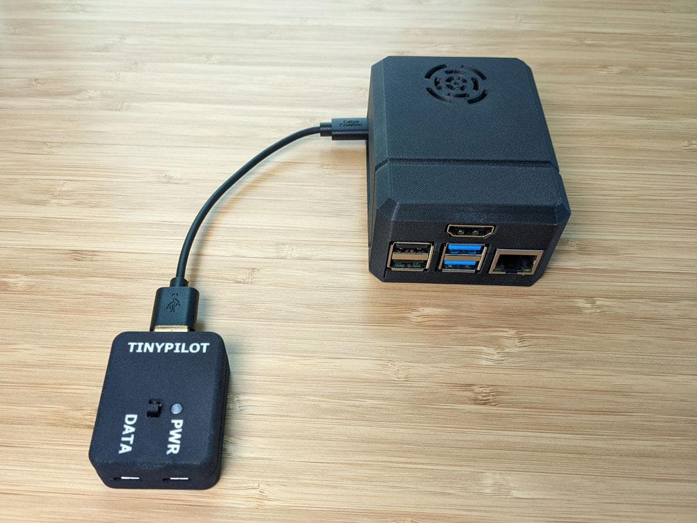
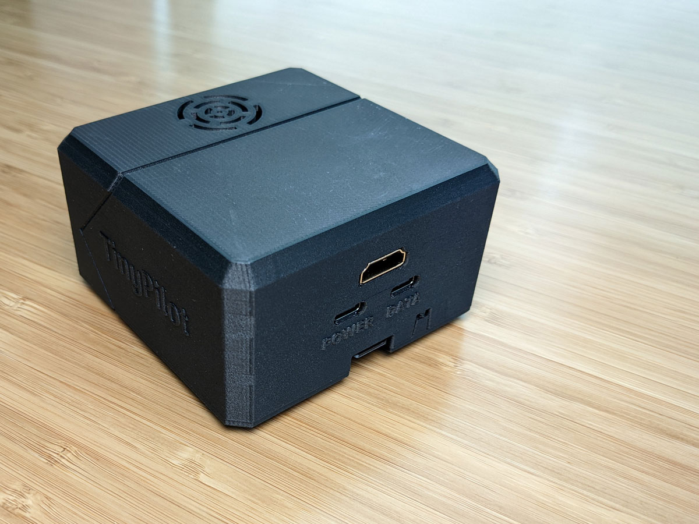
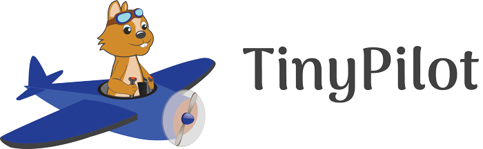
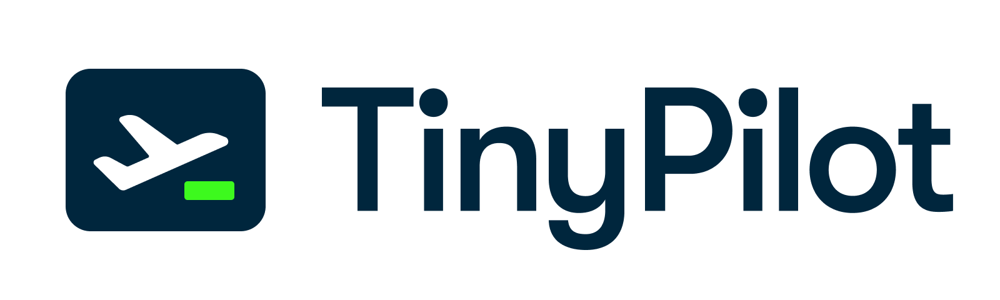

## Highlights

* I've launched the TinyPilot Voyager 2 and a new logo.
* TinyPilot's revenue continues running strong at $55k.
* I've learned to manage design projects more aggressively.

## Goal Grades

At the start of each month, I declare what I'd like to accomplish. Here's how I did against those goals:

### Launch the Voyager 2

* **Result**: Launched the Voyager 2
* **Grade**: A

After many months of hard work, I finally launched the Voyager 2 last month.

### Launch TinyPilot's rebrand

* **Result**: Debuted TinyPilot's new logo
* **Grade**: B

I haven't quite finished the rebrand, but I've published TinyPilot's new logo, which is 80% of the benefit.

### Build up enough inventory that TinyPilot isn't scrambling to meet demand

* **Result**: We're no longer in emergency mode, but we're still scrambling a bit.
* **Grade**: B

I raised prices slightly on the Voyager 2, and that seems to have slowed sales down just enough that our manufacturing processes have time to catch up and we can build up a small buffer of inventory.

## [TinyPilot](https://tinypilotkvm.com/?ref=mtlynch.io) stats



| Metric                   | November 2021  | December 2021   | Change                                           |
| ------------------------ | -------------- | --------------- | ------------------------------------------------ |
| Unique Visitors          | 7,983          | 6,156           | -1,827 (-23%)           |
| Total Pageviews          | 14,596         | 12,840          | -1,756 (-12%)           |
| Sales Revenue            | $56,626.33     | $52,224.65      | -$4,401.68 (-8%)        |
| Enterprise Subscriptions | $47.75         | $47.75          | 0                                                |
| Royalties                | $8,185.78      | $3,000.00\*       | -$5,185.78 (-63%)       |
| Total Revenue            | $64,859.86     | $55,272.40      | -$9,587.46 (-15%)       |
| **Profit**               | **$12,758.39** | **$-16,609.43**\*\* | **-$29,367.82 (-230%)** |

\* Royalties are an estimate until I receive the final numbers from my distributor.

\*\* Profit is a rough approximation based on the delta in my cash balance month-over-month. I'll update with the final numbers in a few weeks when I complete bookkeeping.

Sales are down slightly from November, but December was still my second-highest revenue month of all time. I'm continuing to enjoy the revenue boost from [selling just one product](/retrospectives/2021/12/#reducing-to-a-single-product-nearly-doubled-sales).

My cash profit is down because I'm investing heavily in inventory for 2022. With the chip shortage continuing, I want to secure as many electronic components as possible. Otherwise, I'll constantly have to redesign TinyPilot's circuit boards to swap in components as certain items become unavailable.

## Releasing the Voyager 2

I've been working on the Voyager 2 since March 2021. I originally expected it to take about six weeks, and it ended up taking six months. I finally launched it for sale in early December.

The Voyager 2 brings a tidier form factor. The Voyager 1 had an external power connector that sat outside the main device and required three different cables. The Voyager 2 eliminates that component so that everything is in a single unit.


  {{}}
  {{}}


Honestly, the launch felt a little anticlimactic. While it's more convenient to eliminate the external power connector, I struggled to write [the announcement](https://tinypilotkvm.com/blog/introducing-voyager-2) in a way that sounded exciting. It felt silly to say, "Brand new version! It's exactly the same except without a separate box!"

But it does really simplify things. The Voyager 1 came with six distinct parts &mdash; the Voyager 2 requires only three. That simplifies installation for the user and the fulfillment proceess for TinyPilot's staff.

I'm still excited for the power over Ethernet (PoE) version, which is due to launch this month. Even though it's still just a difference of cables, eliminating the whole power plug makes a big difference in convenience. Plus, I just love PoE. Anytime I plug in a PoE device, and it turns on *just from the network cable*, it feels magical.

## TinyPilot's new logo and learning to work with designers

Back in July of 2020, I commissioned TinyPilot's first logo. I found an illustrator on Upwork and paid her $600 to create it.

{{}}

By mid-2021, it felt like TinyPilot had outgrown the logo. Now that we were targeting business users instead of solely hobbyists, the chipmunk mascot came across as too cutesy and not professional enough.

In September, I [hired a design firm](/retrospectives/2021/10/#investing-more-into-design) to redesign TinyPilot's website and create a new company logo. After lots of discussion, we finalized the logo in December:

{{}}

I like the logo a lot, and I've heard positive feedback about it.

One big lesson I'm taking away from this project is to be more vigilant about structuring design projects in the future.

When I initially contracted the design firm, they estimated that the rebrand and new logo would take 2-4 weeks for a cost of $5-7k. The plan was to agree on a rebrand, which would basically be a new logo, new fonts, and a new color scheme. Once that was nailed down, we'd start the larger project of redesigning the website.

But then the milestones got a little murky. The designers started the rebranding by showing me new designs for the website. When I clarified that I just wanted to focus on the branding, they said they understood but that it's easier seeing the new brand alongside a "sketch" of a new website design.

Okay, fine.

Then, every check-in, the website designs would get more elaborate and detailed. We'd sometimes have check-ins where the only updates were around the website design, and there was virtually no change in the branding.

Three months later, I'd spent $16k and had no finished work. I liked where the designs were going, but the lack of structure meant that we essentially had five separate subprojects that were all 70-90% complete. This blocked me from using any of the work, as I can't publish a page if it still has placeholder graphics and has no design for mobile.

I don't think the designers were trying to manipulate me, but I realized I needed to be more aggressive about structuring the project.

First, I asked the designers to pause the rest of the redesign and focus on completing the logo. Two days later, we had the final logo. Great! Now I at least had a tangible artifact of the design work that I could publish and use.

Next, I requested that the design firm pause and map out the remaining work in terms of milestones, calendar time, and billable hours. Instead of focusing on all the pages at once, I suggested that we focus on completing one page at a time. That way, as soon as we finish a page, I can hand the designs to my dev team for implementation rather than blocking dev work until the entire project is complete.

The design firm took it well. They said they typically work on larger projects where the milestones are at the scale of months, but they were happy to slice the work into more granular segments to support the style of incremental development I want.

## The last unfilled role: tech support

One of my goals for 2021 was to systematize enough of TinyPilot that [I can take a two-week vacation](/solo-developer-year-3/#automate-tinypilot-management) without impacting operations.

Over the December holidays, I took a one-week vacation where I didn't read any TinyPilot email. Everything went smoothly, but it took me several days to get through technical support requests when I got back.

A member of my fulfillment staff has stepped up and taken over for most customer support requests, but he doesn't have a background in software or IT. There are still 2-5 support requests per day that need to be escalated to a support engineer. And right now, the only support engineer is me.

This has made me realize that the next role I need for TinyPilot is a support engineer. I've never hired for that before, but I know that [Jon Yongfook](https://twitter.com/yongfook) of [Bannerbear](https://www.bannerbear.com/) recently [hired his first support engineer](https://twitter.com/yongfook/status/1444836336364523520), so maybe I can piggyback on the things he shared.

## Legacy projects

Here are some brief updates on projects that I still maintain but are not the primary focus of my development:

### [Is It Keto](https://isitketo.org)



| Metric                   | November 2021 | December 2021 | Change                                      |
| ------------------------ | ------------- | ------------- | ------------------------------------------- |
| Unique Visitors          | 17,790        | 15,781        | -2,009 (-11%)      |
| Total Pageviews          | 40,722        | 35,740        | -4,982 (-12%)      |
| Domain Rating (Ahrefs)   | 15.0          | 11.0          | -4.0 (-27%)        |
| AdSense Revenue          | $235.36       | $171.00       | -$64.36 (-27%)     |
| Amazon Affiliate Revenue | $26.25        | $30.21        | +$3.96 (+15%)    |
| **Total Revenue**        | **$261.61**   | **$201.21**   | **-$60.40 (-23%)** |

December is typically a slow month for Is It Keto, but I usually see traffic double in January, as people begin thinking about diet-related New Year's resolutions. I've let the site languish in 2021, but I'm hoping to see a bump back up to ~$400/month for the first few months of 2022.

### [Hit the Front Page of Hacker News](https://hitthefrontpage.com/)



| Metric                    | November 2021 | December 2021 | Change                                      |
| ------------------------- | ------------- | ------------- | ------------------------------------------- |
| Unique Visitors           | 159           | 106           | -53 (-33%)         |
| Gumroad Revenue           | $94.57        | $19.30        | -$75.27 (-80%)     |
| Blogging for Devs Revenue | $0.00         | $27.30        | +$27.30 (+inf%)  |
| **Total Revenue**         | **$94.57**    | **$46.60**    | **-$47.97 (-51%)** |

It was a slow month for Hit the Front Page of Hacker News. Not a lot of technical blogging around the holidays, I guess.

### [Zestful](https://zestfuldata.com)



| Metric            | November 2021 | December 2021 | Change                                         |
| ----------------- | ------------- | ------------- | ---------------------------------------------- |
| Unique Visitors   | 576           | 461           | -115 (-20%)           |
| Total Pageviews   | 1,489         | 1,176         | -313 (-21%)           |
| RapidAPI Revenue  | $727.17       | $1,252.31     | +$525.14 (+72%)     |
| **Total Revenue** | **$727.17**   | **$1,252.31** | **+$525.14 (+72%)** |

2021 has been a nice, quiet comeback story for Zestful. I've left it on auto-pilot since early 2020, but there's been consistent growth in paid usage. These are all pay-as-you-go customers, and I'm skeptical that monthly revenue will remain this high, but I'm enjoying it while it lasts.

## Wrap up

### What got done?

* Launched [TinyPilot Voyager 2](https://tinypilotkvm.com/blog/introducing-voyager-2).
* Debuted TinyPilot's new logo.
* Migrated employee payroll from Justworks to Gusto.

### Lessons learned

* Define expectations with designers and enforce them consistently.
  * The design firm I hired for TinyPilot's redesign is doing good work, but I let myself get into a position where I had no usable work after three months and $16k.
  * What I should have done was more aggressively insist on a structure that facilitated iterative design.

### Goals for next month

* Launch Voyager 2: PoE Edition
* Write a job description for TinyPilot support engineer and begin interviewing candidates.
* Publish my fourth [annual retrospective](/tags/annual-review/)
