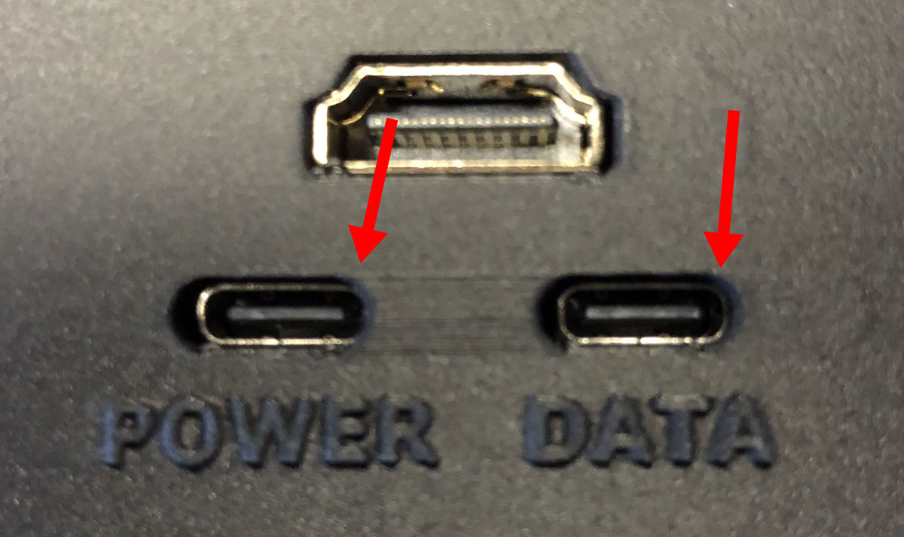

## Highlights

- I published my [fourth annual retrospective](/solo-developer-year-4/) about being a bootstrapped founder.
- TinyPilot sales continue running strong despite a delay in launching our next product.
- I analyze how I'm spending my time and figure out ways to allocate my hours better.

## Goal Grades

At the start of each month, I declare what I'd like to accomplish. Here's how I did against those goals:

### Launch Voyager 2: PoE Edition

- **Result**: Delayed the launch a few weeks due to a manufacturing issue
- **Grade**: D

I had to delay the launch because we discovered that the first manufactured batch of PoE hardware is behaving differently than our prototypes. We should be able to fix the boards, but it's going to take a few weeks.

### Write a job description for TinyPilot support engineer and begin interviewing candidates

- **Result**: I wrote a job description, but I haven't posted it to any job boards.
- **Grade**: C+

This is one of those things that I keep deprioritizing because it's [important but not urgent](/book-reports/7-habits-of-highly-effective-people/#time-management-matrix). If TinyPilot had a support engineer, it would get me out of frequent time crunches, so I need to prioritize it better.

### Publish my fourth [annual retrospective](/tags/annual-review/)

- **Result**: Published my [annual retrospective](/solo-developer-year-4/)
- **Grade**: A

I was glad to publish this retrospective, as I'd been working on it for several weeks. It's one of the few things I do that has a strict deadline, as I like the tradition of posting on my quit-iversary.

I was surprised the post didn't get more traction on Hacker News and reddit. Usually, my annual updates are popular there, but this year was a miss on both sites. As always, there's a lot of luck involved, so I can't draw too much from an individual post.

## [TinyPilot](https://tinypilotkvm.com/?ref=mtlynch.io) stats



| Metric                   | December 2021                            | January 2022                             | Change                                         |
| ------------------------ | ---------------------------------------- | ---------------------------------------- | ---------------------------------------------- |
| Unique Visitors          | 6,156                                    | 7,282                                    | +1,126 (+18%)       |
| Total Pageviews          | 12,840                                   | 15,477                                   | +2,637 (+21%)       |
| Sales Revenue            | $52,224.65                               | $51,066.78                               | -$1,157.87 (-2%)      |
| Enterprise Subscriptions | $47.75                                   | $47.75                                   | 0                                              |
| Royalties                | $1,100.47                                | $5,075.00                                | +$3,974.53 (+361%)  |
| Total Revenue            | $53,372.87                               | $56,189.53                               | +$2,816.66 (+5%)    |
| **Profit**               | **$-15,207.05** | **$-21,316.65** | **-$6,109.60 (-40%)** |

Sales were down slightly relative to December, but only slightly. Considering we had to pause sales for four days because we were sold out of Voyager 2, this feels like a stronger month than December.

I'm still cash flow negative and probably will be for the next month or two. Now that we're confident in the design for the Voyager 2, I'm stockpiling parts for the next 18-24 months so that we don't have to keep redesigning our circuit boards when parts go out of stock. We've had to redesign six or seven times already, and it's a costly, unpleasant process.

## How can I manage TinyPilot with only 20 hours per week?

One of my goals for this year is to [manage TinyPilot with only 20 hours per week](/solo-developer-year-4/#manage-tinypilot-on-20-hours-per-week). I'm currently spending about 45 hours per week on TinyPilot. I don't have a good way of measuring my time rigorously, but here's how I think the hours break down vs how I want to spend those hours:

| Task                                            | Hours per week | Ideal hours/wk |
| ----------------------------------------------- | -------------- | -------------- |
| Coordinating changes                            | 12             | 2              |
| Answering technical support questions           | 8              | 2              |
| Overseeing dev work                             | 5              | 2              |
| Preparing TinyPilot releases                    | 5              | 2              |
| Making software architecture decisions          | 4              | 2              |
| Communicating with employees                    | 3              | 3              |
| Communicating with major vendors / distributors | 4              | 1              |
| Administration/payroll/taxes                    | 2              | 0.5            |
| Answering sales questions                       | 1              | 0.5            |
| Answering non-technical support questions       | 1              | 0.5            |
| **Total**                                       | **45**         | **15.5**       |



**Note**: These are targets I want to hit on average, not strict limits. If a customer tells me they have a few questions about buying 200 Voyagers, I'm not going to say, "Sorry, I hit my half-hour limit on sales calls this week."



I spend most of my time coordinating changes. By this, I mean little adjustments as TinyPilot evolves. For example, releasing a new product involves many big changes upfront in assembling and shipping it, and then there are many small adjustments for months afterward as we work out all the kinks. It's a complicated enough topic that I split it into its own section [below](#how-can-i-spend-less-time-coordinating-changes).

Technical support is the most obvious place to outsource. I've been thinking for months that I should hire someone to help out with it, but I haven't been prioritizing it enough. I'm [working on that now](/retrospectives/2022/01/#the-last-unfilled-role-tech-support).

I spend more time than I should overseeing dev work, and that's mostly because I like being involved in software even when I don't need to be. Often, it's because I'm eager to see some change, and it's easiest if I do it myself. I need to exercise more discipline and patience in delegating to TinyPilot's dev team.

I'm still spending too much time preparing TinyPilot releases, but I've been working on automating and delegating that. Each release used to take me about 35 hours between building, testing, and writing the release announcement. Now, it's down to about 15 hours. The dev team has automated a lot of the build process, and TinyPilot's local staff has taken over most of manual testing. There's still more to do, but we're making steady progress.

## How can I spend less time coordinating changes?

Coordinating changes is one of the biggest places where I spend my time, and it's one of my least fun responsibilities.

A recent example of change coordination involved making an adjustment to the Voyager 2's cases. TinyPilot's EU distributor emailed me to say that on about 10% of his Voyager 2 builds, the USB-C ports came out misaligned so badly that he couldn't plug in USB-C cables.

{{}}

This was the sequence to get it sorted out:

1. I email the distributor to say I'll investigate and get back to him.
1. I email TinyPilot's local staff to ask if they've seen anything similar.
1. TinyPilot's local staff says they've seen it, but not as extreme as the distributor is seeing it.
1. I ask staff to investigate where the inconsistency in builds is coming from (e.g., case, PCBs, build technique).
1. Staff tells me that after a few hours of investigating, they haven't been able to pinpoint a cause.
1. I email our distributor letting him know that we're revising the case to fix the issue.
1. I email our 3D printing partner and ask him to work around it by widening the USB-C holes.
1. TinyPilot's 3D printing partner prints a prototype and ships it to us.
1. I ask TinyPilot's staff to test a build with the new case and verify it works.
1. Staff verifies that the new case works and should fix the issue.
1. I email our 3D printing partner asking for the design files and requesting that we change our cases to the new design.
1. 3D printing partner sends me the case design files.
1. I send the design files to our distributor.

So, that was a lot of work to fix a skew of a few millimeters.

Looking back, I don't see obvious pieces I should have delegated. I can't put my distributor in contact with my staff or 3D printing designer and just tell them to do whatever he asks.

I guess I could have delegated more of the interaction with the 3D printing vendor. Steps 7 to 11 could have been, "I ask my staff to work out a fix with the 3D printing vendor and send me the design files when they're done." That would have only saved me a small amount of work, but I should still get in the habit of empowering TinyPilot's local staff to own more of our assembly process.

Obviously, we don't run into this situation every week, but similar issues crop up once or twice a week that require coordination between disparate parts of TinyPilot, and they I usually need to make final decisions.

The other factor is the sheer number of changes happening all the time. Right now, I'm overseeing seven separate major projects:

1. We're switching electrical engineering vendors.
1. We're revising the Voyager 2's electrical design in response to part shortages.
1. We're wrapping up manufacturing and testing for the PoE version of the Voyager 2.
1. We're redesigning the website.
1. We're hiring our first support engineer.
1. We're exploring case manufacturing options that allow us to produce higher volumes.
1. We're working with an external consultant to add H264 video support to TinyPilot.

From this, I'm realizing I should be more conservative in taking on major projects. If I change fewer things, I'll spend less time coordinating changes.

Another change I can make is to treat bandwidth as a first-class concern when hiring external vendors. The website redesign is taking months longer than I expected because the design firm is averaging only five hours per week on TinyPilot when I expected it to be more like 20. In the future, I'll talk more with vendors during the interview phase about their weekly capacity.

## Legacy projects

Here are some brief updates on projects that I still maintain but are not the primary focus of my development:

### [Is It Keto](https://isitketo.org)



| Metric                   | December 2021 | January 2022 | Change                                         |
| ------------------------ | ------------- | ------------ | ---------------------------------------------- |
| Unique Visitors          | 15,781        | 25,948       | +10,167 (+64%)      |
| Total Pageviews          | 35,740        | 59,351       | +23,611 (+66%)      |
| Domain Rating (Ahrefs)   | 11.0          | 14.0         | +3.0 (+27%)         |
| AdSense Revenue          | $171.00       | $291.47      | +$120.47 (+70%)     |
| Amazon Affiliate Revenue | $30.21        | $51.45       | +$21.24 (+70%)      |
| **Total Revenue**        | **$201.21**   | **$342.92**  | **+$141.71 (+70%)** |

Ouch! January is usually a huge month for Is It Keto with all the New Year's resolution dieters, but this was the weakest January comeback the site has ever seen.

I can't complain because I'm doing nothing to maintain the site, but I was hoping it wouldn't fade out so quickly.

### [Hit the Front Page of Hacker News](https://hitthefrontpage.com/)



| Metric                    | December 2021 | January 2022 | Change                                        |
| ------------------------- | ------------- | ------------ | --------------------------------------------- |
| Unique Visitors           | 106           | 140          | +34 (+32%)         |
| Gumroad Revenue           | $19.30        | $66.59       | +$47.29 (+245%)    |
| Blogging for Devs Revenue | $27.30        | $0.00        | -$27.30 (-100%)      |
| **Total Revenue**         | **$46.60**    | **$66.59**   | **+$19.99 (+43%)** |

Things are still pretty quiet with the blogging course. There was one new purchase, but that's all. It seems like everyone who follows me that's interested in the course has already purchased by this point.

### [Zestful](https://zestfuldata.com)



| Metric            | December 2021 | January 2022 | Change                                       |
| ----------------- | ------------- | ------------ | -------------------------------------------- |
| Unique Visitors   | 461           | 564          | +103 (+22%)       |
| Total Pageviews   | 1,176         | 1,514        | +338 (+29%)       |
| RapidAPI Revenue  | $1,252.31     | $847.38      | -$404.93 (-32%)     |
| **Total Revenue** | **$1,252.31** | **$847.38**  | **-$404.93 (-32%)** |

Zestful dipped a bit, slumping back under its $1k/month revenue, but clients are still actively using the service, and I'm receiving inquiries from potential new customers every few weeks.

## Wrap up

### What got done?

- Published my [fourth-year retrospective](/solo-developer-year-4/)
- Released [TinyPilot 2.3.2](https://tinypilotkvm.com/blog/whats-new-in-2022-01)
- Began transition process to my new electrical engineering vendor
- Worked with an external consultant to create a [proof-of-concept WebRTC implementation](https://github.com/tiny-pilot/tinypilot/tree/experimental/h264) of TinyPilot's video streaming

### Lessons learned

- Change fewer things at once.
  - I need to keep track of how many ongoing changes are happening and resist the urge to start any new projects until previous projects wrap up.
  - It's easy to feel like I have spare capacity because projects vary in how much attention they need each week.
  - Each new project increases the risk of an unlucky week where too many changes demand my attention at once.
- Treat vendor bandwidth as a first-class concern.
  - If you hire a vendor for a one-off project, and they have only a few hours of availability each week, it stretches out the project and costs more of your time in context-switching.

### Goals for next month

- Launch Voyager 2: PoE Edition
  - For real this time.
- Hire a TinyPilot support engineer
- Complete design work on TinyPilot website overhaul
