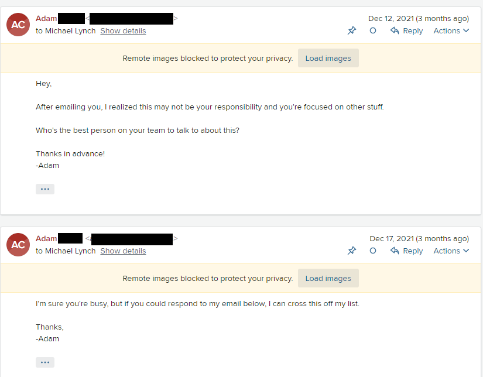
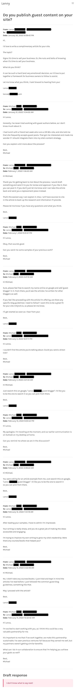
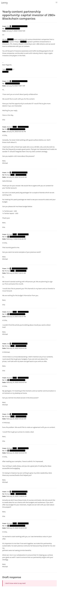

## Highlights

* I hired TinyPilot's first support engineer.
* I learned that hiring a support engineer is even harder than I expected.
* I'm evaluating platforms for paying international contractors.

## Goal Grades

At the start of each month, I declare what I'd like to accomplish. Here's how I did against those goals:

### Launch Voyager 2: PoE Edition

* **Result**: I finally [launched Voyager 2 PoE](https://tinypilotkvm.com/blog/voyager-2-poe)
* **Grade**: A

Oh, boy. This took way longer than I expected. I looked back at the original design document that I wrote in early April 2021. I estimated that we'd have 200 units ready by May 15, 2021. In other words, I estimated six weeks, and it took 11 months.

### Hire a TinyPilot support engineer

* **Result**: Started a trial hire with a support engineer
* **Grade**: A

It was a lot of work to hire for this role, but I'm excited to have this new member of the team. This retrospective is mostly about the process of hiring a support engineer, so read on for more details.

### Complete design work on TinyPilot website overhaul

* **Result**: Deferred this until March
* **Grade**: N/A

The design firm I'm working with had too few hours to complete the design in February. I've negotiated guaranteed hours with them in March and April, so I expect to complete this by the end of the month.

## [TinyPilot](https://tinypilotkvm.com/?ref=mtlynch.io) stats



| Metric                   | January 2022   | February 2022  | Change                                              |
| ------------------------ | -------------- | -------------- | --------------------------------------------------- |
| Unique Visitors          | 7,282          | 6,991          | -291 (-4%)                 |
| Total Pageviews          | 15,477         | 14,916         | -561 (-4%)                 |
| Sales Revenue            | $51,066.78     | $49,026.99     | -$2,039.79 (-4%)           |
| Enterprise Subscriptions | $47.75         | $47.75         | 0                                                   |
| Royalties                | $5,075.00      | $3,552.41      | -$1,522.59 (-30%)          |
| Total Revenue            | $56,189.53     | $52,627.15     | -$3,562.38 (-6%)           |
| **Profit**               | **-$8,425.67** | **$27,039.62**\* | **+$35,465.29 (+inf%)** |

\* Profit is just a rough estimate based on the delta in my cash holdings until I complete real bookkeeping for the month.

Sales have been steady since January. Total sales are down slightly due to the shorter month, but on a per-day basis, I actually did better than in January.

My profit was atypically high in February, but it's mainly a consequence of timing. I'm waiting to receive a few large invoices, and my business credit card finally increased my line of credit by $20k, so I'm holding more cash.

## Hiring a support engineer: the job posting

I've wanted to hire a support engineer for the past few months, but I've been short on time. It took even longer than I expected, but I've hired my first support engineer. The first step was to create a [job posting](https://tinypilotkvm.com/jobs/support-engineer/).

I advertised the job description in three places:

| Channel | Cost | Total Candidates | Passed Initial Screen | Trial Hires |
|---------|------|------------------|-----------------------|-------------|
| [Twitter](https://twitter.com/deliberatecoder/status/1488993366666887168) | $0   | 2                | 1                     | 0           |
| [Hacker News](https://news.ycombinator.com/item?id=30184256) | $0 | Didn't track, seemed low | N/A | N/A |
| We Work Remotely | $358 | 219 | 18 | 1 |
| **Total** | **$358** | **221** | **19** | **1** |

One of the problems with hiring is that, as a small business owner, I want to hire someone who understands what my company is and communicates that to me. The problem is that most companies treat their candidates like garbage. This creates an ecosystem that discourages candidates from investing time into any particular company because there's a 90% chance that their application is going into the void.

When I wrote the job posting, I tried to make it clear that I'm personally reading each and every application. Applications aren't going to a machine learning bot or a clueless recruiter who's blindly screening on keywords. If you put in effort, I'll put in effort.

I also wanted candidates to feel that I respected their time throughout the hiring process because that's how I want them to feel when we work together.

A lot of job postings say something like, "Mention the word `banana` in your cover letter, so I know you read this description carefully." I deliberately chose not to do that, as I feel like it starts the relationship off on a sour tone. I don't want candidates to think my default assumption is that they're lazy or incompetent. It only takes me a few seconds to recognize a low-effort application, so I don't need magic keywords.

I wasn't sure what to choose for pay. It's tough to gauge the market rate for this role because so few job postings list compensation, especially for a part-time contract role. I chose $40/hr, but other founders I spoke to say they'd expect to find a qualified candidate for $20-30/hr.

## Hiring a support engineer: screening applications

Once the job posting was up, it was time to start screening applications. This was the most time-consuming part of the process.

At this stage, I was evaluating:

* Is their writing clear and syntactically correct?
* Did they take the time to learn about TinyPilot?
* Do they have experience with support or writing user-facing documentation?
* Do they meet the technical requirements?

I tried to identify standout candidates and responded to them quickly. For everyone else, I either fast-rejected them or put them in a queue for a response as I had availability.

I quickly found that I needed some sort of organization system for managing candidates at different stages of the process, so I sorted all the ongoing threads into email folders:

### instant-reject

My `instant-reject` folder was for candidates who didn't follow the instructions about how to apply. This included:

* Candidates who sent me a blank email with only their resume attached
* Candidates whose letter didn't mention any specifics about the job or TinyPilot (recycled application)
* Candidates who didn't meet the job requirements and didn't acknowledge the gap in their cover letter

For these candidates, I moved their application to the `instant-reject` folder and didn't send a reply.

I put 138 candidates (62% of total) into the `instant-reject` folder.

### cover-letter-reject

The `cover-letter-reject` folder was for candidates who made a good faith effort to apply, but I could tell from their cover letter or resume that they were a poor match.

For these candidates, I sent individualized responses. Here's an example:

>Hi Joe,
>
>Thanks for reaching out and for taking the time to learn more about TinyPilot.
>
>Unfortunately, I don't think this would be a good match.
>
>It seems like you have a lot of great experience with Linux and Raspberry Pi, but the position requires someone with more experience writing customer-facing content. Your English is pretty strong, but there were several errors in your letter and resume, so I don't think this role would be a good fit.
>
>I'm sorry it didn't work out, but I wish you the best of luck in your search.
>
>Best, 
Michael

In the response, I'm trying to emphasize that I'm rejecting their *application* rather than saying, "I'm rejecting [**you**](/human-code-reviews-1/#never-say-you)." I avoided getting too specific because I didn't want the candidate to feel like I was picking on them or rejecting them over a single careless error.

Most employers skip individualized rejection letters, and I understand why. It's a huge time-suck, and it has no benefit for the employer. Still, I feel like it's disrespectful to ignore people or send them a form letter after I've asked them to spend unpaid time applying to work with me.

About 65% of candidates never responded to my rejection letter. Roughly 25% told me they appreciated the feedback. Of these, a few asked for clarification, and I gave specific notes about things they could fix and recommended resources for improving their writing.

Of candidates who received a rejection note, about 10% tried to convince me that they could prove themselves if I let them complete my screening questions. It was tempting, but giving feedback on screening questions takes an order of magnitude more time than rejecting at the cover letter stage, so I didn't want to waste time for both of us.

Most of the people who responded seemed surprised and grateful to receive a response that cited specific problems with their application, as that seems to be rare. Nobody became hostile in their responses. Everyone stayed professional.

I put 62 candidates (28%) into the `cover-letter-reject` folder. Between `instant-reject` and `cover-letter-reject`, only 19 candidates (9%) made it past the resume screen.

### pending-questions

If a candidate's cover letter had clear, grammatically correct English, and they met the technical requirements, I wrote them a personalized response telling them what I liked about their application and why I think they might be a match for TinyPilot.

I then invited these candidates to answer three example customer support requests so I could get a sense of how they speak to customers and offer technical solutions.

After I responded, I put them in the `pending-questions` folder until they completed the questions.

19 candidates (9%) reached this stage. Of those, only 10 (53%) submitted answers, though two or three candidates only got the questions in the last few days and may still respond.

### questions-reject

When the candidate shared their answers to my sample questions, I decided whether to proceed with them to a trial hire.

I sent all candidates who answered the sample questions detailed feedback regardless of whether I was making them an offer. I got this idea from Firebase founder, Andrew Lee:

>It’s critical that candidates don’t feel their time is wasted. At Firebase, we made sure of this by putting a great deal of effort ourselves into the take home test process... [A]fter they submitted their answer, we would provide them with a thorough and detailed code review (usually by the legendary [@mikelehen](https://twitter.com/mikelehen)).

>We treated this code review like a real production code review, and we did it whether or not we planned to move forward with the candidate. This review was very important for two reasons. First, it showed the candidate that we took them seriously and that we were investing a significant amount of our own time in the interview process. Second, it gave the candidate an idea of what working at Firebase might be like; “If they do code reviews this well for their coding challenges, I can’t wait to work with this team on real production code!”
>
>-Andrew Lee, ["How Firebase Interviewed Software Engineers"](https://startupandrew.com/posts/how-firebase-interviewed-software-engineers/)

Andrew's process always stuck with me as the right way to treat people, so I've tried to apply that mentality in hiring for any position.

Most people were appreciative of the detailed feedback and said they found the notes helpful. One person felt that my criteria were too narrow, and I ended up changing the question based on his feedback.

Of candidates who answered the questions, I put 17 of 19 (89%) in the `questions-reject` folder.

### maybe-trial-hire

In the first week of my search, one candidate answered the screening questions pretty well, but I still had reservations. They were the best I'd seen so far, but I wanted to see more options. I told them that I was going to have a decision for them in a few weeks, and I put them in the `maybe-trial-hire` folder. I ended up finding a candidate who was a better match, so I later told the "maybe" candidate I went with someone else.

After I hired my first support engineer, I realized it would be too hard to run a trial hire with multiple candidates. With developers, I can run multiple trial hires at once because I can just give them separate tasks. It felt too dog-eat-dog to have multiple support engineers seeing each other's answers on the help forum and knowing that they're competing for the same job.

I'm still keeping the `maybe-trial-hire` folder in case I add support engineers in a few months. I'm transparent with candidates that I'm already running a trial hire, but  they can continue with their application, and they'll be on my shortlist if I hire additional support later. Alternatively, I give them the option to pause their application and resume from where they left off.

### trial-hire

I was only trial hiring one person at a time, so it was easy to track at that stage. But, for completeness' sake, I created a folder for the final stage of the hiring funnel.

### Summary

Converting my folder system to a "hiring funnel," here are what the numbers looked like at each stage:

| Stage | # of candidates | % of total |
|-------|-------|-------------|
| Applied for the job | 221 | 100% |
| Met the minimum application requirements | 83 | 38% |
| Strong enough application to offer sample questions | 19 | 9% |
| Trial hire | 1 | 0.5%

## Hiring a support engineer: payment

I currently work with three freelance developers, each in a different country. They all receive payment in different ways. Now that I'm adding a fourth contractor, I thought I should standardize the payment process with a single solution.

I looked for payment platforms for remote workers that would do the following:

* Minimize everyone's time dealing with invoicing and payments
* Manage compliance documentation
* Manage contract documents
* Make it possible for contractors to record expenses
* Make it easy for contractors to track their billable time without installing spyware

### Deel (winner)

I ended up choosing Deel, as they ticked all of my boxes. I'm only a week in, but it's going well so far.

Deel seems to be more transparent than other providers in showing the exact amount that will arrive in the contractor's bank account in their local currency. Other providers just promise to do their best in finding good conversion rates, but contractors only find out the final rate when the payment lands in their bank account.

Deel is also planning to expand into payroll services for US-based employees. That would be great for me, as I've been disappointed with Justworks and Gusto.

### Pilot

Pilot is pretty similar to Deel. They're both backed by Y Combinator, and they have a similarly slick UI. Pilot doesn't support time tracking, while Deel does.

I signed up for Pilot first, and I was planning to use them, but they took an entire week to activate my account. In the meantime, another founder mentioned Deel, so I switched. I guess it pays to onboard your customers well.

### Remote

Remote offers free payments for contractors. Sounds great, right? Free service was the dealbreaker for me.

If Remote can offer a service for free that others are charging $30-50/mo per contractor, something is fishy. It might mean they're making money from me in some unexpected way like they hide fees in their currency conversion rate. Or it could mean that contractors are a use-case they don't care about, and they might suddenly drop it, as we see Google do over and over with their free services.

### Gusto

I'm already using Gusto as a payroll service for my local staff. I'm not crazy about Gusto, but using a single service to pay everyone would be convenient.

Unfortunately, Gusto only supports international contractors if they receive a fixed dollar amount each pay cycle. If your contractors work different hours each week, Gusto won't work.

## Legacy projects (RIP)

I used to keep a regular section in my retrospectives for updates on my legacy businesses, but the writeups have gotten pretty boring. They're all essentially, "I did nothing. Here's how that affected my metrics."

I'm replacing "Legacy projects" with "Side projects" so I can talk about the hobby projects I play with on weekends and evenings.

## Side projects

### [Lenny](https://lenny.email)

Lenny is a chatbot that responds to spam emails on my behalf.

Spam is getting more aggressive. Spammers are now sending automated message sequences when I don't respond to their first message.

{{}}

It annoyed me that spammers can keep invading my inbox and wasting my time, and all it costs them is a fraction of a penny per email and a new domain every few months. And they're doing this to thousands of people because they don't have to put in any effort until they get a response. I wanted a way to increase the spammers' costs so that bulk, semi-targeted emails aren't as cost-effective.

I was inspired by [a YouTube channel](https://www.youtube.com/channel/UCrBZYWrikliO6EPZKM7KxVQ) that wastes telemarketers' time with a voice chatbot. The channel maintains a VoIP number that takes calls from telemarketers and responds with recordings of a kindly Australian man named Lenny. The recorded responses always express interest in what the telemarketers are selling but with lots of rambly digressions. Lenny has probably cost telemarketing firms tens to hundreds of thousands of dollars.



I've built my own version of Lenny, but for email rather than voice calls. Now, when I get spam emails, I forward them to my own email-based Lenny. Lenny responds enthusiastically to the spammer, but he keeps getting distracted and sending the conversation in circles.

The following are two different spammers responding to the same message sequence I wrote for my chatbot. Lenny manages to get five responses from each spammer before they each give up at the same point. In the second example, Lenny's responses stop making sense in the context of the spammer's messages, but the spammer keeps going for a while.


  {{}}
  {{}}


I'm trying to keep the third-party dependencies to a minimum, but in February, I started using the [Bulma CSS framework](https://bulma.io/), and it makes the UI look a lot better.

Outside of that, I've been working on making it easier to define new responses. Currently, all the responses are baked into the code, but I want to make them editable through the web UI.

I'm not sure where Lenny will go as a project. I might release it as a free, open-source tool, but I feel like people might be willing to pay for this as a hosted service. For now, I'm just working on it for my own entertainment, but I hope to offer it to others in the next few months. If you're interested in paying for early access, [sign up](https://mtlynch.eo.page/lenny).


I just realized as I'm writing this that the [Lenny telemarketing bot](https://www.lennytroll.com/) author seems to be building a business around his chatbot, so I'll probably have to change the name.


### [PicoShare](http://pico.rocks)

PicoShare is a simple tool for sharing files.

There are a million services that will let you host and share files, but they all get in your way in one form or another. For example, I can't just upload a video to Google Drive and send someone a link. Google Drive insists on re-encoding the video, so it's a 10-minute wait before the video is even available. And even then, the recipient has to navigate through the Google Drive UI to even play the file. It's the same on Dropbox, imgur, etc.

PicoShare is a no-frills, no-hassle file-sharing service. You upload a file and get a direct link. Anyone with the link can view it or download it directly without signing up for an account or viewing ads.

I used PicoShare recently to share a short clip from *30 Rock* with my family in a group text. Here's what it looks like for me to upload the clip to PicoShare and get a shareable link:



PicoShare also supports setting an expiration time for shared files. Sometimes I want to share a file for TinyPilot, but maybe it has sensitive data that I don't want sitting in someone's email account indefinitely. In the past, I've uploaded the files to cloud storage and shared a link, but then I have to remember to delete the file later. PicoShare automates it by auto-deleting the file after its expiration.

I only started working on PicoShare a few weeks ago, so it's still rough. I don't think there's a business here because the cost of policing abuse is too high. For now, it's [open-source](https://github.com/mtlynch/picoshare), but I'm still rapidly changing it, so I haven't invested much into documentation.

## Wrap up

### What got done?

* Launched [TinyPilot Voyager 2 PoE](https://tinypilotkvm.com/blog/voyager-2-poe)
* Hired TinyPilot's first support engineer
* Created [PicoShare](https://pico.rocks)

### Lessons learned

* Use the hiring process as a preview of your working relationship.
  * Talented people want to work with people who treat them well.
  * Your job description and hiring process should show candidates that you'll respect them and value their time.
* You can't spot generic applications if your job description is generic.
  * If you write a generic job description, you'll get recycled applications that say nothing specific about your company.
  * Use the job description to distinguish your company from others. Give candidates unique things they can talk about in their cover letter to demonstrate that they've put effort into learning about your company.
* Treating candidates well is expensive, but it delights people.
  * It takes 10x longer to treat rejected candidates respectfully, but that doesn't mean you should skip it.
  * If you're a founder, you choose how you treat people, even if it doesn't directly benefit you.

### Goals for next month

* Publish TinyPilot Pro 2.4.0
* Wrap up design overhaul of the TinyPilot website
* Complete onboarding for TinyPilot's new support engineer
