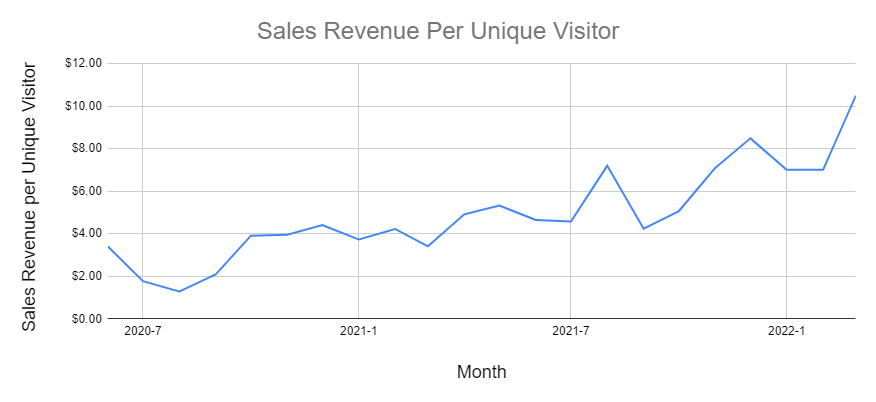

## Highlights

- TinyPilot had its best month of sales ever, at $69k of total revenue.

## Goal Grades

At the start of each month, I declare what I'd like to accomplish. Here's how I did against those goals:

### Publish TinyPilot Pro 2.4.0

- **Result**: XX
- **Grade**: XX

TODO

### Wrap up design overhaul of the TinyPilot website

- **Result**: XX
- **Grade**: XX

TODO

### Complete onboarding for TinyPilot's new support engineer

- **Result**: XX
- **Grade**: XX

TODO

## [TinyPilot](https://tinypilotkvm.com/?ref=mtlynch.io) stats



| Metric                   | February 2022  | March 2022                                | Change                                           |
| ------------------------ | -------------- | ----------------------------------------- | ------------------------------------------------ |
| Unique Visitors          | 6,991          | 6,212                                     | -779 (-11%)             |
| Total Pageviews          | 14,916         | 13,375                                    | -1,541 (-10%)           |
| Sales Revenue            | $49,026.99     | $65,171.82                                | +$16,144.83 (+33%)    |
| Enterprise Subscriptions | $47.75         | $47.75                                    | 0                                                |
| Royalties                | $3,552.41      | $4,012.83                                 | +$460.42 (+13%)       |
| Total Revenue            | $52,627.15     | $69,232.40                                | +$16,605.25 (+32%)    |
| **Profit**               | **$27,039.62** | **-$2,551.26**\* | **-$29,590.88 (-inf%)** |

\* Until I do real bookkeeping mid-month, Profit is just an estimate based on my change in cash.

The big change is that we released the Voyager 2 PoE. We sold 14% more devices than February, but almost half of them were our new Voyager 2 PoE, which costs $60 more than our standard model. The new, premium product had a significant impact on our sales.

My profit was negative, but that's really about odd timing of expenses this month. Profit for the first quarter of 2022 is at a healthy $16k, averaging $5.3k per month.

{{}}

Revenue per visitor was its highest ever, at $10.49 per unique visitor. To put that in context, my average revenue per visitor this time last year was about $4. I think improvements in the product, pricing, and the website have made people more likely to purchase.

## The return of discretionary time

In February, I brainstormed how I could manage TinyPilot [with 20 hours per week](/retrospectives/2022/02/#how-can-i-manage-tinypilot-with-only-20-hours-per-week).

One of the largest demands on my time was technical support, which occupied 8 hours per week.

TinyPilot's first support engineer, Diego, is now ramped up. He answers all the questions in the support forum now. He also published his first tutorial, a guide to [setting up Tailscale on TinyPilot](https://tinypilotkvm.com/blog/tailscale).

I've also been making an effort to let TinyPilot's staff take on more responsibility. There are lots of little routine tasks that I've been doing in coordinating with our vendors. For example, this week, we found out that the specific type of screw we use to assemble the Voyager 2 is now out of stock everywhere. Normally, I would work with our case designer to find a replacement and verify it works, but instead, I'm letting TinyPilot's staff take it on.

One of the things I'm happy to do again is write. I've been working for the past few weeks on a blog post in my [homelab](/tags/homelab/) series. I enjoy writing them, and they bring a lot of new customers to TinyPilot. I've always wanted to write more of them, but it's hard to outsource because I have to find someone knowledgeable about building computers, good at writing, and interested in freelance work.

I'm focusing my free time on marketing, automation, and delegation. For the last six months, we've been shifting from the Voyager 1 to the Voyager 2. It's hard to work on efficiency when everything is in flux. Now that there's less change, I want to focus on optimizing our workflows.

- Automating our release process
- Automating our end-to-end testing
- Establishing escalation paths between TinyPilot's customer service staff and support engineer
- Establishing repeatable workflows with our manufacturers

I'm resisting the temptation to spend this new free time on adding things. I keep thinking, "Oh, I should add this feature or hire this person." And I have to remind myself that those things are always more complicated than they first seem. I've been scrambling to manage too many growth projects for the past year, so now it's time to optimize what I have right now.

## Keep reinvesting or start collecting income?

I want to keep iterating on the software, as that's the part I enjoy most.

My big expenses now are redesigning the website ($5-6k/month) and iterating on the Voyager 2's electrical design ($5-6k/month). In a few months, I expect those costs to drop drastically, as we finalize circuit boards and I stop fiddling with the website.

At that point, do I continue investing in either category? I could have the designers start working on the TinyPilot app itself to make it look more professional.

And I can begin working on

One thing that could shift things is that I applied for a grant for manufacturers affected by the supply shortage. I could win up to $25k toward the Voyager 3, and then that slightly shifts things, but it's still.

Do I start on Voyager 3? Voyager 3 will probably cost $100-150k, which will essentially swallow my profit for the next year. But it would allow me to add features that make Voyager competitive with similar products in the $1,500-$3k range while not significantly increasing my manufacturing costs. So we'd be making $1-2k on every sale rather than $250-350.

## What I wish I knew about working with a design agency

Back in September, I [hired a design agency](/retrospectives/2021/10/#investing-more-into-design) to improve the TinyPilot website. At the time, I thought the project would take six weeks and cost $7k. Six months later, I've spent $39,577, and the project is still not done.

There are many factors that led to this point. Some of these were mistakes on the agency's side, but the majority of the problems came from me not knowing how to work effectively with an agency. I've only ever hired freelancers, and I didn't realize how different things are when working with an agency.

### An agency requires more management, not less

My perception of design and development agencies is that they cater to people who don't have experience managing people or projects. Going into the project, I felt like the agency would require less oversight and management

In theory, the agency could give you a single point of contact, and that person abstracts the rest of the team from you, but then you'd be playing telephone through that person and things would get lost in translation. So working with an agency team necessarily means communicating with more people than if you're working with an individaul freelancer.

The fundamental mistake I made when hiring this agency was underestimating the time I'd need to manage them. I budgeted the amount of time I'd allocate to hiring one freelancer, but I should have budgeted more like three. I think I could have avoided a lot of these problems if I was more on top of the project instead of assuming that the agency would mostly manage itself.

### Aggressively protect your scope

The biggest problem with this project has been in scoping.

Initially, the agency and I agreed that the project was just a rebrand. We'd create a new logo, color scheme, and font for the website and then evaluate next steps. But then came scope creep. The designers kept silently expanding the scope until I found myself halfway through [a full redesign of the website](/retrospectives/2022/01/#tinypilots-new-logo-and-learning-to-work-with-designers).

I kept feeling like if I let them go for a little longer, they'd be done but things kept dragging on and on. Looking back, I should have just cut my losses and downscoped the project down to just the rebranding as we had originally planned. But this goes back to underbudgeting my management time. I was scrambling to manage all the changes that came with switching from Voyager 1 to Voyager 2 at the time, so the easiest thing for me to do was let the agency keep going.

Even though I thought I learned my lesson, scope creep bit me again this month. I'm now on a retainer plan with the agency, so I buy a certain number of hours from them up front each month. They asked that I start the month with a list of tasks. I don't get a refund on unused hours, so they recommended I overbook the schedule to prevent them from running out of tasks and leaving hours unused.

I enumerated the design tasks I wanted them to finish, and I wasn't sure how long it would take, so I added some low-priority bugs to the list just in case they sped through all the design work. But you know where this is going. They left all of the design tasks half-finished, but they used 16 out of the 60 hours fixing all the low-priority bugs. Going forward, I need to set better expectations so they know not to work on non-critical tasks until all the critical tasks are complete.

### Beware open loops

If you assigned a freelancer tasks A, B, C, and D, it would be odd if they abruptly stopped working on task A when it was 80% complete and then started working on task B instead. It would be even more bizarre if they stopped at the halfway point on task B and started tasks C and D.

With an agency, it's easy to end up in a situation where several tasks are only 80% complete because multiple people are working in parallel, but not necessarily on the same schedule. Maybe Alice at the agency only has 10 hours free this month, so she gets 80% through task A. Bob starts next, and he also only has 10 hours free. He doesn't want to duplicate effort by finishing off Alice's work, so he starts task B and gets 30% through it. Before you know it, you've spent $39,577 and you can't use any of the work because it's all only 80-90% finished.

In the book _Getting Things Done_, David Allen describes unfinished tasks "open loops." The more open loops, the bigger the drain on your focus because you're managing so many things.

Open loops are also worse value for your money. Suppose you hire someone to complete six tasks over the course of six months. If you're hiring an individual, they'd deliver about one task per month, so you never have to wait more than a few weeks before you start paying for the work and when you start realizing the value of that work. With an agency, they might assign those six tasks to six people who only spend 1/6th of their time on your project, so .

Presumably, you're paying for this work because you expect some sort of return on this investment, such as increased sales from a better design. With the individual, you're realizing these results much earlier. So if you're getting a 3% increase in sales from each task, the serialized tasks would have paid off much earlier.

### Agree on hours per month

Even though I signed a retainer agreement for 60 hours of work in March, the agency isn't obligated to deliver 60 hours. The contract says that if they can't reach 60 hours, they either refund me the hours or roll them over to the next month.

I'd love to agree on _deadlines_, but designers don't want to agree to that. And that's reasonable because the deadlines aren't completely within their control. A job can be done in 15 hours if you love the first thing they show you, but if you keep rejecting things, the project timeline grows unbounded.

### Beware of latency

Even with a retainer agreement, I don't have any guarantees around latency. For this past month, there was no design work at all for the first

The designer I've been working with isn't available for several weeks, so the design sits half done. By the time we circle around, we've lost a lot of momentum. And at that point, I'm much less interested in polishing the design because who knows if it's going to be another three weeks before I hear back, so I have to drop my standards more than what I'd necessarily want.

## Side projects

### [PicoShare](https://demo.pico.rocks/)

Two YouTube creators made videos about it.

David Burgess made [a video about it](https://www.youtube.com/watch?v=9eJeA8If0dY).

Got contributions for copying links to clipboard.

Store files in chunks rather than in single blobs.

I added support for multiarch Docker images, so now you can run the Docker image on ARM-based systems like the Raspberry Pi. The process of creating multiarch builds is [surprisingly simple](https://github.com/mtlynch/picoshare/pull/164/files), but it was so hard to find instructions for it because the process keeps changing.

I added a live demo. I was trying to figure out a way to prevent abuse, and I realized I could cut out a lot if I make it so that you can only download your own files.

Added a CLA.

## Wrap up

### What got done?

- Released TinyPilot Pro 2.4.0
- Released the v1 of PicoShare

### Lessons learned

-

### Goals for next month

- Publish a blog post about building a homelab NAS server with TinyPilot
