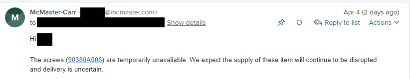

## Highlights

- TinyPilot had its best month of sales ever, at $69k of total revenue.
- How I went five months and $32k over budget on a website redesign.
- PicoShare is now the fastest-growing project I've ever published.

## Goal Grades

At the start of each month, I declare what I'd like to accomplish. Here's how I did against those goals:

### Publish TinyPilot Pro 2.4.0

- **Result**: Released TinyPilot 2.4.0 on schedule
- **Grade**: A

The latest release [added support for multiple users](https://tinypilotkvm.com/blog/whats-new-in-2022-03#credentials-for-multiple-users), which customers had requested for a while. We also [eliminated an annoying bug](https://tinypilotkvm.com/blog/whats-new-in-2022-03#improved-hardware-compatibility) that generated frequent support requests.

### Wrap up design overhaul of the TinyPilot website

- **Result**: The design is done, but it's not published yet
- **Grade**: C

This project is continuing to take longer than I expected. We're done with the designs themselves, but the design agency hasn't had capacity to implement the code changes to publish them on TinyPilot's site.

### Complete onboarding for TinyPilot's new support engineer

- **Result**: Diego is ramped up and handling most support requests independently
- **Grade**: A

It took a long time to find the right engineer, but I'm happy this is working out. It's freeing up a significant amount of time for me already.

## [TinyPilot](https://tinypilotkvm.com/?ref=mtlynch.io) stats



| Metric                   | February 2022  | March 2022                                | Change                                           |
| ------------------------ | -------------- | ----------------------------------------- | ------------------------------------------------ |
| Unique Visitors          | 6,991          | 6,212                                     | -779 (-11%)             |
| Total Pageviews          | 14,916         | 13,375                                    | -1,541 (-10%)           |
| Sales Revenue            | $49,026.99     | $65,171.82                                | +$16,144.83 (+33%)    |
| Enterprise Subscriptions | $47.75         | $47.75                                    | 0                                                |
| Royalties                | $3,552.41      | $4,012.83                                 | +$460.42 (+13%)       |
| Total Revenue            | $52,627.15     | $69,232.40                                | +$16,605.25 (+32%)    |
| **Profit**               | **$27,039.62** | **-$2,551.26**\* | **-$29,590.88 (-inf%)** |

\* Until I do real bookkeeping mid-month, Profit is just an estimate based on my change in cash.

March was TinyPilot's best month ever in terms of sales and total revenue. We only sold 14% more devices than February, but almost half of them were our new Voyager 2 PoE, which costs $60 more than our standard model, which translated to a 33% increase in revenue.

My profit was negative, but that's more a function of how my expenses were timed. Profit for the first quarter of 2022 is at a healthy $16k, averaging $5.3k per month.

{{}}

Revenue per unique visitor reached $10.49, its highest ever. To put that in context, my average revenue per visitor this time last year was about $4. This is great news, as my plan was to focus on increasing the conversion rate on my website ("bottom of funnel") before focusing on marketing. The growth in this metric suggests my plan is working. I think improvements in the product, pricing, and website have made people more likely to purchase.

## I have free time again!

In February, I brainstormed how I could manage TinyPilot [with 20 hours per week](/retrospectives/2022/02/#how-can-i-manage-tinypilot-with-only-20-hours-per-week). I'm definitely not there yet, but I'm making progress.

One of the largest demands on my time was technical support, which took me 8 hours per week. That was the hardest responsibility to delegate because the hiring process took hundreds of hours. Even after I found a qualified engineer, training was time-consuming because I had two years of institutional knowledge trapped in my head.

I'm happy to say that we're now over the hump. Diego, TinyPilot's first support engineer, is now answering all questions in our [support forum](https://forum.tinypilotkvm.com/), so I'm averaging less than 8 hours a week on support. He also published his first tutorial, a guide to [setting up Tailscale on TinyPilot](https://tinypilotkvm.com/blog/tailscale).

I've also been making an effort to let TinyPilot's local staff take on more responsibility. For example, this week, we found out that the model of screw we use to assemble the Voyager 2 is now out of stock everywhere.

{{}}

Normally, I would work with our case designer to find a replacement and try building with the new screw, but I caught myself before emailing him. This was a good opportunity for TinyPilot's local staff to take on more responsibility, so I asked them to take the lead.

I noticed a significant difference in my time management throughout March. For the previous six months, I've ended most days feeling like I didn't finish everything and had to postpone [important but non-urgent tasks](/book-reports/7-habits-of-highly-effective-people/#time-management-matrix). In March, I often completed my urgent tasks by mid-afternoon and had free time to invest in marketing, automation, and delegation.

I'm resisting the temptation to spend this newly available free time on _adding_ things like hiring another person or finding new features for TinyPilot. I have to remind myself that those things are always more complicated than they first seem.

I spent 2021 scrambling to manage too many growth projects, so now it's time to optimize what we have:

- Automating our release process
- Automating our end-to-end testing
- Talking more with customers proactively instead of only when they contact customer support
- Establishing escalation paths between TinyPilot's customer service staff and support engineer
- Improving workflows with our manufacturers

## Keep reinvesting or start collecting income?

For all of TinyPilot's existence, I've ignored short-term profits and instead focused on long-term growth. I avoided running at a deficit, but I was happy to run at nearly breakeven, reinvesting all revenue into improving the product.

I thought of reinvestment as building momentum. If my sales were $3k/month and I spent $5k to improve the product to reach $4k/month, that $5k is a one-time cost, but then TinyPilot's sales velocity is permanently higher.

But I'm not a venture-backed startup. My goal isn't to grow forever and get an IPO. At some point, I have to stop putting everything into growth and start collecting income. Is that time now?

My main short-term expenses are optimizing the Voyager 2's electrical design for manufacturability ($10-20k/month) and redesigning the [sales website](https://tinypilotkvm.com) ($5-6k/month). In a few months, we'll finalize circuit boards for the Voyager 2, and I'll stop fiddling with the website, so those costs will fall drastically. If I sustain my sales, I'll earn $20k/month by just not starting any new projects.

My initial plan was to work with my electrical engineering partner on Voyager 3 as soon as we stabilized production for Voyager 2. Developing the Voyager 3 will cost about $15-25k per month for the next six months, swallowing my profit for the rest of the year. Not only that, it will consume a large portion of my time, as releasing a new product changes a lot of TinyPilot's internal workflows.

At this point, I think it's time to start collecting income. I can start new projects later in the year, but first, I'd like to grow sales to the $70-90k range so that I can invest in product improvements without draining all my profits.

## What I wish I knew about working with a design agency

Back in September, I [hired a design agency](/retrospectives/2021/10/#investing-more-into-design) to improve the TinyPilot website. At the time, I thought the project would take six weeks and cost $7k. Six months later, I've spent $39,577, and the project is still not done.

How did we get here? I can point to mistakes on the agency's side, but the core problem was that I didn't know how to work effectively with an agency. I've only ever hired freelancers, and I didn't realize how much an agency changes the dynamics.

I'm recording the things I wish I knew at the beginning, as a reminder to myself and in the hopes that it benefits someone who hasn't started working with an agency yet.

### An agency requires more management, not less

The fundamental mistake I made when hiring this agency was underestimating the time I'd need to manage them.

The agency works with me for 40-60 hours per month. That's the same amount of time as each of my other freelancers, so I thought the agency would require similar oversight to one freelancer. I should have budgeted significantly more time to manage them.

When you work with an agency, you're interacting with multiple people who are working on their own subprojects. More people necessarily means more management time.

For example, imagine you spent six to eight hours per week managing an employee who worked 40 hours per week. If you split that role into two people working 20 hours each, your management time would probably expand to 10-12 hours per week even though your employees are working the same total number of hours.

The same logic applies to a design agency. Even if you're getting 40 hours/month of work, there's more work for you as the client if you're working with six members of an agency as opposed to a single freelancer.

### Aggressively protect your scope

The biggest problem with this project has been in scoping. You might have guessed that based on the fact that I'm six months into a six-week project.

Initially, the agency and I agreed that the project was just a rebrand. We'd create a new logo, color scheme, and font for the website and then evaluate the next steps. But then came scope creep. The designers kept silently expanding the scope until I found myself halfway through [a full redesign of the website](/retrospectives/2022/01/#tinypilots-new-logo-and-learning-to-work-with-designers).

I kept feeling like if I let them go for a little longer, they'd wrap up within the month, but things kept dragging. Looking back, I should have just cut my losses and downscoped the project down to the rebranding, as we had originally planned. But I was distracted by the Voyager 2 launch during those months, so the easiest thing for me to do was let the agency keep going.

Even though I thought I learned my lesson, scope creep bit me again this month. I created a project board with outstanding tasks for the redesign in priority order. I booked 60 hours for the month, but I wasn't sure the design tasks would consume all the hours. I added some low-priority bugs at the end of the list in case the agency had time left over.

You know where this is going...

The design agency left all of the design tasks half-finished, but they used a quarter of my hours for the month to fix all the low-priority bugs.

Going forward, I need to set better expectations so they know not to work on non-critical tasks until all the critical tasks are complete.

### Beware open loops

If you assigned a freelancer tasks A, B, and C, it would be odd if they abruptly stopped working on task A when it was 80% complete and then started working on task B instead. It would be even more bizarre if they stopped midway through task B to start task C.

With an agency, it's easy to end up in a situation where several tasks are only 80% complete. Maybe Alice at the agency only has 10 hours free this month, so she gets 80% through task A. Bob starts next, but he doesn't want to pick up Alice's project midway through, so he starts task B and gets 30% through it. Before you know it, you've spent $39,577, and you can't use any of the work because it's all only 80-90% finished.

In the book _Getting Things Done_, David Allen describes unfinished tasks as "open loops." The more open loops you have, the worse your focus because each one occupies a bit of real estate in your mind. A freelancer will generally have only a couple of open loops with you at once, whereas a design agency can have 5-10x as many, and they drag on for longer.

Open loops are also worse value for your money. Suppose you need to complete six tasks over the course of six months. If you hired an individual, they'd deliver about one task per month. If you pay them at the end of each month, by the time you've paid, you're already enjoying the benefit of the work. With an agency, they might assign those six tasks to six people who only spend 1/6th of their time on your project. At month five, you've spent 80% of the money and enjoyed 0% of the benefit.

### Start hourly, then switch to retainer

The agency I'm working with offers both hourly and retainer plans. With hourly, I can buy a block of 30 hours up front, and then the agency works with me until they've consumed those hours. With a retainer plan, I commit to a certain number of hours every month, with a minimum of 40. It's a 20% discount from the hourly rate, but unused hours don't roll over, and I have to give 28 days' notice to cancel.

What I didn't realize is that hourly clients can end up starved for resources for months. I started working with the agency in October, and the work was great for two months and then took a massive nosedive in December.

At the time, I thought it was just a holiday slowdown, but when it continued into January, I raised the issue with the owner. He admitted that the agency had lost staff and taken on new retainer clients, so they were finding it difficult to allocate bandwidth for TinyPilot, as I was their only hourly client. He recommended I switch to a retainer agreement to guarantee priority.

I was annoyed. They deprioritized my project and expected me to make a bigger commitment to them? At the same time, I get it. The agency is a small business too, and they want to prioritize long-term clients rather than one-off jobs. The agency told me back in October that I'd get priority as a retainer client, but I didn't realize how much of a difference that would make.

If I were to do it over again, I'd buy one 30-hour block as a trial hire for the agency and then switch to a retainer agreement for the remainder of the project. Having guaranteed hours on the agency's schedule seems to yield better quality, as I have protected time on their schedule instead of just a few scattered hours throughout the month.

## Side projects

### [PicoShare](https://demo.pico.rocks/)

PicoShare is an open-source, minimalist file-sharing tool I created in February.



I often share images, videos, and PDFs with other people. If I'm sending a file for business, I feel silly sending a link to a file I uploaded to imgur or mega.nz. Those services don't exactly scream "professional business communication." I don't like dealing with Google Drive or Dropbox either because their UI gets in the way and sometimes pushes the recipient to create an account before viewing the file. PicoShare lets me create easy-to-share links without relying on a third-party service.

I officially released [PicoShare v1.0.0](https://github.com/mtlynch/picoshare/releases/tag/1.0.0) on March 20th by [announcing it to the /r/selfhosted](https://old.reddit.com/r/selfhosted/comments/tirbdq/picoshare_a_minimalist_easytohost_service_for/) subreddit. The reception was positive but nothing sensational. Slowly, in the following weeks, it picked up steam.

YouTube creator David Burgess made [a video about PicoShare](https://www.youtube.com/watch?v=9eJeA8If0dY), and then Hal Gus [made another](https://www.youtube.com/watch?v=E0G5mSe04NE). A self-hosting blogger [wrote a tutorial](https://mariushosting.com/how-to-install-picoshare-on-your-synology-nas/) about installing PicoShare on a Synology NAS (fun for me because my first-ever blog post was about [setting up a Docker image on my Synology NAS](/sia-via-docker/)).

PicoShare is now the fastest-growing project I've ever created. The [first commit](https://github.com/mtlynch/picoshare/commit/bd4b3c38a680ffc06f95174d0e062cb429e2e4d1) was February 13th, and the project currently has 664 stars on Github. For comparison, [TinyPilot](https://github.com/tiny-pilot/tinypilot) has 1.8k stars after almost two years, and [LogPaste](https://github.com/mtlynch/logpaste) has 201 stars after one year.

Open-source developers made cool code contributions as well:

- [@viktorpenelski](https://github.com/viktorpenelski) added an option for [preserving shared files forever](https://github.com/mtlynch/picoshare/pull/125).
- [@dertuerke](https://github.com/dertuerke) added better [human-readable formatting](https://github.com/mtlynch/picoshare/pull/119) for file sizes (e.g., "1.53 MB" instead of "1530000 bytes").
- [@dertuerke](https://github.com/dertuerke) added a ["Copy to Clipboard" button](https://github.com/mtlynch/picoshare/pull/128).

I added support for multiarch Docker images, so now you can run the Docker image on ARM-based systems like the Raspberry Pi. The process of creating multiarch builds is [surprisingly simple](https://github.com/mtlynch/picoshare/pull/164/files), but it was so hard to find instructions because the process keeps changing.

I also created a [live demo](https://demo.pico.rocks/) server. I avoided it at first because I didn't want to deal with people uploading illegal content or exhausting bandwidth. Then, I realized I could add a limitation to the demo server where users can only access files that were uploaded from their own IP. That allows people to play with the service, but it limits the amount they can abuse it.

## Wrap up

### What got done?

- Released TinyPilot Pro 2.4.0
- Released PicoShare 1.0.0
- Trained TinyPilot's first support engineer

### Lessons learned

- Agencies require different management than freelancers.
- Creating a Docker image for a self-hosted tool makes it much more attractive.
  - I suspect the reason PicoShare has attracted users so quickly is that you can run it with a single Docker command.

### Goals for next month

- Publish a blog post and video about building a homelab NAS server with TinyPilot.
- Complete the TinyPilot website redesign.
- Publish a release of TinyPilot Pro with opt-in experimental support for H264 video over WebRTC.
