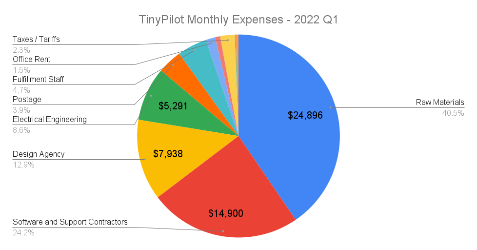
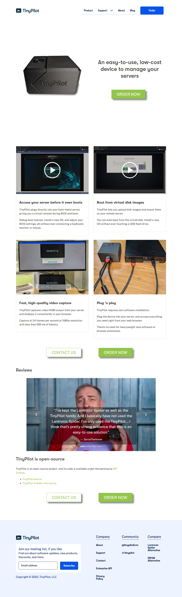
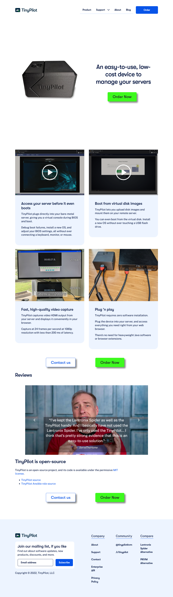
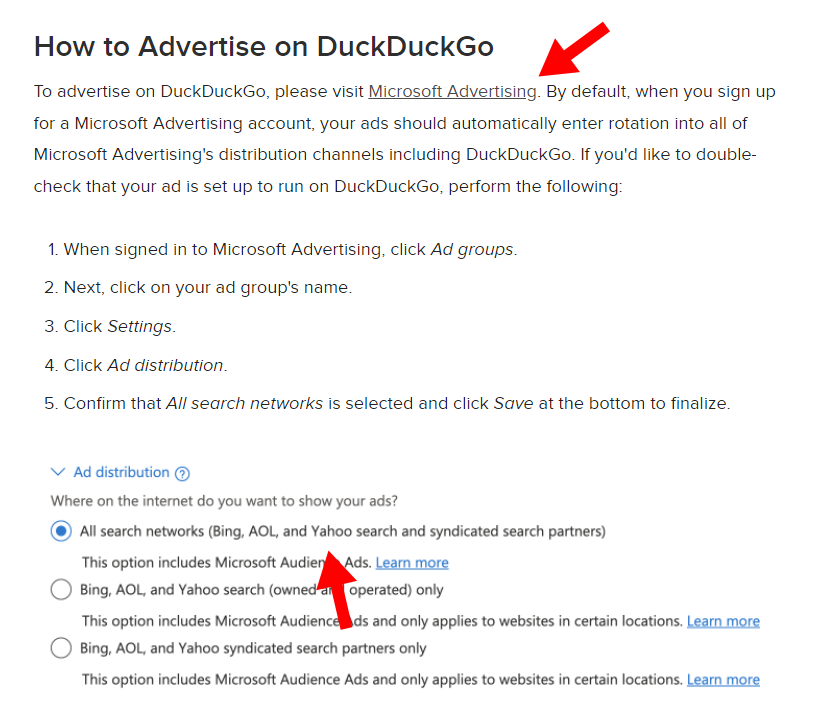

## Highlights

-

## Goal Grades

At the start of each month, I declare what I'd like to accomplish. Here's how I did against those goals:

### Publish a blog post and video about building a homelab NAS server with TinyPilot

- **Result**: XX
- **Grade**: XX

TODO

### Complete the TinyPilot website redesign

- **Result**: XX
- **Grade**: XX

TODO

### Publish a release of TinyPilot Pro with opt-in experimental support for H264 video over WebRTC

- **Result**: XX
- **Grade**: XX

TODO

## [TinyPilot](https://tinypilotkvm.com/?ref=mtlynch.io) stats



| Metric                   | March 2022                              | April 2022                                 | Change                                          |
| ------------------------ | --------------------------------------- | ------------------------------------------ | ----------------------------------------------- |
| Unique Visitors          | 6,212                                   | 5,268                                      | -944 (-15%)            |
| Total Pageviews          | 13,375                                  | 11,974                                     | -1,401 (-10%)          |
| Sales Revenue            | $65,171.82                              | $43,771.00                                 | -$21,400.82 (-33%)     |
| Enterprise Subscriptions | $47.75                                  | $47.75                                     | 0                                               |
| Royalties                | $4,012.83                               | $2,253.61                                  | -$1,759.22 (-44%)      |
| Total Revenue            | $69,232.40                              | $46,072.36                                 | -$23,160.04 (-33%)     |
| **Profit**               | **$-3,043.34** | **$-17,203.28**\* | **-$14,159.94 (inf%)** |

\* April profit is just a rough estimate based on the delta in my checking account until I do monthly bookkeeping.

## Where is all my money going?

In my last retrospective, I reported that I was averaging a profit of $16k in the first quarter of 2022. When I was doing my bookkeeping, I realized that the number was incorrect, and I actually lost $10,153 in the first quarter. The numbers seem surprising to me since I had $XXk/month in revenue, so how can I be spending more than that?

In the first quarter, my revenue was $175k. I sell each TinyPilot device for a profit of $250-325, so how can I possibly losing money?

TinyPilot's expenses are bursty, so it's difficult to assess on a month-to-month basis, so I looked at my average expenses over the course of 2022 Q1.

{{}}

| Expense                          | Cost Per Month |
| -------------------------------- | -------------- |
| Raw Materials                    | $24,896.46     |
| Software and Support Contractors | $14,900.43     |
| Design Agency                    | $7,938.32      |
| Electrical Engineering           | $5,291.07      |
| Postage                          | $3,535.35      |
| Fulfillment Staff                | $2,915.75      |
| Office Rent                      | $916.67\*      |
| Cloud Services                   | $495.03        |
| Taxes / Tariffs                  | $281.28        |
| Advertising                      | $106.78        |
| Everything Else                  | $265.34        |
| **Total**                        | **$61,542.47** |

\* My actual rent is $550/month, but rent expenses appeared higher in Q1 just through weird timing of my landlord cashing my rent checks.

My biggest expense was raw materials, which is even higher than usual because I had to stockpile parts for the next 18-36 months to protect TinyPilot from supply shortages. About $6.2k/month was for parts that will last me a few years, so once I get through stockpiling, monthly costs will be significantly lower.

The design agency cost almost $8k/month, and that expense is fortunately going away. I've paid them their last check, and they're finishing out May and then that's it. I might hire a developer to maintain the website, but it will be more like $1-2k/month.

Next we have $5.3k/month in electrical engineering. These costs will stay high for the next 2-3 months as my electrical engineering partner redesigns the TinyPilot Voyager 2 for manufacturability. Once the design work is complete, I expect costs to drop to something like $2k/month, as maintenance will be significantly cheaper than design work.

$18,526 of that was to stockpile components that will last me 18-36 months.

Software contractor costs were a little higher than usual

## The importance of low-latency hours reporting

I talked in my last update about the [many things I wish I knew about working with a design agency](/retrospectives/2022/04/#what-i-wish-i-knew-about-working-with-a-design-agency). And in April, I realized there was one more thing to add to the list: hours reporting is critical.

At the end of March, the agency had a suggestion for the redesign: a new Bootstrap theme. The TinyPilot uses the Bootstrap CSS framework with a free, third-party theme from Bootswatch. They pointed out that we had an unnecessary layer of overrides. Bootstrap sets a default style, our third-party theme was overriding those defaults, and then we were overriding those defaults again. The cleaner solution would be to replace the third-party theme with our own.

It sounded sensible to me, and the agency estimated that it would only be a few days of work. It would probably pay for itself because otherwise the rest of the redesign would be fighting with two different CSS styles.

The theme work ended up taking five weeks for a total cost of $6,152. Here is what the changes looked like to the user:


{{}}
{{}}


So, on this redesign that I've been desperate to finish for months, I allowed a five week delay on a change that barely had an impact on the user experience. How did I let this happen? This never happens with TinyPilot's regular devs, so how did this simple task get so out of hand without me noticing until it was over?

I realized the critical difference is that I have low-latency insight into how TinyPilot's developers spend their time. At the end of their working session, TinyPilot's in-house devs record their hours with a short note saying what they were working on.

TODO: Screenshot

If I'm expecting work from them and I don't see it, I check the developer's hours. If I see that they've spent eight hours on a task that I expected to take two, I check in with them. It means I either underestimated the difficulty or explained the task poorly. In either case, we should communicate and decide whether to continue on or course-correct.

With the design agency, there was a much slower feedback loop. They sent me an update on the 15th of the month telling me only how many hours they've worked but not where they were allocated. At the end of the month, they sent me a full report of where the hours went, but by then it's too late.

TODO: Screenshot

The other issue with the design agency is that they commit to hours only on a monthly basis, not on a weekly basis. Some months, they do no work for the first three weeks and then squeeze everything in in the last ten days. But this compounded the effects, since I couldn't distinguish between a task that was taking a long time and a task that they just hadn't started working on yet.

If I work with a design agency in the future, I'll insist on using a tool that lets us share a view of the hours billed as they happen. They're recording the hours in real time anyway, so it's worse for everyone if I have to wait until the end of the month for them to generate a report manually.

## Dipping my toe in paid search advertising

I tried paid ads early in TinyPilot's life, but I didn't have a good way of measuring their performance. Google Analytics has e-commerce tools built in that track conversions, but I have an unusual website stack for a Shopify store, so it's hard to get Google Analytics and Shopify to talk to each other through my setup. And even when I seemed to get Google Analytics registering purchases, it would only recognize about 30% of them, and I could never figure out if it was a bug in my setup or just that most of my customer have ad-block installed, which prevents Google Analytics from tracking the conversion.

When I experimented with affiliate advertisers, I

| Metric                     | Google    | Bing      |
| -------------------------- | --------- | --------- |
| Ad spend                   | $1,715.10 | $1,018.09 |
| Impressions                | 15,623    | 7,023     |
| Clicks                     | 701       | 196       |
| Click through rate (CTR)   | 4.5%      | 2.8%      |
| Cost per click (CPC)       | $2.45     | $5.19     |
| Revenue from conversions   | $4,202.88 | $789.97   |
| Revenue on ad spend (ROAS) | 2.45      | 0.78      |

Google ads are performing much better than I expected, and Bing ads are bombing.

I originally intended to advertise on [Duck Duck Go](https://duckduckgo.com) because I suspect those users are a good match for my product, but bizarrely, Duck Duck Go only sells ads indirectly through its competitor Bing. To buy Ads on Duck Duck Go, you have to advertise on Bing and then enable advertising through Bing's syndicated partners, which include AOL, Yahoo, and Duck Duck Go.

{{}}

The most important metric is revenue on ad spend (ROAS), which is 2.45 on Google. That means for every $1 I spend on Google ads, I'm getting $2.45 in revenue. $2.45 in revenue costs me about $0.76 in parts and labor, so that comes out to $2.45 revenue - $1 ad spend - $0.76 in parts and labor = $0.69 profit.

In other words, spending $1 on Google ads gets me $0.69 in profit, so that's a great deal! The revenue is a lower-bound on the actual number as well because if a user clicks the ad on their phone and then buys from their desktop, my metrics fail to credit Google with the sale.

I'm also seeing these results with very little optimization of ad copy or audience tuning. I suspect that if I handed over the reins to a marketing agency, they could substantially improve these returns.

I've increased my Google budget to $150/day, and I'll keep cranking it up as long as it continues to be profitable.

I'm keeping my Bing budget to $50/day and tuning the ads a bit. Bing was showing my ads for irrelevant queries like "unifi 24 port switch" (a product that serves a completely different function) and "kvms pro" (some kind of CCTV management software).

## Side projects

## Wrap up

### What got done?

-

### Lessons learned

-

### Goals for next month

-
