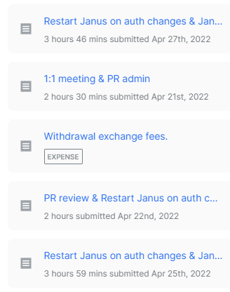
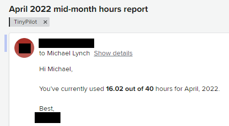
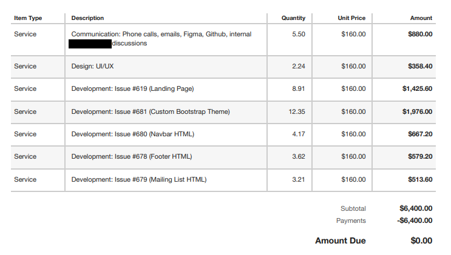
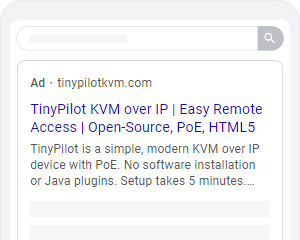
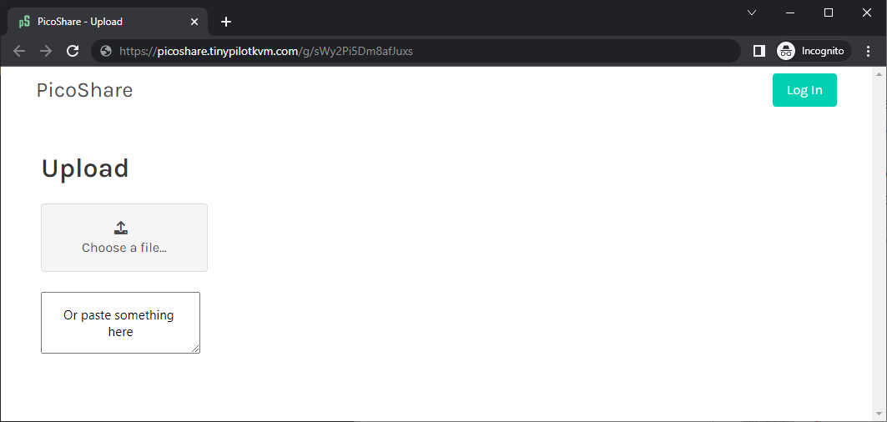
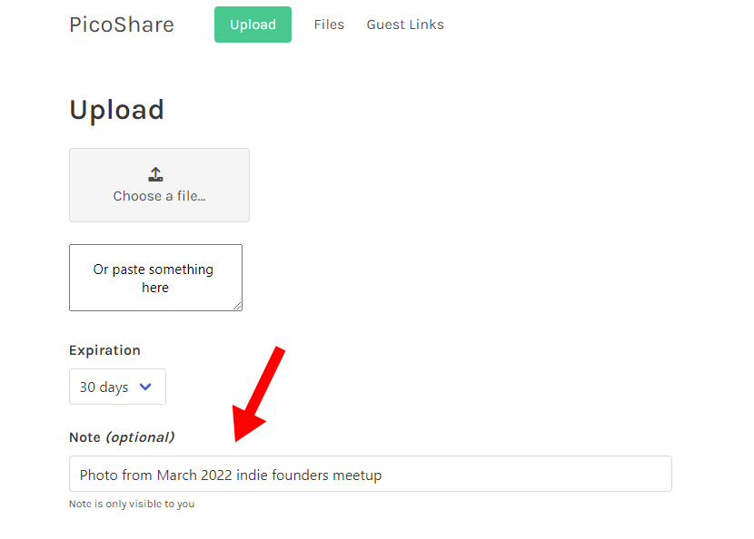
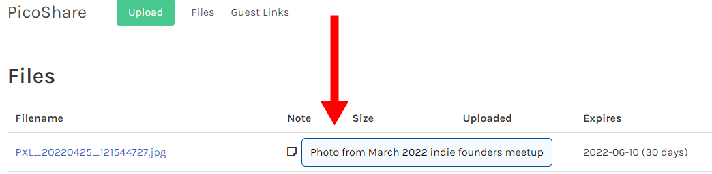

## Highlights

-

## Goal Grades

At the start of each month, I declare what I'd like to accomplish. Here's how I did against those goals:

### Publish a blog post and video about building a homelab NAS server with TinyPilot

- **Result**: I'm nearly done but I haven't published yet
- **Grade**: D

The blog post is turning out to be much longer than I expected. There are a lot of details about my thought process in choosing parts that I want to include, and I didn't realize how long that would take.

### Complete the TinyPilot website redesign

- **Result**: There were barely any design changes to the website
- **Grade**: F

We've now completed month seven of what was supposed to be a six-week redesign. Once again, there was a one-month delay in implementing any design changes.

I've canceled the contract with the design agency, so they're wrapping up their work this month. I'm hoping they can complete the redesign in the remaining weeks. If they can't, I'm hiring another developer to finish it up because this has been dragging on forever.

### Publish a release of TinyPilot Pro with opt-in experimental support for H264 video over WebRTC

- **Result**: Shared an early build with a large customer but haven't cut a public release yet
- **Grade**: C

In a month of, "took a little longer than I expected," this also took a bit longer. The release is code complete, but I still have to wrap up some last manual tests before releasing the build to customers.

## [TinyPilot](https://tinypilotkvm.com/?ref=mtlynch.io) stats



| Metric                   | March 2022                              | April 2022                                 | Change                                          |
| ------------------------ | --------------------------------------- | ------------------------------------------ | ----------------------------------------------- |
| Unique Visitors          | 6,212                                   | 5,268                                      | -944 (-15%)            |
| Total Pageviews          | 13,375                                  | 11,974                                     | -1,401 (-10%)          |
| Sales Revenue            | $65,171.82                              | $43,771.00                                 | -$21,400.82 (-33%)     |
| Enterprise Subscriptions | $47.75                                  | $47.75                                     | 0                                               |
| Royalties                | $4,012.83                               | $2,253.61                                  | -$1,759.22 (-44%)      |
| Total Revenue            | $69,232.40                              | $46,072.36                                 | -$23,160.04 (-33%)     |
| **Profit**               | **$-3,043.34** | **$-17,203.28**\* | **-$14,159.94 (inf%)** |

\* April profit is just a rough estimate based on the delta in my checking account until I do monthly bookkeeping.

## Where is all my money going?

In my last retrospective, I reported that I was averaging a profit of $16k in the first quarter of 2022. When I was doing my bookkeeping, I realized that the number was incorrect, and I actually lost $10,153 in the first quarter. The numbers seem surprising to me since I had $XXk/month in revenue, so how can I be spending more than that?

In the first quarter, my revenue was $175k. I sell each TinyPilot device for a profit of $250-325, so how can I possibly losing money?

Here are my average monthly expenses over the course of 2022 Q1.

{{}}

| Expense                          | Cost Per Month |
| -------------------------------- | -------------- |
| Raw Materials                    | $24,896.46     |
| Software and Support Contractors | $14,900.43     |
| Design Agency                    | $7,938.32      |
| Electrical Engineering           | $5,291.07      |
| Postage                          | $3,535.35      |
| Fulfillment Staff                | $2,915.75      |
| Office Rent                      | $916.67\*      |
| Cloud Services                   | $495.03        |
| Taxes / Tariffs                  | $281.28        |
| Advertising                      | $106.78        |
| Everything Else                  | $265.34        |
| **Total**                        | **$61,542.47** |

\* My actual rent is $550/month, but rent expenses appeared higher in Q1 just through weird timing of my landlord cashing my rent checks.

My biggest expense was raw materials, which is even higher than usual because I had to stockpile parts for the next 18-36 months to protect TinyPilot from supply shortages. About $6.2k/month was for parts that will last me a few years, so once I get through stockpiling, monthly costs will be significantly lower.

The design agency cost almost $8k/month, and that expense is fortunately going away. I've paid them their last check, and my contract with them terminates at the end of May. I might hire a developer to maintain the website, but that would be fewer hours at a lower rate, so more like $1-2k/month.

Next, we have $5.3k/month in electrical engineering. These costs will stay high for the next 2-3 months as my electrical engineering partner redesigns the TinyPilot Voyager 2 for manufacturability. Once the design work is complete, I expect costs to drop to something like $2k/month, as maintenance will be significantly cheaper than design work.

The expenses break down into three general categories:

- Scale with sales: Raw materials and postage are a pure function of sales.
- Ongoing costs: Recurring costs like rent and payroll that are independent of sales.
- Temporary expenses: One-time expenses like redesigning hardware or stockpiling components.

I have to make enough profit from sales to cover my ongoing costs with room leftover for temporary expenses for growth. So if I estimate that electrical engineering will go down to $2k per month, my ongoing costs are around $22k per month. If raw materials are about 30% of my revenue, that means that I need to hit $31.5k in sales to keep the lights on ($31.5k in sales translates to $22k in profit, deducting cost of materials).

Hitting $31.5k/month in sales feels pretty doable, as I've been well above that for six months. Still, my sales are trending downward and signs are pointing to a recession, so I'm hoping I can continue clearing the breakeven point with enough room for growth and one-time costs.

## The importance of low-latency hours reporting

I talked in my last update about the [many things I wish I knew about working with a design agency](/retrospectives/2022/04/#what-i-wish-i-knew-about-working-with-a-design-agency). In April, I realized there was one more thing to add to the list: hours reporting is critical.

At the end of March, the agency had a suggestion for the redesign: a new Bootstrap theme. The TinyPilot uses the Bootstrap CSS framework with a free, third-party theme from Bootswatch. They pointed out that we had an unnecessary layer of overrides. Bootstrap sets a default style, our third-party theme was overriding those defaults, and then we were overriding those defaults again. The cleaner solution would be to replace the third-party theme with our own.

It sounded sensible to me, and the agency estimated that it would only be a few days of work. It would probably pay for itself because otherwise the rest of the redesign would be fighting with two different CSS styles.

The theme work ended up taking five weeks for a total cost of $6,152. Here the result in terms of what the user can see:


{{}}
{{}}


So, on this redesign that I've been desperate to finish for months, I allowed a five week delay on a change that barely had an impact on the user experience. How did I let this happen?

I was trying to figure out why this situation never arises with TinyPilot's regular devs, but it keeps happening with the design agency. I realized one critical difference is that I have low-latency insight into how TinyPilot's developers spend their time. At the end of their working session, TinyPilot devs record their hours with a short note saying what they were working on.

{{}}

If I'm expecting work from them and I don't see it, I check their hours. If I see that they've spent eight hours on a task that I expected to take two, it means I either underestimated the difficulty or explained the task poorly. In either case, I check in with the dev, and we decide whether to continue or course-correct.

With the design agency, there was a much slower feedback loop. They sent me an update on the 15th of the month telling me only the total number of hours they've worked. At the end of the month, they sent me a full report of where the hours went, but by then it's too late.


{{}}
{{}}


The other issue with the design agency is that they commit to hours only on a monthly basis, not on a weekly basis. In February, they did no dev work for the first three weeks and then squeezed everything in in the last ten days. This compounded the poor feedback loop, since I couldn't distinguish between a task that was taking a long time and a task that they hadn't started yet.

If I work with a design agency in the future, I'll insist on using a tool that lets us share a view of the hours billed as they happen. The information is too valuable to hoard for weeks.

## Dipping my toe in paid search advertising

I [tried paid ads](/retrospectives/2020/11/) early in TinyPilot's life, but I didn't have a good way of measuring their performance. I have a weirdo custom tech stack for my sales site, and it makes it hard to integrate with normal conversion tracking tools on Shopify or Google Analytics. Even when conversion tracking seemed to be working, it was only registering about 30% of sales, so either I messed something up or 70% of my users have ad-block enabled.

When I experimented with affiliate advertisers, I ended up accidentally solving the conversion tracking problem. When a customer visits through an affiliate link, the TinyPilot stores the referral ID in the browser's local storage. When the customer checks out, we save the referral ID as an attribute of the order. That way, we don't depend on Google Analytics, and we don't have to fight with ad-blockers.

I revisited paid advertising by running ads on Google and Bing. Google ads are performing much better than I expected, and Bing ads are bombing.

{{}}

| Metric                     | Google    | Bing      |
| -------------------------- | --------- | --------- |
| Ad spend                   | $1,715.10 | $1,018.09 |
| Impressions                | 15,623    | 7,023     |
| Clicks                     | 701       | 196       |
| Click through rate (CTR)   | 4.5%      | 2.8%      |
| Cost per click (CPC)       | $2.45     | $5.19     |
| Revenue from conversions   | $4,202.88 | $789.97   |
| Revenue on ad spend (ROAS) | 2.45      | 0.78      |

Google is beating Bing on almost every metric. Bing costs twice as much per click, but it generates less than one fifth of the revenue.

The most important metric is revenue on ad spend (ROAS), which is 2.45 on Google. That means for every dollar I spend on Google ads, I'm getting $2.45 in revenue. $2.45 in revenue costs me about $0.76 in parts and labor, so that comes out to $2.45 revenue - $1 ad spend - $0.76 in parts and labor = $0.69 profit.

In other words, spending $1 on Google ads gets me $0.69 in profit, so that's a great deal! The revenue is a lower-bound on the actual number as well because if a user clicks the ad on their phone and then buys from their desktop, my metrics fail to credit Google with the sale. So, it's possible I'm making even more from these ads than the metrics show.

I've done zero experimentation with ad copy or audience tuning. I suspect that if I handed over the reins to a marketing agency, they could substantially improve these returns.

I've increased my Google budget to $150/day, and I'll keep cranking it up as long as it continues to be profitable.

I'm keeping my Bing budget to $50/day and tuning the ads a bit. Bing was showing my ads for irrelevant queries like "unifi 24 port switch" (a product that serves a completely different function) and "kvms pro" (some kind of CCTV management software).

I originally intended to advertise on [Duck Duck Go](https://duckduckgo.com) because I suspect those users are a good match for my product. Bizarrely, Duck Duck Go only sells ads indirectly through its competitor Bing. To buy Ads on Duck Duck Go, you have to advertise on Bing and then enable advertising through Bing's syndicated partners, which include AOL, Yahoo, and Duck Duck Go.

{{}}

## Side projects

### [PicoShare](https://github.com/mtlynch/picoshare)

I'm continuing to have fun working on PicoShare, a simple web app I built to make it easier to share large files with people.

One feature I'm excited about is the ability to create guest upload links. Often, especially when working with partners for TinyPilot, I want a way for people to send me a file that's too big for email, but I don't want to force one of us to sign up for a storage service like Google Drive or Dropbox.

With PicoShare's guest uploading, I can create a guest link like this:

{{}}

Then, PicoShare generates a custom guest link like `https://picoshare.tinypilotkvm.com/g/sWy2Pi5Dm8afJuxs`. When the guest visits that link, they can upload files to my PicoShare server without signing up or jumping through any hoops:

{{}}

I've already started using it at TinyPilot, and it's much smoother than the tools I was using before like Mega.nz and Dropbox.

The other feature I added was support for private notes that you can attach to your uploads in case you want to remember details about the file:


{{}}
{{}}


## Wrap up

### What got done?

- Started to see promising results from paid search advertising

### Lessons learned

- Working with a contractor or agency requires low-latency hours reporting
  - Otherwise, it's too easy to miss when projects are going over-budget or out of scope until it's too late.

### Goals for next month

-
