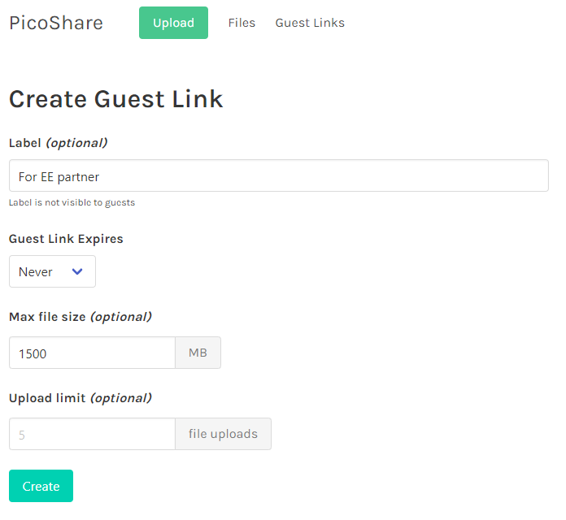

## Highlights

- TinyPilot generates $58k/month in revenue yet somehow loses money.
- It's more important than I thought to have low-latency insight into developers' hours.
- I'm trying paid advertising again for the first time in almost two years.

## Goal Grades

At the start of each month, I declare what I'd like to accomplish. Here's how I did against those goals:

### Publish a blog post and video about building a homelab NAS server with TinyPilot

- **Result**: I'm nearly done, but I haven't published yet.
- **Grade**: D

The blog post is turning out to be much longer than I expected. There are so many details I want to include about my thought process in choosing parts, and I didn't realize how long that would take. I'm hoping to wrap up in the next couple of weeks.

### Complete the TinyPilot website redesign

- **Result**: There were barely any design changes to the website.
- **Grade**: F

We've now completed month seven of what was supposed to be a six-week redesign. And again, shamefully, we barely made any user-visible changes to the website.

I've canceled the contract with the design agency, so they're wrapping up their work this month. I'm hoping they can complete the redesign in the remaining weeks. If they can't, I'm hiring another developer to finish it up because this has been dragging on forever.

### Publish a release of TinyPilot Pro with experimental support for H264 video over WebRTC

- **Result**: Shared an early build with a large customer but haven't cut a public release yet.
- **Grade**: C

The month's theme is, "this took a little longer than I expected." The release is code complete, but I still have to wrap up some last manual tests before publishing the build to customers.

## [TinyPilot](https://tinypilotkvm.com/) stats



| Metric                   | March 2022     | April 2022                               | Change                                          |
| ------------------------ | -------------- | ---------------------------------------- | ----------------------------------------------- |
| Unique Visitors          | 6,212          | 5,268                                    | -944 (-15%)            |
| Total Pageviews          | 13,375         | 11,974                                   | -1,401 (-10%)          |
| Sales Revenue            | $65,171.82     | $43,771.00                               | -$21,400.82 (-33%)     |
| Enterprise Subscriptions | $47.75         | $47.75                                   | 0                                               |
| Royalties                | $4,012.83      | $2,253.61                                | -$1,759.22 (-44%)      |
| Total Revenue            | $69,232.40     | $46,072.36                               | -$23,160.04 (-33%)     |
| **Profit**               | **$-3,043.34** | **$-19,392.76** | **-$16,349.42 (inf%)** |

April was a rough month for TinyPilot. Sales dropped to their lowest levels in six months, both in the US and with our EU distributor. Usually, about $5-10k in revenue each month comes from a handful of large orders, but we didn't see any of those in April.

It's unclear if April was just an unlucky month, if people are spending less due to signals of a recession, or if new offerings from TinyPilot's competitors are eating into sales.

## Where is all my money going?

In my last retrospective, I reported that I was averaging a profit of $5.3k in the first quarter of 2022. When I was doing my bookkeeping, I realized that my blog numbers were out of sync with my bookkeeping, and I was actually _losing_ $3k per month.

The numbers surprised me since I had $58k/month in revenue, and I sell each TinyPilot device for a profit of $250-325, so how can I possibly be losing money?

To find out, I took a closer look at my monthly expenses for 2022 Q1.

{{}}

| Expense                          | Cost Per Month |
| -------------------------------- | -------------- |
| Raw Materials                    | $24,896.46     |
| Software and Support Contractors | $14,900.43     |
| Design Agency                    | $7,938.32      |
| Electrical Engineering           | $5,291.07      |
| Fulfillment Staff                | $2,915.75      |
| Postage                          | $2,393.49      |
| Taxes / Tariffs                  | $1,423.14      |
| Office Rent                      | $916.67\*      |
| Cloud Services                   | $495.03        |
| Advertising                      | $106.78        |
| Everything Else                  | $265.34        |
| **Total**                        | **$61,542.47** |

\* My actual rent is $550/month, but rent expenses appeared higher in Q1 because my landlord cashed checks at weird times.

My biggest expense was raw materials, which is even higher than usual because I had to stockpile parts for the next 18-36 months to protect TinyPilot from supply shortages. About $6.2k/month was for parts that will last me a few years, so once I get through stockpiling, monthly supply costs will be significantly lower.

The next largest expense was software and support, at $14.9k. That's a little higher than usual because I hired an external consultant on a short-term basis to help integrate a new video technology. The norm is closer to $12k, which is still quite high.

Charging for [TinyPilot Pro](https://tinypilotkvm.com/product/tinypilot-pro) was supposed to fund development and support costs, but we haven't yet implemented license checks or reminders. About 1/3 of TinyPilot customers have expired TinyPilot Pro licenses and don't realize it, but they continue receiving free support and updates. My top software priority for the next few months is to overhaul TinyPilot's update flow so that only users with paid, active licenses get access to the latest TinyPilot Pro releases. I also want to make it easier for people to sign up for recurring billing so that they can just pay $80/year for their license and not deal with re-buying when it expires.

The design agency cost almost $8k/month, but that expense is going away, fortunately. I've paid them their last check, and my contract with them terminates at the end of May. I might hire a developer to maintain the website, but that would be fewer hours at a lower rate, so more like $1-2k/month.

Next, we have $5.3k/month in electrical engineering. These costs will stay high for the next 2-3 months as my electrical engineering partner redesigns the TinyPilot Voyager 2 for manufacturability. Once the design work is complete, I expect costs to drop to something like $2k/month, as maintenance will be significantly cheaper than design work.

The expenses break down into three general categories:

- Ongoing costs: Recurring costs like rent and payroll that are independent of sales.
- Materials and postage: These are almost a pure function of sales, but they should grow about 1/3 as fast as revenue.
- Temporary expenses: One-time expenses like redesigning hardware or stockpiling components.

I have to make enough profit from sales to cover my ongoing costs with room for growth expenses. If I estimate that software will go down to $12k per month and electrical engineering will go down to $2k, my ongoing costs are around $19k per month. If raw materials are about 30% of my revenue, that means that I need to hit $27k in sales to keep the lights on ($27k in sales nets $22k after deducting the cost of materials).

Hitting $27k/month in sales feels pretty doable, as I've been well above that for six months. Still, my sales are trending downward, and signs are pointing to a recession, so I'm hoping I can continue clearing the breakeven point with enough room for growth and one-time costs.

## The importance of low-latency hours reporting

My last update enumerated the [many things I wish I'd known about working with a design agency](/retrospectives/2022/04/#what-i-wish-i-knew-about-working-with-a-design-agency). In April, I discovered one more thing to add to the list: hours reporting is critical.

At the end of March, the agency had a suggestion for the redesign: a new Bootstrap theme. The TinyPilot website uses the Bootstrap CSS framework. We're still using the same free, third-party theme I got from [Bootswatch](https://bootswatch.com/) when I created the first version of the site. On top of Bootstrap and the third-party theme, we also have our own custom styles, often on a per-page or per-component basis.

The agency pointed out that this architecture was convoluted, and we should replace the third-party theme and per-page styles with our own site-wide Bootstrap theme. They estimated that it would only be a few days of work. It sounded sensible to me. It would probably pay for itself because otherwise the rest of the redesign would be fighting with three different layers of CSS styling.

The theme work ended up taking five weeks for a total cost of $6.1k. Here are the results in terms of what the user can see:


{{}}
{{}}


Long-term, this refactoring is helpful, but I wouldn't have chosen to do it right now. The redesign is already six months late and 5x over budget. I'd rather have a pretty website while we work on fixing ugly code than a dumpy-looking website with beautifully-factored code.

So, how did I let this happen? TinyPilot's regular devs rarely get lost in the weeds on something I didn't want, but it keeps happening with the design agency.

One critical difference is that TinyPilot's developers give me low-latency insight into how they spend their time. At the end of each working session, they record their hours with a short note saying what they were working on.

{{}}

If I'm expecting work from them, I check their hours. If I see that they've spent 14 hours on a task that I expected to take two, it means I either underestimated the difficulty or explained the task poorly. In either case, I check in with the dev, and we decide whether to continue or course-correct.

With the design agency, there's a much slower feedback loop. They send me an update on the 15th of the month telling me only the total number of hours they've worked. At the end of the month, they send me a full report of where the hours went, but by then, it's too late.


{{}}
{{}}


The other issue with the design agency is that they commit to hours only on a monthly basis, not on a weekly basis. In February, they did no dev work for the first three weeks and then squeezed all of their work into the last ten days. This compounded the poor feedback loop since I couldn't distinguish between a task that was taking too long and a task that they hadn't started yet.

If I work with a design agency in the future, I'll insist on using a tool that lets us share a view of billable hours as they happen. The information is too valuable to delay for weeks, as it prevents me from identifying mismatches in expectations.

## Dipping my toe in paid search advertising

I [tried running paid ads](/retrospectives/2020/11/) early in TinyPilot's life, but I didn't have a good way of measuring their performance. I have a weirdo custom stack for my sales site, and it makes it hard to integrate with normal conversion tracking tools on Shopify or Google Analytics. Even when conversion tracking seemed to be working, it was only registering about 30% of sales, so either I messed something up, or 70% of my users have ad-block enabled.

When I experimented with affiliate advertisers, I ended up accidentally solving the conversion tracking problem. When a customer visits through an affiliate link, the TinyPilot website stores the affiliate ID in the browser's local storage. When the customer checks out, we save the affiliate ID as an attribute of the order. That way, we don't depend on Google Analytics, and we don't have to fight with ad-blockers.

I realized I could use the same solution to track paid ads. I can just treat the referral information in an ad URL as if it were an affiliate ID. With this, I revisited paid advertising by running ads on Google and Bing.

{{}}

| Metric                     | Google    | Bing      |
| -------------------------- | --------- | --------- |
| Ad spend                   | $1,715.10 | $1,018.09 |
| Impressions                | 15,623    | 7,023     |
| Clicks                     | 701       | 196       |
| Click through rate (CTR)   | 4.5%      | 2.8%      |
| Cost per click (CPC)       | $2.45     | $5.19     |
| Revenue from conversions   | $4,202.88 | $789.97   |
| Revenue on ad spend (ROAS) | 2.45      | 0.78      |

Google is beating Bing on almost every metric. Bing costs twice as much per click, but it generates only a third of the revenue.

The most important metric is revenue on ad spend (ROAS), which is 2.45 on Google. In other words, for every dollar I spend on Google ads, I'm getting $2.45 in revenue. That costs me about $0.76 in parts and labor. The return is roughly $2.45 revenue - $1 ad spend - $0.76 in parts and labor = $0.69 profit.

In other words, spending $1 on Google ads gets me $0.69 in profit, so that's a great deal! The revenue is a lower bound on the actual number because if a user clicks the ad on their phone and then buys from their desktop, my metrics fail to credit Google with the sale. So, it's possible I'm making even more from these ads than the metrics show.

I've done zero experimentation with ad copy or audience tuning. I suspect that if I handed the reins over to a marketing agency, they could substantially improve these returns.

I've increased my Google budget to $150/day, and I'll keep cranking it up as long as it continues to be profitable.

I'm keeping my Bing budget to $50/day and tuning the ads a bit. Bing was showing my ads for irrelevant queries like "unifi 24 port switch" (a product that serves a completely different function) and "kvms pro" (some kind of CCTV management software).

I originally intended to advertise on [Duck Duck Go](https://duckduckgo.com) because I suspect their users to be a good match for my product. Bizarrely, Duck Duck Go only sells ads indirectly through Bing, its direct competitor. To buy Ads on Duck Duck Go, you have to advertise on Bing and then enable advertising through Bing's syndicated partners, which include AOL, Yahoo, and Duck Duck Go.

{{}}

## Side projects

### [PicoShare](https://github.com/mtlynch/picoshare)

I'm continuing to have fun working on PicoShare, a simple web app I built to make it easier to share large files.

One feature I'm excited about is the ability to create guest upload links. Often, especially when working with partners for TinyPilot, I want a way for people to send me a file that's too big for email, but I don't want anyone to jump through the hoops of signing up for a cloud storage service like Google Drive or Dropbox.

With PicoShare's guest uploading, I can create a guest link like this:

{{}}

Then, PicoShare generates a custom guest link like `https://picoshare.tinypilotkvm.com/g/sWy2Pi5Dm8afJuxs`. When the guest visits that link, they can upload files to my PicoShare server without any signup:

{{}}

I've already started using it at TinyPilot, and it's much smoother than the tools I was using before, like Mega.nz and Dropbox.

The other feature I added was support for private notes that you can attach to your uploads in case you want to remember details about the file:


{{}}
{{}}


## Wrap up

### What got done?

- I've started to see promising results from paid search advertising.
- TinyPilot Pro reached code complete for its 2.4.1 release with support for H264 video.
- TinyPilot [contributed documentation](https://github.com/pikvm/ustreamer/pull/150) to uStreamer explaining how to stream H264 video over WebRTC.

### Lessons learned

- Working with a contractor or agency requires low-latency hours reporting.
  - Otherwise, it's too easy to miss when projects are going over budget or out of scope until it's too late.

### Goals for next month

- Publish a blog post and video about building a homelab NAS server with TinyPilot.
- Complete the TinyPilot website redesign.
- Hire a marketing agency or freelancer.
