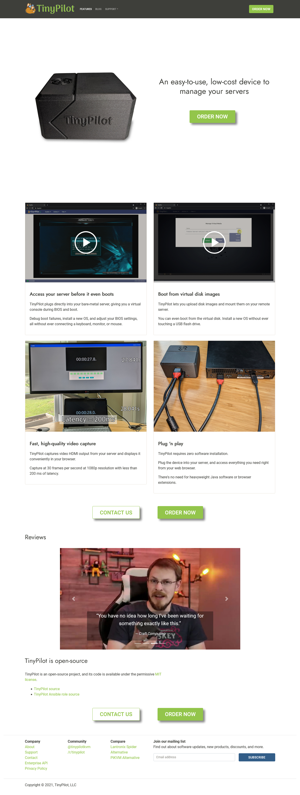
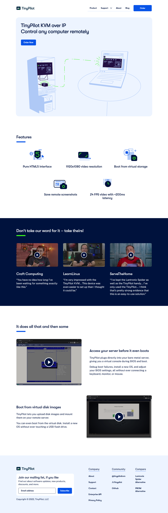
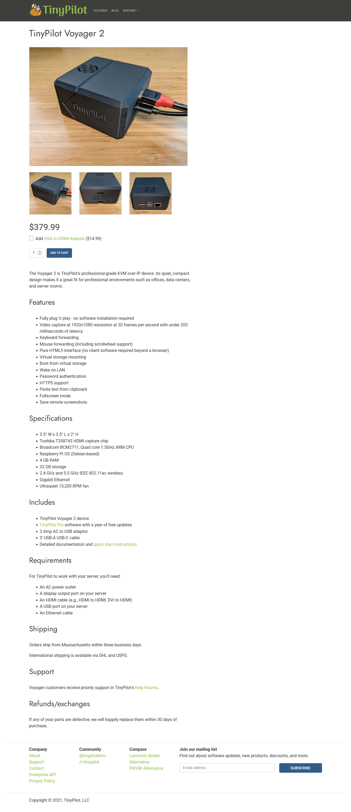
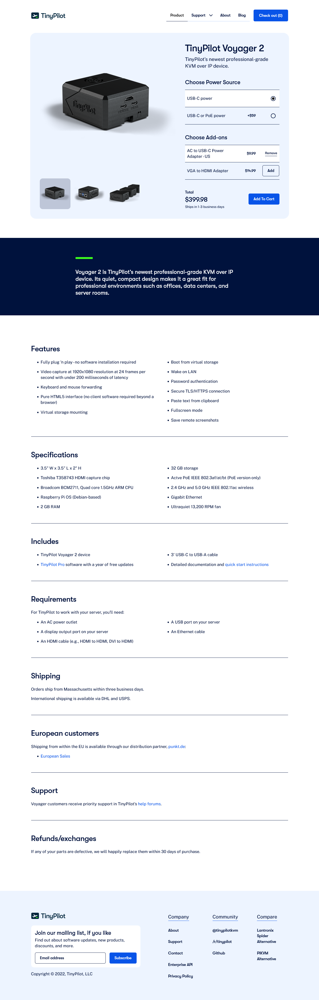
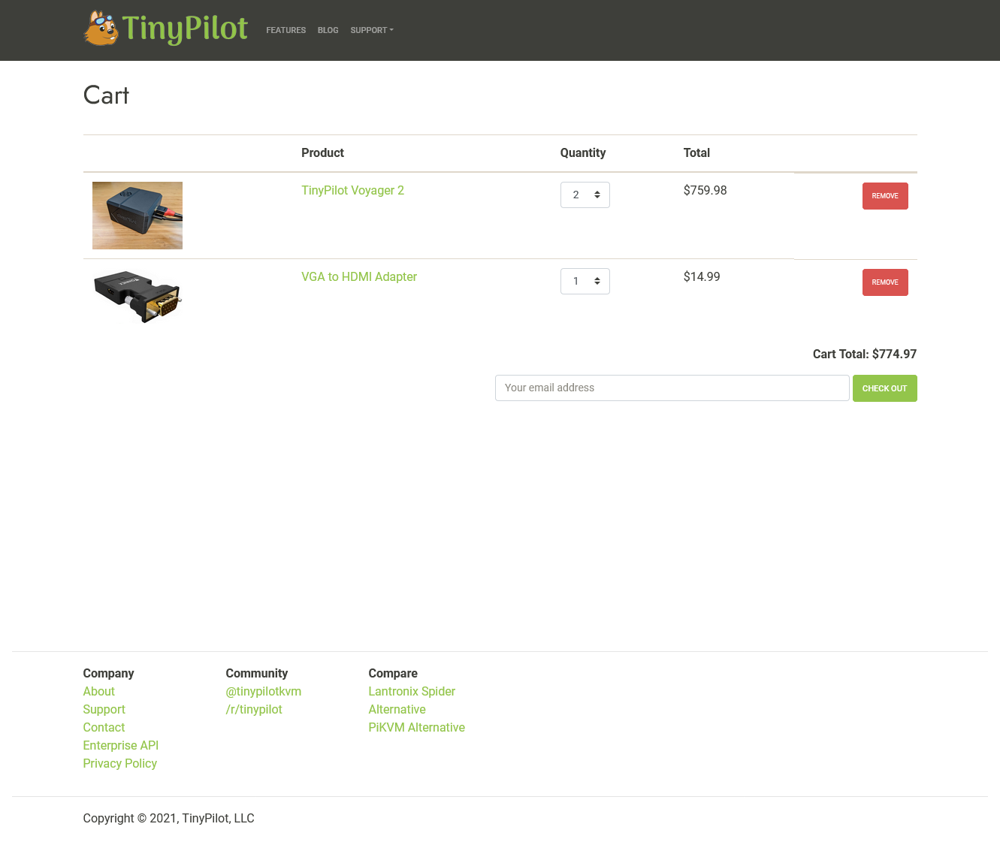
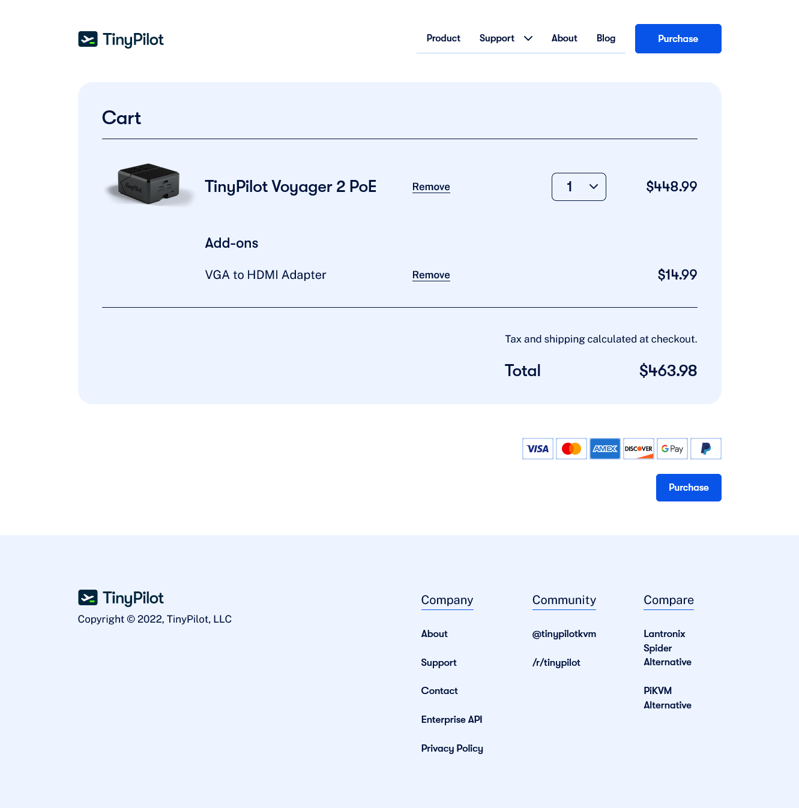
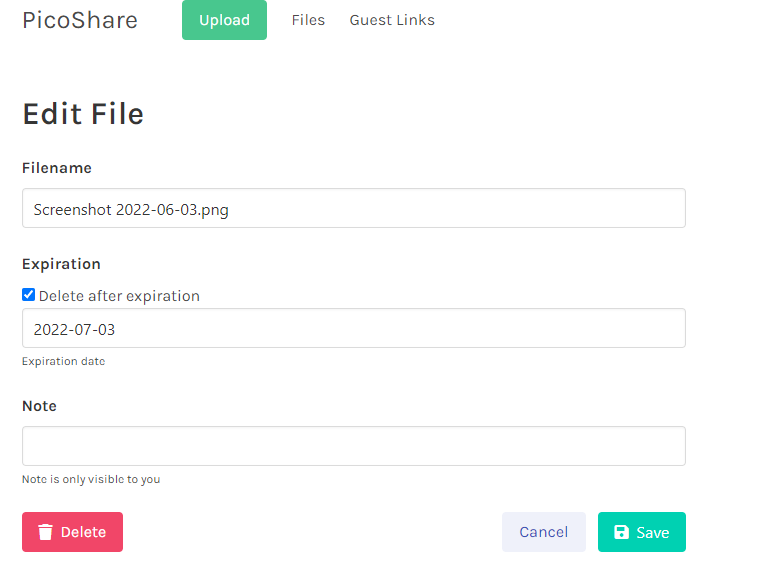
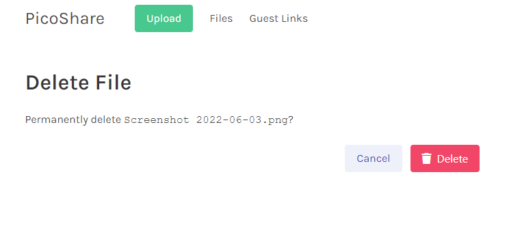
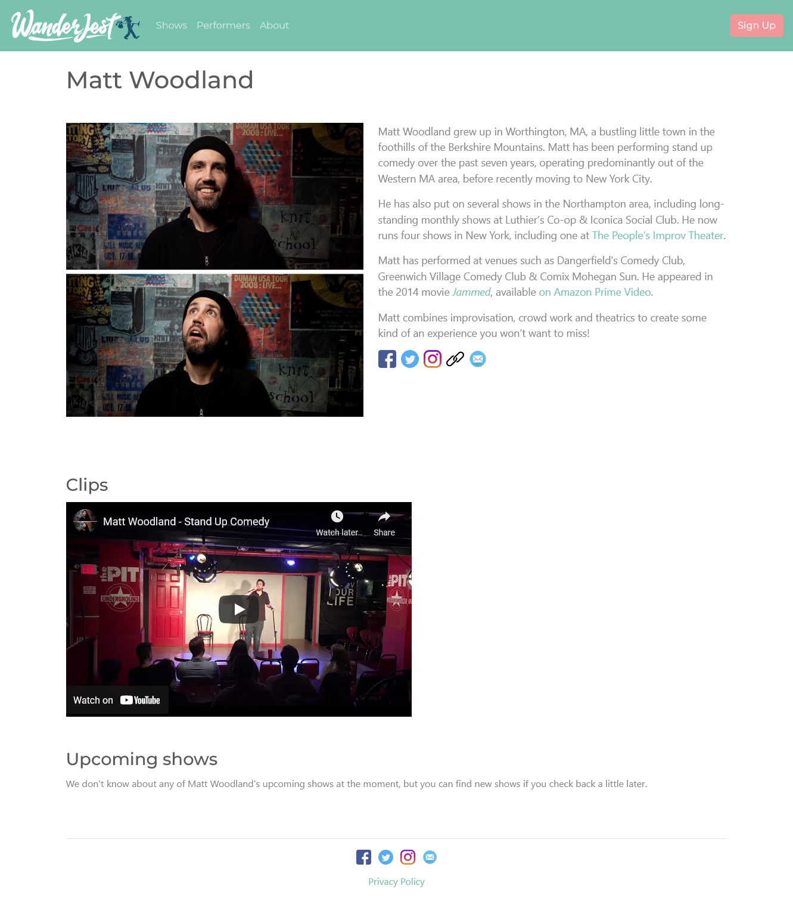
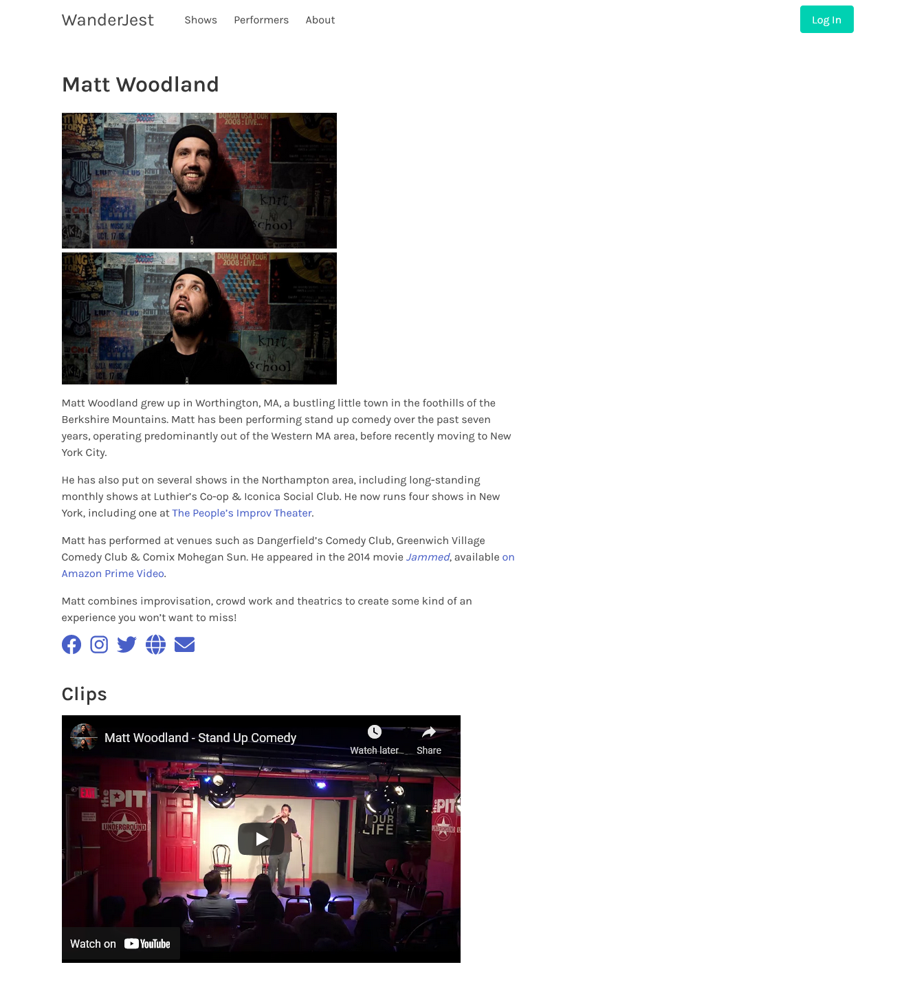

## Highlights

- The TinyPilot website redesign is finally done.
- I've learned to make Debian packages, and it's surprisingly simple.
- I've given up on Vue and frontend frameworks in general.

## Goal Grades

At the start of each month, I declare what I'd like to accomplish. Here's how I did against those goals:

### Publish a blog post and video about building a homelab NAS server with TinyPilot

- **Result**: [Published the post](/budget-nas/) and [accompanying video](https://youtu.be/q_Mi5LrnIiU)
- **Grade**: A

This was my first blog post in over a year that wasn't a retrospective or year-end review. It got a [so-so reception on reddit](https://www.reddit.com/r/truenas/comments/uw5hly/how_i_built_my_first_home_truenas_server_22_tb/), but it reached [#2 on Hacker News](https://news.ycombinator.com/item?id=31548829).

The post led many visitors to TinyPilot's website, bringing the monthly unique visitors to 14k. That's an all-time high, beating its previous record by 30%. I spent about 45 hours writing the post and producing the video, so the results helped justify the effort.

### Complete the TinyPilot website redesign

- **Result**: It's finally done!
- **Grade**: A

The redesign is finally complete. I've expected this project to wrap up every single month for the past four months, and then something always comes up to delay it. Now, it's officially complete.

### Hire a marketing agency or freelancer

- **Result**: Hired a freelancer a few days into June
- **Grade**: B

I found an agency that seemed like a potential match, but I felt a little iffy about them. We agreed on pricing for a three-month contract, but then after I agreed, they asked to change it to a five-month minimum. That was a big red flag. I continued trying to work something out with them, but their proposals all felt questionable, so I eventually ended the discussions.

Fortunately, my electrical engineering partner firm recommended a digital marketing freelancer. From the first call, he was a much better match than anyone else I'd spoken to, so I hired him on the spot.

## [TinyPilot](https://tinypilotkvm.com/) stats



| Metric                   | April 2022                               | May 2022                                 | Change                                             |
| ------------------------ | ---------------------------------------- | ---------------------------------------- | -------------------------------------------------- |
| Unique Visitors          | 5,268                                    | 14,296                                   | +9,028 (+171%)          |
| Total Pageviews          | 11,974                                   | 24,131                                   | +12,157 (+102%)         |
| Sales Revenue            | $43,771.00                               | $54,844.20                               | +$11,073.20 (+25%)      |
| Enterprise Subscriptions | $47.75                                   | $47.75                                   | 0                                                  |
| Royalties                | $2,253.61                                | $3,269.56                                | +$1,015.95 (+45%)       |
| Total Revenue            | $46,072.36                               | $58,161.51                               | +$12,089.15 (+26%)      |
| **Profit**               | **-$19,392.76** | **$6,445.38** | **+$25,838.14 (+inf%)** |

This was a strong month in terms of visitors and sales. Visitors nearly tripled, and sales jumped by 25%.

Most of the visitors arrived from Hacker News, though it didn't seem to have much of an effect on sales. Sales were already on track to beat April by about 25% before I published the articles landed on Hacker News. The results might be delayed, as I'm seeing an atypically strong start to June.

## The TinyPilot website redesign

Oh, boy. The redesign.

What to say?

It's been dragging on for months, and the end has always felt just a few weeks away.

When I interviewed designers and agencies at the start of this project, I told them I was looking to spend $8-15k on a redesign that would last a couple of months. I said that I most certainly didn't want a project where I have to spend six months and $40k before I can see whether the changes have any real impact on sales.

In the end, the project took eight months and cost $46k. I fell into the exact trap I wanted to avoid.

I'm going to write a longer blog post about the experience, but the main mistakes were:

- **Too broad a scope**: I should have [kept the scope small](/retrospectives/2022/04/#aggressively-protect-your-scope), starting with a rebranding before I let the agency expand into a full-blown redesign.
- **Hours reporting was too slow**: I should have insisted on a system where the agency [reported billable hours to me](/retrospectives/2022/05/#the-importance-of-low-latency-hours-reporting) as they occured rather than on a 2-week delay. If I can't see how long a task is taking, I can't adjust the scope it if it turns out to be more expensive than I expected.
- **Scheduling needed more transparency**: I should have pushed for more communication about timelines so that I wasn't surprised with how long the project dragged on.
- **Insufficient management time**: I assumed that an agency working 40 hours per month would require roughly the same management overhead as an individual freelancer working 40 hours per month. Agencies involve more people, and more people mean [more management](/retrospectives/2022/04/#an-agency-requires-more-management-not-less).

But let's take a look at the results. The project involved redesigning the three pages in the checkout flow: the landing page, the product page, and the shopping cart page:


{{}}
{{}}



{{}}
{{}}



{{}}
{{}}


Money aside, I'm happy with the results. I think the new design is inarguably better than what I had before. The new logo and images make the project look more professional and distinctive.

So, the new design is better, but is it $46k better?

If I could go back in time, I certainly wouldn't have paid that much and sunk all that time into the redesign. Still, it could still plausibly pay for itself.

Beyond my fixed costs, 70% of TinyPilot's sales revenue are profit. That means the redesign has to generate $66k in additional sales to earn its keep. If it increases my sales by 10%, then I'd go from an average of $50k/month to $55k/month. That would put me ahead in about a year. If better marketing attracts more customers to the site, I'll make my money back even faster.

## Debian packages are easy

One of the odd design decisions I made with TinyPilot is its installation and update mechanism. We do it using [Ansible](https://www.ansible.com/), a tool that's designed for devops engineers to provision systems at scale. I used Ansible to provision my Raspberry Pi with [the first prototype of TinyPilot](/tinypilot/). That flow worked, so we just stuck with it.

I knew that there were better solutions for installing software on Linux, but I didn't have experience with them. TinyPilot has unusual requirements for configuring Raspberry Pi's hardware features, so I dreaded the process of adapting standard install tools to meet those requirements. Instead, we continued using Ansible, as it worked fine and wasn't causing any problems. It was slow, so an installation that should have been a few seconds took two minutes, but that wasn't too bad.

Two years in, we're pushing the limits of Ansible. Our installation is getting too complex, and updates take upwards of five minutes.

I'd considered Debian packages (e.g., `apt-get`) in the past, but I'd heard negative stories about Debian's packaging tools. And then on top of that, there were repository servers, keypairs, and a package signing process? It seemed like it would be a huge effort just to get the basics in place and then an incredible pain to do what we needed.

As an experiment, I tried building a Debian package, and it turned out to be far easier than I feared. Debian packages are just tarballs with a particular folder structure and a few special files. I made my first working `.deb` file in about an hour.

And the repository servers and key pairs? It turns out that's optional. You can just distribute the `.deb` package files directly without ever needing a repository.

[`debhelper`](https://man7.org/linux/man-pages/man7/debhelper.7.html), the official tool for creating Debian packages, was indeed as confusing and difficult as I'd heard, but it's not necessary. We found it easier to just skip `debhelper` and generate Debian's metadata files by hand.

Better still, we don't have to switch from Ansible to Debian packages in one terrifying leap. We can incrementally move logic from Ansible to Debian packages at our own pace.

Our first Debian package is for [Janus](https://janus.conf.meetecho.com), the open-source WebRTC server. We used to compile the application from source on each device, which took ~30 minutes. Our new Debian package installs in a few seconds. And even though we need 32-bit ARM binaries, we can build the Debian package on x64 cloud servers using Docker's QEMU integration. All of our code for compiling and packaging the code [is open-source](https://github.com/tiny-pilot/janus-debian).

Here are the resources we found helpful for learning about Debian packages:

- [Creating and hosting your own deb packages and apt repo](https://earthly.dev/blog/creating-and-hosting-your-own-deb-packages-and-apt-repo/)
- [Building binary deb packages: a practical guide](https://www.internalpointers.com/post/build-binary-deb-package-practical-guide)
- [Debian New Maintainers' Guide](https://www.debian.org/doc/manuals/maint-guide/)
- [Official Debian Documentation](https://help.ubuntu.com/community/Repositories/Personal)
- [Basic Overview of the debian/ Directory](https://packaging.ubuntu.com/html/debian-dir-overview.html)

## Search ads are leveling off

When I last calculated it, Google search ads looked amazing. I was [earning $0.69 in profit](/retrospectives/2022/05/#dipping-my-toe-in-paid-search-advertising) for every dollar I spent on Google Ads. Now that more time has elapsed, and I have more data, it's a less rosy picture.

When I ran the numbers last month, I included April and the first week of May. That first week turned out to be an outlier, so the profit is weaker when I segment by month:

| Metric                     | April     | May       |
| -------------------------- | --------- | --------- |
| Ad spend                   | $804.12   | $4,283.71 |
| Impressions                | 5,270     | 239,498   |
| Clicks                     | 351       | 3,327     |
| Click through rate (CTR)   | 6.6%      | 1.4%      |
| Cost per click (CPC)       | $2.29     | $1.29     |
| Revenue from conversions   | $1,314.91 | $7,649.60 |
| Revenue on ad spend (ROAS) | 1.63      | 1.79      |

About 30% of my revenue goes to hardware and labor costs, so a ROAS of 1.43 is roughly breakeven (1.43 - 30% = 1.0). Anything higher is profitable. At 1.79, I'm still making $0.26 for every dollar I spend on ads, so I'll keep going.

TinyPilot's new digital marketing consultant reviewed my Google Ads account and identified several places where I was overspending on low-value keywords, so we'll likely be able to improve these numbers over the next few months.

## Side projects

### [PicoShare](https://pico.rocks/)

PicoShare is the open-source tool I [released in March](/retrospectives/2022/04/#picosharehttpsdemopicorocks) that facilitates sharing files that are too big for email.

In May, I added support for editing a file's metadata after you upload it:

{{}}

Originally, you had a chance to add a note and choose an expiration time for a file at the time you uploaded it, and those decisions were final. Now, PicoShare is more flexible, allowing you to change a file's metadata and expiration date at any time.

After I added the edit screen, I realized it was a good opportunity to make the process of deleting files more error-proof. Before, if you clicked the delete button in the file listing, the file was gone &mdash; no confirmation, no undo. Now, deleting a file requires you to first visit the edit screen, click delete, then confirm the deletion:

{{}}

### [WanderJest](https://wanderjest.com)

In early 2020, I was [building WanderJest](/retrospectives/2020/04/#putting-wanderjest-on-hold), a site that helps people find live comedy near them. I [put the site on hold in March](/retrospectives/2020/04/#putting-wanderjest-on-hold) due to the pandemic. As we slowly return to normal, I've been revisiting WanderJest on weekends and evenings.

One of the things that struck me in developing PicoShare was how much a simpler tech stack improves my development velocity:

|            | PicoShare            | WanderJest |
| ---------- | -------------------- | ---------- |
| Backend    | Go                   | Go         |
| Frontend   | Go templates + HTML5 | Vue 2      |
| Data Store | SQLite + Litestream  | Firestore  |

Firestore slows me down because of how hard it is to make schema changes. The only way I know how to do it is to write custom migration code and deploy it to the production server. With SQLite, I can just download the production database, write some SQL queries to tinker with it, and then push it out to the server.

I'm now working on reimplementing WanderJest to replace Vue with Go templates and Firestore with SQLite.


{{}}
{{}}


Writing a frontend in Go is easier than I expected. The up-front experience isn't as nice as Vue. I'd love conditional rendering or reactive properties, and you don't get that in vanilla JS. But overall, rendering a page is so much simpler with Go.

With Vue, my process for rendering data on the page was:

1. Backend retrieves the data from the datastore.
1. Backend derives a copy of the data with only the properties we want to share with the frontend.
1. Backend serializes the data to JSON.
1. Frontend retrieves the JSON data from the backend.
1. Frontend populates page elements based on data it retrieved from the backend.

In contrast, rendering the page with Go templates is just two steps:

1. Backend retrieves the data from the datastore.
1. Backend populates a page template with data from the datastore.

When you render the frontend in Go, you can skip all the work of choosing what data the backend exposes to the frontend, how to serialize and unserialize it, and how to manage a local cache.

I'll have to wait until I've reached feature parity with the Vue version, but I think I'm on track to reduce total lines of code by about 50%.

## Wrap up

### What got done?

- Completed TinyPilot's website redesign.
- Published [a new TinyPilot release](https://tinypilotkvm.com/blog/whats-new-in-2022-05).
- Published a new blog post about my [homelab NAS server](/budget-nas/).
- Hired a digital marketing freelancer.

### Lessons learned

- Debian packages are easier than they seem.
- Life is easier without frontend frameworks.

### Goals for next month

- Create a self-contained tarball for installing TinyPilot.
- Complete the first draft of a full-length blog post about the TinyPilot website redesign.
- Increase ROAS on paid search ads to 2.0.
