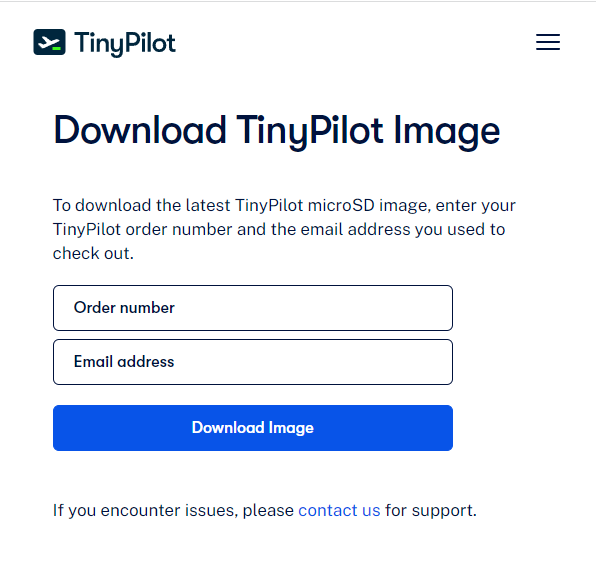
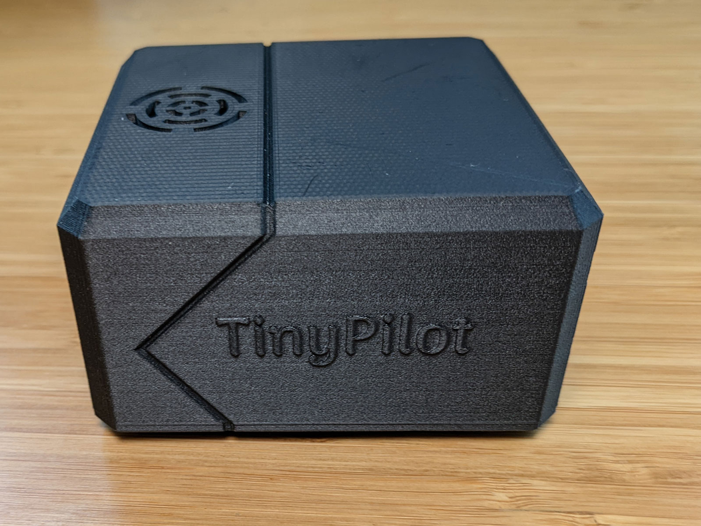
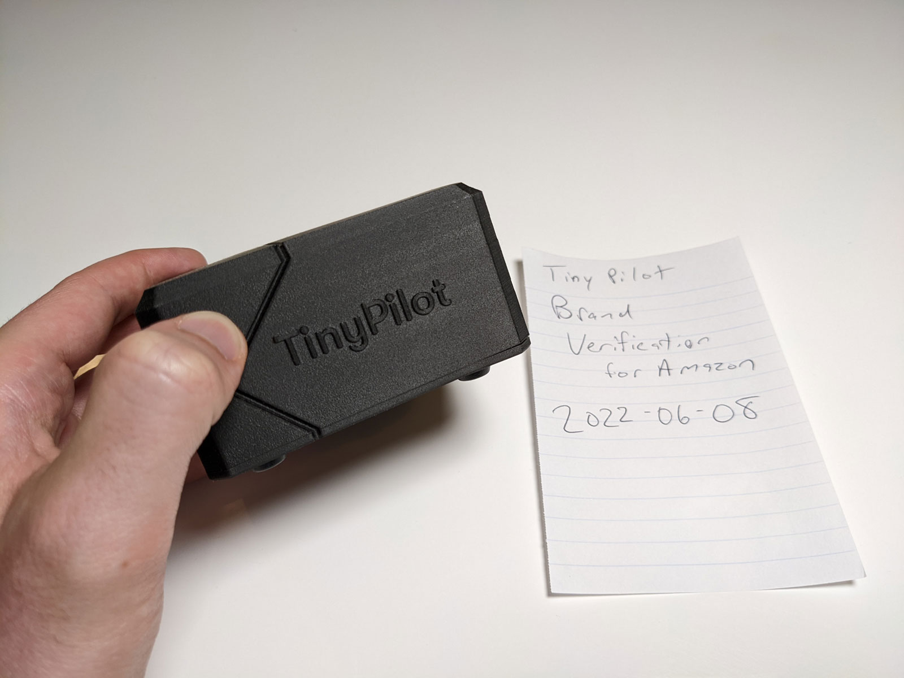
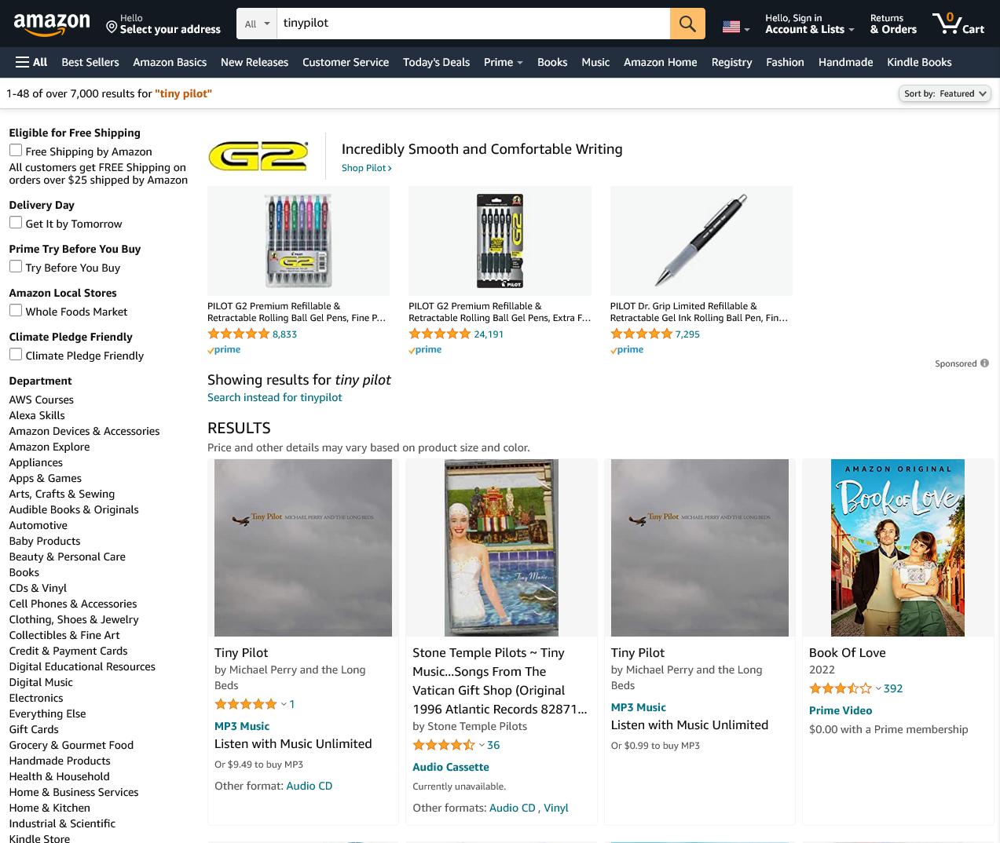
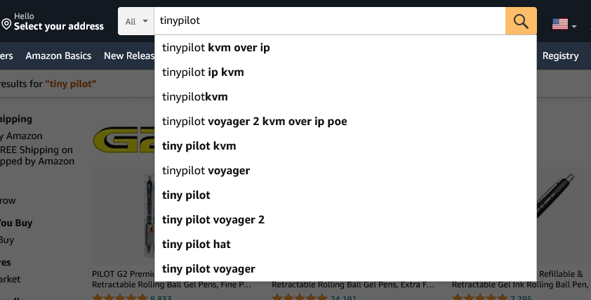
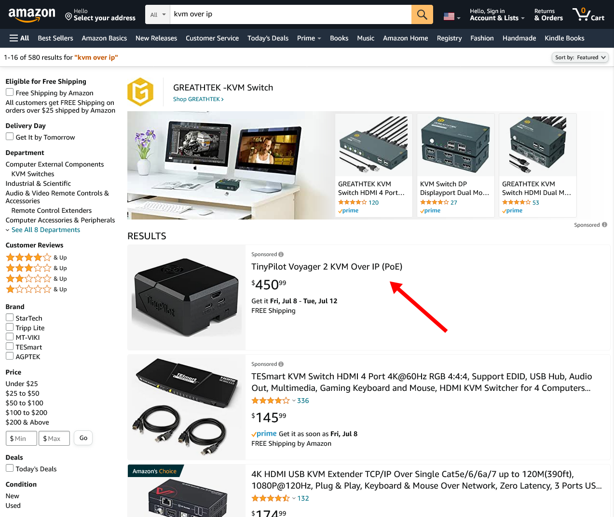

## Highlights

- TinyPilot reached an all-time high of $74k in revenue.
- I'm trying to figure out the best approach to software licensing.
- I'm still searching for a web framework I can love.

## Goal Grades

At the start of each month, I declare what I'd like to accomplish. Here's how I did against those goals:

### Create a self-contained tarball for installing TinyPilot

- **Result**: We now have a working tarball package
- **Grade**: A

TinyPilot's install process has been growing more complex over time. It pulls in code from multiple repositories and third-party dependencies, and it's becoming increasingly difficult to keep track of those relationships.

We're currently overhauling the install process by converging everything into a single tarball. This centralizes all of the dependencies in a clear location. We're in the process of switching the free version of TinyPilot to the new update system, and we'll migrate TinyPilot Pro soon after.

### Complete the first draft of a full-length blog post about the TinyPilot website redesign

- **Result**: Completed the first draft
- **Grade**: A

I thought it would be easy to write the blog post because I'd written so much about the experience in my retrospectives, but I write full-length posts in a different style, so I still have to rewrite a lot. It's 5,200 words, which is about twice as long as my typical article, so I'm trying to trim it down.

### Increase ROAS on paid search ads to 2.0

- **Result**: Increased ROAS from 1.79 to 1.99
- **Grade**: A

The digital marketing freelancer working with TinyPilot increased revenue on ad spend to 1.99. I estimate that I'm earning about $0.55 in profit for every dollar I spend on ads.

Unfortunately, I can't just double ad spend and double sales, as costs increase as you try to capture a greater share of search impressions. Still, I'm happy with the performance so far, and we're continuing to explore new marketing channels.

## [TinyPilot](https://tinypilotkvm.com/?ref=mtlynch.io) stats



| Metric                   | May 2022      | June 2022       | Change                                           |
| ------------------------ | ------------- | --------------- | ------------------------------------------------ |
| Unique Visitors          | 14,296        | 10,056          | <font color="red">-4,240 (-30%)</font>           |
| Total Pageviews          | 24,131        | 18,764          | <font color="red">-5,367 (-22%)</font>           |
| Sales Revenue            | $54,844.20    | $72,476.80      | <font color="green">+$17,632.60 (+32%)</font>    |
| Enterprise Subscriptions | $47.75        | $47.75          | 0                                                |
| Royalties                | $3,269.56     | $1,710.27       | <font color="red">-$1,559.29 (-48%)</font>       |
| Total Revenue            | $58,161.51    | $74,234.82      | <font color="green">+$16,073.31 (+28%)</font>    |
| **Profit**               | **$6,445.38** | **$7,716.34**\* | **<font color="green">+$1,270.96 (+20%)</font>** |

\* _Note: Profit is just a naive delta in my cash balance until I do real bookkeeping mid-month._

This was TinyPilot's all-time strongest month of revenue. And the exciting part is that there was otherwise nothing remarkable about June.

All of TinyPilot's previous record-breaking months were related to some one-time event like a new product launch or a positive review. But June was effectively just a boring old month where nothing out of the ordinary happened. And that's great! It indicates that we can repeat what we're doing without relying on external events to drive sales.

Site visitors are down relative to the previous month but only because May was [atypically high](/retrospectives/2022/06/#tinypilothttpstinypilotkvmcomrefmtlynchio-stats) due to my last blog post. Our overall visit count is still significantly higher than the first quarter. I credit the increase in visitors to our new marketing campaign.

## How do TinyPilot Pro users prove their license?

I've always wanted TinyPilot's software to be sustainable on its own regardless of whether we continue selling new hardware. Users get our premium software for free when they purchase the TinyPilot hardware, but there needs to be a way for them to pay after a certain point to fund software maintenance.

I launched a paid version of TinyPilot called TinyPilot Pro back in December of 2020. I initially planned to launch with license key checks, but I [punted that feature](/retrospectives/2021/01/#enforcing-software-licenses-via-the-honor-system), reasoning that I didn't need it until licenses started expiring at the end of 2021.

Now, it's 18 months later, and TinyPilot Pro still never checks if the user has a valid license. I estimate that around 1/3 of users have an expired license and don't realize it.

I'm planning to add a check for a valid license when a user upgrades to the latest version. That way, if a user is happy with their current version, they can use it forever. If they want the latest and greatest, they have to pay for the software update after their initial one-year license expires.

To check the user's right to download the latest updates, I need a way for the user to prove to the update server that they have an active TinyPilot Pro license.

Here are the options I'm considering:

### Device ID

TinyPilot runs on the Raspberry Pi, and every Pi device has a hardware serial number that you can retrieve like this:

```bash
$ cat /proc/cpuinfo | grep Serial | cut -d ' ' -f 2
10000000ecf8821b
```

We could record the device IDs from each Pi before we sell them to a customer. When the user attempts to upgrade, we just check if their device ID is pre-registered and then activate based on their device ID.

- Pros
  - Easy for the user - can't lose or forget their device ID
- Cons
  - Requires us to keep track of all the device IDs
  - Adds an extra step to the device manufacturing process
  - We still need a solution for users who purchased before we started recording device IDs

### Order details

Today, when a customer wants to download the official TinyPilot disk image, we ask for the order number and the email address associated with their purchase:

{{}}

We could use the same logic within the TinyPilot web app to gate upgrades.

- Pros
  - Minimizes bookkeeping because we don’t have to keep track of keys or device IDs, as we’re already storing order information
  - Works for all past customers because we already have their order information
- Cons
  - End-users don't always know their order details
    - Sometimes they buy from a reseller, or someone else at their company purchased the device
  - Every time we start selling through a new channel (e.g., Amazon, eBay), we’d have to write custom code to query order information from that channel

### Printed activation key

We could generate a set of activation keys, similar to how you activate Microsoft Windows or Office (e.g., `1F9PA-V4JD5-4JPOM`). The keys could be printed out and included with each device, and the user types the key to prove they have a license.

- Pros
  - Works the same regardless of whether the user buys directly from us or through Amazon, eBay, etc.
- Cons
  - Users are prone to lose or ignore a printed slip of paper in their order
  - We still need a solution for users who purchased before we started handing out activation keys

### License baked into the software

We flash images onto customer devices, so we could theoretically place a unique key file on each customer's device that grants the TinyPilot Pro license.

- Pros
  - Works the same regardless of whether the user buys directly from us or through Amazon, eBay, etc.
  - User can't lose their key
- Cons
  - Wildly impractical and complicated to implement
    - We'd have to generate custom disk images for each customer and make sure the customer always install their particular image
  - We still need a solution for users who purchased before we started baking in activation keys

### Some combination

I'm leaning towards a blended approach that uses the most automatic method possible but falls back to more manual methods for edge cases:

1. Check if the device's hardware ID is pre-registered.
1. If the device isn't pre-registered, prompt the user for their order ID and email so we can find their order automatically.
1. If we can't find their order automatically with order ID + email, ask the user to email customer support so we can provision a license manually.

Of the options I can think of, that seems to be the least error prone and puts the least amount of work on end-users.

## Abandon all hope, ye who enters the Amazon Sellers Marketplace

For a long time, I've considered selling TinyPilot on Amazon, as many people treat Amazon as their one-stop shop for all online shopping. I've been resistant because signing up as an Amazon seller seemed like a miserable and tedious process. Having now gone through the process, I can say it's more miserable and tedious than I expected.

It took three weeks before I could even list my product on Amazon. Every few days, Amazon told me I needed some new approval or had to prove something about my identity or my product.

First, Amazon had to verify my identity with my driver's license and credit card numbers. Then, I needed to appear on a live video call holding my driver's license in front of my face and bending it to prove it wasn't just a printout.

Then, Amazon froze my account for a day because they couldn't verify my credit card. This was the same credit card I'd had on file with Amazon for a year and used to make ~$50k in purchases with them.

Then, Amazon froze my account so they could verify I'm entitled to use the "TinyPilot" brand name. I showed them proof that I'm the owner of TinyPilot, LLC, and I sent them photos of my product with "TinyPilot" written on the side.

{{}}

They said they'd review within three days, but it actually took 10. Their conclusion was that my photos didn't sufficiently prove that "TinyPilot" was permanently affixed to my product...

{{}}

So, I sent new photos much more focused on the brand name, and only then did they finally approve the product.

{{}}

The new problem was that TinyPilot didn't show up in search results if you search for "tinypilot":

{{}}

This is especially weird given that Amazon's own autocomplete suggestions were all clearly about my product:

{{}}

Even "tinypilot kvm over ip" didn't show my product until page two or three of search results.

I ended up just purchasing ads on Amazon, which finally led to my first few sales.

{{}}

I'm hoping the hard parts are over for getting up and running, so I'll stick with it and see if Amazon grows our sales as we accrue ratings there.

## Amazon customers are a different breed

Amazon customers seem to have drastically different expectations than customers who purchase directly from the TinyPilot website.

The first customer to purchase through Amazon sent a message with the order "ship this with UPS 2-day," but we don't offer UPS shipping. I responded to the customer's message, but I wasn't sure what to do next. Should I cancel the order and risk a penalty from Amazon? Wait for the customer to respond and risk Amazon penalizing me for shipping late? I ended up waiting a day and canceling after not hearing back. Then, the customer placed the same order, so we just fulfilled it with USPS and didn't hear any complaints.

A few days later, a different Amazon customer sent me a message saying she was "very disappointed" that her product hadn't arrived yet, as she paid $10 for expedited shipping. I checked the tracking and saw that we shipped her product a day early via USPS Priority, but USPS was running late. This is obviously out of our control, but I suspect customers don't understand the difference between purchasing from a third-party seller and purchasing directly from Amazon with their own delivery fleet.

We sometimes get these types of complaints from customers who order directly, but it's nowhere near the rates we're seeing on Amazon.

## Still searching for a lovable web framework

As I mentioned in [my last update](/retrospectives/2022/06/#wanderjesthttpswanderjestcom), I'm rebuilding [WanderJest](https://wanderjest.com), a tool for finding live comedy that I put on hold [at the start of the pandemic](/retrospectives/2020/04/#putting-wanderjest-on-hold).

{{}}

I'm rewriting WanderJest in Go + VanillaJS + SQLite as a "back to basics" tech stack after years of trying to work with SPA frameworks like Angular and Vue. Chris Ferdinandi articulates some of my frustrations in his article, ["SPAs were a mistake."](https://gomakethings.com/spas-were-a-mistake/)

I like my current tech stack better than any web framework I've tried in the past, but I still don't _love_ it. I spend the majority of my time on tedious tasks just gluing things together.

For example, to allow users to create profiles on WanderJest with their photo, bio, and links to other social networks, I need to:

1. Create web forms to allow the user to create and edit their profile
1. Create server-side endpoints to receive the user submissions
1. Create data models to represent profile information
1. Write serialization/deserialization code to move data in and out of the data store
1. Write SQL queries for inserting and retrieving the data from the data store
1. Create a web UI for rendering the profile information

It's fewer steps than other frameworks I've used, but that stuff is _really boring_.

[Phoenix LiveView](https://github.com/phoenixframework/phoenix_live_view) has been on my list for the past year. It's what the cool kids over at [fly.io](https://fly.io) are all excited about. Part of Phoenix's promise is that it automates many of the repetitive tasks I listed above. Chris McCord made a [neat demo](https://www.youtube.com/watch?v=MZvmYaFkNJI) where he uses Phoenix to build a basic Twitter clone in 15 minutes.

At the same time, I'm afraid of a "grass is always greener" mentality that has me constantly hopping around to different frameworks without learning any particular stack well. Maybe a good compromise is [Ruby on Rails](https://rubyonrails.org), which I think has a similar developer experience to Phoenix but with a more mature ecosystem around it.

## Wrap up

### What got done?

- Started selling TinyPilot on Amazon
- Completed the first draft of a new full-length blog article
- Completed the process of generating install bundles for TinyPilot

### Lessons learned

- Amazon Seller Marketplace is even more unpleasant than it seems.

### Goals for next month

- Finalize plans for managing TinyPilot licenses.
- Migrate TinyPilot Community to the next-generation update system.
- Publish the blog post about the TinyPilot website redesign.
