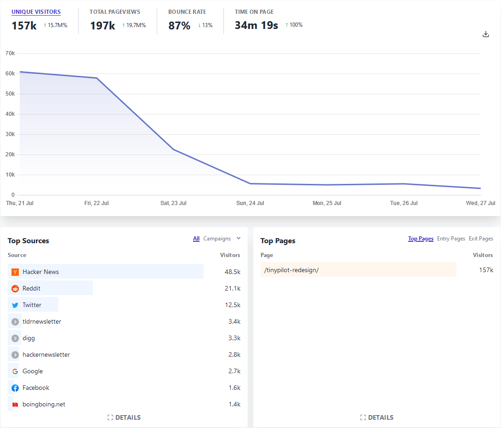
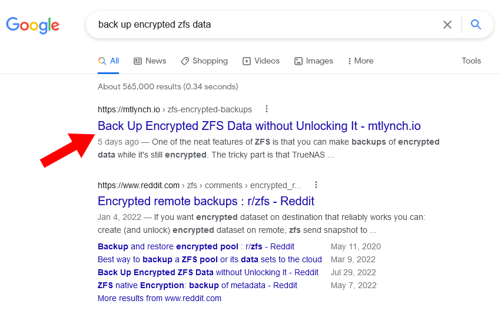

## Highlights

-

## Goal Grades

At the start of each month, I declare what I'd like to accomplish. Here's how I did against those goals:

### Finalize plans for managing TinyPilot licenses

- **Result**: Made no progress on plans for managing TinyPilot licenses
- **Grade**: F

TODO

### Migrate TinyPilot Community to the next-generation update system

- **Result**: We're close but we haven't pulled the trigger yet
- **Grade**: C

TODO

### Publish the blog post about the TinyPilot website redesign

- **Result**: Published ["I Regret My $46k Website Redesign"](/tinypilot-redesign/), which became my second most popular blog post
- **Grade**: A

TODO

## [TinyPilot](https://tinypilotkvm.com/?ref=mtlynch.io) stats



| Metric                   | June 2022      | July 2022        | Change                                        |
| ------------------------ | -------------- | ---------------- | --------------------------------------------- |
| Unique Visitors          | 10,056         | 21,242           | +11,186 (+111%)    |
| Total Pageviews          | 18,764         | 33,578           | +14,814 (+79%)     |
| Sales Revenue            | $65,597.73     | $56,954.66       | -$8,643.07 (-13%)    |
| Enterprise Subscriptions | $47.75         | $290.70          | +$242.95 (+509%)   |
| Royalties                | $1,710.27      | $2,513.71        | +$803.44 (+47%)    |
| Total Revenue            | $67,355.75     | $59,759.07       | -$7,596.68 (-11%)    |
| **Profit**               | **-$4,230.17** | **-$7,485.91**\* | **-$3,255.74 (77%)** |

\* July profit is just a naive estimate based on change in cash holdings until I do real bookkeeping mid-month.

Sales are still strong following the website redesign. There was a 13% drop, but that's almost entirely due to a single order. A large company placed a complicated, custom order for $4,200. The day after we shipped it, they changed their mind and canceled the order. That's $8,400 of the delta between the last two months because June had the revenue, and July had the refund.

But oof on that negative profit. Every month, I feel like my one-time costs are coming to a close, and then something pops up that eats up any chance at profit for the month. This month, it was $17k in hardware engineering to redesign around the chip shortage and $10k from an old vendor who hadn't gotten around to billing me for work going back to July 2021.

## My redesign regret blog post

["I Regret My $46k Website Redesign"](/tinypilot-redesign/) is now my second most popular blog post of all time, attracting 157k unique readers in its first week. It was the second most upvoted post [on Hacker News](https://news.ycombinator.com/item?id=32179563) for the full month of July, and it reached the top spot of the [/r/web_design](https://www.reddit.com/r/web_design/comments/w4ir7r/i_regret_my_46k_website_redesign/) and [/r/programming](https://www.reddit.com/r/programming/comments/w5egi7/i_regret_my_46k_website_redesign/) subreddits. The only article I've ever written that's attracted more attention was, ["Why I Quit Google to Work for Myself,"](/why-i-quit-google/) which had 389k readers.

{{}}

I appeared as [a guest on the _Ditching Hourly_ podcast](https://podcast.ditchinghourly.com/episodes/michael-lynch-i-regret-my-46k-website-redesign) to talk about my experience with the website redesign

### Why was it so popular?

I'm honestly surprised that the post got so popular. I thought there was a stronger chance than most of my posts that this would flop. It had several big things working against it:

- It's 4,100 words and an estmated 20-minute read, twice as long as my usual posts.
- It's a good match for Hacker News, but I wasn't confident it would match anywhere else.
- It's about hiring a web design agency on a small budget, which is not a relatable experience to most people.
- If it misses on social media platforms (Hacker News, reddit), there's little chance of people discovering it through Google because "website redesign regret" isn't a common search term.

Seeing the post succeed, I realized I failed to consider a few important strengths.

First, it's a story, and people love stories. Most of my successful blog posts are stories. Even if a reader is not particularly interested in a topic, they'll stick around if they connect to the human elements of the story.

Next, it's more relatable than I considered. Even though a miniscule portion of the population hires designers, nearly everyone has opinions about design. And I know almost nothing about design, so it was impossible for me to alienate anyone by being too jargony or academic in telling the story. I also wonder if people related to it on the level of feeling taken advantage of by a business, which is more common than the specific experience of hiring a design agency.

Last, it's about blowing a lot of money on something stupid, and people love those stories. People just get excited about money and (relatively) big numbers, whether it's gaining or losing.

### Why didn't you name and shame the agency?

One of the most common responses I heard was that I should have named the agency instead of using the pseudonym of "WebAgency."

I had a few reasons for keeping the agency anonymous:

- The point was too learn from the experience, and blaming everything on the agency doesn't teach me much
- I didn't want them to respond and having a whole public back-and-forth about who was to blame
- I didn't want people harassing the agency on the basis of my one-sided story

But in writing up this retro, I realized those reasons aren't really true. I've named and shamed companies in the past, where all of those reasons would have applied:

- I accused [Stripe](/stripe-recording-its-customers/) of collecting excessive data about their customers.
- I accused [a keto bread company](/collect-debt/) of underpaying its affiliates.
- I accused [a crypto company](https://blog.spaceduck.io/siaberry-2/) of putting its customers at risk and being generally incompetent.

I think the real reason I didn't name the agency was that it just felt too personal. I'd worked with these people for eight months and frequently spoke with them face to face. It just felt like too much of a social violation to turn around and villainize them on my blog.

If it had been more egregious, then I'd happily name them. Like if they'd tried to install a backdoor or cryptocurrency miner onto my website, then sure &mdash; all bets are off. But applying [Hanlon's razor](https://en.wikipedia.org/wiki/Hanlon%27s_razor), I think this was more a consequence of poor management rather than bad faith, so it didn't feel like a public shaming was warranted.

### Is it worth writing blog posts like this?

One of the things I struggle with is whether I can justify time I spend blogging when TinyPilot is still struggling. I don't think people directly buy it

Visits to TinyPilot

There wasn't a noticeable jump in sales. Sales were high for a few days after, but they were still within the noise of TinyPilot's usual sales.

I think it's good for TinyPilot long-term, though, as most of the readers had probably never heard of TinyPilot and maybe weren't even aware that products like it exist.

## Less tweeting, more blogging

Last month on Twitter, Josh Pitzalis asked me about something I'd written about programmatic SEO:



I knew I'd used programmatic SEO to generate pages for [my local comedy site](https://wanderjest.com), but I couldn't figure out what writing he was talking about. I vaguely remembered writing something, but I couldn't find anything in my blog.

But then Josh ended up finding the thing he'd remembered reading: a Twitter thread I'd completely forgotten:



Ever since that exchange, I've been thinking about how I can write more on my blog and less on other platforms. Twitter is an especially bad medium for preserving knowledge because it's ephemeral by design. I forget what I post there, and searching my post history is slow and tedious.

When I started blogging, it was because I kept running into situations where I wished a tutorial existed. Over time, I found that readers responded more to the story of me figuring something out than the solution itself. For example, [GreenPiThumb](/greenpithumb/) was one of my first popular posts, and it was because I told it as a story rather than a tutorial.

As I've started focusing on the story behind the solution, I'm once again left with the problem of not having a good place to share solutions to things I found challenging. So I'm experimenting with posts that aren't meant to attract wide readership but are just a place for me to share useful knowledge.

My first attempt to return to a "capture knowledge" style of article was a post I published last week called, ["Back Up Encrypted ZFS Data without Unlocking It."](/zfs-encrypted-backups/) It didn't get much traction anywhere, but it's now the top result on Google for the (admittedly specific) search query of "back up encrypted zfs data":

{{}}

My logs say I spent just under 6 hours writing it, so I feel like it was a good return on investment. Writing the blog post helped me clarify my understanding of how ZFS worked, and I feel like it will be a useful reference for me even if nobody else reads it.

Though I'm trying to keep more content on my blog, I think some things are a better fit for Twitter. For the past two weeks, I've been trying to figure out why PicoShare keeps crashing on systems with low RAW, and I've been tweeting my progress.



People seem to enjoy the thread, and I received lots of great advice that helped me identify issues much more quickly than if I'd been doing it by myself. And I think that's the ideal kind of content for Twitter because I'm sharing live progress and not a finished result.

## Experimenting more with price

In July, I reduced pricing on TinyPilot for the first time in at least six months. I'd been slowly inching up pricing.

Every time I raised prices, I thought, "People aren't going to buy at this new price. That's crazy!" And then it seemed like sales revenue stayed the same.

Right now, we have a backlog of hardware, so I'd rather sell it and not have so much of my assets tied up inventory. I'm hoping that reducing prices can increase sales, but it's possible that it will have no effect or the opposite effect. It could be that almost anyone who'd buy TinyPilot at $350 would also buy it at $400, so I'm just forfeiting $50 per sale. I'll hopefully have a better idea by the end of next month.

The non-PoE version outsells the PoE version 2:1. We'll see what effect this has on sales.

## Side projects

## Wrap up

### What got done?

- Published two new blog posts: ["I Regret My $46k Website Redesign"](/tinypilot-redesign/) and ["Back Up Encrypted ZFS Data without Unlocking It"](/zfs-encrypted-backups/)

### Lessons learned

-

### Goals for next month

- Migrate TinyPilot Community and TinyPilot Pro to the next-generation update system
- Finalize plans for managing TinyPilot licenses
