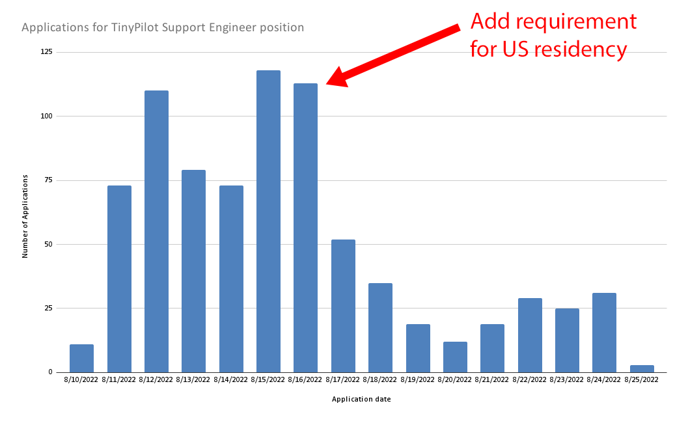
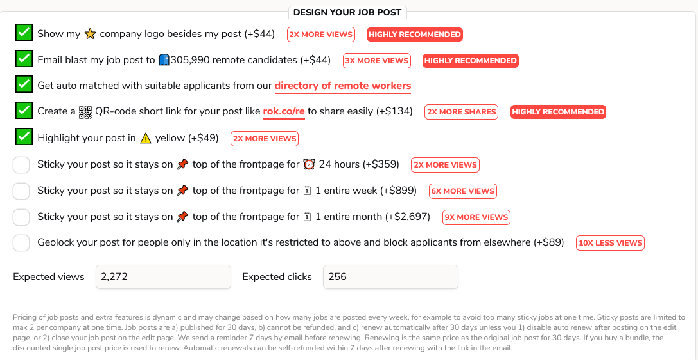
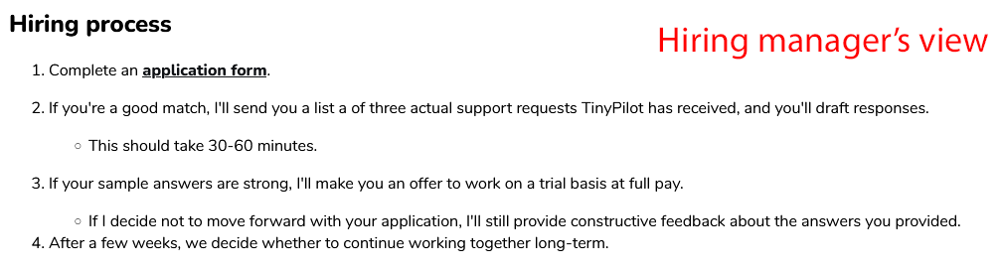
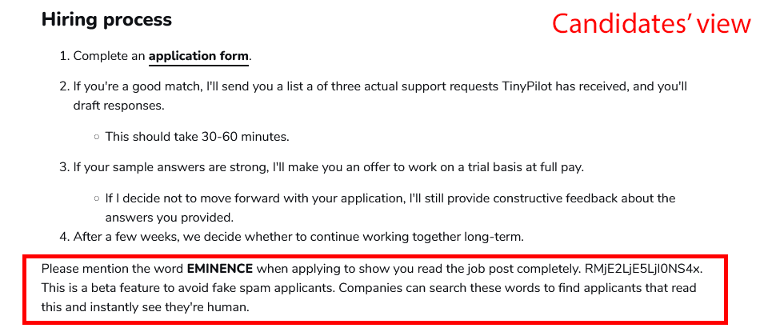
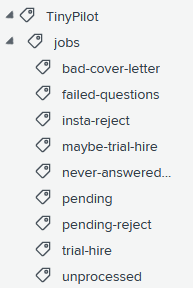
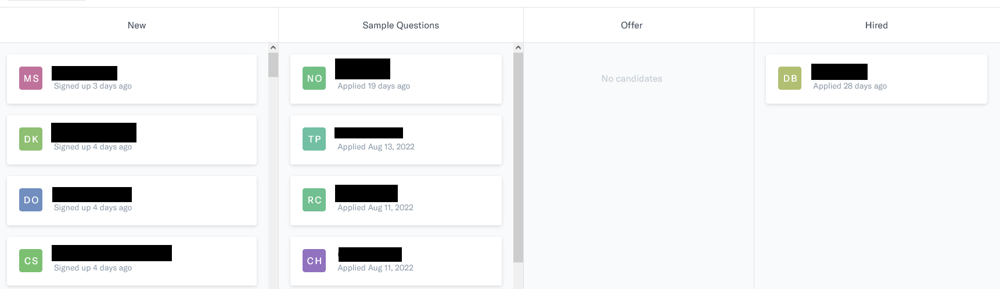
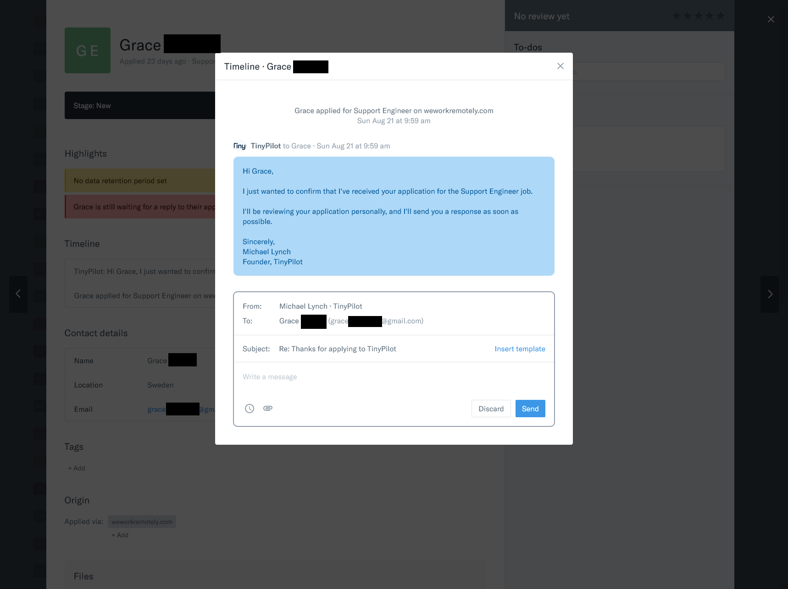
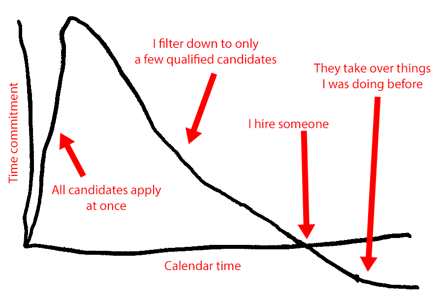
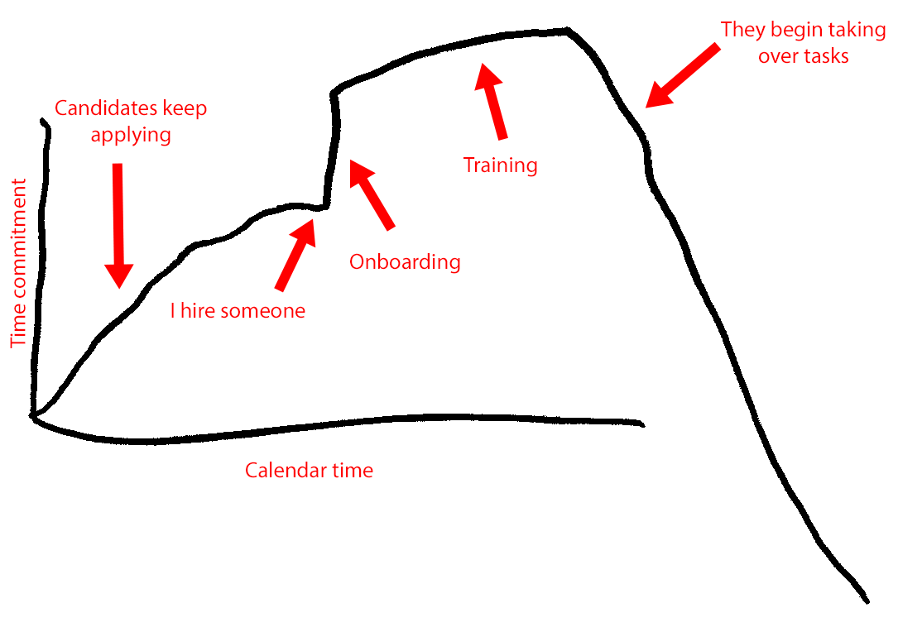



**New here?**

Hi, I'm Michael. I'm a software developer, and the founder of [TinyPilot](https://tinypilotkvm.com), an independent computer hardware company. I started the company in 2020, and it now earns $60-80k/month in revenue and employs six other people.

Every month, I publish a retrospective like this one to share how things are going with my business and in my professional life overall.


## Highlights

- TinyPilot had its all-time best month, reaching nearly $80k in revenue and exceeding its previous record by 15%.
- The response rate to my job posting was 8x higher than when I listed the same job six months ago.
- I have lots of thoughts about hiring people.

## Goal Grades

At the start of each month, I declare what I'd like to accomplish. Here's how I did against those goals:

### Migrate TinyPilot Community and TinyPilot Pro to the next-generation update system

- **Result**: We migrated TinyPilot Community, but TinyPilot Pro is not yet ready.
- **Grade**: C+

We've been working on overhauling TinyPilot's update system since May, and it's taking way longer than any of us expected.

Over the first two years, I accrued a lot of technical debt in TinyPilot's update system. We're paying it down now, but it also means that we keep encountering surprises that eat up a week or more of dev time. I'm pretty confident that we're down to the last few weeks now.

### Finalize plans for managing TinyPilot licenses

- **Result**: Plans are finalized.
- **Grade**: A

We've finalized a plan for managing TinyPilot licenses, and I think everyone involved is happy. It offers a smooth user experience and minimizes engineering complexity.

### Send TinyPilot Voyager to two YouTube creators or bloggers for review

- **Result**: I was too busy with hiring to get to this.
- **Grade**: F

I didn't make any progress here. I really should have made hiring one of my goals instead because that's what I spent most of the month doing.

## [TinyPilot](https://tinypilotkvm.com/?ref=mtlynch.io) stats



| Metric                   | July 2022       | August 2022    | Change                                              |
| ------------------------ | --------------- | -------------- | --------------------------------------------------- |
| Unique Visitors          | 21,242          | 11,903         | -9,339 (-44%)              |
| Total Pageviews          | 33,578          | 23,214         | -10,364 (-31%)             |
| Sales Revenue            | $56,954.66      | $76,082.06     | +$19,127.40 (+34%)       |
| Enterprise Subscriptions | $290.70         | $290.70        | 0                                                   |
| Royalties                | $2,513.71       | $3,264.23      | +$750.52 (+30%)          |
| Total Revenue            | $59,759.07      | $79,636.99     | +$19,877.92 (+33%)       |
| **Profit**               | **$-12,349.21** | **$21,580.82** | **+$33,930.03 (+inf%)** |

August was a record month in TinyPilot's revenue and profit. I [reduced prices by 11%](/retrospectives/2022/08/#experimenting-more-with-tinypilot-pricing) at the end of July, and it looks like that increased sales by 34%. And again, it was another "boring" month in that no external events drove these numbers, so I'm optimistic about sustaining this.

The reason I was able to reduce prices was that I finally have a healthy supply of circuit boards. The chip shortage forced us into an eight-month redesign to replace a component that went out of stock. I had to keep prices high to avoid selling out our limited inventory. Now that we can continue making new chips, I have more flexibility in price and sales velocity.

## Handling 8x the applicant rate

I hired a second support engineer in August, and it was a drastically different experience from when I hired for the same role six months ago.

Last time, I [received 221 applicants in 30 days](/retrospectives/2022/03/#hiring-a-support-engineer-the-job-posting). This time, there were 802 applications in only two weeks. There were so many applicants that I had to actively slow things down, and I ultimately closed applications entirely after two weeks.

I wanted to pause my job listing while I caught up with responses. We Work Remotely, annoyingly, doesn't let you temporarily hide job posts. You either delete them permanently and forfeit all the time you've paid for, or you leave them running and attract more candidates than you can handle.

As a workaround, I left the job listings up, but I changed the location requirement from "Worldwide" to "US only." There's nothing about the role that strictly requires candidates to live in the US, but it was the best way I could think of to slow the flow of applications without totally taking down the post.

{{}}

Adding a location requirement did slow down the rate of new applications by about half. Still, many applicants ignored the requirement. Only 42% of the candidates said they actually lived in the US after the requirement compared with 18% before.

I closed applications after two weeks, as I'd received 802 applications, and I knew I wouldn't be able to process all of them fast enough to give candidates timely responses.

Why so many more applicants this time? Here are my guesses:

### Structured web forms are less intimidating than email

I think the biggest factor was that candidates applied through a web form this time. Last time, I told people to just email me a resume and cover letter. I suspect people feel more comfortable filling out a structured form, so it encourages more people to apply.

The downside is that the web form seems to attract more low-effort applicants. Last time, 18% of We Work Remotely applicants were strong enough to pass the initial resume screen. This time, only 6% proceeded past the first stage.

### More hiring channels means more candidates

I posted the job to two additional channels: RemoteOK and Craigslist. Craigslist didn't seem to add many applicants, but RemoteOK added 127 over two weeks.

### A declining economy means more job-seekers

Lastly, the global economy is worse today than it was when I hired six months ago. There are more fears of a recession, and fewer companies are hiring. I'd assume it's more of an employer's market than it was earlier in the year.

## Comparing channels for advertising remote jobs

Through this process, I found that different hiring channels had drastically different returns on investment.

The two metrics I care about are:

- Number of qualified candidates
- Percentage of qualified candidates out of total applicants

I want a platform that can deliver me about 10-20 qualified candidates per role so that I have a decent pool of options to choose from. If the platform's signal-to-noise is so bad that I have to screen 3,000 people to find a handful who are qualified, it's not valuable.

For the purposes of this evaluation, I consider everyone who passed my resume screening to be a qualified candidate. I'm also only considering the applications for the five days when the job was open worldwide. This is partly because changing the location requirement biases the responses, and partly because I haven't finished processing all the other applications.

| Channel                                                      | Cost     | Total Candidates | Passed Initial Screen | Cost per Qualified Candidate | Trial Hires |
| ------------------------------------------------------------ | -------- | ---------------- | --------------------- | ---------------------------- | ----------- |
| We Work Remotely                                             | $398     | 359              | 20 (6%)               | $20                          | 0           |
| Remote OK                                                    | $448     | 67               | 0 (0%)                | N/A                          | 0           |
| Craigslist                                                   | $25      | 3                | 1 (33%)               | $25                          | 0           |
| [Hacker News](https://news.ycombinator.com/item?id=32418196) | $0       | 2                | 0 (0%)                | N/A                          | 0           |
| Other aggregators                                            | $0       | 53               | 1 (8%)                | $0                           | 0           |
| Unknown / applied directly\*                                 | $0       | 52               | 3 (15%)               | $0                           | 1           |
| **Total**                                                    | **$871** | **464**          | **25 (5%)**           | **$35**                      | **1**       |

\* The "Unknown" category includes candidates who applied through the link on the TinyPilot website, so it includes people who saw me post about it on Twitter or other places. My final hire found the job from [my tweet](https://twitter.com/deliberatecoder/status/1557385358576418817).

We Work Remotely performed pretty well. It has its share of low-effort and spammy applicants, but finding 20 candidates out of 359 is a pretty good ratio.

RemoteOK had no qualified candidates in this time range, and my experience using it was so bad that it deserves its own section.

## RemoteOK is hugely disappointing

I've been a fan of [Pieter Levels](https://levels.io/) for a long time. [His interview on the _Indie Hackers_ podcast](https://www.indiehackers.com/podcast/043-pieter-levels-of-nomad-list), is one of the best episodes of the series. Pieter does a great job of highlighting what makes the bootstrapper lifestyle exciting and liberating.

Unfortunately, RemoteOK, Pieter's flagship business, was a huge letdown. I can't remember the last time I've used a product that feels like it's fighting so stubbornly against me, its paying user.

Right off the bat, when you create the job post, RemoteOK pushes all these little upsells on you.

{{}}

We Work Remotely tries similar upsells, but theirs don't feel as gross. Maybe it's because We Work Remotely isn't charging $134 to create a QR code for you.

RemoteOK jobs have tags to help applicants search, so I added tags like `linux`, `customer support`, `flexible schedule`. When I came back to the job a few hours later, I saw that RemoteOK had automatically added several inaccurate tags like `microsoft` `windows` `webdev` `development` even though those have nothing to do with my job. I erased RemoteOK's tags, but the next day, they were back. The only way I could get rid of them permanently was by adding more tags myself.

The most egregious example of RemoteOK taking control away from the user is its magic keywords. RemoteOK adds the instruction, "Please mention the word \[_some random word_\] when applying to show you read the job post completely." RemoteOK doesn't tell you that it's adding these instructions, and [you can't remove them](https://twitter.com/deliberatecoder/status/1557394573189595137).


{{}}
{{}}


I hate, hate, HATE this feature. I wouldn't have listed my job on RemoteOK at all had I known about it.

I find these "magic keyword" requirements insulting to applicants, and I deliberately exclude things like that when advertising my job. It's incredibly irritating that RemoteOK surreptitiously injects it into the job posting I purchased.

Most damning of all, RemoteOK failed entirely at its one job: delivering qualified candidates. None of RemoteOK's candidates passed my initial application screen, while We Work Remotely matched me with 20 qualified applicants during the same time period.

## Homerun is good, not great

Last time I hired, I directed candidates to just email me, and then I organized applications using inbox labels. That ended up being messy and confusing.

This time around, I [tested several applicant tracking systems](/notes/bootstrapper-ats/), eventually settling on [Homerun](https://homerun.co).

After using Homerun for the full hiring pipeline, I'm pretty satisfied. The UI looks nice, and it did everything I needed. Everything felt fairly intuititive, so it was easy to process applications in an organized way.


{{}}
{{}}


I really liked Homerun's templated email feature. I rarely sent candidates pure form letters, but it was helpful having a skeleton structure in place for common responses like:

- You don't have enough Linux experience
- Your English isn't at the level the role requires
- You're a great candidate, so let's move on to the sample questions

{{}}

Homerun costs $71/mo, which is within the affordable range for most small businesses. And billing is fair in that you don't have to pay for months when you're not hiring. Most [other applicant tracking platforms](/notes/bootstrapper-ats/) delete all of your data if you stop paying the full monthly fee. Homerun allows you to downgrade to the free plan when you're not actively hiring, which preserves all of your data. The only restriction under the free tier is that you can't accept new applicants until you begin paying again.

I did encounter a few big weaknesses in Homerun:

### Can't filter candidates

With such a high volume of candidates, I wanted a way to reach out early to the most promising ones. I'd love to filter down to candidates who live in an English-speaking country and rate themselves proficient in Linux. Homerun has this data, but they don't offer any way of filtering candidates on these criteria. The only way to find these applicants in my queue is by reviewing each application one-by-one.

### Bad email UX

One of the Homerun's worst UI decisions is how their email works. Like all applicant tracking systems, Homerun lets you email candidates from within their web app. But it does this by popping up a modal window:

{{}}

The modal window completely blocks everything the candidate wrote in their application, so you can't refer to any of your notes, their resume, or their answers to questions on the application form. This is a terrible choice, as employers obviously need this information when writing back to the candidate.

I worked around this by keeping Homerun open in two side-by-side windows. This worked okay, but Homerun doesn't sync well across browser windows. If I marked a candidate as rejected in one window, the other window would get confused and reload from the top of the applicant list.

### Poor email deliverability

I sent candidates my sample assignment as a link to a PDF, but several candidates told me they didn't receive it. I suspect that Homerun uses email servers with weak sender reputations, so spam filters block Homerun emails that include links.

### Slow web app

The Homerun web app is annoyingly slow. I have a modern desktop with fiber internet, but most Homerun pages take 2-5 seconds to load. Some take as long as 10 seconds.

## Improvements for my next hire

I'm dissatisfied with how I treated candidates this round of hiring. I wasn't prepared for the volume of applications, and I wasted applicants' time by accepting more applications than I could process within a reasonable timeframe.

Here are some changes I plan to make next time to improve the hiring experience for everyone.

### Be more conservative in sending responses

When I first started processing applications with Homerun, I got overeager about its email templates. My last hiring round, if a candidate sent a low-effort application, I just ignored them. With Homerun, the email templates made it easy to respond even to people who put in low effort.

I made a template that basically said I'm rejecting them because their application looked copy/pasted. I figured it was good to at least give feedback that copy/pasting applications is losing them jobs.

{{}}

This strategy worked poorly.

Of the candidates who responded, about 50% were gracious and appreciated the feedback, so that was good. About 20% were rude or hostile, so that was bad.

The last 30% realized an actual human was finally engaging with them, and their application hadn't disappeared into the void like they'd assumed. At that point, they started researching the company and said they, in fact, were interested in TinyPilot specifically. That put me in a weird position. If I reconsidered their application, it felt unfair to candidates who wrote thoughtful answers up front instead of copy/pasting the same thing to everyone.

After a day or two of burning time on low-effort applications, I just stopped responding to that category of applicants. I changed my strategy to respond only if the following were true:

- The candidate is qualified for the role at a basic level
  - e.g., if one of the job requirements is "comfort with Linux" and the candidate says they've never used Linux: no response.
- The candidate has invested at least a few minutes into their application
  - e.g., if the responses are clearly copy/pasted or dashed off: no response.

This new strategy had the pleasant side effect of eliminating hostile responses. When I rejected the thoughtful-answer candidates and gave my reasons, they didn't always respond, but when they did, they were professional and appreciative of the feedback.

### Hire someone to help me do the initial screening

Screening resumes and applications takes dozens of hours, but it's a task I could easily train an intelligent person to do for me.

I don't want to use dumb automated filters or machine learning &mdash; it's important for me that I can tell candidates honestly that a real human is reviewing their application. It just doesn't strictly have to be me.

### Build redundancy into customer support

One of the factors that delayed my responses to the applicants was that the TinyPilot employee who usually handles customer support was out sick for a week. Customer support _feels_ like it has redundancy because our support engineer can fill in. And if that fails, I'm the last line of defense. But when TinyPilot's normal customer support person was out sick, it made me realize how fragile our customer support process is.

I forgot how much work customer support is when I'm doing it, especially with the extra burden of communicating with 800 job applicants. On top of that, I was on vacation for a few days, which meant that TinyPilot's support engineer was the only one offering support. That was rocky because he doesn't have access to Shopify or our local fulfillment office, so he was limited in what kind of support he could offer.

Once things are settled with the support engineering team, I'm going to add a second person to handle customer support, too. That will help keep things smooth when one person is sick or on vacation.

### Convert the job application form to a waitlist once I reach some limit

Even if I get other people to help me with hiring, there are limits to how many applications we can review in a reasonable timeframe. Once we exceed some limit like 400 candidates, I should convert the application to a waitlist so I'm not wasting candidates' time by asking to explain why they want to work with me.

### Remember how time-consuming it is

I've hired through a job posting before, but I forgot how time-consuming the process was until I started doing it again.

In my head, the time commitment looks like this:

{{}}

There's a big influx of candidates who all apply on day one. I sort through the candidates until I've narrowed it down to a single person. Finally, I hire that person, they start doing tasks I used to do, and everything is great.

In reality, the time commitment is more like this:

{{}}

There's a big burst of applicants, and then while I'm processing them, people keep applying. And then when I finally hire someone, I still have to follow up with everyone I didn't choose while simultaneously onboarding and training the new hire.

So, next time I hire, I just have to revisit these beautiful and informative graphs to remind myself that I'll need lots of spare bandwidth to tackle this.

## Wrap up

### What got done?

- Hired a second TinyPilot support engineer
- Deployed the next-generation update system to the Community version of TinyPilot
- Published my notes on [applicant tracking systems for bootstrappers](/notes/bootstrapper-ats/)
- Published my notes on [debugging memory issues in PicoShare](/notes/picoshare-perf/)

### Lessons learned

- Hiring is always harder than I expect

### Goals for next month

- Migrate TinyPilot Pro to the next-generation update system.
- Send TinyPilot Voyager to two YouTube creators or bloggers for review
- Explore new case manufacturing options
