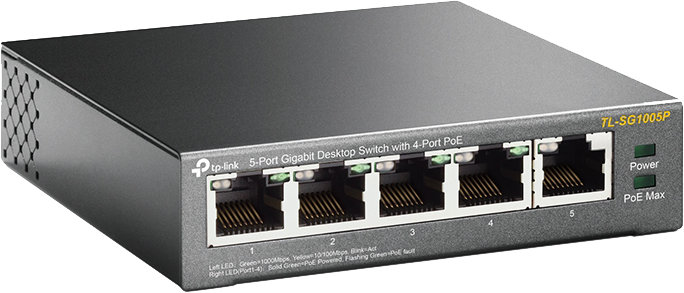
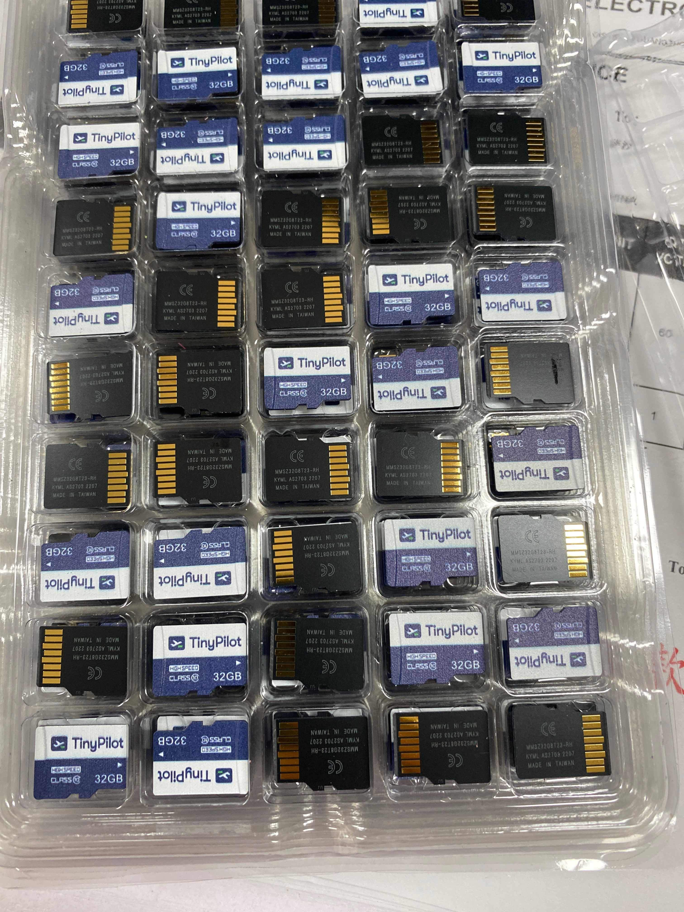
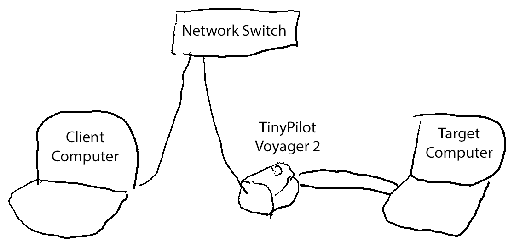
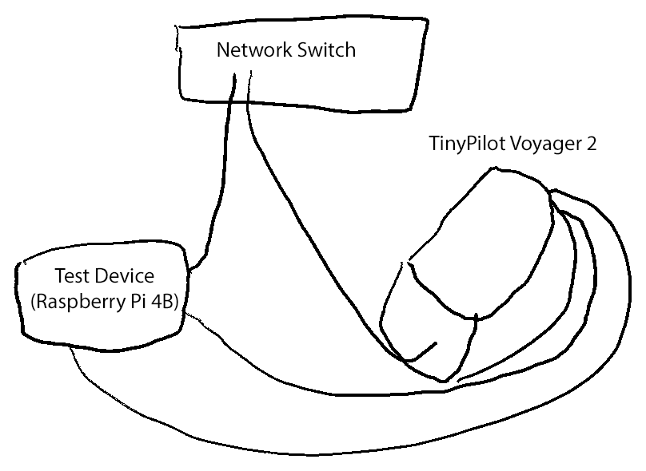
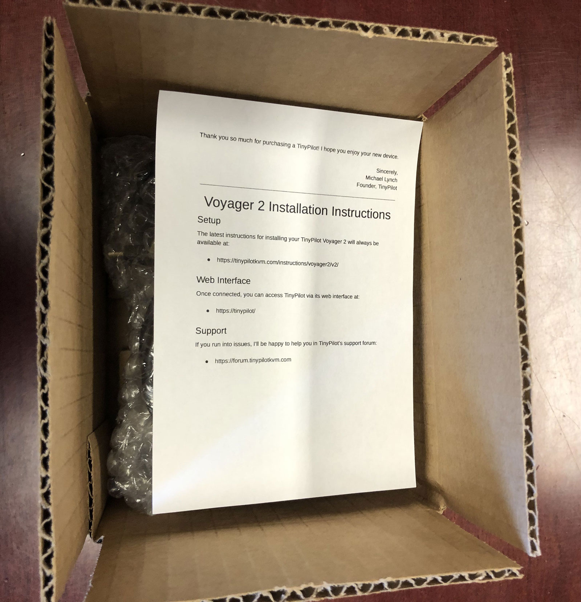
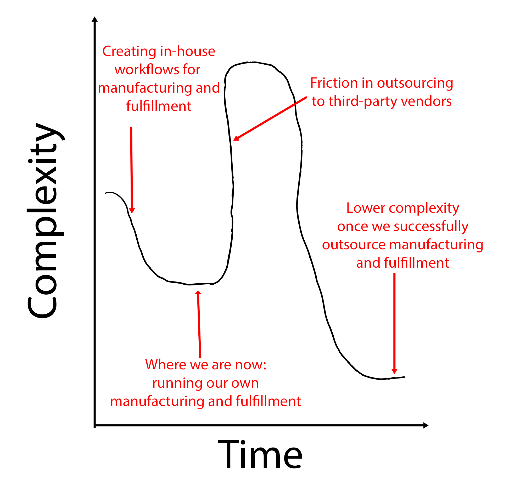



**New here?**

Hi, I'm Michael. I'm a software developer and the founder of [TinyPilot](https://tinypilotkvm.com), an independent computer hardware company. I started the company in 2020, and it now earns $60-80k/month in revenue and employs six other people.

Every month, I publish a retrospective like this one to share how things are going with my business and in my professional life overall.


## Highlights

- I'm doing a thought exercise about whether TinyPilot could function without a physical office.
- Thinking about outsourcing forces me to recognize inefficiencies in our current workflows.
- The [Playwright](https://playwright.dev) end-to-end testing tool has won me over.

## Goal Grades

At the start of each month, I declare what I'd like to accomplish. Here's how I did against those goals:

### Migrate TinyPilot Pro to the next-generation update system

- **Result**: Published TinyPilot Pro 2.5.0, which includes the new update system.
- **Grade**: A

The big change in this release is in how updates work. TinyPilot used to query a git server for updates and always attempted to update to the latest version. Now, we have a custom web service that TinyPilot [queries for the next version](https://github.com/tiny-pilot/tinypilot/blob/bf3c39302ecf643f288ec0e5da50c49e61a61944/bundler/README.md). The new update system gives us [more control](https://tinypilotkvm.com/blog/whats-new-in-2022-10) over the update process and makes it easier for us to test new versions.

This release took five months, longer than any of us expected. Our usual release cadence is around two months. I expect the new version to help us iterate and test more quickly in the future.

### Send TinyPilot Voyager to two YouTube creators or bloggers for review

- **Result**: Canceled this goal in favor of hiring again.
- **Grade**: N/A

I ended up letting a support engineer go, so I instead focused on hiring his replacement. This was successful, and I hired a new engineer at the beginning of October.

### Explore new case manufacturing options

- **Result**: Ordered a prototype metal case.
- **Grade**: A

This is a vague goal, as I'm still exploring options at this point. In the past, I'd [explored injection-molded cases](/retrospectives/2021/02/#scaling-manufacturing), which have a low per-unit cost but require an expensive upfront price. I'm now exploring metal cases, which don't require as much upfront cost and scale up efficiently.

## [TinyPilot](https://tinypilotkvm.com/) stats



| Metric                   | August 2022    | September 2022                            | Change                                           |
| ------------------------ | -------------- | ----------------------------------------- | ------------------------------------------------ |
| Unique Visitors          | 11,903         | 9,040                                     | -2,863 (-24%)           |
| Total Pageviews          | 23,214         | 17,608                                    | -5,606 (-24%)           |
| Sales Revenue            | $76,082.06     | $68,640.50                                | -$7,441.56 (-10%)       |
| Enterprise Subscriptions | $290.70        | $242.95                                   | -$47.75 (-16%)          |
| Royalties                | $3,264.23      | $3,440.90                                 | +$176.67 (+5%)        |
| Total Revenue            | $79,636.99     | $72,324.35                                | -$7,312.64 (-9%)        |
| **Profit**               | **$21,580.82** | **-$8,764.28**\* | **-$30,345.10 (-inf%)** |

\* This profit figure is just a naive calculation of my change in cash holdings until I do real bookkeeping mid-month.

The numbers are all scary red, but I think it was actually a strong month. I'm thrilled to see another month where we exceed $70k in revenue.

Profit is down because I had a surprise bill for $11k in raw materials dating back six months. Still, I'm a bit surprised that I finished so far in the red. I suspect that it's mainly a function of how invoices were timed, and it will average out positively over the next few months.

## What do metal cases mean for TinyPilot?

One of our remaining bottlenecks for production is our cases. We 3D-print our cases, and we use a premium material that's slow to print, so we're limited to manufacturing about 160 cases per month. We're also limited to one particular 3D printing vendor because we rely on a Massachusetts state grant that's only available through this vendor.

We've been selling 200+ devices per month, so the cases will soon become the limiting factor. We can keep shipping at our current rates for a few more months because we stockpiled cases when we were selling below our manufacturing capacity.

Our hardware partner suggested metal cases, similar to what you'd find on consumer networking hardware:

{{}}

A metal case would reduce costs and eliminate the 160/month production constraint, as we could manufacture thousands each month.

Our hardware partner also offhandedly mentioned something that got me thinking: if we manufactured the cases in China, we could also assemble the devices in China.

At first, assembling in China didn't appeal to me. We have an assembly process in Massachusetts that works, so why mess with it?

Assuming that each device costs $10 to assemble in the US, maybe a Chinese vendor can do it for $1-2. A $9/unit savings doesn't justify all the risks associated with changing a process that works smoothly.

But then thinking about manufacturing in China got me wondering about how that would change TinyPilot's office. Our shelves wouldn't be stocked with hundreds of cases, USB cables, and tiny rubber feet because those would all live at the manufacturer. And if our raw materials lived at the manufacturer, the manufacturer could also track inventory and reorder supplies to keep up with production.

Then, I began to ask myself whether we need a TinyPilot office at all.

## What happens in the TinyPilot office?

Today, we use the TinyPilot office for six main functions:

1. Storing inventory
1. Assembling devices
1. Flashing microSDs
1. Testing assembled devices (quality assurance)
1. Packing and shipping customer orders
1. Processing returned orders

Can TinyPilot still perform these functions without its own office? Let's find out!

## Storing inventory and assembling devices

If we move manufacturing to China, then inventory management also effectively moves to China.

If it works well, outsourcing inventory and manufacturing would simplify a lot of TinyPilot's workflows. On the other hand, when there are problems, they're significantly worse when the manufacturer is thousands of miles away.

If an overseas manufacturer takes over manufacturing devices, a lot of our work in the TinyPilot office suddenly disappears. Most of the storage space in our office would become free because we only need to store finished products. Our inventory tracking becomes much simpler because we're only tracking finished products, not raw materials or partially-assembled components. We could finally cancel our subscription to our inventory tracking tool, the most frustrating and low-quality piece of software in our stack.

Importing goods should take less time. Most of our raw materials come from China, so if we receive them all at once as finished products, that's much easier to manage than handling them piecemeal when they come as raw materials.

I often get trapped in the critical path of imports because DHL prefers to call the number on the package instead of emailing our support mailbox. We don't have an office phone number, so they end up just calling my cell phone. If we get down to a couple of deliveries per month, it should be few enough that TinyPilot's staff can proactively track them and pay import duties before they try to call us. And if we combine outsourced manufacturing with a 3PL vendor, we can be out of the loop entirely because the manufacturer can ship directly to a third-party fulfillment center.

The downside is that it requires us to place a lot of trust in our manufacturer. With the chip shortage, we have to stockpile electronic components for months or years of production. If our manufacturer loses a year's supply of one component, that places us in a terrible position. We can request periodic stock counts and send in third-party auditors, but I'm not sure what recourse I have if the manufacturer just says, "Whoops, we lost $20k of your inventory."

TinyPilot's products go through many small adjustments as we upgrade components or discover issues in the design. With in-house manufacturing, we discover quickly when pieces don't fit together quite right or when there's too much stress on a component. With an overseas manufacturer, there's a slower feedback cycle. By the time we discover an issue, the manufacturer might have already produced several hundred with the same flaw.

## Flashing microSDs

Each TinyPilot requires a microSD that we flash with TinyPilot software. I currently have high confidence that nobody has tampered with the microSDs because they never leave our possession after we flash them. The only person who can tamper with the microSDs between us and the customer is the courier, and if the USPS wanted to be evil, they probably have more interesting targets than TinyPilot.

I'm not sure how to outsource the process of flashing microSDs. We use custom, branded microSDs, and the company that makes them is perfectly happy to flash software onto them. I'm reluctant to do that, as I feel like there's too high a risk of malware. In theory, I could randomly spot-check their output to make sure it matches the disk image I gave them, but even that wouldn't give me complete confidence.

{{}}

We could potentially keep flashing microSDs ourselves and send them to the manufacturer. That assumes the manufacturer is honest, but it's probably the same risk every company is taking by having computer products manufactured overseas.

## Testing assembled devices

After we build devices, we currently test them by hand to make sure that all the functionality works.

Our current test setup is slow, complicated, and would be difficult to hand over to a manufacturer. It requires a TinyPilot employee to plug the newly built TinyPilot into a target computer, then use the web browser from a second computer to visit the TinyPilot web interface. The employee then has to wait for the TinyPilot to boot up, and then they verify that the TinyPilot is capturing the target computer's display and accurately forwarding keyboard and mouse input.

{{}}

It's been on our list to automate this process, but automating it requires hardware engineering resources, and that's currently our scarcest resource.

Writing this out, I'm realizing we could solve this with commodity hardware and only software engineering resources. We should be able to make a TinyPilot testing machine with a Raspberry Pi.

A Raspberry Pi has HDMI output and USB input. We can program a Raspberry Pi to act as a test runner, making sure the TinyPilot is capturing video from the Pi's HDMI output. The Pi could verify that when it tells the TinyPilot to send a keystroke, the Pi receives the same keystroke through its USB input from the TinyPilot. This test would give us confidence that everything is connected and working correctly in the newly-built Voyager 2.

{{}}

At that point, we'd just need an external indicator on the test device that declares whether the TinyPilot Voyager 2 passed verification. That should be a simple enough test setup that we could hand the Pi and network switch to the manufacturer and teach them how to do testing on their end.

This is a good example of a task where thinking about how to outsource it creates benefits even if we end up not outsourcing it.

## Packing and shipping customer orders

Of all the parts of our workflow, order fulfillment is the one that would be easiest to outsource at this point.

We always have a queue of ready-to-ship boxes, so we could hand those to a 3PL vendor instead of keeping them at our office.

{{}}

The benefit of outsourcing fulfillment is that our already flexible hours become more flexible. Currently, we staff the TinyPilot office six days per week for a few hours per day. If we have a 3PL vendor, nobody needs to be at the office on any particular day as long as we're assembling enough devices to keep orders flowing.

We'd free up physical space in our office, as boxes and packing materials eat up a lot of real estate in our small office.

Another benefit is that customers will have more shipping options. We currently only offer USPS and DHL because there's added complexity in coordinating with each courier. A 3PL provider will already have daily pickups from all the major providers, so it's easy for them to support any major courier.

Shipping speed might increase slightly, although this is less significant as TinyPilot already ships 90% of orders within one business day.

The downside is that a 3PL vendor increases complexity. Right now, our customer service experience is excellent because when a customer emails us, they're speaking directly to a knowledgeable TinyPilot employee. Chances are, the same employee assembled, packed, or shipped their particular device. They also have the power to check shipping status, cancel orders, and arrange returns.

If there's a problem with an order that a 3PL vendor fulfilled, a TinyPilot customer support rep will have to check with our point of contact at the 3PL vendor, who might have to check with someone else, etc.

## Processing returns

I don't know how we'd process returns without an office.

I wouldn't trust a 3PL vendor to refurbish a TinyPilot device, but I wouldn't want them just destroying returns, either.

Perhaps we could have a separate return address that's just a PO box. Employees could pick up returns from the post office, refurbish them, and then ship them to the 3PL vendor to sell as a refurbished item.

I haven't talked to 3PL vendors yet, so it's possible they have a better solution for this.

## What happens when everything is outsourced?

Assuming that we can successfully extract all of the office functions to third-party vendors or location-independent alternatives, what does that mean for me and the company?

### We become location-independent

Right now, we're tied to our physical office. If we got rid of the office, every TinyPilot employee could theoretically do their jobs from anywhere.

### We become less time-dependent

Without fulfillment or manufacturing, the only time-sensitive responsibility we have is customer support.

### We become more robust to employee absence

A few times in the last few months, members of TinyPilot's local staff have been out of work for several days at a time. Some were planned vacations; others were due to illness.

TinyPilot has enough redundancy that we were able to keep going without affecting customers, but it did [strain other parts of our systems](/retrospectives/2022/09/#build-redundancy-into-customer-support).

If we outsourced manufacturing and fulfillment, it would become far easier for TinyPilot to handle employee absence. We wouldn't have to scramble to keep orders shipping, as we would no longer be in the critical path for fulfillment.

### Roles change for local staff

One challenge of outsourcing is the impact it has on our existing local staff's jobs. If we were to get rid of the TinyPilot office and outsource manufacturing and fulfillment, that would eliminate about 75% of the work our local team currently does.

The local team does great work, and I want to make sure they still have roles within the company if we get rid of our office.

The local team will continue to have customer service work. It's likely that outsourcing will allow us to scale up sales, so more customers will mean more demand for customer service.

The local staff can also take on more outreach work. In the past, we've seen positive results from proactively reaching out to large customers and asking them about their experience with our product. We don't do it much because of time constraints, but if we freed up time, we could invest more in that area. Similarly, local staff could work with more reviewers and YouTube creators, which would help with marketing.

### We reduce red tape

Right now, TinyPilot's local staff are the only people in the company legally classified as employees. Everyone else is an independent contractor. Because local staff members work on-premises, US employment law requires them to be employees and not contractors.

If we got rid of the TinyPilot office, employees could become contractors. I know this one sounds like, "I can't wait to cut benefits!" but I think we could do the transition in a way that benefits everyone. My goal isn't to reduce compensation as much as reduce stress and paperwork.

There's a huge difference in complexity between paying employees vs. contractors. On an almost monthly basis, some Massachusetts government office sends me an inscrutable letter telling me something about withholdings or compliance requirements, but it's never clear what action is required on my part, if any.

There are services that help with compliance and paying the right taxes, but I've never found one that does an especially good job. When I forward government notices to Gusto, my payroll provider, they just tell me that I have to call the government and figure it out myself. And then, when I call the state agency, I get routed around a phone tree to people who don't know anything about the notice I received, so I'm left to just ignore it and hope that's the right thing to do.

Contractors require much less paperwork. We can adjust pay so that staff gets equivalent or better compensation relative to what they had as employees, and it's less red tape for everyone.

### We reduce costs

Outsourcing will also reduce costs, though this is the least interesting benefit for me.

Without an office, we no longer have to pay rent ($550/month), Gusto payroll service ($80/month), inventory tracking ($59/month), worker's comp ($30/month), or renter's insurance ($10/month).

The labor costs theoretically go down by a few dollars per unit because Chinese manufacturers can build devices at a fraction of our labor costs, and 3PL vendors have economies of scale that allow them to fulfill orders more cheaply than we can.

### We reduce flexibility and agility

Outsourcing everything optimizes our "happy path," but it makes it harder to manage exceptions or fix mistakes.

In the past, we've been able to iterate rapidly on the product to reduce visual blemishes and make it easier to use. With everything outsourced, the feedback loop will be slower. We might not identify issues until several customers report it. By that point, we might have hundreds of devices that have passed the problem point in our pipeline and are on the way to customers or warehouses.

### We increase our error rate

Outsourcing would almost certainly increase our error rate. Our current error rate is about as near to zero as you can get. We've had about 2,500 orders in the past 18 months, and there have only been two or three instances where a customer tells us that we shipped them the wrong item or that it arrived with manufacturing errors.

I imagine that even experienced vendors for manufacturing and fulfillment can't match the error rate we've achieved in-house. Still, I think our current error rate is much better than it needs to be to keep customers happy. We can afford an error rate of something like 0.3% without significantly impacting customer experience.

## Does outsourcing increase or decrease complexity?

My main goal in outsourcing is to reduce complexity. I'm still trying to [reduce my management time to 20 hours per week](/retrospectives/2022/02/#how-can-i-manage-tinypilot-with-only-20-hours-per-week).

My biggest worry is that manufacturing and fulfillment are the parts of TinyPilot that require the least amount of management, so there's no time to gain back from outsourcing. It took a lot of work up front to build repeatable workflows for everything, but it's been pretty much smooth sailing since then.

The times when I need to be involved in manufacturing and fulfillment are events like part shortages or customers having issues with delivery that are unique enough to be escalated to me. I'd still be involved in those issues if we moved to external vendors, and it would be harder to manage across company boundaries.

At the same time, it feels like it just _has_ to be easier to work with external vendors than to keep maintaining our own home-grown solutions for manufacturing and fulfillment. Even though our office runs smoothly, there's significant mental overhead in just maintaining an office and all the processes that go with it.

I'm hoping that we're currently at a local minimum in terms of complexity. The friction of switching processes will increase complexity, but I think outsourcing will ultimately bring us to a state of lower complexity.

{{}}

## Side projects

### Hello, Playwright; goodbye, Cypress

I've been [a fan of the Cypress end-to-end testing tool](https://mtlynch.io/painless-web-app-testing/) ever since I saw Gleb Bahmutov demo it at [a 2018 web dev meetup](https://youtu.be/wApmbgPGmqQ). Over the years, I've been hearing more chatter over the years about [Playwright](https://playwright.dev/), Microsoft's competitor to Cypress.

I tried Playwright a year ago and [wasn't that impressed](https://whatgotdone.com/michael/2021-08-06). I was recently reading [a Hacker News thread](https://news.ycombinator.com/item?id=33047136) where everyone seemed to agree that Playwright had surpassed Cypress, so I gave Playwright another try.

I now must admit that I agree with Hacker News. As an experiment, I [rewrote all of PicoShare's end-to-end tests in Playwright](https://github.com/mtlynch/picoshare/pull/340). I found Playwright easier to work with than Cypress in almost every dimension.

I'm working on a longer post about the process of porting from Cypress to Playwright, but the short version is that I'd now recommend Playwright over Cypress for end-to-end testing web apps.

## Wrap up

### What got done?

- Published TinyPilot Pro 2.5.0.
- Gave personal responses to everyone who applied for the Support Engineer job in August.
- Hired a second TinyPilot Support Engineer.

### Lessons learned

- Just thinking about how to outsource tasks can uncover opportunities in your existing workflows.

### Goals for next month

- Ramp up new support engineers.
  - I'm aiming for the first one to be able to answer 80% of questions unassisted and the second 50%.
- Start production on a second metal case prototype.
- Reach out to three 3PL vendors to talk about the process of transitioning our fulfillment.
