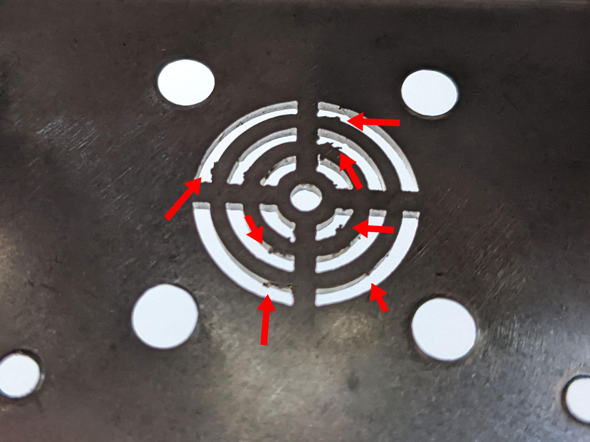



**New here?**

Hi, I'm Michael. I'm a software developer and the founder of [TinyPilot](https://tinypilotkvm.com), an independent computer hardware company. I started the company in 2020, and it now earns $60-80k/month in revenue and employs six other people.

Every month, I publish a retrospective like this one to share how things are going with my business and in my professional life overall.


## Highlights

- TinyPilot had a new record month in sales, reaching $92k in revenue for October.
- I think I've found a third-party logistics vendor that's a good match for TinyPilot.
- I'm scrambling to produce more cases before they become a sales bottleneck.

## Goal Grades

At the start of each month, I declare what I'd like to accomplish. Here's how I did against those goals:

### Ramp up new support engineers

- **Result**: The team ramp-up feels ahead of my expectations
- **Grade**: A

I was aiming for the first engineer to answer 80% of questions unassisted and the second 50%. I haven't measured precisely, but we're roughly there.

We had a one-week period of record support requests, and the team managed to answer almost all of them within our target response times. The team also published three new tutorials on the TinyPilot website and wiki.

### Start production on a second metal case prototype

- **Result**: We're still designing the second prototype
- **Grade**: D

I underestimated the turnaround time a redesign would take. With our 3D printing vendor, design changes typically take a few days, at most. Design iterations on the metal case have taken multiple weeks.

I'm not sure if it's just greater difficulties of designing with metal or if the metal designers have less bandwidth for this project, but it's definitely an adjustment from 3D printing.

### Reach out to three 3PL vendors to talk about the process of transitioning our fulfillment

- **Result**: Reached out to six 3PL vendors
- **Grade**: A

Of the six vendors I approached, two ended up being a good match for what I want. I'm hoping to transition fulfillment to one of these 3PL vendors in December.

## [TinyPilot](https://tinypilotkvm.com/) stats



| Metric                   | September 2022                          | October 2022                              | Change                                             |
| ------------------------ | --------------------------------------- | ----------------------------------------- | -------------------------------------------------- |
| Unique Visitors          | 9,040                                   | 7,994                                     | -1,046 (-12%)             |
| Total Pageviews          | 17,608                                  | 17,862                                    | +254 (+1%)              |
| Sales Revenue            | $68,640.50                              | $85,834.20                                | +$17,193.70 (+25%)      |
| Enterprise Subscriptions | $242.95                                 | $290.70                                   | +$47.75 (+20%)          |
| Royalties                | $3,440.90                               | $5,544.12                                 | +$2,103.22 (+61%)       |
| Total Revenue            | $72,324.35                              | $91,669.02                                | +$19,344.67 (+27%)      |
| **Profit**               | **-$5,337.82** | **$26,042.39** | **+$31,380.21 (+inf%)** |

October marked another all-time record for TinyPilot's sales. TinyPilot had $86k in sales, beating its previous record by almost $10k. Our profit is way up, but that's a bit noisy month-to-month, so I'll focus on the $14k trailing average profit from the last three months.

October put TinyPilot in the black for the year, and I'm optimistic that we'll end the year in the neighborhood of $20-40k in profit, on track to earn $15-20k per month in 2023.

For better or for worse, this is all happening while I put zero effort into marketing. I've been spending all of my time ramping up new hires and scaling production to meet our growing demand. Google Ads are on auto-pilot and are adding about $15k of revenue per month at a cost of $5k, but TinyPilot is otherwise not advertising.

## Exploring the world of 3PL vendors

"3PL" is the shorthand term for a third-party logistics provider. A 3PL vendor serves as a warehouse and fulfillment center for other businesses. Basically, they store my products, and when an order comes in, we forward it to our 3PL vendor, they pick our products off the shelves, pack them into a box, and send it to the customer.

TinyPilot has always done fulfillment in-house, but we're reaching the point where that no longer makes sense, and I'm evaluating 3PL vendors to take over this process.

### My ideal 3PL vendor

There's a wide spectrum of options for 3PL vendors. At one end are the giant corporate machine vendors like Amazon FBA. Those vendors are probably good if you have thousands of products and hundreds of daily orders, but they're impersonal and highly automated, so you have to adapt to their rigid processes.

I've heard horror stories from other founders who used Amazon FBA and saw Amazon discard huge amounts of their inventory without justification or freeze $100k+ in funds for months. So, Amazon is the exact opposite of what I want in a 3PL vendor.

At the other end of the spectrum are the "mom and pop" 3PL vendors who have dozens to hundreds of customers and only one or two warehouses. I was hoping to find a vendor like this, where they can offer flexibility as things evolve at TinyPilot.

### How I found 3PL vendors

I found three vendors by just searching "3PL" on Google Maps near where I live. Of the three I found through Google Maps, one vendor responded, and two ignored me. The one who responded ended up being the best match I found overall, and their warehouse is only a two-hour drive from TinyPilot's office.

I found another small 3PL vendor in North Carolina by searching "3PL site:reddit.com," which yielded a two-year-old comment from the founder. I reached out, and we had a video call a few days later. They seem like another good option, though I prefer having a vendor within driving distance.

I found the last two vendors from personal recommendations, but they were both dead ends. Notably, both companies advertised themselves as "packaging" vendors rather than 3PLs, so I think they're more targeted at businesses that produce things like cereal or candy.

### Working with "mom and pop" 3PLs

Both of the 3PL vendors I met with ended up being very close to what I had in mind at the beginning of the search. Both vendors emphasized their flexibility in adapting to whatever processes their clients needed. TinyPilot can give the 3PL vendors special packing instructions if items need to be combined in a certain way (e.g., orders that include at least one product X always include a free product Y).

Both 3PL vendors had 100-200 customers, which felt comfortably within [Dunbar's number](https://en.wikipedia.org/wiki/Dunbar%27s_number). After being burned as [my design agency's smallest client](/tinypilot-redesign/#avoid-hiring-a-vendor-as-their-smallest-client), I asked how I'd compare to their other customers, and both said I'd fall around the middle in terms of order volume.

In terms of product value, I'm on the high end relative to their other customers. It seems like 3PL vendors work with a lot of products in the $20-50 range. TinyPilot's high price should be advantageous because the vendors charge a flat fee per order rather than a percentage of revenue. 3PL vendors also charge by warehouse storage space, which should be low in TinyPilot's case since the product is small.

Both 3PL vendors offer light manufacturing services, so we could theoretically send them our raw materials and have them build TinyPilot devices. I probably won't do this because if we're going to outsource manufacturing, it's easier to have the Chinese factory that makes TinyPilot's custom hardware also assemble the devices. On the other hand, in case of a disastrous dispute between TinyPilot and its manufacturer, it would be better if we're both in the US as opposed to trying to go to court with a company located in China.

## With metal cases, manufacturing quality makes a huge difference

TinyPilot is in the process of transitioning from 3D-printed cases to metal cases. TinyPilot's hardware partners reached out to a Chinese vendor to manufacture the first prototype, but I had researched and interviewed several local sheet metal shops [back in 2019](/retrospectives/2020/01/#sheet-metal-research). I thought we should get bids from them as well, as it would be faster to iterate on designs with a local vendor than if we had to go back and forth with a vendor in China.

We reached out to four different local sheet metal vendors. Only one of the local vendors responded. They said that the others wouldn't be interested in such a small job, but they specialized in prototyping, so they'd help us.

A few weeks later, I received the US vendor's prototype and immediately felt deflated.

{{}}

The case looked like something I'd find if I smashed a hole in my wall and pulled out some wiring. It definitely didn't look like something I'd hand to a customer. The bends had large, visible gaps along the seams. The edges didn't feel sharp enough to cut skin but were definitely too sharp for comfort. And most of the screws were visible from the outside, which looked sloppy.

When I shared my disappointment with TinyPilot's hardware partner, they said that most of what I was seeing was incompetent manufacturing rather than poor design. The surface would look better with powder coating, and the sharp edges meant that the sheet metal shop didn't tumble it for long enough to smooth them out.

I was skeptical, but I awaited the prototype we ordered from China. I received that one a few weeks later, and it was a night and day difference.

{{}}

The powder coating made the surface feel completely different, much more like a user-friendly product. There were no sharp edges or debris in the gaps. The seams were barely visible. The gaps in the American prototype looked massive by comparison.


{{}}
{{}}



{{}}
{{}}



{{}}
{{}}


The most shocking part was the difference in price. The Chinese prototype cost $139, while the American one cost $857, more than six times as expensive for far worse quality.

| Vendor location | Price | Turnaround time | Quality |
| --------------- | ----- | --------------- | ------- |
| US              | $857  | 20 days         | D       |
| China           | $139  | 31 days         | A       |

A big chunk of the turnaround time was negotiating logistics, so we expect future iterations to come down to the 10-20 day range.

## The race for more cases

I've been worried about 3D-printed cases becoming the bottleneck for TinyPilot [since month 7](/retrospectives/2021/02/#scaling-manufacturing). Since then, TinyPilot's 3D printing vendor has afforded us more time by purchasing more printers to accommodate TinyPilot's orders. But at this point, it doesn't make sense for the vendor to keep increasing capacity since TinyPilot's orders will rapidly shrink to zero as soon as our metal cases are ready.

At the end of October, we had 190 cases in stock. TinyPilot's 3D printing vendor typically manufactures 140-160 cases per month, but we sell about 210 devices per month. Based on this, I expect us to run out of cases by January 2023:

| Month    | Manufactured | Sold / Projected to Sell | Cases at end of month |
| -------- | ------------ | ------------------------ | --------------------- |
| October  | 150          | 207                      | 190                   |
| November | 150          | 210                      | 130                   |
| December | 130\*        | 220                      | 30                    |

\* Anticipating lower production capacity due to holidays.

If TinyPilot's sales volume drops to 150 devices when demand is for 230 devices, we're essentially forfeiting 80 x $375/device = $30k in revenue or $20k of profit per month.

When we switch to metal cases, manufacturing capacity is a non-issue &mdash; Chinese sheet metal vendors can crank out thousands of cases per month. The hard part is predicting when the metal cases will be ready. It largely depends on how many design revisions we need:

| Scenario                                | ETA for first production batch | Probability |
| --------------------------------------- | ------------------------------ | ----------- |
| Second revision is ready for production | Late December 2022             | 75%         |
| Third revision is ready for production  | Early February 2023            | 20%         |
| We need more than three revisions       | April 2023 or later            | 5%          |

In other words, if we get lucky, I can do nothing, and the first few hundred metal cases will arrive just as we're about to run out of 3D-printed cases. If we get unlucky and it takes three revisions to design the metal case, TinyPilot misses out on ~$20k of profit in January. If we get _very_ unlucky, TinyPilot misses out on ~$60-70k of profit throughout the first quarter of 2023.

My options to handle the coming 3D-printed case shortage were:

1. Do nothing and hope to have metal cases ready before we run out of 3D-printed cases.
1. Supplement capacity by ordering prints from additional 3D printing vendors.
1. Pay our vendor a one-time fee to offset the costs of purchasing a new printer, which the vendor will own.
1. Purchase a 3D printer outright, but the vendor will run it and dedicate it to TinyPilot prints.

I went with option (4).

A new Markforged printer costs $5,500 after taxes and shipping. I'm hoping I can sell it for $3-4k once we switch to metal cases in a few months. In effect, I'm paying $2k to protect myself from a potential $20k downside.

I requested 3D printing quotes from other vendors, but they were all surprisingly expensive. I had quoted backup vendors in early 2021 to prepare for a production shortage, but the prices have increased by ~80% since then to $100-180/case. A couple of Chinese vendors quoted in the $20-50/case range for a cheaper material, so I requested samples in case I need a plan B.

## Wrap up

### What got done?

- Produced the first TinyPilot metal case prototype
- Applied for a US Trademark on the term "TinyPilot"
- Published ["On Migrating from Cypress to Playwright"](https://mtlynch.io/notes/cypress-vs-playwright/)
- Published ["Should I invest in iBonds?"](https://mtlynch.io/notes/ibonds/)

### Lessons learned

- It's possible to find 3PL vendors that are friendly to small, unique businesses.
  - Within the eCommerce ecosystem, most vendors (e.g., Shopify, Amazon) force business owners into rigid workflows that are a pain if there's anything unusual about your business.
  - From my experience so far, there are 3PL vendors that serve smaller niches and can adapt to uniqueness in a company's fulfillment workflows.
- Designing with sheet metal is an order of magnitude more time-consuming and expensive than 3D printing.

### Goals for next month

- Prepare to transition TinyPilot's fulfillment to a 3PL vendor.
- Continue onboarding new support engineers.
- Reduce projects where I'm in the critical path.
