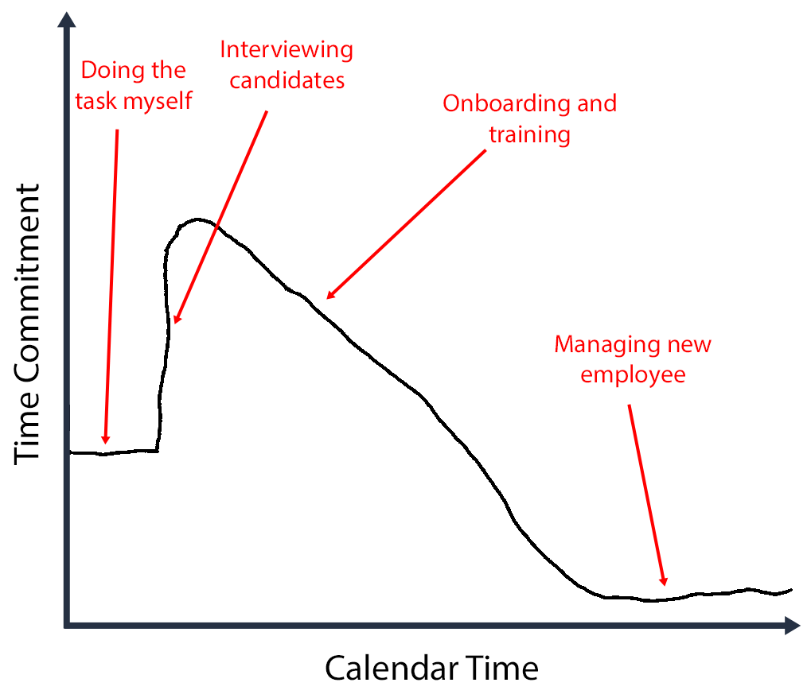
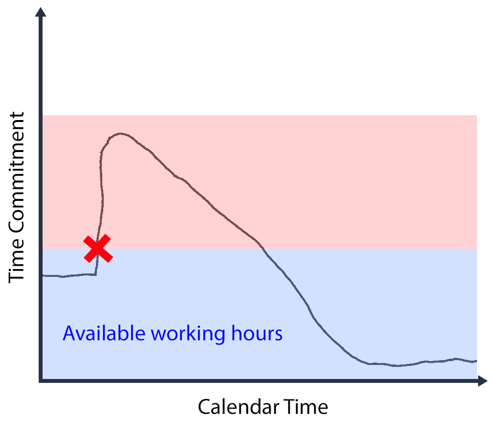
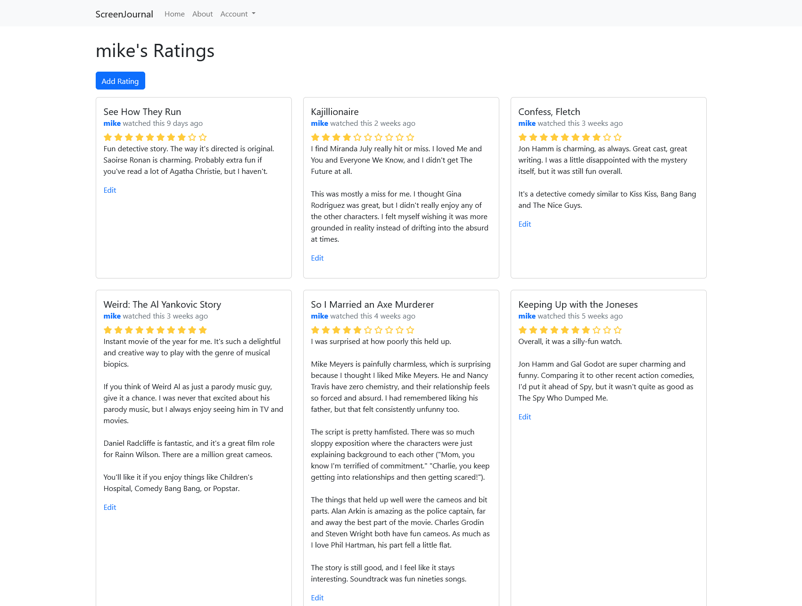



**New here?**

Hi, I'm Michael. I'm a software developer and the founder of [TinyPilot](https://tinypilotkvm.com), an independent computer hardware company. I started the company in 2020, and it now earns $60-80k/month in revenue and employs six other people.

Every month, I publish a retrospective like this one to share how things are going with my business and in my professional life overall.


## Highlights

- TinyPilot generated $112k of monthly revenue, breaking the six-figure mark for the first time ever.
- I grossly overestimated how much spare capacity TinyPilot's fulfillment team had.
- Long-term tasks can be a canary for impending resource exhaustion.

## Goal Grades

At the start of each month, I declare what I'd like to accomplish. Here's how I did against those goals:

### Prepare to transition TinyPilot's fulfillment to a 3PL vendor

- **Result**: Started the onboarding process with a single, low-volume product
- **Grade**: B

I underestimated how much spare capacity the local staff would have to work on this. Combined with an unexpected spike in sales, we didn't make progress adapting our in-house fulfillment workflow to a 3PL vendor. Still, we can move forward with an imperfect process and improve it as the 3PL vendor frees up our time.

### Continue onboarding new support engineers

- **Result**: Both support engineers are answering around 80% of support tickets unassisted.
- **Grade**: A

The support engineering team is becoming more effective than I expected. In addition to handling advanced support requests, the support engineers have begun improving the logging in TinyPilot's software to faciliatate diagnosing common issues.

### Reduce projects where I'm in the critical path

- **Result**: I've resisted the urge to initiate any new projects.
- **Grade**: B

Launching a new TinyPilot model always requires a lot of my time. I've been through this process enough to anticipate a lot of the work, but I also know that no matter how much planning I do, there will always be work I fail to anticipate. Even though there are days where I feel like I have some spare bandwidth, I'm trying to keep as much of my time free as possible.

## [TinyPilot](https://tinypilotkvm.com/?ref=mtlynch.io) stats



| Metric                   | October 2022   | November 2022    | Change                                         |
| ------------------------ | -------------- | ---------------- | ---------------------------------------------- |
| Unique Visitors          | 7,994          | 9,512            | +1,518 (+19%)       |
| Total Pageviews          | 17,862         | 20,387           | +2,525 (+14%)       |
| Sales Revenue            | $85,834.20     | $107,223.10      | +$21,388.90 (+25%)  |
| Enterprise Subscriptions | $290.70        | $290.70          | 0                                              |
| Royalties                | $5,544.12      | $4,402.50        | -$1,141.62 (-21%)     |
| Total Revenue            | $91,669.02     | $111,916.30      | +$20,247.28 (+22%)  |
| **Profit**               | **$26,042.39** | **$21,508.21**\* | **-$4,534.18 (-17%)** |

\* Profit is a naïve calculation based on my change in cash holdings over the month. I'll update it after I do real bookkeeping mid-month.

TinyPilot hit another all-time high in sales, reaching $112k in total revenue. This is TinyPilot's first month ever crossing the six-figure mark.

The jump was largely due to TinyPilot receiving a positive mention on [Linus Tech Tips](https://youtu.be/232opnNPGNo), one of the most popular YouTube channels for homelab enthusiasts. Even though the review was primarily about our competitor's product, the channel has so many subscribers that TinyPilot saw a sizable surge in orders for the following two weeks.

I'm happy to see three-month trailing profit staying comfortably in the positive, even amid atypically high costs. TinyPilot's is paying a premium to 3D-print cases [beyond our normal capacity](/retrospectives/2022/11/#the-race-for-more-cases), but our costs should drop significantly in January when we switch to metal cases.

## We don't have enough time to save ourselves time

One of the goals for November was to begin transitioning fulfillment to a third-party logistics (3PL) vendor. I asked a member of the fulfillment team to review our workflows and prepare to hand them over to a 3PL vendor.

The next week, we saw a spike in orders from the Linus Tech Tips video, so there was no progress on researching the transition to 3PL. And then two weeks later, we were still catching up from the sales spike, so there still wasn't progress.

The next time I met with the member of the fulfillment staff, I asked how much spare capacity we usually have for atypical tasks like this, and I was surprised to learn that it was roughly zero. The fulfillment team's short-term tasks of assembling devices, shipping out orders, and responding to suppport requests was enough to occupy all of their hours for the week.

This is a familiar situation I've experienced in running TinyPilot, though usually I'm the person with no short-term availability.

For any workflow, there are usually some obvious ways to free up time. It could be automation, hiring additional people, moving to a managed service, etc. The catch is that workflow changes have a frictional cost themselves.

For the past few months, I've been drawing [beautiful](/retrospectives/2022/10/#does-outsourcing-increase-or-decrease-complexity) [graphs](/retrospectives/2022/09/#remember-how-time-consuming-it-is) of time commitment for outsourcing and delegation. In that spirit, here's the amount of time I spend on a task before and after I hire somoene to take it over:

{{}}

At the beginning, the task is time-consuming because I'm doing all the work myself. But then when I hire someone, I'm doing even more work because I still have to do the task myself in addition to the work of hiring and training a new person. I eventually reach a net savings when the new person is fully trained, but that can take weeks or months depending on the task's complexity.

In practice, there are only so many hours in the day. What happens if I take into account the limits of my working hours?

{{}}

When your day-to-day tasks leave you with no spare capacity, then you're stuck. You can't switch worflows because you can't afford the frictional costs &mdash; you don't have enough time to save yourself time.

## Using long-term tasks as an early warning for exhaustion

The delay in switching to a 3PL vendor made me realize I need a better early warning system for running out of spare capacity.

My best idea is to be more conscientious about making sure everyone has a mix of short-term tasks and long-term tasks. For example, the support engineers' urgent responsibility is responding to customer support requests on the TinyPilot help forum and on our CRM platform. Support volume ebbs and flows, so when the support engineers have spare time, they look for recurring patterns in support requests and publish [help articles](https://tinypilotkvm.com/faq) or investigate deeper bugfixes.

Everyone at TinyPilot has a mix of short-term tasks and long-term tasks:

| Team                | Short-term tasks                                                                           | Long-term tasks                                                                                            |
| ------------------- | ------------------------------------------------------------------------------------------ | ---------------------------------------------------------------------------------------------------------- |
| Founder             | Team management Vendor management Reviewing work Filling gaps in responsibilities | Marketing Public writing Re-evaluating strategy Hiring and training                               |
| Fulfillment staff   | Assembling devices Fulfilling orders Customer service                                | Creating customer support playbooks Assisting in marketing                                              |
| Support engineers   | Answering technical support questions                                                      | Writing documentation Writing blog posts Investigating difficult bugs                                |
| Software developers | Releasing new features Fixing urgent bugs                                               | Refactoring code Improving development experience Creating automated tests Fixing non-urgent bugs |

Long-term tasks can act as the canary in the coal mine. When a team's progress on long-term tasks slows over time, they're likely approaching their maximum capacity. At that point, I should find ways to reduce load by decreasing responsibilities or adding capacity by hiring, outsourcing, or purchasing better tools.

There are two problems with this. The first is that the team who's most frequently ignoring their long-term tasks is the founder team, by which I mean me. So when I'm overloaded, I won't notice a slowdown on long-term tasks. Even if I do, I don't have time to do anything about it. I suppose the solution is to be more vigilant about the number of projects I take on so I can leave spare capacity for switching costs.

The other problem is that the fulfillment team has the least obvious set of long-term tasks.

The support engineers, on the other hand, have the clearest balance between short- and long-term work. Nobody likes answering the same question over and over, so the sooner the support engineers write a support article, the sooner they can stop answering the same question. It's a virtuous cycle.

Oru manufacturing and fulfillment processes aren't the kind of workflows you can improve every week. But as we shift fulfillment and manufacturing to third-party vendors, the fulfillment team's responsibilities will shift to customer support. Customer support has a more natural balance between the short-term work of answering support requests and the long-term tasks of refining our internal playbooks for handling common requests.

## Getting out of the Ansible hole

[Ansible](https://github.com/ansible/ansible) is a tool for configuring servers automatically. I've been using it for seven years, and it's how I manage all the [virtual machines in my homelab](/building-a-vm-homelab/).

When I started work on TinyPilot back in 2020, I needed a way to deploy code onto my Raspberry Pi and configure the OS functionality TinyPilot needed. Ansible was a good fit since remote system configuration is Ansible's bread and butter.

When I published TinyPilot, the easiest way to let users install it was to just replicate the workflow I used during development. I created [a simple install script](https://github.com/tiny-pilot/tinypilot/blob/2a97cf02bd6e032a2fc60846d7d2c60be92c7c74/quick-install) that bootstrapped an Ansible environment and then installed TinyPilot via Ansible.

At the time, I knew that the more conventional installation would have been to use Debian packages. The problem was that I didn't know anything about Debian packages, and they seemed like a lot of work. Would I have to set up my own apt repository? Do I have to manage repo keys? TinyPilot depended on nginx, so how was I supposed to configure nginx from my own package?

Two and a half years later, the dev team is paying the price for my choice of Ansible. As TinyPilot has developed more features, our Ansible configuration has become painfully complex. If the installer was a pure shell script or Debian package, installation would probably take 10-20 seconds. Instead, all the overhead from Ansible drives the install and update time to six minutes or more.

Beyond the impact on the end-user, Ansible has a tendency to swallow up development resources. Ansible code is slow to test or debug, especially because we can't replicate a realistic Raspberry Pi device environment in our continuous integration environment. We frequently run into minor changes that balloon to a week of dev time due to Ansible.

In the last few months, the dev team has been exploring how we can port our Ansible code to a Debian package for TinyPilot. I'm happy to report that we now have [a foothold](https://github.com/tiny-pilot/tinypilot/tree/437adc28e4a956be13bc994d23d278b4ca7fd31b/debian-pkg). We've created a hybrid solution where TinyPilot's Ansible role installs the latest TinyPilot Debian package. This makes it easier for us to chip away incrementally at our Ansible code and move it to our Debian package.

Here are the things I wish I'd known about Debian when I started work on TinyPilot:

- You can create and distribute standalone Debian packages without running your own apt repository.
- Creating a simple Debian package takes five minutes if you're following [the right tutorial](https://earthly.dev/blog/creating-and-hosting-your-own-deb-packages-and-apt-repo/).
- You can [use Docker QEMU](https://github.com/tiny-pilot/janus-debian/blob/e29efc6ee3585cc01a22d1263863ed4f57325080/.circleci/config.yml#L15L63) to build ARM Debian packages from x64 systems.
- If your code is in a portable language like Python, you can skip QEMU and build an architecture-independent Debian package.
- If your package needs to configure another package, the typical way to do it is by adding a file to a configuration directory rather than tinkering with files the other package owns.
  - For example, a TinyPilot Debian package could configure nginx by adding a file to the `/etc/nginx/sites-enabled/` directory.

The hardest part of learning Debian was finding useful information amid all the noise. A lot of the resources basically say, "Just read [the 9,000 page Debian maintainer's guide](https://www.debian.org/doc/manuals/debmake-doc/), but ignore the parts that are out of date."

The guides I found most helpful were:

- ["Creating and hosting your own deb packages and apt repo"](https://earthly.dev/blog/creating-and-hosting-your-own-deb-packages-and-apt-repo/) by Alex Couture-Beil
- ["Pragmatic Debian packaging"](https://vincent.bernat.ch/en/blog/2019-pragmatic-debian-packaging) by Vincent Bernat

Vincent was even kind enough to [hop on a video call with me](https://m.mtlynch.io/@vbernat@hachyderm.io/109369842244090259) to answer some of my remaining questions about Debian packages.

## Side projects

### [ScreenJournal](https://github.com/mtlynch/screenjournal)

I watch a lot of TV shows and movies, and I enjoy making recommendations to friends. But by the time I talk to someone, I often forget what show or movie I wanted to recommend to them.

I've checked around for apps that let you track movies and TV the same way you'd track reading with Goodreads, but nothing matched what I had in mind. I feel like my friends are exhausted with social apps that default to public, so I wanted something that lets you create a micro-community of friends who want to share recommendations. Less like Twitter, more like Discord.

I've started working on an app for sharing movie reviews with friends. It's called [ScreenJournal](https://github.com/mtlynch/screenjournal):

{{}}

It's not quite ready for prime time yet, as the reviews are private, but it only supports a single admin user. Right now, it's only effective as a private movie journal for one person, but the next featue on my list is support for multiple users.

User management is notoriously hard to get right, so I've always avoided rolling my own implementation. For the past few years, I've used my friend [David Toth](https://twitter.com/jupiterunknown)'s [UserKit](https://userkit.io) service to manage users. UserKit has been a great experience, but it's not open to the public yet, which makes it impractical for other developers who want to run ScreenJournal on their own systems.

I looked for an open-source user management framework for Go, but the majority relied on OAuth from external services, which I didn't want. The rest were so heavyweight and complicated that I didn't want to bother.

Instead, I'm living dangerously and rolling my own user management. For session management, I'm using [jeff](https://github.com/abraithwaite/jeff), and for authentication, I'm going to use [bcrypt](https://pkg.go.dev/golang.org/x/crypto/bcrypt) and hope for the best.

## Wrap up

### What got done?

- Started the onboarding process with a 3PL vendor.
- Improved TinyPilot's Debian package in several important ways.
- Found a better payment platform for international contractors.
  - Deel has been a poor experience, and I wasn't crazy about Remote.com, so we're going with [Pilot](https://pilot.co).

### Lessons learned

- Long-term tasks are a good leading indicator of resource exhaustion.
  - If a team's progress on long-term tasks slows consistently, it's important to address it before you're out of breathing room to switch processes.
  - It's especially important for a founder to keep time for long-term tasks because they otherwise can't respond effectively to resource exhaustion on other teams.
- Debian packaging isn't as intimidating as it first seems

### Goals for next month

- Fulfill the first order from our 3PL vendor.
- Reach code complete on the next TinyPilot Pro release.
- Prepare for a January release of TinyPilot Voyager 2a.
