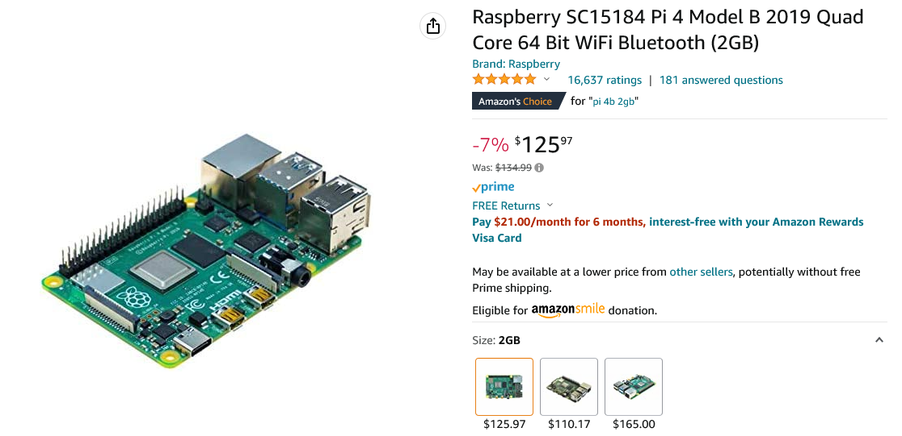
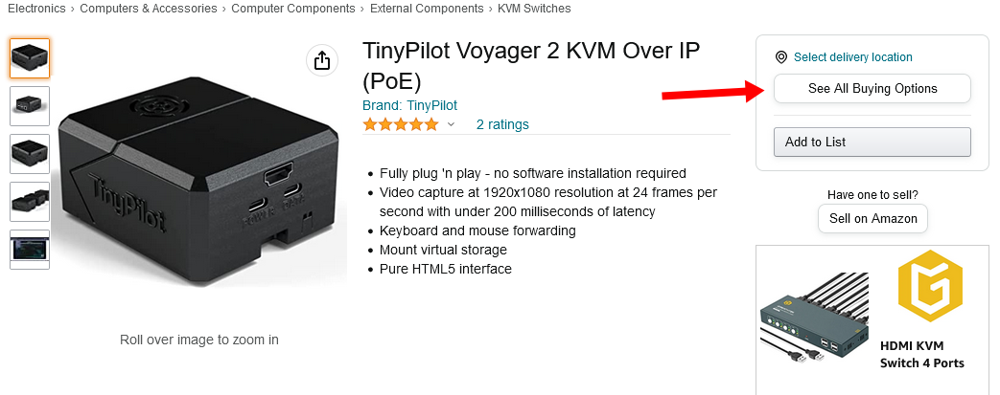
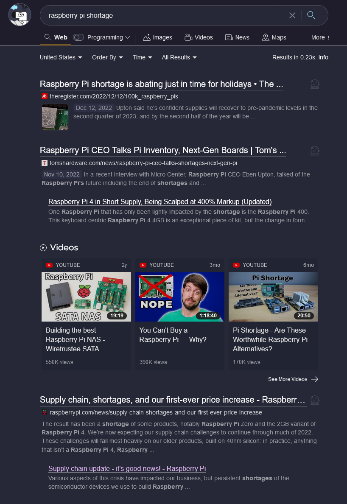
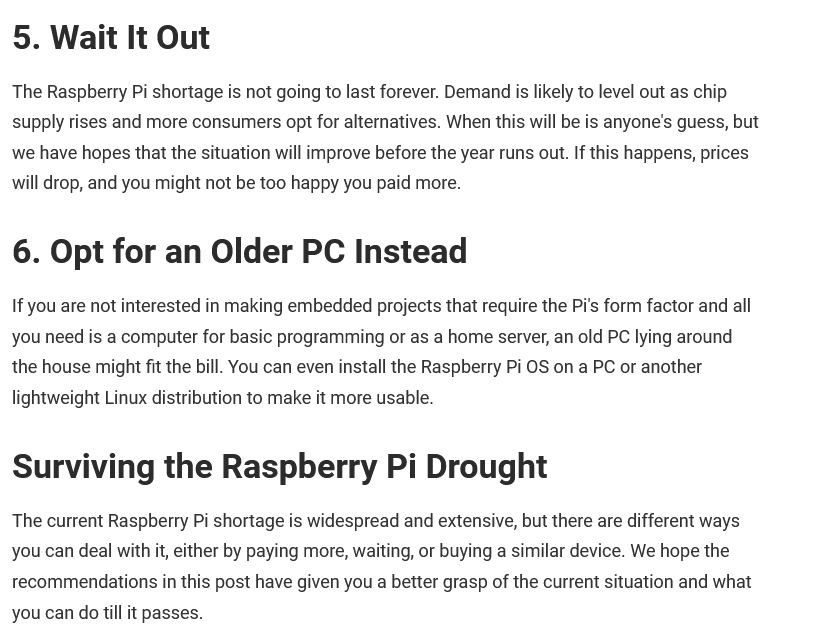



**New here?**

Hi, I'm Michael. I'm a software developer and the founder of [TinyPilot](https://tinypilotkvm.com), an independent computer hardware company. I started the company in 2020, and it now earns $60-80k/month in revenue and employs six other people.

Every month, I publish a retrospective like this one to share how things are going with my business and my professional life overall.


## Highlights

- TinyPilot is facing a supply shortage that will drastically limit its sales for 2023.
- Running leaner might not be such a bad thing.

## Goal Grades

At the start of each month, I declare what I'd like to accomplish. Here's how I did against those goals:

### Fulfill the first order from our 3PL vendor

- **Result**: Our 3PL vendor shipped three orders.
- **Grade**: A

Our 3PL vendor is now up and running. They're fulfilling orders for one of our low-volume products as a trial run. Things have been fairly smooth so far, and we're on track to transition the remainder of the products over in February.

### Reach code complete on the next TinyPilot Pro release

- **Result**: We reached code complete in the first week of January.
- **Grade**: C

We were close to hitting this deadline, but there was one final bug that took longer than I expected, and we had fewer dev hours due to the holidays. As of this writing, we're at code complete and planning to publish the release next week.

### Prepare for a January launch of TinyPilot Voyager 2a

- **Result**: We're on track for a January release.
- **Grade**: A

We're on track for this so far. It's always hard with a new release to anticipate all the changes that will be necessary, but we've completed almost all of the predictable tasks, so we have spare capacity to fix unexpected issues.

## [TinyPilot](https://tinypilotkvm.com/?ref=mtlynch.io) stats



| Metric                   | November 2022 | December 2022                           | Change                                            |
| ------------------------ | ------------- | --------------------------------------- | ------------------------------------------------- |
| Unique Visitors          | 9,512         | 7,308                                   | -2,204 (-23%)            |
| Total Pageviews          | 20,387        | 15,549                                  | -4,838 (-24%)            |
| Sales Revenue            | $107,223.10   | $66,092.24                              | -$41,130.86 (-38%)       |
| Enterprise Subscriptions | $290.70       | $290.70                                 | 0                                                 |
| Royalties                | $4,402.50     | $2,798.97                               | -$1,603.53 (-36%)        |
| Total Revenue            | $111,916.30   | $69,181.91                              | -$42,734.39 (-38%)       |
| **Profit**               | **$7,407.30** | **-$4,806.26** | **-$12,213.56 (-inf5%)** |

December saw a large dropoff for TinyPilot across the board. Part of the downturn is seasonal, as businesses seem less interested in purchasing new hardware at the end of the year. The other part was that I intentionally [reduced TinyPilot's sales volume](#adapting-to-the-shortage) in response to a supply shortage I learned about mid-month.

## The Pi supply

TinyPilot runs on top of the Raspberry Pi 4B, a small, inexpensive single-board computer. There's been such a massive shortage of Raspberry Pis for the past year that it's been near impossible for consumers to buy them.

TinyPilot has lucked out in that we placed a year of orders in early 2021 directly from the manufacturer, and they've consistently filled our orders every month.

As our sales have grown, I've been nervous about whether Raspberry Pi would allocate more units to TinyPilot. In mid-December, I saw some good news from Raspberry Pi's CEO, Eben Upton. In fact, the blog post was literally titled, ["it's good news!"](https://www.raspberrypi.com/news/supply-chain-update-its-good-news/)

{{}}

The most important part of the blog post was this sentence:

> As a result, we can say with confidence that, after a lean first quarter, we expect supply to recover to pre-pandemic levels in the second quarter of 2023, and to be unlimited in the second half of the year.

That sounded great! Even in mid-2020, I was able to buy 50+ Raspberry Pis at a time from local retailers, so if we were going back to that level, TinyPilot would be in a wonderful position.

Deeper into the post, there was this ominous sentence:

> Although we are sitting on substantial order backlogs from commercial customers, we expect to gradually increase the fraction of our output which we dedicate to single-unit sales next year until we’re back in our pre-pandemic situation.

Uh oh. I'm a commercial customer. If they're deprioritizing commercial customers, that means less for TinyPilot. Still, I figured we'd get a smaller slice of a larger pie.

## Losing $450k in a single email

I had emailed TinyPilot's sales rep at Raspberry Pi in mid-November asking to increase our allocation for the following year. She told me that they'd be deciding 2023 allocation in mid-December, so she'd let me know whether they'd take my new orders then.

Finally, on December 20th, I received this email:

> Hi Michael
>
> apologies for the delay, the Best we can offer at the moment is \[...\] for delivery 28.08.2023 in the PI4/2GB

I re-read it several times, hoping desperately to identify some date format for "28.08.2023" that didn't mean I'd be waiting eight months for my next Raspberry Pi order. Unfortunately, that's exactly what it meant.

We still have standing Raspberry Pi orders through May 2023, so this isn't a death blow, but we'll have to survive the final three months with no Pi shipments at all.

For the past few months, TinyPilot's been selling an average of 220 Voyager 2s per month. I expected to grow sales by about 35% over the next eight months, which would mean selling about 250 Voyager 2s per month.

Given the new supply constraint, TinyPilot is now limited to selling about 140 Voyager 2s per month if we want to stretch our supply out to September. What could have been about $875k in revenue is now limited to $425k.

In other words, that email was letting me know I'd be losing $450k in revenue over the next eight months.

Okay, I'm not really "losing" $450k if that money is dependent on an unlimited supply of low-cost Raspberry Pis. A monkey could get rich buying Raspberry Pis at the $45 manufacturer price. There's a huge unmet demand for Raspberry Pis, so scalpers sell them on eBay and Amazon for $125 apiece. Still, I was hoping TinyPilot would get enough allocation to keep up with its growth.

{{}}

It's still possible for TinyPilot to receive more allocation before August, but it's also possible for the supply chain to worsen. China has been seeing increasing COVID rates recently, and shutdowns there would impact Raspberry Pi production.

## Can TinyPilot survive on 140 sales per month?

To get a sense of what 140 sales per month looks financially, I looked back to June 2022. TinyPilot sold 151 Voyager 2 devices for $68k in revenue. That month, we had a net loss of $3.6k. That doesn't sound promising.

Looking closer at the books for that month, I saw several significant expenses that won't recur in 2023:

- $10k - Hardware engineering
- $8.2k - Late invoices for hardware purchased in 2021
- $5k - Three-month digital marketing contract

The only repeating expense will be hardware engineering, but I expect that to be in the $2-4k/month range, as the work will be limited to manufacturing support rather than designing circuits.

If we had a repeat of April 2022's sales numbers in 2023, I'd expect TinyPilot to have a profit of \~$15k (-$3.6k + $10k + $8.2k + $5k - $4k = $15.6k).

A profit of $15k/month is still good! If we can pull off $15k/month for most of the year, I'll be quite happy.

## Adapting to the shortage

My goal for January is to sell between 150 and 180 TinyPilot devices. I'm aiming for higher than the 140/month average because there's still a possibility that we'll receive more allocation earlier than I expect.

To reduce sales from 220/month to 150/month, I made the following changes:

- Cut ad spending by 80%
- Increased pricing on the TinyPilot Voyager 2 PoE by $60
- Raised prices on Amazon by 20%

So far, we seem to be on track. The ratio of customers choosing the PoE version hasn't changed, which suggests that I previously priced it too low.

Amazon is penalizing me for having lower prices on the TinyPilot website by hiding the buy button on our Amazon listings:

{{}}

It's still possible for customers to buy through Amazon, but they have to click the more subtle "See All Buying Options" button. And customers still purchase that way, despite the higher price. Not as many as before, but not zero either.

## Upsides to running lean

When I realized TinyPilot would be limited to 140 devices per month, I felt discouraged.

I'd worked so hard to scale up the business over the past two years. Now, it sounded like I'd not only be unwinding the last six months of progress but I'd be frozen there for eight months.

As I thought more about it, I realized that there were several upsides to the 140/month cap. Scaling constantly is hard! As TinyPilot's founder, I spend most of my time [coordinating changes](/retrospectives/2022/02/#how-can-i-manage-tinypilot-with-only-20-hours-per-week). The faster we scale, the faster our processes change. Redefining processes and filling in gaps during transitions is stressful and not particularly fun. I'd much rather be in the position of optimizing the pain points of a working system rather than scrambling to relieve new bottlenecks.

So why didn't I just do that earlier? I control how many devices TinyPilot sells, so I could have scaled more slowly.

I have too much fear of leaving money on the table.

If I sold only 150 devices in a month where there was demand for 200, then I was basically forfeiting $10-15k in profit. TinyPilot doesn't have a ton of profit to spare, so I worried that taking it slow would be financially unsustainable. If the company failed, I'd blame myself for not capitalizing on the demand and earning the profit that was available.

With the Raspberry Pi shortage, I'm stuck scaling slowly, but there's relief in it not being my choice. I can't make more Raspberry Pis appear, so I'm just going to make lemonade out of lemons.

The other nice upside to running lean is that I have to put up with less bullshit. A month ago, Amazon taking away the buy button would have been a big deal. I'd have to bend to their demands to get it back. But now, I know I can sell 140 devices/month without Amazon, so I can ignore their petty games.

Similarly, when large customers send me pushy emails demanding discounts or unreasonable terms, I can stand firm. I tell them that there's currently a supply shortage, so I'm not open to negotiating beyond what I've offered.

## Side project: ScreenJournal

[ScreenJournal](https://thescreenjournal.com) is a hobby project I've been working on for sharing movie recommendations with friends. It's like Goodreads but for couch potatoes.

I didn't have much time to work on it over the holidays, but I still made some progress by adding multi-user support. Previously, only a hardcoded admin user could log in, but in December, I added support for user signups and invite codes.

{{}}

I also got my first beta tester! My fiancé used ScreenJournal for almost a full three minutes. It was a short test, but it was still useful to observe what she expected the app to do and where she got stuck.

## New discovery: Kagi

Over the past few months, I've seen a lot of chatter on Hacker News about [Kagi](https://kagi.com/), an ad-free, privacy-friendly search engine. I've tried Google alternatives in the past, but I always find the quality too low to switch away.

I tried Kagi for a weekend, and I was impressed enough after two days that I signed up as a paying customer. The result quality is on par with Google, which is an astounding feat considering it's a bootstrapped company with a team of [under 20 people](https://blog.kagi.com/status-update-first-three-months).

{{}}

Kagi lets you see Google results if you prefix your query with `!g`, but in my two weeks of using it, I've probably only done that in 5% of my searches.

An ad-free search engine that's as good as Google 95% of the time would be enough for me to switch, but Kagi also has cool power features that let you personalize your results.

For example, in the search results for `raspberry pi shortage`, Kagi's sixth result seems to be a site that either uses AI to generate content or hires writers who have no idea what they're talking about. Google ranks the same article in the seventh slot, but the difference is that Kagi lets me block that site from future results.


{{}}
{{}}


I've only scratched the surface of Kagi's power features, but I'm happy to cut another Google dependency from my life.

## Wrap up

### What got done?

- Started shipping orders through our 3PL vendor.
- Transitioned all remote contractors from TopTracker and Deel to Toggl and Pilot.
  - TopTracker is fine, but it's free, and you get what you pay for.
  - Deel was a poor experience
  - Pilot is not spectacular, but it's better.
- Mapped out and delegated tasks needed to release Voyager 2a in January.

### Lessons learned

- There's a silver lining to the supply shortage.
- Less need for growth means you have to put up with less bullshit.

### Goals for next month

- Ship the first Voyager 2a device.
- Prepare to transition fulfillment to our 3PL vendor in February.
- Write my fifth [annual retrospective](/tags/annual-review/).
