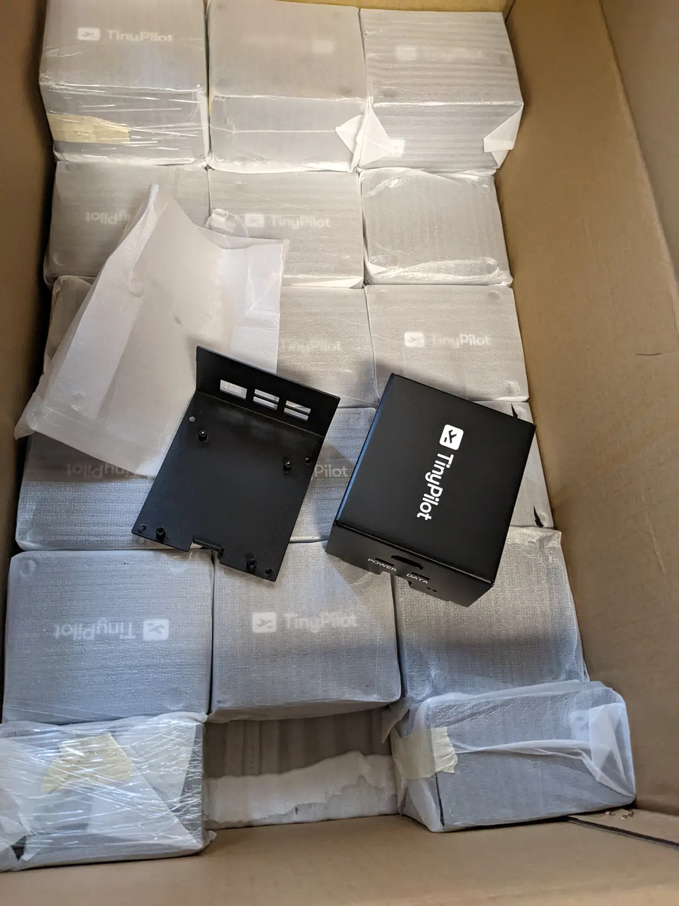
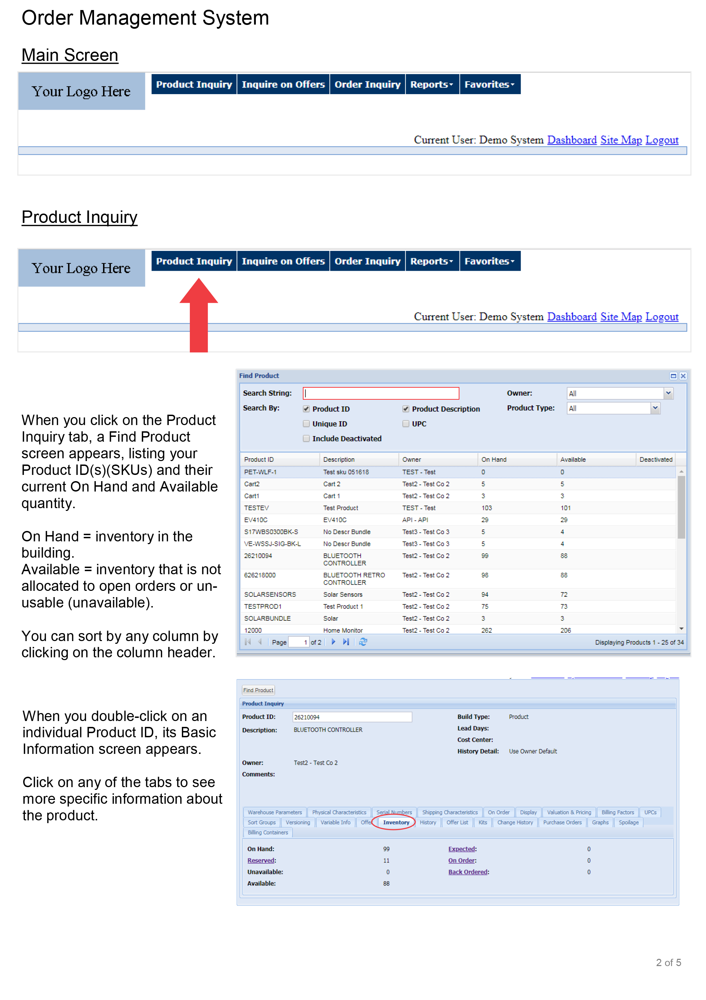



**New here?**

Hi, I'm Michael. I'm a software developer and the founder of [TinyPilot](https://tinypilotkvm.com), an independent computer hardware company. I started the company in 2020, and it now earns $60-80k/month in revenue and employs six other people.

Every month, I publish a retrospective like this one to share how things are going with my business and my professional life overall.


## Highlights

- TinyPilot began shipping a new product: the [Voyager 2a](https://tinypilotkvm.com/product/tinypilot-voyager2a).
- I canceled our contract with a new 3PL vendor a few weeks into the relationship.

## Goal Grades

At the start of each month, I declare what I'd like to accomplish. Here's how I did against those goals:

### Ship the first Voyager 2a device

- **Result**: We began shipping the [Voyager 2a](https://tinypilotkvm.com/product/tinypilot-voyager2a).
- **Grade**: A

The Voyager 2a ended up being TinyPilot's smoothest release ever. For previous launches, we've always forgotten a few small things and had to scramble at the last minute. For the 2a, we'd been preparing since December for everything that needed to happen, and they all happened.

### Prepare to transition fulfillment to our 3PL vendor in February

- **Result**: We canceled our contract with the 3PL vendor.
- **Grade**: N/A

Sadly, once we started working with the 3PL, we found serious gaps in their workflows. More details on that [below](##hiccups-in-transitioning-to-a-3pl-vendor).

### Write my fifth [annual retrospective](/tags/annual-review/)

- **Result**: I [published it](/solo-developer-year-5/) 10 days late, but I'm happy with the result.
- **Grade**: A-

I had a tough time writing my annual review this year. The final post was 2.5k words, but I probably threw out 5-8k words in rejected drafts. I kept finding myself writing long sections only to realize the story required 1,500 words of boring background information for 200 words of reflection.

I felt like the version I published did a good job of covering the major topics of the year without going too far down the rabbit hole on complicated stories.

## [TinyPilot](https://tinypilotkvm.com/?ref=mtlynch.io) stats



| Metric                   | December 2022                           | January 2023  | Change                                             |
| ------------------------ | --------------------------------------- | ------------- | -------------------------------------------------- |
| Unique Visitors          | 7,308                                   | 8,092         | +784 (+11%)             |
| Total Pageviews          | 15,549                                  | 16,665        | +1,116 (+7%)            |
| Sales Revenue            | $66,092.24                              | $68,619.55    | +$2,527.31 (+4%)        |
| Enterprise Subscriptions | $290.70                                 | $290.70       | 0                                                  |
| Royalties                | $2,798.97                               | $5,689.93     | +$2,890.96 (+103%)      |
| Total Revenue            | $69,181.91                              | $74,600.18    | +$5,418.27 (+8%)        |
| **Profit**               | **-$4,806.26** | **$8,552.79** | **+$13,359.05 (+inf%)** |

Sales are down from our peak at the end of last year, but that's intentional. I'm scaling back advertising and keeping prices high on Amazon to compensate for our supply shortage and to reduce load on TinyPilot's fulfillment staff while we transition to our new product.

TinyPilot's three-month average trailing profit has been positive for five straight months, its longest streak ever. I'm especially excited about January's numbers because we had a healthy profit despite several major one-time costs and slower sales than I anticipate for the rest of the year. $8.5k/month puts me almost perfectly on track for [my 2023 goal of $100k/yr in profit](/solo-developer-year-5/#earn-100k-in-profit).

## Increasing production from 140 to 200 devices per month

At the end of last year, I was told that TinyPilot [wouldn't receive any new Raspberry Pi allocation](/retrospectives/2023/01/#losing-450k-in-a-single-email) until September 2023. This limited our production capacity to about 140 TinyPilot devices per month until then. It was tough news, but I had a plan to work around it.

Fortunately, we received word in January that we'd receive a small amount of new allocation, which increases our production capacity to 200/month. We have to purchase 8 GB Pis for nearly double the price, but I'll happily pay a premium to continue selling new devices.

I'm pleased with 200 devices/month as a target. We can comfortably sell at that rate while also having enough time and profit left over to invest in scaling faster when the supply shortage eases in September.

## Getting metal cases in the nick of time

Every year, in late January or early February, China celebrates Chinese New Year. China takes its new year celebration seriously, so Chinese vendors shut down entirely. Some close for a couple of weeks, but others are unavailable for up to four weeks.

TinyPilot purchases most of its raw materials from China, so I plan carefully around Chinese New Year. I have to place orders early enough that they'll complete before things begin shutting down. I also need to order higher quantities so that I can survive the four-week blackout on placing new orders.

In December, we were still finalizing the design for TinyPilot's new metal cases. The manufacturer estimated that it would take 30 business days to complete the order, so we were bumping right up against the Chinese New Year danger zone.

Whenever I'm ordering the first run of a custom product, I order the smallest quantity possible &mdash; about a four-week supply. In this case, the smallest quantity possible was four months' worth &mdash; I needed enough to last me through Chinese New Year plus the turnaround for the next manufacturing run.

So, already, this is a stressful order. Even though we'd seen prototypes, many things can go wrong with a first production run, and I could end up with 1,000 unusably defective cases. That would also mean another four-month stretch on 3D printed cases, where we were paying a steep premium at a backup vendor to meet our excess demand.

The other major risk was that the manufacturer would run late and wouldn't ship anything before Chinese New Year. In the weeks leading up to the ship date, they weren't giving any progress updates except to say that they still thought they'd meet the deadline. I requested that they ship a partial order if necessary, but they didn't tell me whether that would make a difference.

Finally, the Saturday after I thought they closed for the new year, I got an email asking me to send payment immediately for shipping fees. I did, and then a few days later, I received tracking numbers for the cases.

A week later, the cases arrived! And to my great relief, the quality on all of them was just as good as the prototypes.

{{}}

We were able to ship the Voyager 2a as planned, and we have enough cases to last us until we receive the second manufacturing batch.

## Hiccups in transitioning to a 3PL vendor

One of my goals for the year is to move TinyPilot's in-house fulfillment process [to an external shipping warehouse](/retrospectives/2022/11/#exploring-the-world-of-3pl-vendors). These businesses are known as "3PLs": third-party logistics providers.

In December, we started shifting our fulfillment to a 3PL vendor, and things got off to a great start. They were a small business, and all of their customers were small businesses. It seemed like we were well-matched, and they understood our needs.

Then, they gave me instructions for integrating with their warehouse management software, Veracore. The instructions were a PDF, which was the first red flag. When I logged into the system, I found an ASP app that looked like it hadn't been updated in 20 years.

{{}}

Seeing horribly outdated software certainly gave me pause, but I told myself it would be fine. The TinyPilot team would continue managing orders in Shopify. Veracore was how the 3PL would synchronize with our system, but I didn't expect to use it much myself.

We decided to start by shifting our low-volume product over to the 3PL: the [TinyPilot Power Connector](https://tinypilotkvm.com/product/tinypilot-power-connector). It's 1/10th the cost of our main product, and we only sell 30-40 per month. It was a low-risk way to test out the 3PL's workflows end-to-end.

After flipping on order processing at the 3PL, our first Power Connector order came in at 5 PM on Christmas. Obviously, it wouldn't go out that day due to the holiday, so I checked the order the following afternoon. It still showed as unfulfilled in Shopify, but that was fine. Maybe they were closed the day after Christmas too.

By 3 PM on the 27th, the order still hadn't shipped. I emailed the 3PL to verify the order was coming through on their end. They assured me that everything was working fine, but Veracore only syncs its order status back to Shopify once per day. We'd see Shopify update with fulfillment status and tracking numbers by 8 PM.

Once per day? Why wouldn't Veracore just mark orders as fulfilled as soon as they print the shipping label? That would give us the information in real time.

Still, I thought it should be fine. They have a hundred customers who are happy with this system. What did I _really_ need real-time fulfillment information for, anyway?

### What if a customer changes their order?

Every 30 orders or so, a customer requests changes. Sometimes, they realize they mistyped their shipping address. Sometimes, they've changed their mind entirely and want to cancel the order.

In TinyPilot's current system, these requests are easy to handle. The two TinyPilot employees who handle customer support requests are the same people who fulfill orders. As long as we haven't shipped out their order already, we just make the change in Shopify and continue our normal process.

When we transitioned to the 3PL, this is where that "sync once per day" issue came back to bite us. If a customer emailed us requesting changes, now we don't know if the order has been fulfilled or not. The information we see in Shopify is up to 24 hours out of date.

The 3PL's solution was that we email the employee at the 3PL who handles our orders and let them know about any order changes. That felt like a terrible system.

Currently, Shopify is our "source of truth." We can rely on Shopify being the authoritative location where everyone shares information about an order. Starting a parallel discussion over email would spread information into multiple silos that are hard to sync.

I also wasn't crazy about emailing an individual rather than a team. What happens if that person is sick or on vacation? The 3PL said that someone else usually checks that person's email. Usually?

### What if the customer pays in a non-standard way?

There are two common ways that customers purchase from TinyPilot outside of our website's standard checkout flow:

1. They need a custom order that our website doesn't support (e.g., volume discount).
1. They want to pay with a purchase order (basically, how big companies write IOUs).

For (1), we create a custom order and then give the customer a link to pay with a credit card. When the customer pays, Shopify automatically marks the order as "paid," and we ship it out.

For (2), we create a custom order and then wait for the customer to send us a signed purchase order. When we receive the purchase order, Shopify still sees the order as "unpaid" because we don't have the actual cash yet, but we ship it out based on the purchase order.

As you can see, scenarios (1) and (2) are at odds with each other. If we told the 3PL to hold orders until they're marked as "paid," it wouldn't work for customers paying by purchase order (2). If we tell the 3PL to ship out orders even if they're unpaid, they'd ship out orders for (1) immediately, even though the customer might not ever pay.

Before the 3PL, we added notes to an order to make the intent explicit in the case of purchase orders. But the 3PL can't see our note because they only import each order once, so if we add notes later, they don't receive them.

The 3PL's solution was, again, that we email the person who handles our order and explain the special case orders.

Writing this out now, I realize I missed an obvious solution. We could have just made the rule, "Ship out orders when they're marked as paid." And then for (2), we just manually mark the order as "paid" when we receive the purchase order. We'd need a separate system to track unpaid purchase orders, but that's easier than complicating our interface with the 3PL.

### Switching 3PLs

Overall, it felt like our first 3PL's system for managing changes was brittle and invited too many expensive errors.

We told the 3PL it wasn't working, and they took it graciously. Our contract required two months' notice, so they could have demanded two more payments of their $350 monthly minimum, but they didn't.

When I was interviewing 3PLs, there were [two I liked about equally](/retrospectives/2022/11/#working-with-mom-and-pop-3pls). I chose the one that was within driving distance, but the other said I was welcome to reach out anytime.

When I ran into the edge case scenarios with my first 3PL, I followed up with my second choice to see how they'd handle it. The owner told me he found Veracore dated and explained how his warehouse's software would handle my scenarios. It sounded a lot smoother and would allow us to continue managing things in Shopify instead of bridging the gaps with ad-hoc emails. We're now in the process of switching to that 3PL vendor.

## Wrap up

### What got done?

- Launched [TinyPilot Voyager 2a](https://tinypilotkvm.com/product/tinypilot-voyager2a)
- Published my [fifth annual retrospective](/solo-developer-year-5/)
- Canceled my 3PL vendor contract

### Lessons learned

- Figure out how your 3PL will handle non-standard orders.
- Keep interfaces between your eCommerce platform and your 3PL's order management system as simple as possible.
  - In my case, I overlooked simple process changes that would have simplified our 3PL integration.
- Don't transition to a new 3PL all at once.
  - Start with a low-volume or low-cost product so you can work out the kinks before moving on to something higher-risk.

### Goals for next month

- Get back to our normal level of ready-to-ship TinyPilot devices.
- Start the process of transitioning to a new 3PL vendor.
- Begin cross-team collaboration between the developers and support engineers.
