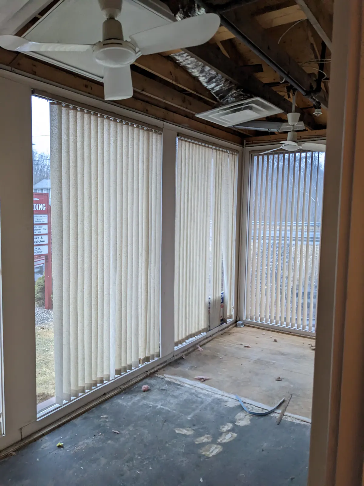



**New here?**

Hi, I'm Michael. I'm a software developer and the founder of [TinyPilot](https://tinypilotkvm.com), an independent computer hardware company. I started the company in 2020, and it now earns $60-80k/month in revenue and employs six other people.

Every month, I publish a retrospective like this one to share how things are going with my business and my professional life overall.


## Highlights

- I left the country for two weeks, and TinyPilot ran smoothly without me.
- A pipe burst in the TinyPilot office, leading to a near-disaster.
- I'm searching for the right balance between reactive and proactive work.

## Goal Grades

At the start of each month, I declare what I'd like to accomplish. Here's how I did against those goals:

### Get back to our normal level of ready-to-ship TinyPilot devices.

- **Result**: We still don't have as much inventory as I'd like.
- **Grade**: C

We're still behind on inventory, as there were a number of surprises that affected the fulfillment team. I've increased prices and slashed ad spending until we get back on our feet.

### Start the process of transitioning to a new 3PL vendor.

- **Result**: We've signed with a new 3PL vendor and are preparing our first shipment to them.
- **Grade**: A

I'm hopeful about this new 3PL. Once we hand over fulfillment to an external vendor, it should relieve pressure on the team and give us breathing room to invest in other areas that allow us to scale up faster.

### Begin cross-team collaboration between the developers and support engineers.

- **Result**: TinyPilot had its first dev-support engineering crossover meeting.
- **Grade**: A

There's work that the developers and support engineers can collaborate on, but I was deferring it until the two teams could meet face-to-face. We had our first dev and support engineering crossover meeting, and now we're ready for the two teams to begin working together directly.

## [TinyPilot](https://tinypilotkvm.com/?ref=mtlynch.io) stats



| Metric                   | January 2023  | February 2023    | Change                                             |
| ------------------------ | ------------- | ---------------- | -------------------------------------------------- |
| Unique Visitors          | 8,092         | 12,141           | +4,049 (+50%)           |
| Total Pageviews          | 16,665        | 23,117           | +6,452 (+39%)           |
| Sales Revenue            | $66,420.52    | $72,585.15       | +$6,164.63 (+9%)        |
| Enterprise Subscriptions | $290.70       | $290.70          | 0                                                  |
| Royalties                | $5,689.93     | $3,935.73        | -$1,754.20 (-31%)         |
| Total Revenue            | $72,401.15    | $76,811.58       | +$4,410.43 (+6%)        |
| **Profit**               | **$8,552.79** | **$26,594.60**\* | **+$18,041.81 (+211%)** |

\* Profit is a naïve calculation based on my change in cash holdings over the month. I'll update it after I do real bookkeeping mid-month.

We're in a strange position of growing revenues despite me trying to constrain sales. The fulfillment team doesn't have enough hours to fulfill more orders on top of their other responsibilities. It could just be that word of mouth always drives our sales up, or it could be that more customers are buying because of the additional features we added in the last couple of months.

I expect we could reach $90k in monthly revenue once we shift fulfillment to a 3PL vendor. We're currently limited by fulfillment capacity, but once we transition to a 3PL, that bottleneck disappears.

We're in our seventh consecutive month of positive profit (well, the trailing three-month average, since our profits are bursty). At this rate, we'll comfortably exceed [my 2023 goal for $100k in profit](/solo-developer-year-5/#earn-100k-in-profit).

## "Are you the TinyPilot guy?"

On a Saturday afternoon last month, I was in my home office when I heard a knock on my front door. I answered it in my pajamas to find a guy in his mid-forties on my doorstep. "Are you the TinyPilot guy?" he asked.

Uh oh. Who's showing up unannounced at my house to ask about TinyPilot?

I tried to recall any recent customer interactions that might have led someone to track me down and beat me up. I didn't remember anything.

"Yes..." I said, cautiously. The mysterious visitor explained that he was the handyman at TinyPilot's office building. He didn't have my phone number, but he was able to find my home address.

"A pipe burst at the office, and we can't get into your suite. Can you come down?"

That didn't sound good.

I got in the car to follow him to the TinyPilot office, mentally calculating whether the company could survive if 100% of our inventory was soaked in water. Even if we got an insurance payout, the turnaround time on manufacturing would leave us out of commission for months.

When I arrived on our floor, I saw that the sprinklers had gone off in the conference room adjacent to TinyPilot. I unlocked the TinyPilot office and breathed a sigh of relief. No water had gotten into our suite at all.

{{}}

They said we couldn't enter our suite for a few days until the fire department signed off on it, as the building no longer had sprinklers. On Monday, I called the landlord, and he said we could resume our normal use of the office.

I thought that was the end of it, but a few days later, a member of the fulfillment team asked me if we were moving. "No... why?" I asked. "Oh, the handyman said in passing that we might have to move."

Uh oh.

I called the landlord to find out what was going on. He said &mdash; very nonchalantly, mind you &mdash; that yes, we might have to move into a new office before Tuesday. And this conversation was happening on Friday.

Because of water damage, my landlord explained, the builders might have to replace one of our walls. But not to worry &mdash; he had a spare office we could use. The new office was 40% smaller than our current office, and our current office was at 80% capacity, so that wouldn't be fun. I asked how long we'd be in the smaller office. He had no idea.

For the next few days, the landlord was fairly blasé about whether we'd have to completely relocate on a couple days' notice. And that was tricky because I was about to [go to Europe for two weeks](#my-longest-tinypilot-vacation), so I wouldn't be available to set up the IT infrastructure in a new office.

I called every day leading up to my trip to ask what the plan was with the wall, and my landlord never had an answer for me. I decided to move just the computers, printers, and networking equipment to the spare office because that was the only part that would be risky without me there.

A week later, we got word that our wall could stay up, so we wouldn't need to move. The fulfillment team lost about a day of work, and I lost another two in contingency planning, but the uncertainty was stressful.

The situation was also a strong motivation to migrate fulfillment to our new 3PL. I'd love to be out of the position of fulfillment grinding to a halt because something goes wrong at our office. A pipe could still burst at our 3PL, but then moving things around to get back up and running would become someone else's problem.

## My longest TinyPilot vacation

In February, I took my longest vacation since starting TinyPilot. I was traveling in Europe for just over two weeks.

The trip began with a wedding I attended in Tübingen, Germany. During this time, I didn't check work emails at all.

{{}}

Many of the people I work with for TinyPilot live in Europe, so I stayed for another week for what I called my "TinyPilot tour of Europe." It consisted of:

- Two nights in Karlsruhe, Germany to visit [punkt.de](https://kvm-ip.de), TinyPilot's European distributor
- Two nights in Berlin, Germany to visit one of TinyPilot's developers
- Two nights in London, England to visit both of TinyPilot's support engineers

The trip was a test of how TinyPilot functions without me, and it went _mostly_ well. Orders went out on time, and users received normal support.

My longest vacation from TinyPilot (as in not checking TinyPilot emails at all) was previously five days, and this was 11, followed by another week on the road with inconsistent Internet access.

### For the local staff

The fulfillment team stayed on top of orders, but they were working nearly at capacity. We're still catching up on the [switch to the Voyager 2a](/retrospectives/2023/02/#getting-metal-cases-in-the-nick-of-time), which takes 30% longer to assemble. For the first time, we're allowing users to trade in old devices for a discount, which adds load to the fulfillment team. [Our office situation](#are-you-the-tinypilot-guy) certainly didn't help matters.

So, fulfillment was fine, but we had less breathing room than I'd like. If someone had gotten sick for a few days, we'd have struggled.

Again, this experience was strong motivation to migrate fulfillment to a 3PL. With a third-party vendor handling fulfillment, there are much fewer time-sensitive tasks we have to handle ourselves, so we'll be more robust against short-term stresses or absences.

### For the support engineering team

TinyPilot's technical support team functioned well without me. During normal operations, the support engineers have the option to escalate issues to me. Without me available, they handled issues independently, and users still received high-quality support.

The support engineering team did experience an "outage" in that there was a period when nobody was available to answer technical questions. One of the support engineers had planned time off during two days of my vacation, and then the last engineer got sick in that same window.

I don't think there's much I can do to prevent outages like this with a team of our size. It's rare, but it's possible for three people to need time off at the same time.

The team felt bad about the outage, so the most actionable lesson was clarifying expectations that outages like this are my problem and not theirs. I don't want to leave customers without technical support, but it's more important to me to respect team members' time off so they don't feel pressured to work during vacation time or when they're ill.

### For the dev team

The dev team worked smoothly while I was traveling. There were a few minor tasks blocked on a decision from me, but the team knew enough about the product roadmap that they could proceed forward without me.

I've been working for the past few years to give the dev team more autonomy and responsibility, so I was happy to see that my absence didn't slow them down much.

## Proactive work from the team generates reactive work for the founder

Over the last few months, I've been thinking a lot about the balance between [reactive and proactive work](/solo-developer-year-5/#run-at-50-capacity) at TinyPilot.

Answering a support ticket is a good example of reactive work. It's time-sensitive, but it's low-impact as it only helps one user who sent the email. A proactive task would be fixing the product or improving documentation so that users don't need to file a support ticket to solve their problem.

I didn't realize until recently that employees' proactive work usually results in reactive work for me. For example, when a support engineer writes a new tutorial, that's useful proactive work, but I need to review it, which is a reactive task for me.

Reviewing documentation is time-sensitive because I want to provide feedback on the work while it's still fresh in the author's mind. I also find it more mentally taxing to give notes on writing than to write the same thing myself. When I see a subtle problem in someone else's writing, I have a hard time identifying and articulating the issues I see.

In the past few months, I've increasingly become the bottleneck on the team's proactive tasks. I keep asking myself whether I should get out of the way and let the team write the way they write, but I keep deciding on "no." I place a premium on our documentation, and it's important that we keep it consistent.

We went through a similar process with the dev team. In the beginning, I was reviewing every code change. About five months in, we switched to [peer reviews](/retrospectives/2021/08/#allow-developers-to-review-each-others-pull-requests) for code changes, and now I'm out of the critical path on most software development work.

I'm hopeful that we'll go through a similar progression on the support engineering team. There's a steep learning curve to writing in the style I want, but if we keep investing in it, my teammates will learn the style I want and peer review each other's writing internally.

My takeaway is that I need to consider my bandwidth even when delegating tasks. Certain tasks generate work that's difficult for me to review, so I need to take into account whether I'll have time to give it a quality review when the work is complete.

## Wrap up

### What got done?

- Took a two-week personal/work trip.
- Signed a contract with our new 3PL vendor.
- Shipped [TinyPilot Pro 2.5.3](https://tinypilotkvm.com/pro/changes#253), which adds audio streaming.

### Lessons learned

- When assigning tasks, consider how much bandwidth I'll need to review.
  - Even if the initial work can happen without me, some tasks require a lot of effort to review.

### Goals for next month

- Transition fulfillment of a low-volume product to our new 3PL.
- Present at [NERD Summit 2023](https://nerdsummit.org/).
- Reduce load on fulfillment team so that reactive tasks occupy less than 80% of their time.

### Requests for help



I'm trying a new idea this month where I announce ways readers can help me. If you're a fan of this blog and can connect me with people that are a match for what I'm looking for, [email me](/about/).



As I explore the process of [shifting manufacturing to China](/retrospectives/2022/10/#what-happens-in-the-tinypilot-office), I'm discovering that it's a larger undertaking than I expected, involving many areas where I have no experience.

If you know someone with experience manufacturing electronics at the scale of 500 to 5,000 units per month, I'd love to speak with them. I'm open to taking on a co-founder, hiring a consultant, or just having a casual chat with someone who wants to share their expertise.
