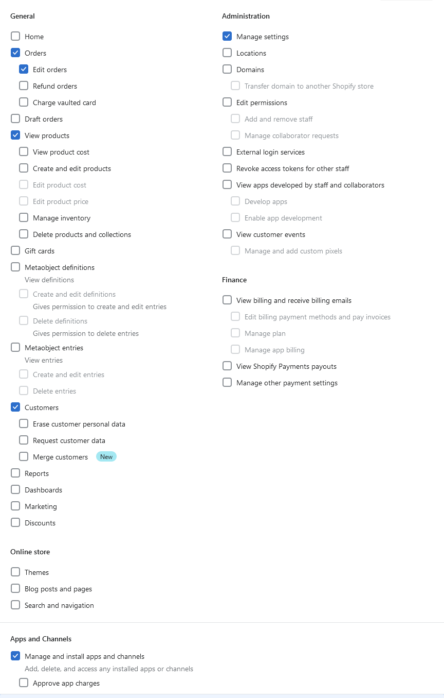
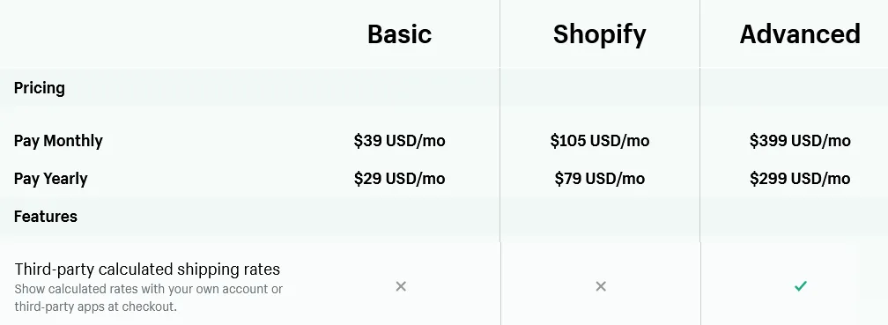
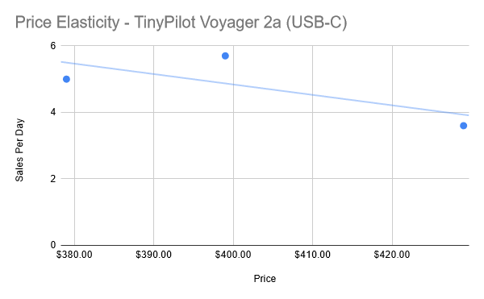
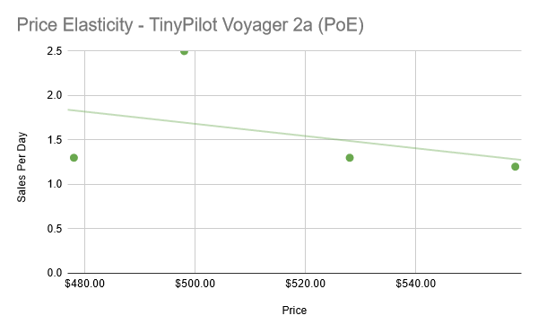
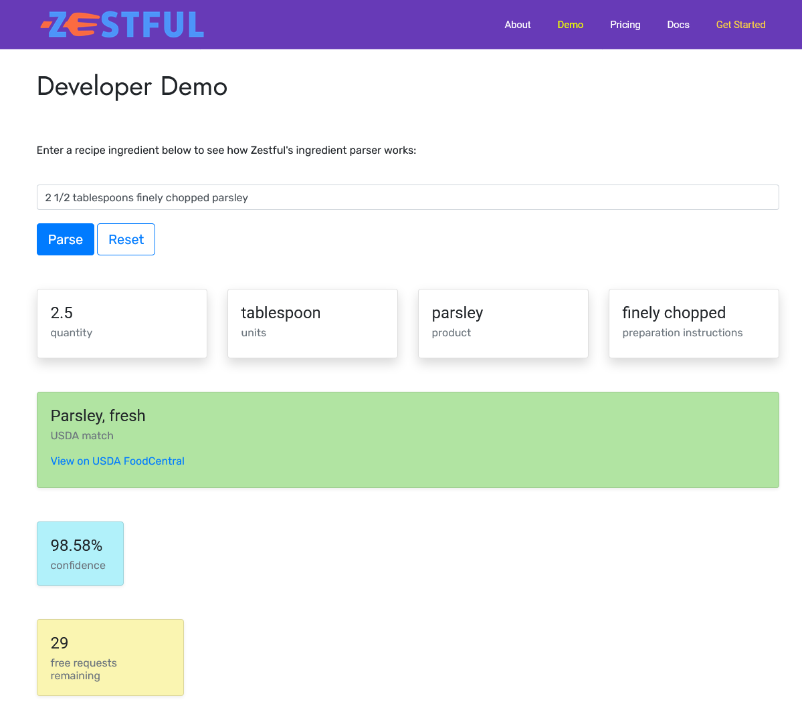



**New here?**

Hi, I'm Michael. I'm a software developer and the founder of [TinyPilot](https://tinypilotkvm.com), an independent computer hardware company. I started the company in 2020, and it now earns $60-80k/month in revenue and employs six other people.

Every month, I publish a retrospective like this one to share how things are going with my business and my professional life overall.


## Highlights

- I've started the process of transitioning TinyPilot's fulfillment to a third-party vendor.
- TinyPilot customers are less sensitive to price than I expected.
- I invested a lot of resources into a trade-in for TinyPilot that I'm not sure paid off.

## Goal grades

At the start of each month, I declare what I'd like to accomplish. Here's how I did against those goals:

### Transition fulfillment of a low-volume product to our new 3PL

- **Result**: Our 3PL vendor has been fulfilling Power Connector orders for three weeks.
- **Grade**: A

There were a few rough edges to smooth out, but we successfully transitioned our first product.

### Present at [NERD Summit 2023](https://nerdsummit.org/)

- **Result**: I presented my talk and felt good about the delivery.
- **Grade**: A

It was fun to be back at NERD Summit in person for the first time since 2019. There were a lot of cool talks and fun hallway conversations.

### Reduce load on fulfillment team so that reactive tasks occupy less than 80% of their time

- **Result**: This was mostly successful but hard to measure.
- **Grade**: B

In order to transition to the 3PL, we needed to free up the local team's workload enough that they could build an extra week's worth of devices. We took several measures to reduce their load, though they also worked more hours than usual.

## [TinyPilot](https://tinypilotkvm.com/) stats



| Metric                   | February 2023  | March 2023     | Change                                            |
| ------------------------ | -------------- | -------------- | ------------------------------------------------- |
| Unique Visitors          | 12,141         | 7,443          | <font color="red">-4,698 (-39%)</font>            |
| Total Pageviews          | 23,117         | 17,904         | <font color="red">-5,213 (-23%)</font>            |
| Sales Revenue            | $72,585.15     | $86,803.78     | <font color="green">+$14,218.63 (+20%)</font>     |
| Enterprise Subscriptions | $290.70        | $290.70        | 0                                                 |
| Royalties                | $3,935.73      | $4,820.75      | <font color="green">+$885.02 (+22%)</font>        |
| Total Revenue            | $76,811.58     | $91,915.23     | <font color="green">+$15,103.65 (+20%)</font>     |
| **Profit**               | **$32,905.55** | **$43,952.10** | **<font color="green">+$11,046.55 (+34%)</font>** |

Switching TinyPilot's case from plastic to metal dramatically increased demand. Even as I increase prices and reduce marketing to near zero, sales volume keeps increasing.

My goal for the year is to [reach $100k in profit](/solo-developer-year-5/#earn-100k-in-profit), but we're already 75% there. At this rate, we'll hit $100k in annual profit before the end of April.

## The hiccups in transitioning to a 3PL vendor

My top priority is to transition TinyPilot's fulfillment to a third-party logistics (3PL) vendor. The 3PL's job is to keep finished products in their warehouse and then pick, pack, and ship products when orders come in.

To start the process, we gave the 3PL our lowest-volume product, the [TinyPilot Power Connector](https://tinypilotkvm.com/product/tinypilot-power-connector). It's for users who build their own TinyPilot devices, and we don't advertise it on our website. We only sell 20-30 per month.

The Power Connector offered a low-risk way to test our new 3PL end-to-end before transitioning all orders over to them. This exercise uncovered several issues, so I was glad we started with a limited test.

### "Everyone just gives us their admin password"

The first challenge was synchronizing TinyPilot's order system with the 3PL's. TinyPilot uses Shopify, one of the most popular eCommerce platforms in the US. Our 3PL uses Shipstation to manage orders. Shipstation is fairly popular, and I've heard positive things about it, so I thought it would be trivial to integrate Shopify with Shipstation.

My [previous 3PL](/retrospectives/2023/02/#hiccups-in-transitioning-to-a-3pl-vendor) had a similar order management system. To integrate with it, I installed an app in Shopify and pasted in the 3PL's access key. It was easy.

When my new 3PL sent instructions for integrating Shipstation with my Shopify account, they suggested I either give them my root admin credentials for Shopify or create a new admin account for them.

That couldn't be right.

I checked [Shipstation's documentation](https://help.shipstation.com/hc/en-us/articles/360026141491-Shopify) and couldn't figure out how to link the two accounts. Shipstation assumes that the same person owns both the Shopify account and the Shipstation account, which wasn't true in our case.

Shipstation's design put us in a deadlock. I couldn't link to the 3PL's Shipstation account because I didn't have their Shipstation admin credentials. The 3PL couldn't link to TinyPilot's Shopify store because they didn't have my Shopify admin credentials.

I didn't want to give the 3PL full admin rights on TinyPilot's Shopify, and I certainly didn't want to hand over credentials to my own account.

Instead, I created my own Shipstation account and a dummy Shopify user account with limited permissions. Then, I repeatedly tried to link TinyPilot's Shopify account with my test Shipstation account using the dummy Shopify user account.

Through trial and error, I figured out the smallest set of permissions the Shopify user account needed to link a Shipstation account. Once I figured it out, I created a limited account for the 3PL in TinyPilot's Shopify with a minimal set of permissions.

If anyone discovers this post who's in the same boat with Shopify and Shipstation, the permissions needed to link Shipstation from Shopify are:

- Orders
  - Edit orders
- View products
- Customers
- Manage settings
- Manage and install apps and channels

{{}}

I was surprised the process of integrating Shopify with the 3PL's Shipstation account was so complicated. The 3PL told me that they have dozens of Shopify customers, so I asked how they'd solved this process in the past.

"Everyone just gives us their admin password," the 3PL manager told me. She explained that most of their customers aren't particularly tech-savvy, so they don't find it unusual to offer their Shopify credentials to the vendor managing their fulfillment.

### Should we pay $150 to ship this $50 order?

The next hitch in our transition came when we received an order from Australia. Shipping rates to Australia are one of the highest of any country that TinyPilot serves. Shipping a TinyPilot Power Connector within the US costs a few dollars, but shipping it to Australia costs $50.

The 3PL reported that it would cost them $150 to ship this order, but the customer had only paid $50. It turns out that TinyPilot has been paying discounted rates for DHL's international shipping because Shopify negotiates a better rate on our behalf. The 3PL didn't have a discounted rate with DHL, so they would have had to pay $150 for the postage to Australia.

If the 3PL purchased the standard postage, I'd be eating the $100 delta. The order would leave me $50 poorer than if the customer hadn't ordered at all.

Losing money on a single order wouldn't be such a big deal, but it indicated a deeper problem. The shipping prices that TinyPilot customers were seeing at checkout were based on Shopify's shipping rates. I needed customers to see the shipping rates for my 3PL instead.

Again, I asked, "What do your other customers do?"

The 3PL manager said their other customers either offer free shipping or set flat pricing per country that's independent of the size and weight of the shipment.

Estimating prices like that wouldn't be a dealbreaker, but it felt sloppy. We'd always be guessing, and there were sure to be situations where we were substantially undercharging or overcharging customers for shipping. TinyPilot's current setup lets customers choose their courier based on the exact shipping cost, and I wanted to preserve that.

I saw from Shipstation's documentation that it could share shipping rates with Shopify, so it seemed possible. The 3PL said they'd never done it before, but they were willing to explore it. A few hours later, the 3PL manager called me to say that it was possible from Shipstation's end, but my Shopify billing tier didn't support it.

I looked at Shopify's feature page and confirmed that the "Third-party calculated shipping rates" was only available in Shopify's Advanced plan:

{{}}

That would take TinyPilot from Shopify's $105/mo tier to a whopping $399/mo plan, making Shopify TinyPilot's most expensive cloud service.

I was still on the phone with the 3PL manager while I figured this all out. Somewhat impulsively, I upgraded right then and there.

I'd made a big fuss about the shipping rates, so I was too embarrassed to back out at that point. But I did deliberately sign up for the monthly rate so I could change my mind later.

In retrospect, I still think the Shopify Advanced plan is worth it. I really didn't want to go country-by-country estimating shipping fees and adjusting them as the market fluctuated. And I'll make some of my money back because the high-tier plan reduces credit card fees by 0.2%. Using TinyPilot's revenue from last year, the fee discounts would have translated to about $2k less in credit card fees, so I'm at least getting back some of the $4,800/year I'm spending on this ridiculous plan.

## How elastic is the demand for TinyPilot?

TinyPilot's current [constraint](/book-reports/the-goal/#two-types-of-resources) is manufacturing capacity. We're still assembling devices in-house, but orders are coming in about as quickly as TinyPilot's staff can build devices.

If we're going to transition all of our products to the 3PL, it's not enough to keep up with orders. We need to build up at least a week's worth of surplus Voyager 2a devices to send to the 3PL's warehouse. To slow down sales, I tried increasing TinyPilot's pricing, which yielded some interesting data.

In economics, the "elasticity" of a product indicates how sensitive consumers are to its price. Uber rides are a good example of an elastic product. If rides are cheap, you'll pay for the convenience, but if prices go up 10x, you'll probably take public transportation instead.

So, how sensitive are TinyPilot customers to price?

### Voyager 2a USB-C

| Time Period       | Price | Sales Volume  |
| ----------------- | ----- | ------------- |
| Feb. 13 - Mar. 6  | $379  | 110 (5.0/day) |
| Mar. 7 - Mar. 12  | $399  | 34 (5.7/day)  |
| Mar. 13 - Mar. 30 | $429  | 65 (3.6/day)  |

{{}}

### Voyager 2a PoE

| Time Period       | Price | Sales Volume |
| ----------------- | ----- | ------------ |
| Feb. 13 - Mar. 6  | $478  | 29 (1.3/day) |
| Mar. 7 - Mar. 12  | $498  | 15 (2.5/day) |
| Mar. 13 - Mar. 19 | $528  | 9 (1.3/day)  |
| Mar. 20 - Mar. 30 | $558  | 13 (1.2/day) |

{{}}

### Reflections

My sample is too small to make any strong claims, but the data suggest that TinyPilot's customers are less sensitive to price than I expected. Demand for the PoE model seems especially inelastic, as customers bought at roughly the same rate even when I raised the price by $80 (17%).

The capitalist in me wants to keep raising prices to maximize profits. The enthusiast in me wants to keep it affordable for casual users.

I was recently re-reading my blog post about [creating the first TinyPilot prototype](/tinypilot/#commercial-solutions) and noticed this paragraph:

> Next, I looked at commercial KVM over IP solutions. They provide similar functionality to Dell’s iDRAC, but... they're even more expensive, ranging in price from $500 to $1000 per unit.

Now _I'm_ the expensive commercial KVM over IP solution!

Perhaps irrationally, I want a TinyPilot offering that would have appealed to the version of me from 2020 who just wants an easy way to manage a [home server](/tags/homelab/) without spending a fortune.

I think the higher price makes sense now while TinyPilot is constrained in both [supply](/retrospectives/2023/01/#losing-450k-in-a-single-email) and production speed, but I'm hoping I can eventually reduce prices again and make it up in volume.

## Were trade-ins a dumb idea?

Every time TinyPilot releases a new hardware version, customers ask if they can trade in their old devices for the newest model. In the past, I've told them we don't have a process for trade-ins, but I'll offer a generous discount on the new version.

This year, TinyPilot's primary constraint is the [availability of Raspberry Pis](/retrospectives/2023/01/#losing-450k-in-a-single-email). Because of that, I'm trying to maximize the amount TinyPilot can earn from our limited supply of Pis.

Instead of offering customers a discount on new devices, I had the brilliant idea of offering trade-ins. The customer would send their device to us, we'd recycle as many parts as possible to convert it to a Voyager 2a, then send it back. Every TinyPilot product has used the same model of Raspberry Pi, so we'd reward loyal customers without using up any new Pis.

The trade-in process turned out to be more complicated and labor-intensive than I expected.

A lot of customers rely on their TinyPilots for day-to-day work, so they didn't want to send in their device without a replacement in-hand. In those cases, we sold them a Voyager 2a made from refurbished parts, then gave them a partial refund when we received their trade-in.

And then there were customers who had multiple TinyPilot devices and needed all of them online. So, we'd send them a refurbished device, they'd send back a legacy device, we'd convert that to the newest version, send it back to them, then they'd send their next device, then repeat until we'd replaced all their devices. Some customers had four devices we replaced this way.

All the trade-ins went smoothly, but they were a lot more work than I expected.

It's hard to weigh the tradeoffs of this decision because the upside is intangible &mdash; we're rewarding customers who stick with us and want to support the product. The downsides of the trade-ins were very tangible, however. Trade-ins took, on average, 2-3x longer to process than normal sales, and we did them basically at cost.

If TinyPilot makes a profit of $300-400 on each standard sale, and each trade-in prevented us from making \~2.5 sales, each trade-in cost us $750-$1k. We did 22 trade-ins in total, so the trade-in program cost around $19k.

If I had to do it over, I would have still offered the trade-ins, but with these adjustments:

- Don't advertise trade-ins broadly, but work with customers who ask.
- Use a separate support queue for trade-in requests, and set expectations that there might be a wait of a few weeks before we start the process with each customer.

## Side projects

### Reimplementing a Zestful microservice in Go

Back in 2018, when I was [launching Zestful](/retrospectives/2018/07/), my recipe ingredient parsing service, I wanted a low-friction way for prospective customers to try out the service. Other services required you to create an account or put in a credit card, but I wanted to offer a [no-friction demo](https://zestfuldata.com/demo) on the Zestful website:

{{}}

I needed the demo to limit each user to 30 parses per day. After that, they'd have to sign up for a paid plan. I decided to build a demo server with an API interface identical to the paid server, except that it limited users to 30 ingredients per day.

At the time, I loved AppEngine and hated the idea of maintaining my own database. I wrote the demo app using Python 2.7 AppEngine and Google Cloud Datastore.

When a request came in, the demo server would look up the user's IP address in Google Cloud Datastore. If the IP had used up all its quota, the server would reject the request with an error telling the user to sign up for a paid plan. If the user had quota remaining, the server would pass the request through to the paid Zestful server and then deduct one unit of quota associated with the client's IP address.

Since 2018, I've [fallen out of love with AppEngine and Google Cloud in general](/litestream/#data-persistence-for-people-who-hate-database-servers). When I received a notice from Google telling me that they'd be turning down AppEngine for Python 2.7 in a few months, I thought it would be a fun experiment to see how much faster I could implement the service today.

Instead of using Python, I used Go, as I find Go web apps easy to build and maintain. I started thinking about how to design the database using SQLite and Litestream until I realized that I could skip the persistent datastore entirely.

If I keep everyone's quota in memory, what's the downside? Whenever I deploy a new version or restart the server, everyone's quota will reset for the day, granting them more requests against the demo server.

Giving each user $0.60 worth of extra quota on every restart isn't a big deal, especially given that I planned to restart the server infrequently.

I reimplemented the service in about six dev hours. I was impressed with myself because I remembered spending two weeks on the original. In just five years, I'd achieved a 10x speedup!

Then, I went back and checked the commit history of the original AppEngine version and realized I actually implemented it in just one day.

```text
Mon Apr 30 00:51:48 2018 -0400  Adding badges to README (#7)
Mon Apr 30 00:51:40 2018 -0400  Adding changes to make prod API work (#6)
Mon Apr 30 00:43:55 2018 -0400  Adding support for parser config model (#5)
Sun Apr 29 23:51:03 2018 -0400  Adding deployment to Travis (#4)
Sun Apr 29 23:41:42 2018 -0400  Adding rate limiter (#3)
Sun Apr 29 18:18:37 2018 -0400  Adding coveralls.yml (#2)
Sun Apr 29 18:14:46 2018 -0400  Merge pull request #1 from mtlynch/parser-proxy
Sun Apr 29 18:11:16 2018 -0400  Fixing response handler
Sun Apr 29 17:52:28 2018 -0400  Fixing HTTP handler
Sun Apr 29 17:40:02 2018 -0400  Adding in ParserProxy and tests
Sun Apr 29 11:20:11 2018 -0400  Initial commit
```

Granted, from the commits, it looks like a marathon coding session where I worked from Sunday morning until 1 AM Monday, so the original probably took around 14 dev hours. That makes the speedup more like 2.3x.

So, I'm not _that_ much faster than I was five years ago, but I'm proud of being able to recognize a new opportunity to simplify by skipping the database. I'm also glad that I'm continuing to learn new technologies so that I have more solutions available to me than I did in the past.

## Wrap up

### What got done?

- Transitioned one product to a 3PL vendor.
- Presented at [NERD Summit](https://nerdsummit.org/).
- Found a new accountant and did most of the legwork for my 2022 tax prep.

### Lessons learned

- Run a limited trial before transitioning a critical operation to a new vendor.
  - If I had tried to hand off fulfillment to a 3PL vendor in one shot, it would have been extremely messy.
  - Starting with the limited trial allowed us to reject the first vendor as a poor match and smooth out rough edges with our second vendor.

### Goals for next month

- Transition all products to our 3PL vendor.
- Choose a contract manufacturer to take over TinyPilot's device assembly and begin the transition process.
- Publish a new release of TinyPilot Pro.

### Requests for help

If you or someone you can convince to talk to me has worked with contract manufacturers on a hardware product, I'd love to talk about the experience. I'm especially interested in people who have worked on an electronics product at low volumes, like 2,000-5,000 units per year.
