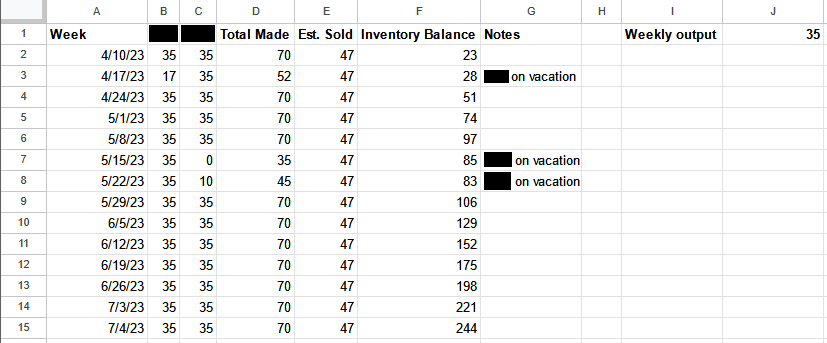
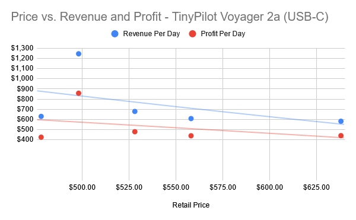



**New here?**

Hi, I'm Michael. I'm a software developer and the founder of [TinyPilot](https://tinypilotkvm.com), an independent computer hardware company. I started the company in 2020, and it now earns $60-80k/month in revenue and employs seven other people.

Every month, I publish a retrospective like this one to share how things are going with my business and my professional life overall.


## Highlights

- We've completed transitioning TinyPilot's fulfillment to a third-party vendor.
- The local team is escaping their months-long stint in "urgent mode."
- Now that production speed isn't a bottleneck, I can choose a price that optimizes for profitability.

## Goal Grades

At the start of each month, I declare what I'd like to accomplish. Here's how I did against those goals:

### Transition all products to our 3PL vendor

- **Result**: Our 3PL vendor is now shipping all of our products.
- **Grade**: A

The transition went smoothly, and it's a big step forward for the company. With the 3PL handling day-to-day order fulfillment, we have much more flexibility, as we don't have to staff the office six days a week. Employees still go into the office regularly, but there's no pressure to get everything done before that day's mail pickup.

### Choose a contract manufacturer to take over TinyPilot's device assembly and begin the transition process

- **Result**: I'm still in discussions but haven't officially picked one.
- **Grade**: B-

I found a contract manufacturer I like but still haven't signed with them officially. I'm waiting for a formal price quote and timeline. Their oprimistic, unofficial estimate for the first production batch is October 2023.

### Publish a new release of TinyPilot Pro

- **Result**: Published [TinyPilot Pro 2.5.4](https://tinypilotkvm.com/pro/changes#254)
- **Grade**: A

This was not an exciting release feature-wise, but it created a path for users to migrate off of Debian Buster, which is now a legacy OS. Dropping support for Buster means eliminating a lot of complexity in our codebase, where we had conditional logic for that OS version.

## [TinyPilot](https://tinypilotkvm.com/?ref=mtlynch.io) stats



| Metric                   | March 2023     | April 2023     | Change                                          |
| ------------------------ | -------------- | -------------- | ----------------------------------------------- |
| Unique Visitors          | 7,443          | 6,560          | -883 (-12%)            |
| Total Pageviews          | 17,904         | 15,034         | -2,870 (-16%)          |
| Sales Revenue            | $83,529.40     | $82,060.84     | -$1,468.56 (-2%)       |
| Enterprise Subscriptions | $290.70        | $290.70        | 0                                               |
| Royalties                | $4,820.75      | $2,369.08      | -$2,451.67 (-51%)      |
| Total Revenue            | $88,640.85     | $84,720.62     | -$3,920.23 (-4%)       |
| **Profit**               | **$43,952.10** | **$10,295.55** | **-$33,656.55 (-77%)** |

The numbers look scary because everything is down, but the difference is minor. Total revenue is only down 4%. Profit is down, but that's just a function of how lumpy expenses are. I'm still feeling positive about average monthly profits in the $20-30k range.

## Getting over the 3PL hump

For the past few months, TinyPilot's local team has been working at nearly 100% capacity, so my top priority was to find ways to reduce load on them.

One of the best bang-for-buck steps I saw in reducing workload was [completing our transition to a third-party logistics (3PL) vendor](/retrospectives/2023/04/#the-hiccups-in-transitioning-to-a-3pl-vendor). Since the beginning of TinyPilot, we've been shipping orders directly from our office. With a 3PL, we'd ship our products in bulk to a warehouse, and then the 3PL would handle the day-to-day work of fulfilling customer orders as they arrived.

Outsourcing fulfillment to a 3PL would definitely save us a good chunk of work, but it was a catch-22 in that the switch itself would take extra work.

Once we shipped our products to the 3PL, it would take about a week before the 3PL was ready to process orders. That meant that we had to build up an extra week's worth of inventory &mdash; no small feat when we were barely keeping up with the existing order volume.

I could have closed up shop for a week while we transitioned, but that would be akin to forfeiting $10-20k in lost sales. Instead, I took a few measures to reduce load for the local team so that they could focus their energy on building up our inventory.

First, I decreased ad spending. That was a no-brainer. There's no use spending money to attract new customers when we already have more demand than we can handle.

Second, I increased prices. I [bumped TinyPilot's price](#what-price-maximizes-profits) in several rounds to slow down the volume of sales while minimizing revenue loss.

Finally, I pitched in on customer support. The local staff covers assembly, fulfillment, and customer support. Every hour I could save the local staff on support meant another hour they could dedicate to building devices.

And fortunately, those efforts succeeded. At the beginning of May, the local team had built up enough of an inventory surplus to ship a week's worth of inventory to the 3PL. Once the 3PL was up and running, the local team's workload dropped by about 15%.

The transition to the 3PL went pretty smoothly, but there are definitely things I'd plan better if I were doing it again. I've collected a set of [questions to ask a 3PL vendor](/notes/3pl-questions/) for others who are approaching 3PLs for the first time (or me, if I ever switch vendors).

## Getting out of &ldquo;urgent mode&rdquo;

Even after outsourcing fulfillment to the 3PL, we couldn't relax as much as I'd hoped. With only a few days of inventory at the warehouse, the team was still scrambling to build new devices and replenish the 3PL's stock.

I wistfully remembered how much spare capacity the local team had a year ago. At that point, my biggest problem was [missing opportunities](/retrospectives/2022/02/#how-can-i-spend-less-time-coordinating-changes) to let them take on more responsibility.

This year, the situation had flipped. I was taking on tasks that the local team would otherwise be doing. And there was a constant feeling that we were struggling to stay on top of our workload rather than just handling it calmly. We were neglecting long-term tasks like documentation or inventory planning.

Worst of all, I couldn't get excited about strong sales days. When I'd check Shopify and see we sold 10+ units in a single day, instead of celebrating the win, my first thought was, "Oh no! This is going to make it harder for us to build up inventory at the warehouse."

I felt like we'd be able to relax when the warehouse had a month's worth of inventory. I did some quick spreadsheet calculations and estimated that it would take us until July to reach that point, but I didn't want everyone to feel this way for another two months.

{{}}

For the past few months, I'd considered hiring a third local employee. I was reticent because I expected load to drop once we moved fulfillment to a 3PL and then drop a lot once we moved production to a contract manufacturer. At that point, the local team's job would reduce to only customer support, and I didn't expect there to be enough support work for three people.

When I saw there was still a significant workload after our 3PL transition, I came back to the idea of a third employee. And then a lightbulb went off: if there wouldn't be enough work in six months, I could just advertise it as a short-term position.

I posted the job on craigslist and in local Facebook groups. Over the course of two weeks, I received 18 applications, interviewed five people, and extended one offer, which the candidate accepted. The new employee begins work this week.

There has definitely been a change in mood since we decided to bring in a third employee. The team doesn't feel the pressure to hurry for the short term. Everyone's more relaxed, and we're back to investing in documentation and long-term planning.

## What price maximizes profits?

For the past two months, I've been increasing TinyPilot's price to reduce sales volume. I intentionally priced TinyPilot high so that we'd reduce total sales and have more time to catch up on inventory.

Now that we've caught our breath and have additional capacity to build devices, I can price our products to maximize profit rather than to work around a bottleneck in production speed.

I had experimented with pricing last month, but now that I have more data, let's see what the numbers look like.

### Voyager 2a USB-C

| Price | Time Period       | Days | Sales per Day | Revenue per Day | Profit per Day |
| ----- | ----------------- | ---- | ------------- | --------------- | -------------- |
| $379  | Feb. 13 - Mar. 6  | 22   | 5.0           | $1,895          | $1,220         |
| $399  | Mar. 7 - Mar. 12  | 6    | 5.7           | $2,261          | $1,496         |
| $429  | Mar. 13 - Apr. 10 | 29   | 4.6           | $1,953          | $1,338         |
| $499  | Apr. 11 - May 3   | 23   | 3.3           | $1,671          | $1,219         |

{{}}

Last month, I was surprised at [how inelastic](/retrospectives/2023/04/#reflections) the demand was for TinyPilot. I expected more of a drop in sales as I increased prices. With more data, the demand curve is a little closer to my expectations. A $120 price increase (32%) caused a 34% decrease in orders.

Interestingly, profit was almost perfectly equal at the $379 and $499 price points ($1,220/day vs. $1,219/day). Overall profits would be higher at the $499 price, as 34% fewer sales would mean lower long-term support costs.

### Voyager 2a PoE

| Price | Time Period       | Days | Sales per Day | Revenue per Day | Profit per Day |
| ----- | ----------------- | ---- | ------------- | --------------- | -------------- |
| $478  | Feb. 13 - Mar. 6  | 22   | 1.3           | $630            | $426           |
| $498  | Mar. 7 - Mar. 12  | 6    | 2.5           | $1,245          | $858           |
| $528  | Mar. 13 - Mar. 19 | 7    | 1.3           | $679            | $480           |
| $558  | Mar. 20 - Apr. 10 | 22   | 1.1           | $609            | $440           |
| $638  | Apr. 11 - May 3   | 23   | 0.9           | $583            | $441           |

{{}}

Customers of the higher-end PoE version seem indifferent to prices between $478 and $528. They bought at roughly the same rate at either price, though the sample size is small.

The most profitable price was $498, though it's also pretty likely an outlier based on how short the collection period was.

### Decision: Sell at $399 + $99

The sweet spot in pricing seems to be selling the base model for $399 and charging +$99 ($498) for the PoE upgrade. TinyPilot saw the most profitable sales at those prices. The sample size is small for that period, but it also seems to be near the top of the curve the other prices suggest.

The other thing I like about a $399 base price is that it's still within reason [for a person like me to buy it](/retrospectives/2023/04/#reflections). If I had seen a product like TinyPilot three years ago, I'd have thought, "Sure, for $399, that's worth it for my [homelab](/tags/homelab/)."

## Side projects

### [ScreenJournal](https://thescreenjournal.com)

I continued working on ScreenJournal, my open-source web app that lets you share movie recommendations with friends.

The main feature I added in April was enabling users to [comment on](https://github.com/mtlynch/screenjournal/pull/173) [other people's movie reviews](https://github.com/mtlynch/screenjournal/pull/163). I'm not using any kind of commenting package, so the implementation is fully homegrown. Here's what it looks like:



The other big change I made to ScreenJournal was redesigning my end-to-end tests to [run in parallel rather than sequentially](https://github.com/mtlynch/screenjournal/pull/169).

I've always struggled with shared database when I'm testing my web apps end-to-end. I haven't been able to figure out how other developers work around it.

Previously, I dealt with the shared state problem by resetting the database before every end-to-end test. That was slow and meant I could only run one test at a time since they're all sharing the same database.

My current solution is to assign a cookie to each client and associate that cookie with a unique in-memory SQLite database. That means the tests no longer share state through the database, so they can run in parallel. I like this solution better than anything I've done before, but I still feel like I'm reinventing the wheel and am curious if readers know of more established solutions.

## Wrap up

### What got done?

- Completed the transition to a 3PL warehouse vendor.
- Published TinyPilot Pro 2.5.4.
- Attended Microconf US 2023.
- Hired a new employee for the TinyPilot office.
- Dealt with [Section 174 headaches](https://ssballiance.org/contactcongress.html) for my 2022 taxes.

### Lessons learned

- There are lots of potential employees who are fine with short-term positions.
  - I had avoided hiring a third person because I worried about what to do when demand for the role faded. I realized that I could present it as a short-term position from the start, and there are plenty of candidates who are happy with or even prefer short-term roles.

### Goals for next month

- Onboard the newest TinyPilot employee.
- Reach $90k in revenue.
- Find three homelab bloggers or YouTubers interested in reviewing TinyPilot Voyager 2a.
