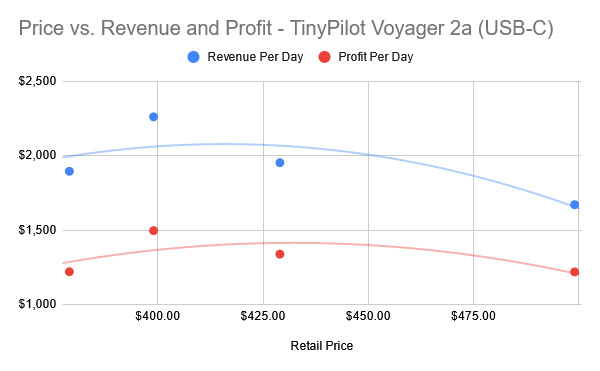



**New here?**

Hi, I'm Michael. I'm a software developer and the founder of [TinyPilot](https://tinypilotkvm.com), an independent computer hardware company. I started the company in 2020, and it now earns $60-80k/month in revenue and employs six other people.

Every month, I publish a retrospective like this one to share how things are going with my business and my professional life overall.


## Highlights

- The local team is escaping their months-long stint in "urgent mode."

## Goal Grades

At the start of each month, I declare what I'd like to accomplish. Here's how I did against those goals:

### Transition all products to our 3PL vendor

- **Result**: Our 3PL vendor is now shipping all of our products.
- **Grade**: A

TODO

### Choose a contract manufacturer to take over TinyPilot's device assembly and begin the transition process

- **Result**: XX
- **Grade**: XX

TODO

### Publish a new release of TinyPilot Pro

- **Result**: Published [TinyPilot Pro 2.5.4](https://tinypilotkvm.com/pro/changes#254)
- **Grade**: A

TODO

## [TinyPilot](https://tinypilotkvm.com/?ref=mtlynch.io) stats



| Metric                   | March 2023     | April 2023       | Change                                          |
| ------------------------ | -------------- | ---------------- | ----------------------------------------------- |
| Unique Visitors          | 7,443          | 6,560            | -883 (-12%)            |
| Total Pageviews          | 17,904         | 15,034           | -2,870 (-16%)          |
| Sales Revenue            | $83,529.40     | $82,060.84       | -$1,468.56 (-2%)       |
| Enterprise Subscriptions | $290.70        | $290.70          | 0                                               |
| Royalties                | $4,820.75      | $2,369.08        | -$2,451.67 (-51%)      |
| Total Revenue            | $88,640.85     | $84,720.62       | -$3,920.23 (-4%)       |
| **Profit**               | **$44,814.70** | **$20,109.02**\* | **-$24,705.68 (-55%)** |

\* Profit is a naïve calculation based on my change in cash holdings over the month. I'll update it after I do real bookkeeping mid-month.

## Getting over the 3PL hump

For the past few months, TinyPilot's local team has been working near 100% capacity, so my top priority was to find ways to reduce load on them.

One of the best bang-for-buck steps I saw in reducing the local team's workload was completing our transition to a third-party logistics (3PL) vendor. Since the beginning of TinyPilot, we've been shipping orders directly from our office. With a 3PL, we'd ship our products in bulk to a warehouse, and then the 3PL would handle the day-to-day work of fulfilling customer orders as they arrived.

Outsourcing fulfillment to a 3PL would definitely save us a good chunk of work, but we needed to do extra work to switch. Once we shipped our products to the 3PL, it would take about a week before the 3PL was ready to process orders. That meant that we had to go from barely keeping up with orders to being so ahead of orders that we had an extra week's worth to cover the transition time.

I could have closed up shop for a week while we transitioned, but that would be akin to forfeiting $10-20k in lost sales. Instead, I took a few measures to reduce sales volume and reduce load for the team responsible for fulfillment.

First, I **decreased ad spending**. That was a no-brainer. There's no use spending money to attract new customers when we already have more demand than we can accomodate.

Second, I **increased prices**. I [bumped TinyPilot's price](/retrospectives/2023/04/#how-elastic-is-the-demand-for-tinypilot) in several rounds to slow down the volume of sales while minimizing revenue loss.

Finally, I **pitched in on customer support**. The local staff covers assembly, fulfillment, and customer support. Every hour I could save the local staff on customer support meant another hour they could dedicate to building devices.

And fortunately, those efforts succeeded. At the beginning of May, the local team had built up enough of an inventory surplus that we could ship a week's worth of inventory to the 3PL. Once the 3PL was up and running, the local team's workload dropped by about 15% because the 3PL had taken over one of their main responsibilities.

The transition to the 3PL went pretty smoothly, but there are definitely things I'd plan better if I were doing it over. I've collected a set of [questions to ask a 3PL vendor](/notes/3pl-questions/) for others who are approaching 3PLs for the first time (or me, if I ever switch vendors in the future).

## Getting out of &ldquo;urgent mode&rdquo;

Even after outsourcing fulfillment to the 3PL, we couldn't relax as much as I'd hoped. With only a few days of inventory at the warehouse, the team was still scrambling to build new devices and replenish the 3PL vendor's stock.

I felt like we'd be able to relax when we reached the point of having a month's worth of inventory at the 3PL. I did some quick spreadsheet calculations and estimated that it would take us until July to reach that point.

{{}}

I thought back to a year ago and remembered that the local team had so much spare capacity. My main problem was that I was [missing opportunities](/retrospectives/2022/02/#how-can-i-spend-less-time-coordinating-changes) to let the local team take on more responsibility. Now the situation was flipped, and I was taking on tasks that the local team would otherwise be doing.

Now, strong sales days were stressing me out because I knew it was preventing us from reaching the inventory levels we wanted.

There was a constant feeling of urgency.

Hired a new employee at the office.

## What price maximizes profits?

For the past two months, I've been increasing TinyPilot's price to reduce sales volume. I intentionally priced TinyPilot high so that we'd reduce total sales and have more time to catch up on inventory.

Now that we've caught our breath and have additional capacity to build devices, I can price our products to maximize profit rather than to accomodate production speed as a bottleneck.

I had experimented with pricing last month, but now I have more data, so let's see what the numbers look like.

### Voyager 2a USB-C

| Price | Time Period       | Days | Sales per Day | Revenue per Day | Profit per Day |
| ----- | ----------------- | ---- | ------------- | --------------- | -------------- |
| $379  | Feb. 13 - Mar. 6  | 22   | 5.0           | $1,895          | $1,220         |
| $399  | Mar. 7 - Mar. 12  | 6    | 5.7           | $2,261          | $1,496         |
| $429  | Mar. 13 - Apr. 10 | 29   | 4.6           | $1,953          | $1,338         |
| $499  | Apr. 11 - May 3   | 23   | 3.3           | $1,671          | $1,219         |

{{}}

### Voyager 2a PoE

| Price | Time Period       | Days | Sales per Day | Revenue per Day | Profit per Day |
| ----- | ----------------- | ---- | ------------- | --------------- | -------------- |
| $478  | Feb. 13 - Mar. 6  | 22   | 1.3           | $630            | $426           |
| $498  | Mar. 7 - Mar. 12  | 6    | 2.5           | $1,245          | $858           |
| $528  | Mar. 13 - Mar. 19 | 7    | 1.3           | $679            | $480           |
| $558  | Mar. 20 - Apr. 10 | 22   | 1.1           | $609            | $440           |
| $638  | Apr. 11 - May 3   | 23   | 0.9           | $583            | $441           |

{{}}

Customers of the higher-end PoE version seem indifferent to prices between $478 and $528. They bought at roughly the same rate at either price, though the sample size is somewhat low.

### Decision: Sell at $399 + $99

Price should be a U-shaped curve. If I sell at too low a price, I'll. There's some optimal price where I'm selling not too many and not too few.

For the base model, the sweet spot seems to be around $399.

The week I sold the base model for $399 and the PoE version for +$99, it was a bit of a magic week. It was the top rate in terms of both revenue and profit. The sample size was small, but even based on the surrounding prices, it seems like the peak of the price-profit curve is somewhere around that $399 base price.

## Side projects

## Wrap up

### What got done?

- Completed the transition to a 3PL warehouse vendor.
- Published TinyPilot Pro 2.5.4.
- Attended Microconf US 2023.
- Hired a new employee for the TinyPilot office.
- Dealt with [Section 174 headaches](https://ssballiance.org/contactcongress.html) for my 2022 taxes.

### Lessons learned

-

### Goals for next month

- Onboard newest TinyPilot employee.
-
