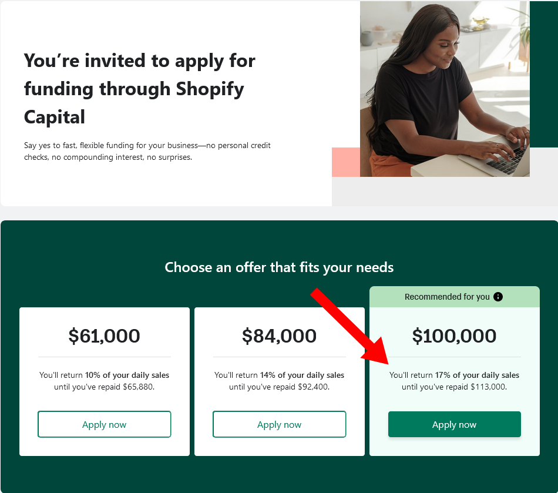



**New here?**

Hi, I'm Michael. I'm a software developer and the founder of [TinyPilot](https://tinypilotkvm.com), an independent computer hardware company. I started the company in 2020, and it now earns $60-80k/month in revenue and employs seven other people.

Every month, I publish a retrospective like this one to share how things are going with my business and my professional life overall.


## Highlights

- I frantically tried to come up with $250k for a large expense.
- I evaluate how a contract manufacturer will change my finances.
- Outsourcing to a 3PL vendor is less expensive than I expected.

## Goal Grades

At the start of each month, I declare what I'd like to accomplish. Here's how I did against those goals:

### Onboard the newest TinyPilot employee

- **Result**: Newest employee is fully spun up.
- **Grade**: A

TinyPilot's newest employee is fully trained and can build Voyager 2a devices. The additional capacity is helping us get back to feeling ahead on inventory instead of scrambling to keep up with orders.

One thing I didn't consider was that office space becomes a bottleneck with three people. With two people working 20 hours per week, they can share a single office easily without overlapping. With three people, space isn't exactly a problem, but we have to plan more to avoid shifts colliding.

### Reach $90k in revenue

- **Result**: Reached $92k in revenue.
- **Grade**: A+

Now that we're no longer constrained by manufacturing capacity. I've increased ad spending and [fixed our Amazon listing](/retrospectives/2023/01/#adapting-to-the-shortage).

The problem with Amazon is that the only way to get them to show a "Buy" button on TinyPilot listings again was to lower our Amazon price to match our website price. Now, customers are much more incentivized to choose Amazon over purchasing from us, so we're seeing a greater share of Amazon purchases and losing a higher fee to Amazon.

### Find three homelab bloggers or YouTubers interested in reviewing TinyPilot Voyager 2a

- **Result**: Found 2.5 people interested in reviewing TinyPilot.
- **Grade**: B+

I reached out to three YouTubers. Two of them are interested and plan to feature TinyPilot in a video. The third doesn't do reviews but is open to giving TinyPilot a cameo if they can find a use for it.

## [TinyPilot](https://tinypilotkvm.com/) stats



| Metric                   | April 2023     | May 2023       | Change                                             |
| ------------------------ | -------------- | -------------- | -------------------------------------------------- |
| Unique Visitors          | 6,560          | 7,773          | +1,213 (+18%)           |
| Total Pageviews          | 15,034         | 17,220         | +2,186 (+15%)           |
| Sales Revenue            | $82,060.84     | $89,569.49     | +$7,508.65 (+9%)        |
| Enterprise Subscriptions | $290.70        | $290.70        | 0                                                  |
| Royalties                | $2,369.08      | $2,597.71      | +$228.63 (+10%)         |
| Total Revenue            | $84,720.62     | $92,457.90     | +$7,737.28 (+9%)        |
| **Profit**               | **$10,295.55** | **$24,034.74** | **+$13,739.19 (+133%)** |

The numbers are all up this month, so that's a good sign. They're still somewhat within the noise of TinyPilot's monthly fluctuations, but the general trend is positive.

The increase in views and revenue comes largely from increased investment in advertising. I hope to increase this even more in the coming months as I send the Voyager 2a to additional bloggers and YouTube creators.

## How do I come up with $250k in cash?

My next major task for TinyPilot is to transition our in-house manufacturing process to a contract manufacturing firm.

At the beginning of May, I reached the price quote stage with a contract manufacturer I'd been talking to for several months. They could build the Voyager 2a for about $110 per unit, including everything except the Raspberry Pi. Raspberry Pis cost $45/unit, so it would be about $155/unit total.

My costs now are around $110/unit in materials and another $5/unit in labor. That means the contract manufacturer would be a $40 (35%) jump in cost, but it still felt worth it. With a contract manufacturer, we wouldn't have to maintain a physical office anymore, we wouldn't need to manage inventory for all of our raw materials, and we could easily scale up production without hiring more people.

I felt fine with $110/unit until I did the math on the total. The contract manufacturer needed me to commit to a minimum of 2,000 units. $110/unit \* 2,000 units is $220k!

Including the Raspberry Pis for the first batch, I'd need to come up with about $250k in cash to pay for this order.

To be clear, this is money I'd be spending anyway. Last year, I spent [$334k](/solo-developer-year-5/#tinypilot-grew-annual-revenue-to-812k) on raw materials, but I paid for everything in small chunks throughout the year. With the shift to the contract manufacturer, I'd be consolidating most of my materials and manufacturing costs, but I'd be paying six to eight months of it at once.

Where was I going to get $250k in cash?

Shopify, Amazon, and Mercury are always bombarding me with offers for eCommerce loans, so I finally read some of the details. They'll loan you some multiple of your monthly revenue, charge an origination fee of 5-15%, and then take an ongoing 10-20% of your revenue until you pay off the loan.

{{}}

If I took a $100k loan from Shopify, it would cost me $13k, and I'd pay off the loan in about seven months. But that's longer than I'd need the loan. My monthly revenue is about $90k. If all of my materials and manufacturing bills were already paid, I'd only have about $25k/month in expenses, leaving $65k/month in cash profits. I'd only need the loan for a month or two, so $13k is a bit steep.

I think I could take out a loan from a bank, but I suspect that's a pretty long, paperwork-intensive process. That probably costs a few thousand dollars as well, and I doubt traditional banks offer two-month loans.

The situation reminded me of an event from my adolescence. Real estate developers were trying to tear down my beloved community center to build a shopping mall. My breakdancing crew put on such a phenomenal dance show that attendees gave us $200k in donations, exactly the amount we needed to protect the community center.

I called Al, a friend from my old dance crew, to see if he'd participate in another breakdancing performance for TinyPilot. Irritatingly, he pointed out that neither of us know anything about breakdancing and that I seemed to be describing the plot of the 80s movie, [_Breakin' 2: Electric Boogaloo_](https://www.imdb.com/title/tt0086999/).

{{}}

So, that plan was out.

At the next meeting with the contract manufacturer, I asked the CEO if there were other ways of structuring the deal so that I'm not paying $250k up front, adding that it's almost a year of expenses for me. He chuckled and clarified that he wasn't expecting the full $250k at once.

It turned out that the contract manufacturer was willing to absorb the up-front costs. As long as I signed a purchase order agreeing to purchase the full 2,000 units within a year, the deal worked for him.

So, I'm likely going to start with an order of about 500 Voyager 2a units. That means I'd owe the contract manufacturer roughly $55k. I'd still owe $34k for the Raspberry Pis, but the total would be around $90k up front, which is much easier to swallow.

## How does a contract manufacturer change finances?

When I calculated the $250k, I had a bit of a panic about how such bursty costs would mess with TinyPilot's finances. Now that I understand we don't owe the full amount up front, I realize the contract manufacturer will be better for TinyPilot's finances than our current system.

### Cash flow

Under TinyPilot's current system, our materials and manufacturing costs are spread out over months or sometimes even years. For example, in February 2022, I spent $20k stockpiling critical electronic components, and we're still working our way through that batch. That's $20k tied up for 14 months and counting.

Stockpiling electronic components has the longest payback period, but TinyPilot has several expenses that tie up cash for months. We pay a 30% deposit on metal cases three months before we receive them and then the last 70% when they're ready to ship. We receive the cases in batches of 1,000 at a time, so it takes us three months just to assemble them all into devices. That means that it can take four to six months for us to earn back the cost of the cases by selling devices.

With the contract manufacturer, payment is due 30 days after they ship the order. That's a much tighter turnaround between the time I pay for materials and the time I turn a profit by selling the finished product. If the order arrives at the warehouse in a week, I have almost three full weeks of selling the finished units before I even have to pay for them.

### Cost tracking

Our current system makes it difficult to track costs associated with building a particular TinyPilot device.

For example, the $20k batch of electronic components I mentioned above had lots of additional costs along the way just to be available in various stages of our production:

| Expense                                                                         | Cost (from memory) |
| ------------------------------------------------------------------------------- | ------------------ |
| Tariff on importing the components to the US                                    | $5,000             |
| Shipping the components to our hardware consultants for initial production runs | $300               |
| Inventorying the components to ship to the manufacturer                         | $750               |
| Shipping the components to our manufacturer in China and paying tariffs again   | $1,200             |

Once it reached our manufacturer in China, we paid to have the manufacturer assemble the components into PCBs. The manufacturer shipped the PCBs to the US, and we paid another tariff. And then there's a labor cost on our side to assemble the PCBs and other components into a Voyager 2a device.

So how much did it cost to produce a particular Voyager 2a device? I'm sure I could figure it out if I had a way of attributing every cost along the way to a particular batch of components, but we don't have tooling that supports anything close to that.

When we move to a contract manufacturer, our manufacturing costs boil down to just three expenses:

1. The price I pay per unit to the contract manufacturer.
1. The price I pay per unit for Raspberry Pis.
1. The shipping cost from my manufacturer to the fulfillment warehouse.

The contract manufacturer's factory is in Vietnam, and the US supposedly has no import tariffs on electronics from Vietnam. I say "supposedly" because I'm reserving confidence until I go through the actual import process. If it's true, it cuts out another big expense and further simplifies cost tracking.

## How much does a 3PL vendor cost?

One of TinyPilot's major projects this year has been transitioning order fulfillment from our home-rolled solution [to a third-party logistics (3PL) vendor](/retrospectives/2023/05/#getting-over-the-3pl-hump).

As the sole founder of TinyPilot, I'm mainly constrained by time. I was eager to shift to a 3PL because it [reduces complexity of what happens within TinyPilot](/retrospectives/2022/10/#packing-and-shipping-customer-orders). Given the value, I expected to pay around $20 per order to the 3PL vendor, but it ended up being much cheaper.

Here's the cost breakdown from the first full month of working with the 3PL for all of our orders:

| Charge                                        | Cost                          |
| --------------------------------------------- | ----------------------------- |
| Shipments from TinyPilot to 3PL               | $560                          |
| Warehouse storage                             | $28                           |
| Software license fee                          | $45                           |
| Time receiving inventory                      | $288                          |
| Order picking                                 | $336                          |
| Communication                                 | $72                           |
| Payment processing fee                        | $10                           |
| **Total (w/o postage or shipping materials)** | **$1,585 ($8.86 per order)**  |
| Shipping materials                            | $223                          |
| Postage                                       | $2277                         |
| **Total**                                     | **$4,085 ($22.82 per order)** |

I split out postage and shipping material because we'd incur those expenses anyway. We pay slightly more because the 3PL adds a markup of 15% or about $1 per order.

In total, the 3PL's costs work out to about $9 per order before postage and shipping materials, which is lower than I expected. It's more expensive than doing it in-house, but it gets us closer to not needing our office, which would cut about $750 in monthly expenses.

Using a 3PL also improves cash flow a little bit. When TinyPilot was doing its own fulfillment, we had to pay for shipping materials in advance and then labor and postage as they occurred. With the 3PL, we get an invoice at the end of the month, and we have a month to pay it. In other words, for an order that the 3PL processed on May 1st, I pay on June 30th, so the 3PL allows TinyPilot to hold cash longer.

## Side projects

### Poster generators in WanderJest

In early 2020, [I created WanderJest](/retrospectives/2020/01/), a business that was supposed to help comedy fans find live comedy. I shuttered it when COVID hit, but I've been tinkering with it on weekends for the past few months.

The problem with listing live comedy shows was that it's labor intensive. Show producers typically announce their shows on places like Facebook or Eventbrite, and both platforms are actively hostile to automated tools consuming the data. To list show information on WanderJest, I had to look on other platforms and copy all the details by hand.

I wanted to encourage comedians to enter information about their own shows. If it's extra work, they're not going to do it, so I've been looking for ways that WanderJest can improve tasks comedians are already doing and capture show information as a side effect.

I frequently see comedians do this thing on social media where they'll post an image with a list of their upcoming shows:

{{}}

From the looks of it, the comedians seem to be creating these images by hand using general-purpose image editing tools. As show details changed, the comedians would sometimes clunkily edit on top of their previous image, presumably because they didn't have a way of going back and editing the original.

My idea was to create a specialized tool for creating these images. It would save comedians' data so they could edit it later and produce updated images as they added shows to their schedule.

If my tool was easier to use and produced better output than general-purpose tools, comedians would use it. It would drive people to WanderJest, and it would be a way for WanderJest to get information about shows.

I spent a Saturday learning about the `<canvas>` element in browser APIs and threw together this prototype:



There was one comedian that I'd met a couple of times, and I'd seen her post images like this. I sent her a Facebook message showing her the tool, and she said it looked great! The next day, she posted another image of her upcoming shows using a general-purpose image editing tool...

So, no successful adoptees yet, but I'm going to try it with a few more comedians before I give up on the idea.

## Wrap up

### What got done?

- Onboarded a new TinyPilot employee
- Reached out to three YouTube creators about TinyPilot
- Published [a tutorial about deploying Syncthing on Fly.io](/syncthing-on-fly.io/)

### Lessons learned

- When switching to outsourced vendors, consider the impact on both cost and cash flow.
  - With the 3PL, costs increased, but cash flow also improved slightly.
  - With the contract manufacturer, our manufacturing costs will become more bursty, but cash flow will improve substantially.

### Goals for next month

- Start a manufacturing batch with a new contract manufacturer.
- Publish TinyPilot Pro 2.6.0.
- Reach $95k in revenue.
