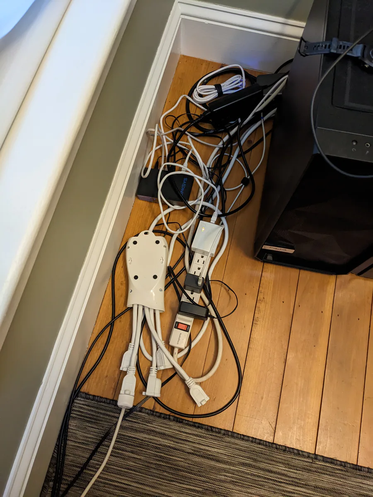
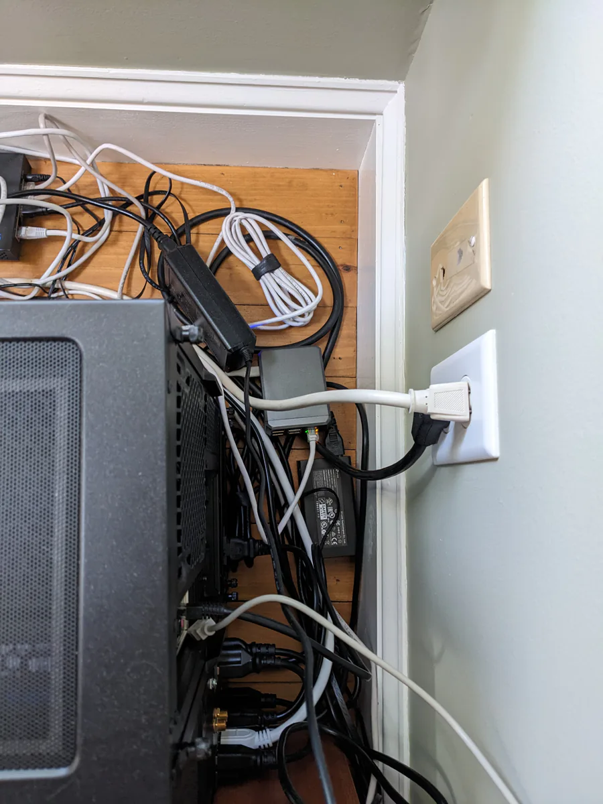
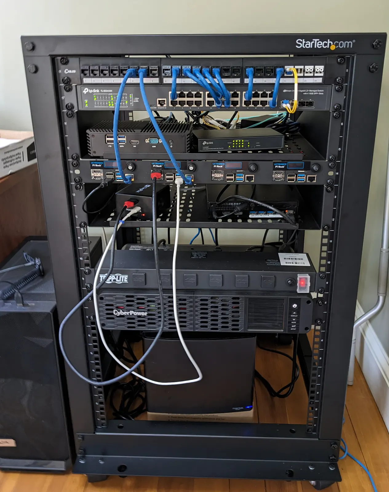



**New here?**

Hi, I'm Michael. I'm a software developer and the founder of [TinyPilot](https://tinypilotkvm.com), an independent computer hardware company. I started the company in 2020, and it now earns $60-80k/month in revenue and employs seven other people.

Every month, I publish a retrospective like this one to share how things are going with my business and my professional life overall.


## Highlights

- I'm trying to figure out where I'm spending unnecessary time on TinyPilot.
- I realized I've once again become addicted to email.
- I built my first server rack.

## Goal Grades

At the start of each month, I declare what I'd like to accomplish. Here's how I did against those goals:

### Start a manufacturing batch with a new contract manufacturer

- **Result**: The first manufacturing batch has started.
- **Grade**: A

I signed the purchase order with our contract manufacturer, so the wheels are now in motion for our first production batch. It's scary because it's going to be the biggest single change to the business we've ever done. If it goes well, it will be great. If it goes badly, it will be catastrophic. I'm hoping for the former.

### Publish TinyPilot Pro 2.6.0

- **Result**: Published TinyPilot Pro 2.6.0 on schedule.
- **Grade**: A

Our June release went smoothly but felt underwhelming. A lot of our dev effort the last two releases has focused on making updates simpler and less error-prone. The changes have made the software significantly more maintainable, but that doesn't sound exciting in a release announcement.

### Reach $95k in revenue

- **Result**: Reached $93k in revenue.
- **Grade**: C

TinyPilot's earnings were fairly flat. A new review [came out](https://www.youtube.com/watch?v=tx724dhxGxc) but it got a tepid response, so we saw fewer sales than I hoped.

## [TinyPilot](https://tinypilotkvm.com/?ref=mtlynch.io) stats



| Metric                   | May 2023       | June 2023        | Change                                           |
| ------------------------ | -------------- | ---------------- | ------------------------------------------------ |
| Unique Visitors          | 7,773          | 8,300            | +527 (+7%)            |
| Sales Revenue            | $89,569.49     | $88,378.45       | -$1,191.04 (-1%)        |
| Enterprise Subscriptions | $290.70        | $290.70          | 0                                                |
| Royalties                | $2,597.71      | $4,399.66        | +$1,801.95 (+69%)     |
| Total Revenue            | $92,457.90     | $93,068.81       | +$610.91 (+1%)        |
| **Profit**               | **$24,034.74** | **$27,553.68**\* | **+$3,518.94 (+15%)** |

\* Profit is a naïve calculation based on my change in cash holdings over the month. I'll update it after I do real bookkeeping mid-month.

Almost every metric was flat this month. One of my marketing pushes fell flat, but I'm still optimistic about others I have cooking.

TinyPilot's ad effectiveness decreased substantially. In May, we made $3.64 in revenue for every $1 in ad spend. In June, each dollar of ad spend only got us $2.62 in revenue. Considering that $2.62 of revenue costs about $0.90 in materials, our ads are still profitable but the margins are slimmer.

I'll give the ads another month. If performance doesn't improve, I'll book some time with TinyPilot's marketing consultant to see what we can fix.

## Where does my time go?

At a recent indie founder meetup, I mentioned that my biggest challenge was finding time for [tasks that are important but non-urgent](/book-reports/7-habits-of-highly-effective-people/#habit-3-put-first-things-first).

The other meetup attendees were surprised. I've been running TinyPilot for three years, and the business sounds like it should be easy to manage: we make the same product every day &mdash; when customers place an order, we ship it out. Why couldn't I just automate or delegate everything? What required my attention specifically?

Last year, I found it useful to [evaluate how I was spending my time](/retrospectives/2022/02/#how-can-i-manage-tinypilot-with-only-20-hours-per-week), so I'm repeating the exercise.

Here are the tasks that occupy most of my time as TinyPilot's founder.

### Task 1: Coordinating changes

When TinyPilot's team grew past two people, I realized that one of my main responsibilities was to coordinate changes.

TinyPilot grows in multiple dimensions in parallel: we improve the software, we improve the hardware, we integrate new vendors, we addi more team members, etc. Changes to one area of the buisness typically have ripple effects that impact other parts. As TinyPilot has grown in headcount and complexity, the ripple effects have become more frequent and significant.

#### How I can reduce my time here?

Some of the other attendees at the meetup suggested that I should just hire a manager. That's harder than it sounds.

TinyPilot has three teams composed of two to three people each: software development, support engineering, and customer service / local operations. The three teams have mostly disjoint responsibilities.

If I hired someone to manage only one of TinyPilot's team, that wouldn't save much time. If I hired someone to manage all three teams, they'd need experience managing a software team, so they'd probably need a salary of $125k/yr or more. That means the cost to hire that person would be at least $200k/yr, which would consume all of TinyPilot's current profits.

The best solution I can think of is the same as last year: [juggle fewer projects, and look for more opportunities to delegate](/retrospectives/2022/02/#how-can-i-spend-less-time-coordinating-changes).

There are some tasks that I take on because I notice parts that I can't delegate. For example, if a task consists of subtasks A, B, and C, and part B involves signing a contract on behalf of TinyPilot, I think, "Oh, I'm the only one who can do that." In some of those cases, I can delegate out tasks A and C, but I forget to consider the possibility.

The other solution is pushing more work to vendors and reducing the set of things TinyPilot does in-house. This year, we stopped doing our own fulfillment and transitioned the work a third-party logistics (3PL) vendor. That's made it harder to handle edge cases, but it eliminated entire categories of work we were managing before.

### Task 2: Managing the relationship with our 3PL partner

I expected that the work of transitioning to a 3PL vendor would be heavily front-loaded. I knew it would be hard to pick a vendor and make the switch, but I thought after that would mostly be smooth sailing.

I'm finding that there's still a long tail of little workflows we still need to figure out with the 3PL vendor:

- How do we keep track of inventory as it travels from our office to the 3PL warehouse?
- How do we verify that the 3PL isn't losing inventory at their warehouse?
- How do we resolve issues when the 3PL ships the wrong items in an order?
- How do we handle customers who want same-day shipping?

These are solvable problems, but we continue to hit new issues, so I spend a lot of time thinking about our 3PL.

#### How I can reduce my time here?

This is an area where I should be delegating more to the rest of the team.

I've started asking TinyPilot's local staff to become more active in managing the 3PL relationship, and that's working.

Previously, for something like the problem of preventing the 3PL from losing inventory, I'd define a process for auditing their inventory reports and reconciling the numbers with our sales records. Instead, I asked a member of the local staff to do that, and I gave high-level feedback on the process rather than defining everything myself.

### Task 3: Overseeing dev work

I spend a lot of time overseeing dev work because the software is the part of TinyPilot I enjoy most. I'm still a developer at heart even though I don't get to spend much time writing code.

When I have a few hours free, I often spend them fixing a small bug or tidying up the code in some way. But sometimes seemingly small changes [balloon into days of work](https://github.com/tiny-pilot/tinypilot/pull/1352).

#### How I can reduce my time here?

This one's hard because the obvious solution is, "Michael should stop writing code."

But I _like_ writing code...

The more practical solution is that I should be more conservative in what tasks I take on. I should limit my dev work to:

- Improvements to developer experience like better documentation, improved tests, or new convenience scripts
- Changes where my historical knowledge or context within the company makes it easier for me to make the change directly than to define the change for someone else
- Experimental changes that are beneficial if they work but I can throw them away if they don't

### Task 4: Reviewing documentation

In addition to providing day-to-day customer support, the support engineering team also writes documentation and tutorials. I'm particular about public-facing documentation, so I spend a lot of time reviewing the team's writing and giving feedback about style, clarity, and level of technical ability to target.

Reviewing documentation doesn't take a lot of wall clock time, but it requires a lot of my focus. I find it mentally draining to be clear in my own writing &mdash; it's even harder for me to read someone else's writing and articulate what I think is missing or unclear.

I often end up the bottleneck on documentation tasks because even if I have a free hour to review a new tutorial, I often don't have the mental focus to give useful feedback.

#### How can I reduce my time here?

The easiest change I can make here is to make more use of peer reviews. On the dev team, the software engineers review 90% of each other's code without me having to be involved. It's harder to coordinate a consistent style for written English than it is for code, but I think we can get to 80% of the work happening in peer review.

The other change I should make is taking my own bandwidth into account when assigning documentation tasks. I previously would add three tutorials in a row to the support engineering team's task queue, but then I wouldn't have capacity to review everything at once. I should space out documentation tasks more so I have time to review.

## Getting out of email addiction

Over the last few years, I've oscillated between having a healthy relationship with email and having an unproductive addiction to email.

### How did I lose my good email habits?

Once I have healthy email habits, it's generally easy to keep them up. What typically knocks me out of my healthy habit is an event that gives me a legitimate reason to watch my email aggressively.

Recently, the vendor that manufactures TinyPilot's metal cases ran late, and we ran out of cases. Running out of cases is a huge pain, as it prevents us from assembling new devices. That means I need to scramble to reassign tasks to the local team, and their new tasks have to be things that they can drop on the floor again in a few days when we (hopefully) get cases.

In situations like a case shortage, there's a legitimate need to check email obsessively. If the vendor in China emails me on a Friday evening, and I let the email sit until Monday morning, they won't see my response until Tuesday morning in China. That's a three-day delay, which translates into three more days that the local team can't build new devices.

The problem is that after the emergency situation is over, I retain the habit of checking my email constantly. And when I check my email and find nothing urgent, I still crave the dopamine hit, so I check social media. That's never productive. Instead of taking a 30-second break to check email, I've taken a 10-30-minute break to check social media.

### Solution 1: Only check email during scheduled email time

Historically, the way I break out of a bad email habit is by mapping out my day explicitly.

Each morning, I split my workday [into 30-minute blocks](/eliminate-distractions/#schedule-time-for-email-texts-and-social-media) and decide how to spend each block. To avoid checking email compulsively, I schedule time for reading and responding to email instead of letting emails be a background hum throughout the day.

I need to force myself to get back in this habit. It's easy to keep up once I'm in the rhythm but hard to get into that rhythm. In the past, I grind out the first few days and then it becomes easier and rewarding enough that I don't have to rely on willpower.

### Solution 2: Encourage retroactive feedback

As I write this, it's 10 AM, and I've resisted checking my email so far today. But I have the burning feeling that I'm blocking work.

I think the reason I feel that way is that it's common for my teammates to ask me for feedback on support tickets, which is something I've encouraged. I'm realizing that the downside is that it makes my inbox more time-sensitive than it needs to be. Instead of the ticket being blocked on when either of the two support engineers have time, it's now blocked on me and the specific support engineer who escalated to me. I then feel like I have to respond quickly to avoid making the customer wait for days.

One option we've never tried is "parallel escalation." Instead of pausing a support ticket to wait for my feedback, I want to encourage people to continue working with the customer and asking me in parallel if I have feedback.

### Solution 3: Empower my teammates to use peer review more

I mentioned peer reviews when discussing [documentation review](#how-can-i-reduce-my-time-here), but I should be looking for more opportunities for peer review across all types of work. It makes sure people develop skills alongside their teammates, and it reduces tasks that are blocked on me specifically.

## Side projects

### Building my first home server rack

Ever since building [my first homelab server](/building-a-vm-homelab-2017/), my office has accumulated a collection of servers and networking equipment.

My fiancé has pointed out that my office gets dirty because I have wires everywhere that discourage vacuuming. I thought, "What? No, this is a normal amount of wires." But then I started looking at them and realized it was kind of a lot of wires...


{{}}
{{}}


It occurred to us that I could make both of us happy by building a server rack. I'd enjoy a fun homelab project, and she'd appreciate the tidiness of having all the wires in a self-contained unit.

So, I built my first server rack. It was fun to build, and it does make everything a lot tidier. With everything stacked vertically, there are fewer wires on the floor, and the whole thing moves on wheels for easy cleaning.

{{}}

I'm using a [managed switch and VLANs](/notes/debugging-vlans-tp-link/) for the first time. At first, I found VLANs too cumbersome and hard to debug. Now that I've got the basics, I enjoy them and want to make VLANs for everything.

I'm working on a longer writeup about how I chose all the components and what mistakes I made, so stay tuned.

### Learning Nix

[Nix](https://nixos.org/) has been at the top of my list of interesting-looking technologies for the past year, so I recently invested some time into learning more about it.

I wrote up [notes about my first experiences with Nix](/notes/nix-first-impressions/), and they unexpectedly got a lot of attention on [Hacker News](https://news.ycombinator.com/item?id=36387874) and [Twitter](https://twitter.com/deliberatecoder/status/1670241507486441473). People in the Nix community have been reaching out to me and offering to help me with the parts where I got stuck.

The results have encouraged me to capture more of my [notes](/notes/) when I'm experimenting with technologies that I don't fully understand.

### Implementing an authentication library for Go

When I started making web apps in 2018, I didn't want to roll my own authentication, so I always used third-party services.

Third-party authentication services worked okay, but it limited my adoption of my open-source projects. Other developers could only deploy my apps if they also used the same authentication service I used.

The other problem with third-party authentication is that it makes end-to-end tests slower, less reliable, and more complex.

For my most recent project, [ScreenJournal](https://thescreenjournal.com/), I looked for a way to avoid a third-party service for authentication. I began by surveying [what authentication libraries were available](https://github.com/avelino/awesome-go#authentication-and-oauth). My requirements were:

1. It had to be open-source.
1. It had to use Go, my current language of choice for web apps.
1. It had to be a library I build into my app rather than a separate service that runs alongside my app.
1. It had to support SQLite as a datastore.

[goth](https://github.com/markbates/goth) (formerly gomniauth) seems to be the most popular authentication library, but it breaks requirement (3), as it depends on external third-party services.

The other popular Go authentication solution is [authboss](https://github.com/volatiletech/authboss). It meets all my requirements, but the documentation is pretty sparse. That turned out to be [an intentional choice the author made](authboss-support.png) to limit support requests.

I spent an afternoon trying to implement a simple web app with authboss, but I [couldn't even get the basics working](https://github.com/mtlynch/authboss-minimal/pull/6/files). The more I learned about authboss, the less it seemed to match what I wanted from an authentication library. It seems to expect clients to use authboss not only for authentication but also for page rendering and URL path routing, which is more than I want an auth library to handle.

Now, I'm trying to create my own reusable authentication library. I'm not trying to make it a popular open-source package, just something that saves me from copy/pasting a bunch of auth code across all of my hobby projects.

So far, all it can do is [check if a user's password is correct](https://github.com/mtlynch/screenjournal/blob/02b1c3cdce132380f3f219c924481d88dc198b3b/auth/simple/authenticator.go). It's not reusable yet because the client still [has to create the password hash](https://github.com/mtlynch/screenjournal/blob/02b1c3cdce132380f3f219c924481d88dc198b3b/auth/auth.go), and I want that to be the auth library's job.

Developing a resuable authentication library is an interesting challenge because it forces me to use Go features I don't normally use. It also stretches my architecture skills because I have to weigh tradeoffs between the library simplifying things vs. being more flexible to different forms of authentication.

## Wrap up

### What got done?

- Started working with a contract manufacturer on their first production batch of TinyPilot Voyager 2a devices.
- Built my first home server rack.
- Learned the basics of Nix and NixOS.

### Lessons learned

-
- Server racks are fun for homelab nerds and their significant others.

### Goals for next month

- Reach $98k in sales revenue.
- Stay on schedule for TinyPilot's shift to our contract manufacturer.
- Spend less than 40% of my time on email.
