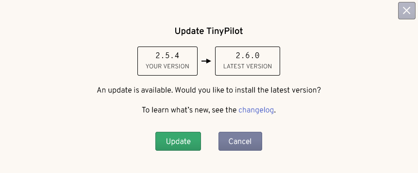
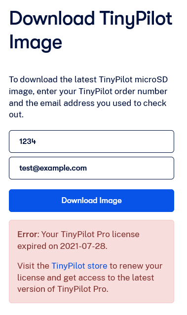



**New here?**

Hi, I'm Michael. I'm a software developer and the founder of [TinyPilot](https://tinypilotkvm.com), an independent computer hardware company. I started the company in 2020, and it now earns $60-80k/month in revenue and employs seven other people.

Every month, I publish a retrospective like this one to share how things are going with my business and my professional life overall.


## Highlights

- I think through what it would take to add recurring subscriptions for TinyPilot Pro.
- I've done some more exploration into [Nix](https://nixos.org/) for managing development environments.

## Goal Grades

At the start of each month, I declare what I'd like to accomplish. Here's how I did against those goals:

### Reach $98k in sales revenue

- **Result**: Revenue dropped 10% to $84k
- **Grade**: C

Our revenue dropped even though we had several new positive reviews:

- [RaidOwl](https://www.youtube.com/watch?v=ceWNyZno7FI)
- [Home Network Guy](https://youtu.be/QsTAKeK0M4s) (and accompanying [blog post](https://homenetworkguy.com/review/remote-control-a-pc-or-server-with-tinypilot-voyager-2a/))
- [Network Profile](https://blog.networkprofile.org/tinypilot-2a/)
- [Botio Studio](https://youtu.be/E94A6EasaSs) (Chinese)

We lost a chunk of sales because Amazon downranked our listings through their Kafkaesque account health policies. We're now back in their good graces, and sales have picked up again.

I've also heard from other founders that they see a regular summer slump around this time. And TinyPilot indeed had an [11% revenue drop in July 2022](/retrospectives/2022/08/).

### Stay on schedule for TinyPilot's shift to our contract manufacturer

- **Result**: The schedule has now slipped three weeks.
- **Grade**: D

The manufacturing schedule slipped, as downstream vendors of the contract manufacturer need more time to produce components like power adapters and USB cables. We still have about three weeks of buffer before we reach zero inventory during the transition, but it's getting a bit dicey.

This wasn't a well-designed goal, as I didn't choose the deadline, and I have limited control over it. The most I can really do is prevent things from being blocked on TinyPilot's side and hold the contract manufacturer to their schedule.

### Spend less than 40% of my time on email

- **Result**: Spent most of my time on email.
- **Grade**: F

I ended up spending way more of my time on email than I expected. I had some vacation travel in July, and I didn't take into account how much email debt I'd acrrue on my days off.

Ultimately, I spent most of my time this month responding to emails and reviewing my teammates' work.

## [TinyPilot](https://tinypilotkvm.com/?ref=mtlynch.io) stats



| Metric                   | June 2023      | July 2023        | Change                                         |
| ------------------------ | -------------- | ---------------- | ---------------------------------------------- |
| Unique Visitors          | 8,300          | 7,800            | -500 (-6%)            |
| Sales Revenue            | $88,378.45     | $79,635.02       | -$8,743.43 (-10%)     |
| Enterprise Subscriptions | $290.70        | $290.70          | 0                                              |
| Royalties                | $4,399.66      | $3,777.52        | -$622.14 (-14%)       |
| Total Revenue            | $93,068.81     | $83,703.24       | -$9,365.57 (-10%)     |
| **Profit**               | **$30,907.55** | **$25,357.82**\* | **-$5,549.73 (-18%)** |

\* Profit is a naïve calculation based on my change in cash holdings over the month. I'll update it after I do real bookkeeping mid-month.

Despite revenue dropping, profit is still in the $20-30k range. The number is somewhat inflated because my expenses are artificially low. With the transition to the contract manufacturer, I'm winding down my own production, so I've stopped buying new materials.

I'm surprised to see website visitors down despite all the new reviews that came out. It looks like TinyPilot has probably saturated homelab reviews as a marketing channel for a while, so I should focus on other types of sales and marketing.

## How can TinyPilot increase recurring revenue?

Whenever TinyPilot's sales slump, I start to think more about recurring revenue. It sure would be nice to have a stable income without relying on constantly finding new customers.

I dread the day when everyone who wants a TinyPilot already has one. What will I do then?

My plan from the beginning was that TinyPilot _would_ have recurring revenue. Customers would buy the hardware once, and then they'd fund ongoing software development and technical support by renewing their software license once a year.

The problem is that I've never set up TinyPilot to collect recurring revenue from customers. Three years in, we barely have any recurring revenue outside of a few enterprise clients.

In this retrospective, I want to think about possible paths to increasing recurring revenue for TinyPilot.

## How TinyPilot Pro's licenses currently work

I began work on a premium version of TinyPilot's software a few weeks after I released the original DIY TinyPilot kits in 2020.

One of the first features I started building for TinyPilot Pro was license checking. If I was going to sell a paid version of the software, I needed a way to check whether the user's license was valid.

As I began designing the license-checking system, I realized it would take me months to write just that component while juggling all of my other responsibilities as a founder. If it took me three months to implement license management, I'd still have to spend two months implementing other premium features so customers would have a compelling reason to purchase TinyPilot Pro.

With the company only a few months old, I didn't want to slow down momentum so much by making users wait five months until the next release.

There's a [Basecamp](https://basecamp.com/) blog post that I can't find anymore where they talk about how they decided to start selling their SaaS product before they'd even written billing software. They reasoned that invoices for their software were due at the end of each month of service, so they had a month after their first sale to figure out how to collect the money.

I adopted a similar strategy for TinyPilot. I settled on [the honor system](/retrospectives/2021/01/#enforcing-software-licenses-via-the-honor-system) as a way of enforcing licenses with the expectation that I had a year to implement a real license management solution.

Now, it's three years later, and I still haven't made any progress on license enforcement for TinyPilot Pro.

## License enforcement at the worst possible time

We advertise to customers that TinyPilot devices come with 12 months of free updates. Our dirty secret is that once you have TinyPilot Pro installed on your device, you can keep updating the software forever through the device's web interface.

{{}}

TinyPilot Pro's software doesn't track whether it's associated with a valid license. There are users who purchased in August 2020 that are now in year three of their one-year license.

The vast majority of customers don't realize that their license expired at all. They assume, understandably so, that if TinyPilot continues delivering updates to their device, their license is still valid.

Customers do sometimes discover that their license expired, but it happens at an especially inconvenient time.

TinyPilot uses microSD cards for storage. microSDs are especially vulnerable to filesystem corruption. When the filesystem on a microSD goes bad, the only solution is to reflash the microSD from a TinyPilot Pro disk image.

In order to download a TinyPilot Pro image, customers enter their order details. Before serving the image, we check if the customer still has a valid license.

{{}}

From the customer's perspective, this is a terrible way to find out that their license expired. Their filesystem got corrupted, so TinyPilot has interrupted their work. To fix the issue, they have to physically walk over to the device, remove the microSD, and reflash it. And now we're shaking them down for more money?

If the customer doesn't want to buy a new image, we'll still give them access to an old image if they contact support. They still have to wait up to one business day for a response from us, which is bad if we're blocking their work.

This system isn't great for us either because requests for old TinyPilot Pro versions drain support resources. And once the customer gets a new image, they're back on the "free updates forever" train because they can keep updating the software from within the device's web interface.

## What would make recurring subscriptions worth the effort?

Any kind of license enforcement is going to be expensive. At a minimum, we'd have to add something to TinyPilot's web interface that allows customers to enter their license information, and then we need a server on the Internet that can decide whether the user qualifies for updates based on their license.

That's expensive to implement because it's several weeks of dev work, and it increases support load when users inevitably email us saying they can't access updates because they deleted the TinyPilot email with their order information.

What if I go through all that effort and find that it has no impact on the renewal rate?

For license renewals to be worthwhile, they'd need to generate at least $30k/yr in additional profit. I estimate payment processing for licenses will cost about 3%, so each license renewal nets TinyPilot about $77.

To hit my target number of $30k/yr in additional profit from licenses, a minimum of 390 customers per year would have to renew their licenses each year (390 x $77 = $30k).

Since we launched in 2020, TinyPilot has sold around 5,000 devices total. We currently sell around 2,700 new devices per year. Getting to 390 paying subscribers means convincing just 7.8% of our existing users to pay for continued updates, which seems doable.

## How can I test customers' willingness to renew their licenses?

Okay, so I have to convince 7.8% of existing customers to purchase renewing licenses, but how can I find out if 7.8% is achievable without investing in a full-blown license management implementation?

### Forced factory resets

Earlier this year, we had to switch TinyPilot's base OS from Debian Buster to Debian Bullseye. The Raspberry Pi OS doesn't have a supported way to do major version upgrades, so we had to [force every user to manually reflash their microSD](https://tinypilotkvm.com/faq/update-to-bullseye) to make the migration.

I hated pushing that cost onto users, but we weren't able to find any other option. One positive side effect was that it ended the "free forever" update train. If a user's license was expired, they had to pay for a new 12-month license to continue receiving updates.

We rolled out this change on April 27th, so I compared license renewals three months before and three months after the change:

|                  | Licenses Sold                        | Licensing Revenue                        |
| ---------------- | ------------------------------------ | ---------------------------------------- |
| Jan 26 to Apr 26 | 33                                   | $2,400                                   |
| Apr 27 to Jul 27 | 55                                   | $4,469                                   |
| Change           | +22 (67%) | $2,070 (+86%) |

On the one hand, these changes are promising because forcing payment to upgrade led to a 67% increase in renewals. On the other hand, these changes are worrying because only 55 users renewed in three months. I estimate that around 2,500 devices have expired licenses, meaning that only 2.2% paid for an update.

There are a few factors that bias the rate of renewals lower than they might otherwise be:

- A lot of our work recently has focused on making the update experience faster and less error-prone. This is useful, but nobody wants to update for the sake of making future updates smoother.
- Upgrading as part of a factory reset is high-friction. Some users are likely foregoing the update because they don't feel like spending 20-30 minutes resetting their device.

### Manual expiration notices

I had an idea this month to try sending email notifications when customers' licenses had expired. This is something we could certainly automate, but before investing too much in automation, I tried sending out a few emails manually to see if anyone would respond or purchase based on my email.

{{}}

I sent seven emails in order to test out the idea, but none of the recipients renewed or responded to the email. It's too small a sample to draw conclusions. If I need 7.8% of customers to renew, then that's only one customer out of 12 or 13.

I'm reluctant to continue this experiment because there are a lot of factors working against it:

- The emails catch them at a time when they don't necessarily care about continuing to receive TinyPilot updates. If the prompt appeared in the TinyPilot web app when the user clicked the "Update" button, it would be a more meaningful test.
- Some customers purchased TinyPilot with email addresses that indicate they're secondary accounts for junk mail, so they might not even be seeing my note.
- These customers may notice that they can keep receiving new updates even if they don't pay for renewal, so they wouldn't have any incentive to renew.

### Add an auto-renew option

We currently only offer license renewals as one-time purchases. I haven't explored a recurring subscription option because Shopify only has native support for one-time purchases.

To collect recurring payments on Shopify, I'd need to use a third-party Shopify app, and I hate doing that. In my experience, Shopify apps are low-quality, and they require me to share broad access to my customers' information, including customers whose purchase never touches the third-party integration.

Still, compared to other experiments, an auto-renew option has a pretty good bang for its buck in terms of testing customers' willingness to subscribe. If I just added another option on the license purchase page, like "Or purchase a yearly subscription for 10% off," it would tell me whether any customers are willing to subscribe.

It would be relatively easy to add a subscription button, and we likely wouldn't have to change any of our other processes or systems because the subscriptions would just show up as regular Shopify orders.

## Side projects

### [What Got Done](https://whatgotdone.com)

I've been [experimenting with Nix](/tags/nix/) recently, and one of the features that interests me is `nix develop`. It lets you create a self-contained shell environment with exactly the dev tools you need to build and test your project.

One of the annoyances I run into with my various software projects is the difficulty of maintaining dependencies. My projects' dependencies are tied to specific versions like Go 1.19 or Node.js 16. Whenever I have to upgrade to the next version, it's a pain to figure out how to install it in my dev environment, then update the version numbers in my continuous integration (CI) configuration.

Worse, if I have multiple projects on the same system, updating Node.js for one project means that the other projects now have unexpected versions of Node.js and npm.

The promise of `nix develop` is that I could define the dependencies in one place: a [Nix flake](https://nixos.wiki/wiki/Flakes). If I needed to upgrade to the next version of Go, for example, I'd just update one file, re-run `nix develop`, and I'd have a local shell with the right version of Go. My CI environment would run the same version. The environment is local to the directory, so changing package versions wouldn't affect any other projects on the same system.

I started experimenting with `nix develop` in [What Got Done](https://github.com/mtlynch/whatgotdone/blob/dd3ea38885b04280bcea07f5294440e9a3521301/flake.nix) because it depends on Go and Node.js, and managing versions has been a pain point.

It's been interesting playing with Nix for What Got Done's development environments, but here are the roadblocks I've run into so far:

- I [couldn't figure out how to make Go static binary builds work](https://www.reddit.com/r/NixOS/comments/15d874l/trying_to_create_a_nix_flake_for_go_with_static/), and [the solution](https://github.com/mtlynch/whatgotdone/pull/884/files) feels kind of like, "You should just know this magic incantation."
- There's no easy way to specify an exact version of a dependency.
  - I expected to be able to declare versions similar to Docker, like `go:1.19.3`, but [Nix doesn't support those semantics](https://github.com/NixOS/nixpkgs/issues/9682).
  - For a tool that focuses so much on reproducibility, this surprised me.
  - The closest solution I've found is to [use a third-party tool](https://gist.github.com/toraritte/62e53be9e6d88d8b6b97391eb3c6558b#22-pin-nixpkgs-in-a-nix-expression) to find the nixpkgs hash associated with a package version, then pin your package to that nixpkgs hash. Here's what that looks like for [one of What Got Done's dependencies](https://github.com/mtlynch/whatgotdone/blob/67f098bace4c7d6302c193dc20e85d4e6a6761a2/flake.nix#L14-L18).
  - [Devbox](https://github.com/jetpack-io/devbox) solves this problem, but then you're only indirectly using Nix, and you have to learn to use Devbox's abstraction on top of Nix.
- Populating the Nix store is prohibitively slow.
  - There's a [`nixos/nix` Docker image](https://hub.docker.com/r/nixos/nix) that I can spin up pretty quickly in CircleCI, but building the Nix environment for my Nix+Go flake takes about two minutes.
  - This means that any CI step I run has to burn two minutes just initializing Nix.
  - I tried caching the Nix store, but it's about 3 GB, which CircleCI takes about two minutes to download and decompress. I believe CircleCI stores its cache files on Amazon S3, so performance is terrible unless the cache size is &lt;1 GB.

## Wrap up

### What got done?

- Published ["Installing NixOS on Raspberry Pi 4"](https://mtlynch.io/nixos-pi4/)
- Learned to use [hurl](https://hurl.dev/) to replace curl-based integration tests for HTTP APIs.
- Visited Charlotte, NC and Montreal, Canada.

### Lessons learned

- TinyPilot seems to have exhausted the marketing value we were getting from blog and YouTube reviews.
  - I'm seeing diminished returns for new reviews relative to the effect that new reviews had a year ago. It's definitely not the effect we saw [two years ago when a single review nearly tripled sales](/retrospectives/2021/02/#tinypilots-first-youtube-review).
- An auto-renewing TinyPilot license option is the best bang-for-buck way to test the market for recurring revenue.

### Goals for next month

- Shift manufacturing to our contract manufacturer as quickly as possible.
- Create a detailed plan for moving out of TinyPilot's local office.
- Test an option for auto-renewing TinyPilot licenses.

### Requests for help

- If you have experience (good or bad) with a third-party recurring subscription app for Shopify, especially for digital producs, shoot me an [email](/about/).
- If you can find [that Basecamp story](#how-tinypilot-pros-licenses-currently-work) that I partially remember, let me know in the comments.
