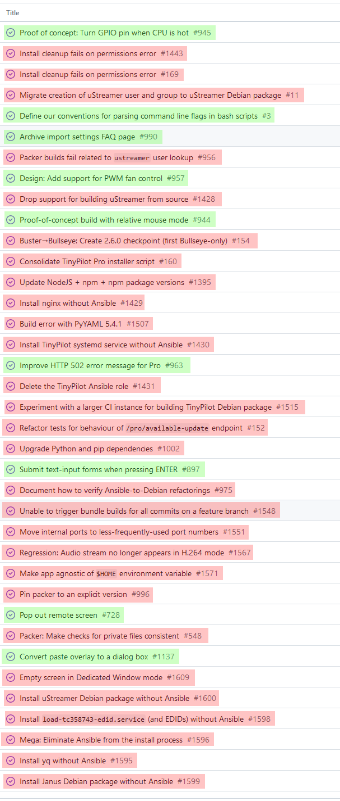
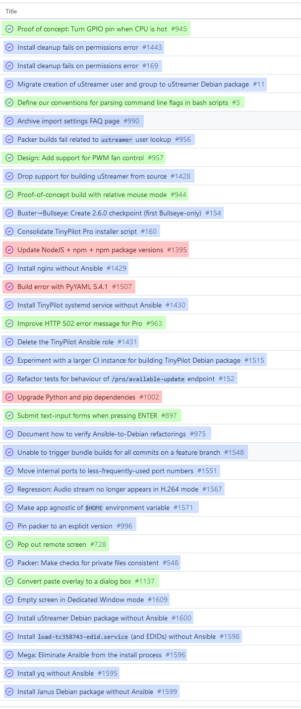



**New here?**

Hi, I'm Michael. I'm a software developer and the founder of [TinyPilot](https://tinypilotkvm.com), an independent computer hardware company. I started the company in 2020, and it now earns $60-80k/month in revenue and employs seven other people.

Every month, I publish a retrospective like this one to share how things are going with my business and my professional life overall.


## Highlights

- I failed to sell recurring TinyPilot license subscriptions.
- I realized I made TinyPilot way too configurable.
- I thought I'd been investing poorly into TinyPilot's development, but writing this retrospective made me realize I'm mostly on track.

## Goal grades

At the start of each month, I declare what I'd like to accomplish. Here's how I did against those goals:

### Shift manufacturing to our contract manufacturer as quickly as possible

- **Result**: I got the manufacturer unblocked quickly but missed opportunities to speed things up.
- **Grade**: B-

I prioritized giving quick, complete responses to the contract manufacturer anytime they were blocked on feedback from me, and I feel I did well in that regard.

I realized too late that I should have also been managing the project more proactively. The manufacturer has a project manager, so I assumed they were on top of things, but ultimately, I'm the one who has the most to lose if they run late.

When they'd ask for feedback about things like the box design or the instruction manual, I'd respond promptly and then forget about it until they followed up. I didn't realize until they were due to ship the final sample that I'd never seen a final draft of the box or instruction manual since giving feedback. The designs turned out to need more revisions, which delayed things unnecessarily.

### Create a detailed plan for moving out of TinyPilot's local office

- **Result**: We now have a month-by-month moveout plan with target dates and milestones.
- **Grade**: A

We have a plan, and everyone's on the same page regarding the schedule.

There's still a chicken-and-egg problem with some of the equipment I want to sell. Like if we sell the printer, how do we print shipping labels to sell anything else? But worse comes to worst, I just store the leftovers at my house and sell from here.

### Test an option for auto-renewing TinyPilot licenses

- **Result**: I evaluated several options but none of them worked well.
- **Grade**: B

I hoped to find a Shopify app that allowed me to sell [recurring subscriptions for TinyPilot Pro](/retrospectives/2023/08/#add-an-auto-renew-option), but I couldn't find any. More on this [below](#my-failed-attempts-at-recurring-subscriptions).

## [TinyPilot](https://tinypilotkvm.com/) stats



| Metric                   | July 2023      | August 2023    | Change                                          |
| ------------------------ | -------------- | -------------- | ----------------------------------------------- |
| Unique Visitors          | 7,800          | 6,900          | -900 (-12%)            |
| Sales Revenue            | $79,635.02     | $91,670.46     | +$12,035.44 (+15%)   |
| Enterprise Subscriptions | $290.70        | $290.70        | 0                                               |
| Royalties                | $3,777.52      | $2,969.62      | -$807.90 (-21%)        |
| Total Revenue            | $83,703.24     | $94,930.78     | +$11,227.54 (+13%)   |
| **Profit**               | **$26,359.62** | **$28,454.42** | **+$2,094.80 (+8%)** |

Things continue to be about steady in terms of revenue and profit. Revenue is up slightly over July, but I think that's primarily due to our Amazon listings being downranked for most of July.

## My failed attempts at recurring subscriptions

Last month, I tried to figure out ways to evaluate whether it was worth [enforcing TinyPilot's license restrictions more strictly](/retrospectives/2023/08/#how-can-i-test-customers-willingness-to-renew-their-licenses). I decided that the best bang-for-buck solution was to [offer an auto-renewal option](/retrospectives/2023/08/#add-an-auto-renew-option) for purchasing licenses.

Shopify has no native support for recurring subscriptions, so I had to search through the 50+ third-party Shopify apps that add this functionality. The problem is that almost all of them are designed for physical goods. The few that support digital products only work on a native Shopify store, which I [don't have](/tinypilot-redesign/#why-didnt-you-just-use-a-shopify-template).

Sidenote: Shopping for Shopify add-ons is _the worst_. Very few of them offer open demos, so the only way to see what they do is by actually installing them into your store and giving them full access to all of your products and customer data. I'm not willing to do this, so I used my dummy store with no actual customer data, but a lot of the functionality doesn't work without a fully populated store. And then, because the add-on has my real Shopify email address, I now get a ton of spam from apps I installed to a dummy store for an hour and then deleted.

My options at this point are:

1. Sell renewing subscriptions outside of Shopify entirely (e.g., with Paddle, LemonSqueezy, Stripe).
1. Convert TinyPilot's purchase flow to a native Shopify store and then revisit Shopify's third-party subscription apps.

(1) requires the dev team to build a lot of infrastructure to support an off-Shopify checkout and to make sure our support teams can still access customer information outside of Shopify.

(2) keeps everything consolidated in Shopify, but it's also a major project. The last time I asked someone for an estimate, they quoted me $20k for the conversion. It's something I'd like to do eventually because a native Shopify store would have lots of other benefits, but I don't have the bandwidth to take it on right now.

## Making TinyPilot less configurable

One of the biggest sources of technical debt for TinyPilot is [our use of Ansible](/solo-developer-year-5/#ansible-and-git-are-not-software-distribution-tools). When I created TinyPilot, I didn't know how to distribute software on Linux. I knew how to use Ansible, so TinyPilot's installer was a minimal shell script that started Ansible and then used Ansible to do the heavy lifting of the installation.

Over time, it became clear that Ansible was the wrong tool for the job. The more subtle mistake was that I'd made the installer too _configurable_.

When you're publishing Ansible roles, it's good practice to abstract away differences between operating systems and hardware architectures. For example, to copy a set of files to a directory, you don't just say, "Install everything to `/opt/whatever`." You say, "Install everything to `{{ my_target_dir }}`," and then in your `defaults.yml` file, you'd define `my_target_dir: /opt/whatever`. That way, if FreeBSD systems wanted you to install to a different location, you could override `my_target_dir` only on FreeBSD systems to point to something like `/usr/local/whatever`.

But TinyPilot supports just one OS and one hardware platform: Debian on the Raspberry Pi 4.

Out of habit, I'd abstracted away paths, names, and values into separate files, but it made our code much harder to reason about. To understand how Ansible would populate the variables in a real install, you often had to jump between three or more files.

Granted, there were users who appreciated this flexibility so that they could use TinyPilot [on systems that we don't officially support](https://github.com/tiny-pilot/tinypilot/discussions/755). Almost none of these users were paying customers, so we were incurring a significant cost to support flexibility when it wasn't serving the customers who fund TinyPilot's development.

In the [latest TinyPilot release](https://tinypilotkvm.com/pro/changes#261), we got rid of Ansible, but we also eliminated most configuration options outside of the web UI. There have been no reports of upgrade issues, which strongly suggests that none of our customers needed this configurability at all.

## Essential vs. accidental dev work for TinyPilot

In his famous essay, ["No Silver Bullet,"](https://www.cgl.ucsf.edu/Outreach/pc204/NoSilverBullet.html) Fred Brooks divides software work into "essential difficulties" and "accidental difficulties."

Essential difficulties include things like defining requirements and designing the UI. Even if you have perfect tooling and limitless resources, you can't create a useful application if you don't figure out what the software does or how the user interacts with it.

Accidental difficulties include things that we only have to do because of the limitations of our tools. For example, managing memory in C is something we wouldn't care about if we had automatic reference tracking or unlimited RAM.

I've been thinking about that essay a lot lately in terms of TinyPilot's dev work. A lot of what we're doing feels like accidental difficulties.

I divided the tasks from TinyPilot's last sprint into "essential difficulties" (green) and "accidental difficulties" (red):

{{}}

Nine tasks (24%) dealt with essential difficulty like adding or refining features, while 28 (76%) dealt with accidental difficulty like regressions, package updates, or refactoring.

I don't have a good way to scale effort by dev hours, but I suspect our accidental difficulty tasks took longer, on average, than essential difficulty tasks. We could be spending as much as 90% of our time on accidental difficulty.

## How do we reduce accidental difficulty?

As I thought about this breakdown more, I realized it doesn't quite match the way I think about TinyPilot's dev work. There are three categories I care about and roughly how much time I'd like to dedicate to each:

| Category                           | Ideal % of effort |
| ---------------------------------- | ----------------- |
| Improving the product              | 70%               |
| Automation and reducing complexity | 20%               |
| Regular maintenance                | 10%               |

The problem is that these numbers are hard to balance. Every new line of code increases maintenance cost. A 50,000-line codebase is going to require at least an order of magnitude more maintenance than a 3,000-line codebase.

Granted, the 20% investment in eliminating complexity should reduce maintenance costs, but it won't always offset the load from new features. Last year we added support for H.264 video, but we had to integrate [Janus](https://janus.conf.meetecho.com/), a third-party WebRTC server. WebRTC is extremely complicated, so that single feature increased our maintenance burden by 20-30% overnight.

Thinking about this more, maybe this is a good opportunity for [my 50% rule](/solo-developer-year-5/#run-at-50-capacity). We should spend 50% of our time improving the product, then perform necessary maintenance, then spend whatever's left over on automation and reducing complexity.

Revisiting the last release through that lens, we had:

| Category                           | # of tasks | % of tasks |
| ---------------------------------- | ---------- | ---------- |
| Improving the product              | 8          | 22%        |
| Automation and reducing complexity | 26         | 70%        |
| Regular maintenance                | 3          | 8%         |

{{}}

We were skewed toward automation because we made a big push to eliminate Ansible, but we were closer to my ideal split than I realized.

Viewing it through the three-category system, I feel like I am making dev investments in the right areas, as we can't infinitely expand features while keeping team size constant.

## Wrap up

### What got done?

- Published [TinyPilot Pro 2.6.1](https://tinypilotkvm.com/blog/whats-new-in-2023-09).
- Removed [Ansible from TinyPilot's install process](https://github.com/tiny-pilot/tinypilot/issues/1596), yielding a huge performance increase and reduction of complexity.
- Published ["_Aardvark'd_: The Fog Creek Documentary, 18 Years Later"](/aardvarkd/).

### Lessons learned

- You can't build new software features forever.
  - As a software project matures, you either have to add developers to handle the extra maintenance or shift focus more toward simplicity.
- Configurability creates subtle maintenance costs.
  - Every configuration option in a project makes behavior harder to understand and increases the cost of changes. Limit configurability to options that really need it.
- Don't assume a project manager is managing a project optimally.
  - I stopped thinking about project management for the shift to the contract manufacturer because they had their own project manager. In retrospect, I should have stayed on top of outstanding tasks more aggressively.

### Goals for next month

_This is kind of cheating because I'm writing this retrospective late in the month, so it's effectively goals for the next week._

- Shift manufacturing to our contract manufacturer as quickly as possible.
- Delegate tasks for clearing the TinyPilot office.
- Use up all remaining Raspberry Pis to build TinyPilot devices.
