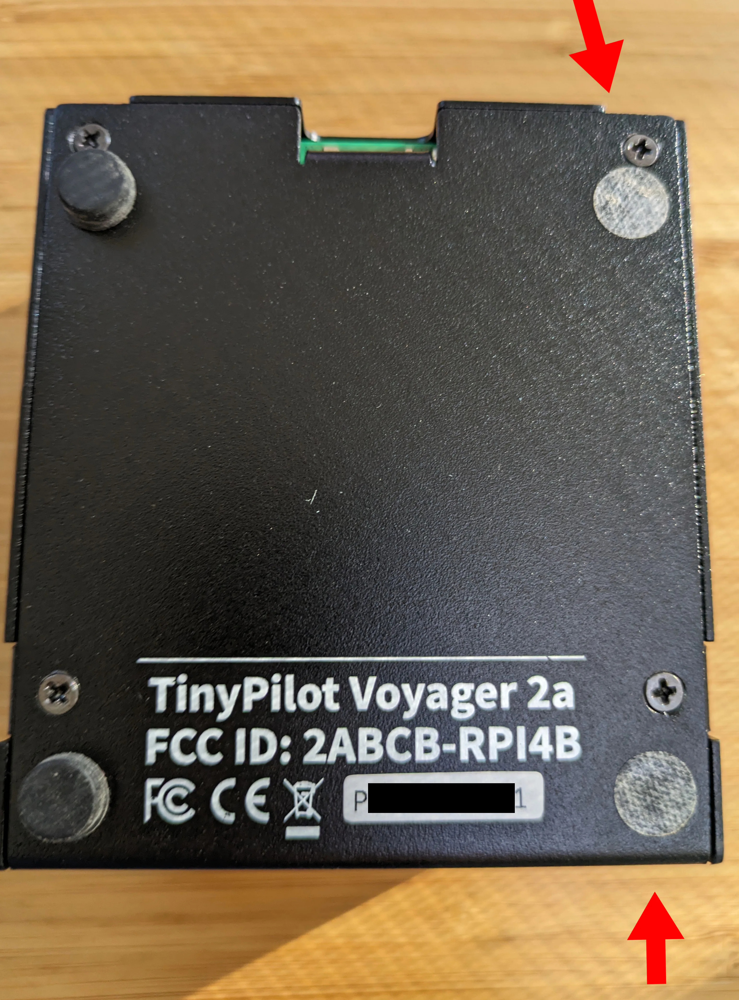
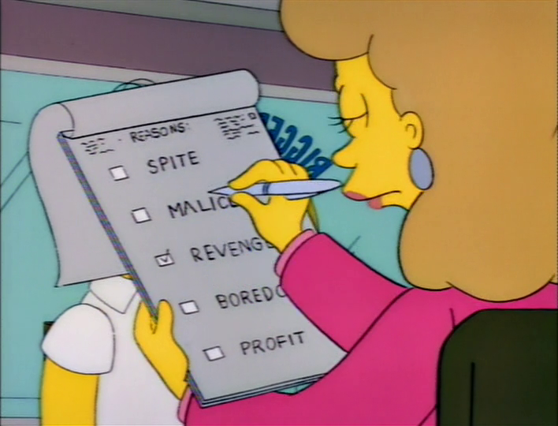



**New here?**

Hi, I'm Michael. I'm a software developer and the founder of [TinyPilot](https://tinypilotkvm.com), an independent computer hardware company. I started the company in 2020, and it now earns $80-100k/month in revenue and employs six other people.

Every month, I publish a retrospective like this one to share how things are going with my business and my professional life overall.


## Highlights

- I'm trying to work around manufacturer delays.
- I've decided to hang onto TinyPilot's office for two more months.
- I'm planning my escape from a miserable seller experience on RapidAPI.

## Goal Grades

At the start of each month, I declare what I'd like to accomplish. Here's how I did against those goals:

### Shift manufacturing to our contract manufacturer as quickly as possible

- **Result**: I'm continuing to get the manufacturer unblocked wherever possible.
- **Grade**: A

Honestly, there hasn't been much to do from on my end. The limiting factor has been shipments from the manufacturer's upstream vendors.

### Delegate tasks for clearing the TinyPilot office

- **Result**: I've assigned tasks for inventorying and clearing the office.
- **Grade**: B-

I ended up deciding to [stay in the office](#slowing-down-the-transition-to-fully-remote) for another two months due to manufacturing delays, but we're still on track to clear most inventory by the end of October.

### Use up all remaining Raspberry Pis to build TinyPilot devices

- **Result**: We've used up all the Raspberry Pis to build new or refurbished devices.
- **Grade**: A

Our assembly went according to plan, and now all of our new devices are at the warehouse. We're on track to sell off our refurbished devices in the next few weeks.

## [TinyPilot](https://tinypilotkvm.com/?ref=mtlynch.io) stats



| Metric                   | August 2023    | September 2023 | Change                                          |
| ------------------------ | -------------- | -------------- | ----------------------------------------------- |
| Unique Visitors          | 6,900          | 6,200          | -700 (-10%)            |
| Sales Revenue            | $91,670.46     | $83,380.02     | -$8,290.44 (-9%)       |
| Enterprise Subscriptions | $290.70        | $290.70        | 0                                               |
| Royalties                | $2,969.62      | $2,056.30      | -$913.32 (-31%)        |
| Total Revenue            | $94,930.78     | $85,727.02     | -$9,203.76 (-10%)      |
| **Profit**               | **$28,454.42** | **$8,163.88**  | **-$20,290.54 (-71%)** |

Revenue is down a bit, but $80k/month +/- $10k is about our norm, so I'm not too concerned. My priority right now is sticking the landing on our manufacturing transition.

Our short-term profit is down because we paid for three months' worth of Raspberry Pis this month, but our three-month trailing profit is still healthily above $20k/month.

## Correcting issues in the first article sample

In September, we received the first article sample from our manufacturer. It was the first end-to-end production sample of the Voyager 2a made in the manufacturer's facility.

Unfortunately, the first article sample didn't go so well.

Paint was chipping on two out of the four samples, and the rubber feet had fallen off three them. The cabling was disconnected on one of the devices, which prevented it from capturing audio. When I held the device sideways, the fan started scraping the case.


{{}}
{{}}


The issues in the sample worried me.

First, it was worrying that so many things went wrong on a small sample that was supposed to show their ability to make a full batch.

Second, it suggested not only a problem with the assembly process but with QA as well. How did an independent QA review miss things like chipped paint and non-functional audio?

After talking with the CEO, it turned out that the manufacturer did "extra" QA on the batch, but the additional checks actually introduced new issues.

The CEO discovered that the manager overseeing the work wiped the devices with alcohol swabs to get rid of fingerprints on the metal, but the alcohol caused the paint to chip. They adjusted their process to prohibit alcohol wipes on the cases and to assemble the devices with gloves to prevent fingerprint smudges.

The CEO believed that the manager may have opened the devices after QA and accidentally disconnected wires, so now the QA process forbids opening the devices after the functional test is complete.

The manufacturer believed that the packaging caused the feet to detach, as the box stressed the weakest point of the feet. They've updated the packaging to avoid that issue.

I was still a bit worried that something was lost in translation about our QA process, so I requested videos of how the manufacturer was performing QA. Fortunately, it matched our process, so I'm hopeful that we've caught the major issues.

## How do I handle the manufacturing schedule slip?

In the original manufacturing schedule, we expected to receive the first production batch by September 15th. I estimated at the time that my in-house inventory would last until the end of October, giving me six weeks of buffer for delays.

The problem is that we've exhausted my safety buffer and are at risk of running out of inventory before the first production batch is ready.

If we run out of inventory, we have to pause sales. The last time we ran out of inventory was for four days in January 2022. Before that, it was one day in January 2021. I _really_ dislike running out of inventory.

Given the slips in the manufacturing timeline, I'm evaluating what my options are to reduce the risk of running out of stock.

### Assumptions

- TinyPilot sells 200 devices per month or about 50 devices per week.
- Every day that TinyPilot is out of stock, we lose about $3k in revenue and $2k in profit.

### What does the current schedule look like?

As of October 16th, we have 164 devices on-hand, so we're due to run out of inventory by about November 8th. We also have eight refurbished devices, so that maybe buys us an extra couple of days, so let's call November 10th the day we sell out completely.

Here's a schedule of how our supply looks based on our manufacturer's current estimates:

| Date    | Activity                                                                     | Duration |
| ------- | ---------------------------------------------------------------------------- | -------- |
| Oct. 19 | Ship second sample from Vietnam to Massachusetts                             | 7 days   |
| Oct. 26 | Inspect second sample                                                        | 1 day    |
| Oct. 27 | Manufacture small production batch                                           | 4 days   |
| Oct. 31 | Ship small production batch from Vietnam to Massachusetts (TinyPilot office) | 7 days   |
| Nov. 7  | Inspect small production batch                                               | 2 days   |
| Nov. 9  | Manufacture large production batch                                           | 4 days   |
| Nov. 13 | Ship large production batch from Vietnam to North Carolina (warehouse)       | 7 days   |
| Nov. 20 | Large production batch is ready for fulfillment                              | 1 day    |

Based on these estimates, we'd avoid running out of inventory but just barely. The large production batch wouldn't be ready until Nov. 20th, but the small production batch would tide us over until then.

### Do we skip the second sample?

The first question is whether to do a minimal sample for the next batch or to do a batch big enough to ship to customers.

If we cut out the second sample, the schedule looks like this:

| Date    | Activity                                                                     | Duration |
| ------- | ---------------------------------------------------------------------------- | -------- |
| Oct. 19 | Ship small production batch from Vietnam to Massachusetts (TinyPilot office) | 7 days   |
| Oct. 26 | Inspect production batch                                                     | 1 day    |
| Oct. 27 | Manufacture large production batch                                           | 4 days   |
| Oct. 31 | Ship large production batch from Vietnam to North Carolina (warehouse)       | 7 days   |
| Nov. 7  | Large production batch is ready for fulfillment                              | 1 day    |

The only issue that was a real showstopper in the first batch was the chipped paint on the cases. Outside of that, the issues we caught were things we could repair at our office.

The possibilities look like:

- Optimistic case (85% likely): Second sample wouldn't have revealed any issues, so we're ready with a production batch two weeks sooner.
- Pessimistic case (15% likely): 50+ devices need to be shipped back to Vietnam.

**Decision**: Skip the sample. Request photos and videos showing that the previous issues are fixed. It seems highly likely that any outstanding issues will be things that we can repair on our end if needed, and a two-week day delay is quite expensive.

### Do we make more devices in-house?

We could stretch out our inventory longer if we manufactured more devices in-house rather than waiting to transition to our manufacturing vendor. It's definitely something we could do, as we've been manufacturing TinyPilots in-house for years, but there are complications with starting up our manufacturing pipeline again.

The hardest problem is that there's still a shortage of Raspberry Pis, and all the Pis that TinyPilot owns are with our manufacturer.

We have an upcoming delivery scheduled, so we could re-route a shipment to our US address. That's not very appealing because it was a lot of work to get the Raspberry Pi Foundation to update our shipping address to Vietnam and have all the customs forms in place. Asking them to change back for a single order has the potential to cause mistakes on future orders. It also means we have to order in multiples of 150 Pis, as that's size of the box that Raspberry Pi ships in.

We own the Raspberry Pi devices at the factory in Vietnam. We could ask our manufacturer to send us some of those. That allows us to request an arbitrary number, but there are likely also customs headaches in getting a UK-built product from Vietnam to the US.

And even if we got our Pis, we're still missing other components. We'd have to get some of our custom PCBs manufactured from our old PCB vendor in China. That should be okay, as they can usually turn around delivery in about a month. And the PCBs we need are about $2/unit, so that's not so expensive.

Cases are the next hardest item. Our old case vendor always claimed that their turnaround time was six weeks, but their _actual_ turnaround time was generally about three months. So, it's possible that even if we asked for new cases, they wouldn't be ready in time anyway. We still have 80 cases sitting at the factory in China that are ready to ship, but I'd asked them to hold off, as it didn't make sense for us to have more cases than we had Raspberry Pis.

We can't get more cases in a timeline that's useful, so we'd be limited to making 80 more devices, maximum.

That means the possibilities look like:

- Optimistic case: There are no more delays, so we waste a lot of time and money building devices that the new factory could have made for us.
- Pessimistic case: There are more manufacturing delays, so making our own devices allows us to sell for 10 more days than we otherwise could have.

**Decision**: Don't build more devices in-house. It's a lot of time and money for something that, at best, gets us only 10 more days of inventory.

### Should I slow down sales?

In addition to stretching out our buffer by making more devices in-house, I have a couple of levers that slow down the rate we sell TinyPilot devices.

First, I could increase prices. We sell fewer TinyPilot devices [when prices are higher](/retrospectives/2023/05/#what-price-maximizes-profits), but it probably reduces our overall profits.

Second, I can reduce marketing spend. There's no use paying for ads if we're going to receive more orders than we can fill.

So, the possibilities here look like:

- Optimistic case: There's no manufacturing delay, so deliberately reducing our sales volume forfeits $3-5k in profit.
- Pessimistic case: There are more manufacturing delays, so reducing sales preserves profits we'd forfeit with needless ad spending or selling for too low a price.

**Decision**: Don't slow down yet, but revisit the decision if there are more delays or issues with the next inspection.

### How big a first batch do we order?

Before we make the full 400-ish unit batch, I want to get a smaller batch that we can inspect by hand.

We want a large enough batch that it creates enough buffer for a subsequent batch to arrive.

Let's say it will take 10 days for a second batch to ship from Vietnam to our warehouse in North Carolina and be ready for fulfillment. 10 days means we need about 66 devices. The devices ship in boxes of 18, so let's say we need 72 devices.

**Decision**: Order 72 devices for the small sample batch.

## Slowing down the transition to fully remote

With the schedule slip from the manufacturer, I became worried about my plan to move out of TinyPilot's local office by the end of October.

Without an office, it would be much harder for us to do things like inspect samples or perform repairs as needed.

The day after I saw the first article sample, I called our landlord and asked to extend our lease. Fortunately, he hadn't put the office on the market yet, so we can stay until the end of the year.

I'm happy with this decision, as it allows us to slow down the number of major changes happening at once. I'd like to be all set with our new manufacturing pipeline before we start redesigning our remaining in-person activities to happen without an office.

## Side projects

### I need to migrate away from RapidAPI... for spite

> **Jerry**: I'd like to return this jacket.
>
> **Salesperson**: Certainly, may I ask why?
>
> **Jerry**: For spite.
>
> **Salesperson**: Spite?
>
> **Jerry**: That's right. I don't care for the salesman who sold it to me.
>
> _Seinfeld_, "The Wig Master"

One of the first projects I took on when I started out as a bootstrapper was [Zestful](https://zestfuldata.com), my ingredient parsing API. It's been in maintenance mode for years, but it still makes $100-200/month in passive income.

The problem is that Zestful's paying customers access the service through RapidAPI, one of the worst platforms I've ever used for anything. I originally published Zestful on a platform called Mashape, which worked pretty well, but then RapidAPI acquired Mashape and tanked the experience.

I've had too many issues with RapidAPI to explain here, but the biggest issue is how terribly they handle metered billing. I charge Zestful customers $0.02 for each ingredient they parse. For inexplicable reasons, RapidAPI doesn't report charges that users have accrued until the end of their billing cycle.

Naturally, RapidAPI's billing system confuses customers. They make a bunch of requests through Zestful, see that their bill is $0, think that their usage still fits in the free tier, keep making requests, then they get a surprise bill of hundreds or thousands of dollars and refuse to pay.

I got a particularly egregious case of this two months ago. I saw that a user was racking up thousands of dollars in charges, so I messaged them through the platform letting them know and offered a custom plan that would save them money. They ignored me, and their final bill was $14.5k. RapidAPI tried billing their credit card a month later, and the payment was declined.

{{}}

RapidAPI does nothing to resolve this situation. They don't attempt to charge the customer again, and they don't even deactivate the customer's account. The user can just happily keep running up charges against my service and never pay.

You might assume that because RapidAPI is fairly hands-off, they have bargain basement prices. They'd, of course, charge less than similar providers like [Paddle](https://www.paddle.com/) and [LemonSqueezy](https://www.lemonsqueezy.com/), who charge 5% of seller revenue.

RapidAPI charges a whopping **20% of revenue**!

Effectively, it's even higher than that because RapidAPI only pays through PayPal, who charges their own fee of 3% + $0.30 per transaction. And absurdly, RapidAPI makes separate payments for every customer. So, if you have five customers on RapidAPI, RapidAPI makes five separate payments and makes you pay PayPal's transaction fee five separate times. I've received payments from RapidAPI where I lose as much as 80% to fees.

I've tolerated RapidAPI this long because I've relegated Zestful to a weekend hobby project, and migrating to a new payment provider never feels like a fun hobby.

Now, I'm motivated enough by spite for RapidAPI that I've begun experimenting on Paddle and LemonSqueezy to see if I can free myself from RapidAPI. It's not _really_ worth the dev time to save $15/month, but I'd like to stop giving money to RapidAPI, and it's handy to become familiar with a SaaS payment gateway that I'll like.

{{}}

## Wrap up

### What got done?

- Evaluated first article samples from the contract manufacturer.
- Adapted to surprises in the manufacturing process.
- Made use of all the remaining new and used Raspberry Pis at our office.

### Lessons learned

- Write out complicated decisions.
  - At the start of writing this retrospective, I didn't have a good sense of how I should adapt to manufacturing delays. Describing the situation in writing made me realize that there were several questions I needed to answer, and writing down the considerations and risks made the decisions easier.

### Goals for next month

- Shift manufacturing to our contract manufacturer as quickly as possible.
- Reduce manual effort from TinyPilot's software release process.
- Create a plan for better enforcement of TinyPilot Pro licenses.
