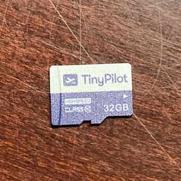
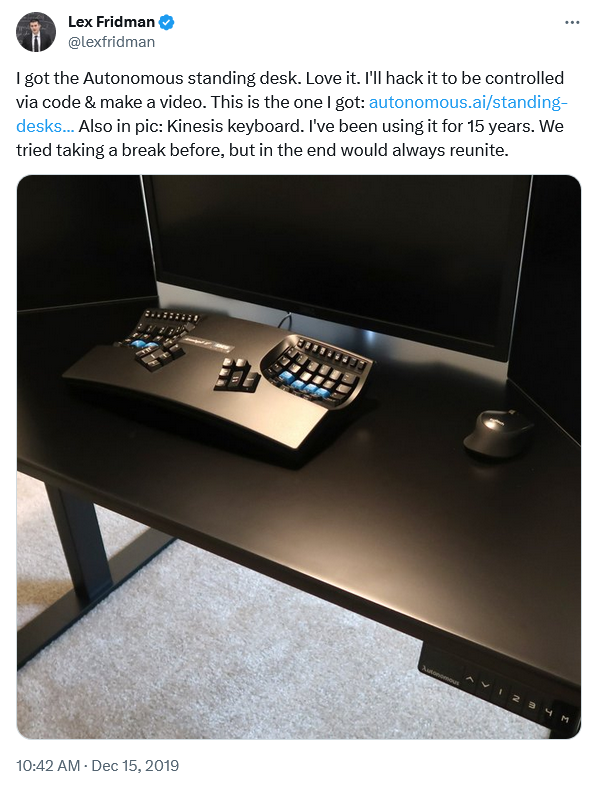
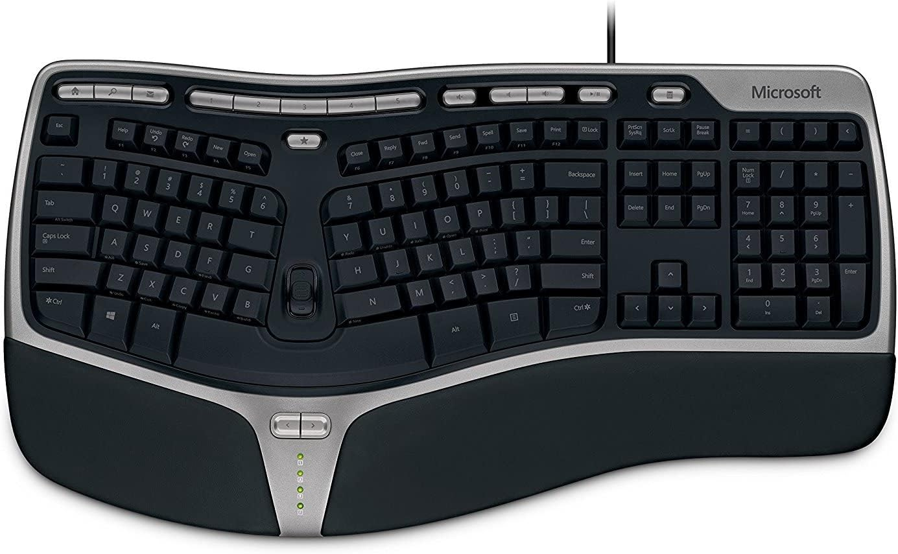
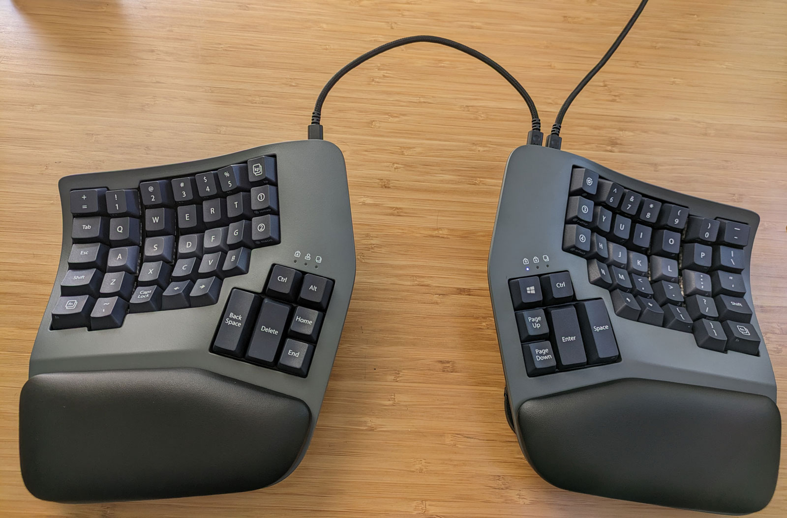



**New here?**

Hi, I'm Michael. I'm a software developer and the founder of [TinyPilot](https://tinypilotkvm.com), an independent computer hardware company. I started the company in 2020, and it now earns $80-100k/month in revenue and employs six other people.

Every month, I publish a retrospective like this one to share how things are going with my business and my professional life overall.


## Highlights

- TinyPilot had its second-strongest month of revenue of all time.
- TinyPilot has almost finished transitioning manufacturing to a third-party vendor.
- I may have crossed into the dark side of mechanical keyboards.

## Goal Grades

At the start of each month, I declare what I'd like to accomplish. Here's how I did against those goals:

### Shift manufacturing to our contract manufacturer as quickly as possible

- **Result**: We had a minor issue with the first batch, but we should be completing the shift soon.
- **Grade**: B

We received our first production batch of devices from our contract manufacturer, and we're shipping them to customers in November.

I was hoping the batch would be perfect and we could declare the shift complete. Sadly, there was [a minor error](#trying-to-get-microsds-right-with-the-new-manufacturer) in the assembly process that we had to fix at our office, so we're still not yet at the point where we have a smooth pipeline from manufacturer to warehouse to customer.

### Reduce manual effort from TinyPilot's software release process

- **Result**: We eliminated a manual release task that was bound to me.
- **Grade**: A

I'm always looking for ways to automate and simplify TinyPilot's software release process. I'm especially interested in ways to eliminate myself from the critical path of TinyPilot's routine workflows. In October, we made progress on both by automating how we update the TinyPilot website when a new version of TinyPilot Pro is available.

It used to be that I'd cut the release and then manually update the website to point to the new download URLs. Now, the website is sync'ed to our update service, so it discovers new releases automatically.

### Create a plan for better enforcement of TinyPilot Pro licenses

- **Result**: We haven't made progress on a plan.
- **Grade**: F

The dev team has had less availability than I was expecting for October, so we ended up not making progress on a plan for license enforcement.

## [TinyPilot](https://tinypilotkvm.com/?ref=mtlynch.io) stats



| Metric                   | September 2023 | October 2023   | Change                                             |
| ------------------------ | -------------- | -------------- | -------------------------------------------------- |
| Unique Visitors          | 6,200          | 8,700          | +2,500 (+40%)           |
| Sales Revenue            | $83,380.02     | $98,896.81     | +$15,516.79 (+19%)      |
| Enterprise Subscriptions | $290.70        | $290.70        | 0                                                  |
| Royalties                | $2,056.30      | $2,609.84      | +$553.54 (+27%)         |
| Total Revenue            | $85,727.02     | $101,797.35    | +$16,070.33 (+19%)      |
| **Profit**               | **$8,644.82**  | **$69,280.58** | **+$60,635.76 (+701%)** |

This was TinyPilot's second-strongest month in history, and I have no idea why. Nothing stands out in our analytics, and I'm not aware of any new reviews or mentions. We saw [strong sales in October 2022](/retrospectives/2022/11/) as well, so it could just be seasonal.

I was expecting numbers to drop a bit because I've been focused on our manufacturing shift and haven't invested in marketing. I'm glad to see that we can survive on momentum, but I'm also beginning to invest more into growth in the last few months of 2023.

## Trying to get microSDs right with the new manufacturer

### The missing disks

TinyPilot devices store data on tiny disks called microSDs. A few days before our manufacturer was supposed to send the first sample of the TinyPilot devices, they noticed that the reference devices I sent them had microSDs in them. Did I want microSDs?

{{}}

It turned out that the manufacturer never included microSDs in the bill of materials (BOM). I never noticed that they were missing, either.

Fortunately, buying and flashing microSDs is a fast and straightforward process. We already had a vendor that made microSDs with the TinyPilot logo on them. We put our manufacturer in touch with that vendor, and we explained to our manufacturer how to flash the microSDs with TinyPilot's software.

The manufacturer and I agreed that it wasn't worth delaying the first samples due to the microSDs. We decided that they'd ship the devices without microSDs and then they'd send the microSDs a week or two later.

There ended up being [so many issues](/retrospectives/2023/10/#correcting-issues-in-the-first-article-sample) with the first sample that I forgot about the microSDs entirely, and the manufacturer never sent them.

### Checking correct microSD flashing

By mid-October, the manufacturer said they'd fixed all the issues I'd raised with the first sample. They were going to send [a small production batch](/retrospectives/2023/10/#do-we-skip-the-second-sample) that should be totally complete and ready to ship to customers.

We were still going to perform additional QA on the first batch to make sure they matched our in-house standards. Part of our verification involved checking that the manufacturer flashed the microSDs correctly.

It wasn't until two days before the batch was scheduled to arrive that I thought - _how_ am I going to check that the manufacturer flashed the microSDs correctly? I wanted to make sure every last byte on the disk was correct.

Verifying the microSDs was non-trivial, so I asked TinyPilot's support engineering team to create a quick shell script that would compare a microSD from the manufacturer to our "golden" disk image and report any differences. They were able to create the script just in time for my testing.

When the first batch arrived, I loaded a microSD, ran our integrity checking script, and it reported that everything matched. Great!

We ran functional tests, and everything worked as it should. I was delighted. This meant that the manufacturer had gotten this batch totally correct, so we could declare victory on our transition to our third-party manufacturer.

As I was preparing to shut down the last TinyPilot in my testing, I noticed something. The video settings weren't the defaults that TinyPilot ships with. It looked like someone had used this device before me.

I shut down the device I was testing and re-ran the microSD checking script. This time, it should definitely report changes because I had changed a lot of the settings during my test. Instead, the script reported that my microSD perfectly matched our golden image.

Uh oh.

Even though the script worked correctly on the support engineer's machine, it always returned a false positive in my testing environment.

From further inspection of the microSD, it was clear that the manufacturer had misunderstood our instructions. We wanted them to perform QA with a test microSD and replace it with a fresh one before it was packaged for the customer. The manufacturer wasn't doing the swap, so they were shipping units to customers with used microSDs.

Fortunately, this mistake was relatively easy for us to correct at our office. Our local team opened each box, re-flashed the microSDs back to clean state, re-packed them, and sent them to our warehouse.

Long-term, we obviously don't want to re-flash every microSD in our office. When we reported the issue to our manufacturer, they told us that they had indeed misunderstood our instructions and revised their process to ensure that every microSD that reaches customers is freshly flashed with our image. We'll verify the next batch again, but I'm hopeful that we're approaching the end of this issue.

### How could I have prevented the microSD issue?

The issue with the microSDs was the culmination of several errors that had happened earlier:

- I didn't notice that the microSD was missing from the manufacturer's bill of materials.
- The manufacturer never sent me the sample microSD, and I forgot to follow up about it.
- I didn't think about how to verify the microSD until late in the process.
- I underestimated the amount of rigor we should put into the script for microSD checking.

When I reviewed the BOM, I just went by memory and thought everything was there. I could have done a more rigorous teardown of one of our products to verify there was a 1:1 match between everything in the manufacturer's BOM and everything in our product.

This is the second time we've run into a problem around [dropped commitments from the manufacturer](/retrospectives/2023/09/#shift-manufacturing-to-our-contract-manufacturer-as-quickly-as-possible), and I still don't have a great solution. Overall, they stay on top of most tasks, but they forget about 10% of tasks unless I follow up. I've been raising issues when I'm waiting on something, but that makes it easy for things like microSDs or instruction manuals to fall through the cracks. They're the parts of the product that seem unimportant until they're preventing us from shipping.

I also underinvested in our microSD checking script. At the time, it felt like a one-off script, so we didn't have to dedicate the time and care we would for customer-facing code. But when we hit the false positive, I realized how important it was for the script to work as expected during our QA process and how expensive a mistake it could have been. So, we're rewriting the script based on our standard process for creating production-grade code.

I'm not sure what the solution is for verifying the manufacturer's process end-to-end. When we were doing this in-house, we had a set of instructions in Notion, and our whole team would just follow those. We can't share a Notion workspace with the manufacturer because their workers don't all read English. So, we give them our English instructions, the manufacturer translates them into Vietnamese, and the workers read the Vietnamese version. I can't verify that the Vietnamese process matches the English process.

Requesting videos of the QA process was helpful. They showed, in a language-independent way, how the manufacturer performs QA. But it's hard to get a video of the entire process end-to-end. The QA process video didn't make it obvious that the microSD they were using for testing ended up staying in the final product, and I'm not sure how I'd prevent that.

The manufacturer did invite me to go to Vietnam to visit the factory. I declined, as I'm traveled-out this year, but looking back, maybe that would have prevented some expensive errors. I also could have also offered the trip to one of the local team members.

## Creating a customer success process

At the start of the year, the local TinyPilot team's job was about 20% customer service and 80% assembly and fulfillment. That balance has shifted significantly this year as we've moved manufacturing and fulfillment to external vendors. By the start of 2024, assembly and fulfillment should be 0% of the local team's work.

The problem is that customer service still takes less than 50% of the local team's weekly hours, so how do we use their additional availability?

The team has been discussing this problem since the beginning of the year. The most natural transition seems to be shifting from reactively responding to support requests to proactively reaching out to existing customers. Some companies call this role "customer success."

The embarrassing truth is that I rarely reach out to customers. It's one of the [important but non-urgent tasks](/book-reports/7-habits-of-highly-effective-people/#time-management-matrix) that I always neglect. But if I can teach the local staff to do it, it's no longer limited by my available bandwidth.

We're piloting a new customer success process that looks like this:

1. Customer service team researches customers who spend a lot with TinyPilot (especially repeat buyers).
1. Customer service team sends the customer a human-written email mentioning specifics about their company and their order (so it doesn't seem automated) and an invitation for a call to discuss feature requests or pain points.
1. We meet with the customer and learn about how they use TinyPilot.
1. We integrate the customer's feedback into our feature roadmap.

When I receive outreach as a customer from other businesses, it's usually baldly selfish. They'll say something like, "We want to help you understand all of our offerings," but they're really just trying to get me to buy more stuff.

I want TinyPilot's customer outreach to feel collaborative rather than parasitic or greedy. I think it will help us tune our roadmap to features that our customers want, and it will help us find out about new opportunities for TinyPilot that we otherwise wouldn't discover.

## Side projects

### Goodbye Ansible, Hello Nix

I've been using Ansible for the past several years to manage my development environments, but it has a lot of pain points that are wearing on me. I've been trying to replace Ansible with Nix [for the past fews months](/tags/nix), and I think I'm finally done.

I had seen [Nix Home Manager](https://github.com/nix-community/home-manager) in the past, but I didn't get the point. It manages files in my home directory? Doesn't NixOS already manage my entire system?

The key things I was missing were:

- Home Manager works on any Linux or Mac system, not just NixOS.
- Because Home Manager is optimized for text files, its interface for managing text files is better than NixOS'.

Now, instead of managing my dev systems with Ansible, I manage everything with Home Manager and [project-specific Nix flakes](/notes/nix-dev-environment/). I haven't run an Ansible playbook in over a month.

One notable change is that I use and define bash aliases more regularly for common commands. My old process for adding bash aliases was to add them to my Ansible playbook, then re-run the playbook on any system where I wanted the alias. But running Ansible playbooks on my system was so slow and prone to failure that I'd end up with half my systems knowing about an alias and half not. There was so much friction involved that I was rarely motivated to add new aliases and integrate them into my normal habits.

With Nix, Home Manager now manages all my bash aliases. If I want to add a shell alias, I edit `~/.config/home-manager/home.nix` and then run `home-manger switch` to apply the changes (actually, I shortened this to a bash alias: `hs`). The whole process takes less than a minute, and it never fails due to external factors the way Ansible did.

I had been trying to make the switch to NixOS, but I was having trouble because there were so many differences between my normal Debian dev environments and NixOS. Using Home Manager is a nice, happy medium between going all-in on Nix and holding on to my familiar Debian workflows.

### I'm a weird mechanical keyboard person now

In Lex Fridman's interview with Python creator Guido von Rossum, Lex has [an extended aside](https://www.youtube.com/watch?v=OLyu899ixL8) about how much he loves his Kinesis Advantage 2 keyboard.

Kinesis is a popular vendor for mechanical keyboards. Their keyboards are unique in that the keys are in a concave well, and the two halves of the keyboard are several inches apart.

{{}}

Lex loves his Kinesis keyboard so much so that he brings it with him on flights because he'd rather lug around a giant keyboard than use his laptop's built-in keys.

I've been using a Microsoft Ergonomic Keyboard of some variation since I was 14 years old. I like it, but I don't love it the way Lex talks about Kinesis, so I've been curious about mechanical keyboards for the past few months.

{{}}

I only know a couple of people who use mechanical keyboards, but I never understood the appeal. It was fine if they wanted to nerd out about something, but I felt like the maximum enjoyment I'd ever get from a keyboard was pretty limited, so why bother?

Then, I got curious and started reading more about high-end keyboards. I spend most of my waking hours at my keyboard, so maybe I _should_ invest in optimizing the experience.

After checking out a few of the options like Kinesis, Ergodox, and ZSA, I ended up going with the [Kinesis Advantage 360](https://kinesis-ergo.com/keyboards/advantage360/).

{{}}

The first day with the keyboard was a real struggle. I was going about 5% of my usual typing speed. I had a lot of paperwork to get through, so I put aside the keyboard for the next morning.

Day two was easier, but it was still a challenge. I kept at it, and I'm now faster on this keyboard when typing English prose, but I'm slower at programming. I haven't gotten used to characters like `[`, `{`, and `=` on this keyboard. I've even remapped keys to make them easier, but I'm still trying to build the muscle memory.

I've read reviews from other people who say they have no trouble switching back to a regular keyboard once they got used to Kinesis, and that hasn't been my experience so far. When I switch to the cramped laptop keyboard on my Surface Pro 6, I make tons of typos. Maybe I'll eventually get back to being comfortable on both.

There's a 60-day return window, but at this point, I'm pretty sure I'm going to stick with the Kinesis.

## Wrap up

### What got done?

- We shipped the first batch of TinyPilot Voyager 2a devices made by our contract manufacturer.
- We eliminated manual effort from TinyPilot's release process.
- I switched to a mechanical keyboard.

### Lessons learned

- Track manufacturer commitments more actively.
  - This is a mistake I made before and didn't address it correctly.
  - The microSDs repeat a pattern where the manufacturer commits to doing something, I assume that they're handling it, we both forget, and it causes issues down the line.
  - I need to start recording their commitments review the status each week in case they forget.
- Match BOMs component by component.
  - When the manufacturer sent the bill of materials months ago, I just mentally checked what I expected to see, but I missed that the microSD was missing.
  - When I go through a BOM agreement process in the future, I'll take our existing product apart, inventory all the components, and then verify that it matches the manufacturer's BOM.

### Goals for next month

- Shift manufacturing to our contract manufacturer as quickly as possible.
- Conduct five customer outreach calls.
- Clear the TinyPilot office of all old inventory and spare parts.
